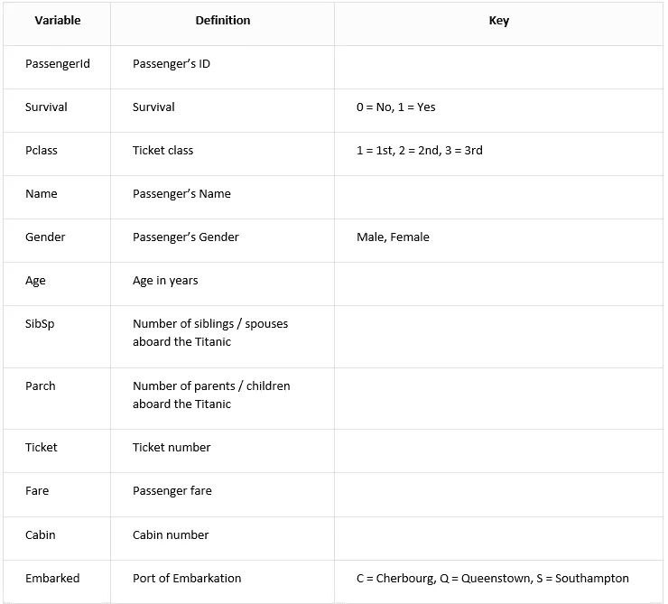
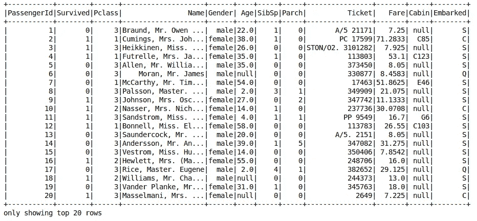
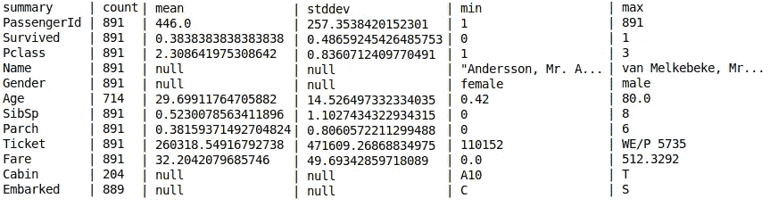
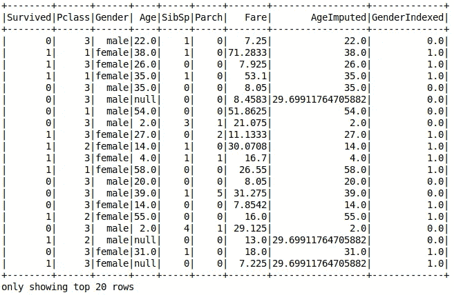
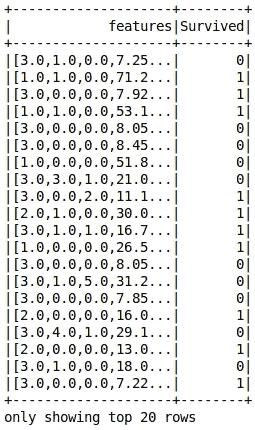
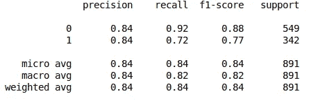
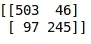

# 分类

> 原文：<https://towardsdatascience.com/apache-spark-mllib-tutorial-part-3-complete-classification-workflow-a1eb430ad069?source=collection_archive---------15----------------------->

## Apache Spark ML 教程

## 构建完整的分类工作流程

注意:本文是系列文章的一部分。查看完整系列: [*第 1 部分:回归*](/apache-spark-mllib-tutorial-ec6f1cb336a9) *，* [*第 2 部分:特征转化*](/apache-spark-mllib-tutorial-7aba8a1dce6e) *，* ***第 3 部分:分类*** *，第 4 部分及以上即将推出。*


Image by [pixel2013](https://pixabay.com/users/pixel2013-2364555/?utm_source=link-attribution&utm_medium=referral&utm_campaign=image&utm_content=3401500) from [Pixabay](https://pixabay.com/)

# 介绍

在这个系列的这一部分中，我们将把我们所学的一切放在一起训练一个**分类模型**。目标是学习如何从头到尾建立一个完整的分类工作流程。

# 问题定义

我们要解决的问题是臭名昭著的 [*泰坦尼克号生存问题*](https://www.kaggle.com/c/titanic) 。我们被要求建立一个机器学习模型，该模型获取乘客信息，并预测他/她是否幸存。数据集包含 12 列，描述如下:[从[这里](https://drive.google.com/open?id=1wI5UtWvoE_n9bvX8nMSp3v6tWr4NRb22)下载]



# 准备开发环境

你现在应该很熟悉这一步了。我们将打开一个新的 *Jyputer 笔记本*，导入并初始化 *findspark* ，创建 *spark 会话*，最后*加载*数据。

```
import findspark
findspark.init('/opt/spark')
from pyspark.sql import SparkSession
spark = SparkSession.builder.getOrCreate()
data = spark.read.csv('./datasets/titanic.csv', inferSchema=True, header=True)
```

让我们看看数据及其统计:



Top 20 rows of the dataset



Statistics

下面是一个关于某人如何通过分析上述表格来选择/更新其特征的示例:

*   包含一些功能是没有意义的，例如:*乘客 ID* 、*姓名*和*车票* →我们将删除它们
*   *小屋*有很多空值→我们也会删除它
*   也许*登上*柱与生存无关→让我们移除它
*   我们在*年龄*列中缺少 177 个值→ *年龄*很重要，我们需要找到一种方法来处理缺少的值
*   *性别*有标称值→需要编码

让我们过滤掉不需要的列:

```
data = data.select(['Survived', 'Pclass', 'Gender', 'Age', 'SibSp', 'Parch', 'Fare'])
```

# 特征转换

我们将逐个处理转换。在以后的文章中，我将讨论如何使用**管道来改进这个过程。但是让我们先用无聊的方法来做。**

## 计算年龄缺失值

*年龄*是重要特征；因为一些缺失的值而丢弃它是不明智的。我们能做的是在现有价值的帮助下填补缺失的价值。这个过程被称为**数据插补**。有许多可用的策略，但我们将遵循一个简单的策略，用从样本中计算出的*平均值*来填充缺失值。

使用**估算器**类，Spark ML 使这项工作变得简单。首先，我们定义估计量，使其适合模型，然后我们对数据应用转换器。

```
from pyspark.ml.feature import Imputer
imputer = Imputer(strategy='mean', inputCols=['Age'], outputCols=['AgeImputed'])
imputer_model = imputer.fit(data)
data = imputer_model.transform(data)
```


不再有缺失值！让我们继续下一步…

## 性别价值观编码

我们了解到机器学习算法无法处理分类特征。所以，我们需要索引*性别*值:

```
from pyspark.ml.feature import StringIndexer
gender_indexer = StringIndexer(inputCol='Gender', outputCol='GenderIndexed')
gender_indexer_model = gender_indexer.fit(data)
data = gender_indexer_model.transform(data)
```



没有更多的分类值…注意，我们不需要对索引值进行一次热编码，它们自然是用 0 和 1 值进行二进制编码的。

## 创建特征向量

我们之前了解到 *Spark ML* 期望数据在两列中表示:一个*特征向量*和一个*标签列*。我们已经准备好了*标签*列(*幸存*，所以让我们准备*特征向量*。

**注意，我们添加了*年龄估算*和*性别索引*，而不是*年龄*和*性别*。**

```
from pyspark.ml.feature import VectorAssembler
assembler = VectorAssembler(inputCols=['Pclass', 'SibSp', 'Parch', 'Fare', 'AgeImputed', 'GenderIndexed'], outputCol='features')
data = assembler.transform(data)
```



我们准备出发了！机器学习时间到了…

# 训练模型

对于这个问题，我们将使用一个**随机森林分类器**。您可以自由选择任何其他您认为合适的分类器。

步骤:

1.  创建评估者
2.  指定要素列和标注列的名称
3.  符合模型

```
from pyspark.ml.classification import RandomForestClassifier
algo = RandomForestClassifier(featuresCol='features', labelCol='Survived')
model = algo.fit(data)
```

搞定了。

# 生成预测

我们调用模型的变换方法来获得我们的预测:

```
predictions = model.transform(data)
```

让我们检查一下预测值:

```
predictions.select(['Survived','prediction', 'probability']).show()
```


到目前为止一切顺利，但是仔细检查记录并逐一验证这些记录不符合逻辑。我们需要计算一些指标来获得模型的整体性能。**评估时间…**

# 模型评估

我们将使用一个**binary classification evaluator**来评估我们的模型。它需要知道*标签列的名称*和*公制名称*。这里我们将使用 ROC 曲线 下的 [*区域。*](https://en.wikipedia.org/wiki/Receiver_operating_characteristic)

```
from pyspark.ml.evaluation import BinaryClassificationEvaluator
evaluator = BinaryClassificationEvaluator(labelCol='Survived', metricName='areaUnderROC')
```

调用 evaluate 方法获得结果:

```
evaluator.evaluate(predictions)
```

通过使用上述设置，我的评估器返回: **0.90**

鉴于我们没有配置*预处理程序*，最初的结果是有希望的。我知道我没有根据测试数据进行评估，但我相信你能做到。

# 使用 SciKit-Learn 进行模型评估

如果您想生成其他评估，如混淆矩阵或分类报告，您总是可以使用 [scikit-learn 库](https://scikit-learn.org)。

你只需要从你的数据帧中提取 *y_true* 和 *y_pred* 。别担心，我会告诉你怎么做:

```
y_true = predictions.select(['Survived']).collect()
y_pred = predictions.select(['prediction']).collect()
```

导入您的指标:

```
from sklearn.metrics import classification_report, confusion_matrix
```

通过传递 *y_true* 和 *y_pred* 调用函数:

```
print(classification_report(y_true, y_pred))
```



```
print(confusion_matrix(y_true, y_pred))
```



# 最后的想法

恭喜你。您已经成功完成了另一个教程。你现在应该对自己的 *Spark ML* 技能更有信心了。在未来的教程中，我们将通过使用 ***管道*** 来改进预处理阶段，我将向您展示更多令人兴奋的 *Spark ML* 特性。敬请关注…

如果你喜欢这篇文章，请点击“鼓掌”按钮，我将不胜感激👏所以可能会传染给他人。也可以在 [*推特*](https://twitter.com/alimasri1991) *，* [*脸书*](https://www.facebook.com/alimasri91) *，* [*上关注我直接发邮件给我*](mailto:alimasri1991@gmail.com) *或者在*[*LinkedIn*](https://www.linkedin.com/in/alimasri/)*上找我。*