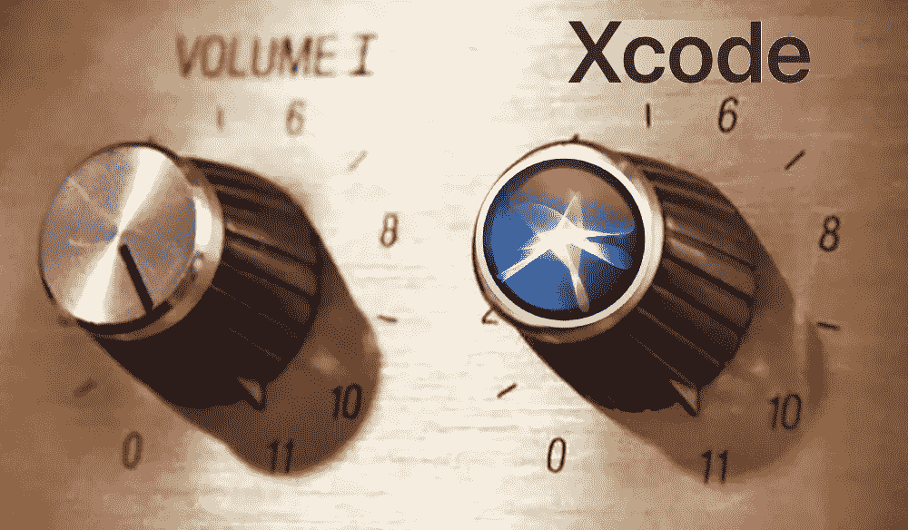
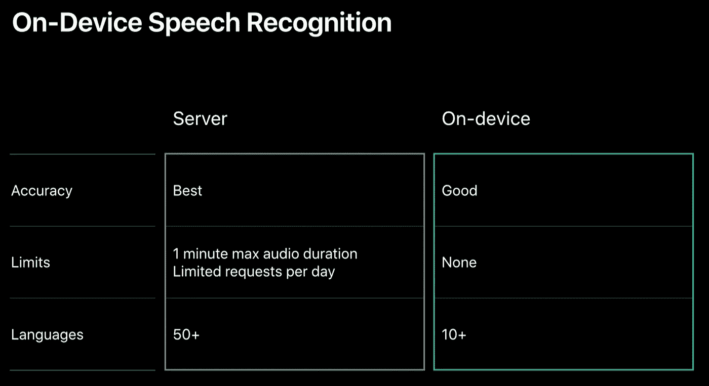
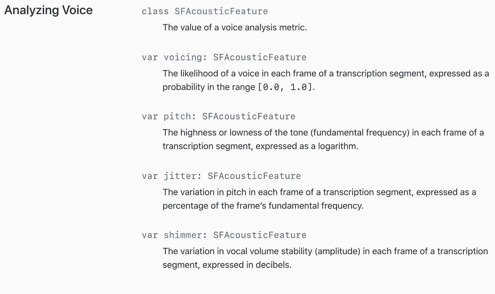

# 苹果将语音转文本功能提升至 Xcode 11

> 原文：<https://towardsdatascience.com/apple-cranks-speech-to-text-up-to-xcode-11-e1848e42252b?source=collection_archive---------30----------------------->

## SFSpeechRecognizer 的新好东西及其 ML 驱动的未来

毫无疑问，语音识别对许多用户来说是一个强大的工具。用户的应用范围从可访问性需求、语言帮助、记录保存，或者仅仅是偏好。在我们目前生活的虚拟助手时代，语音到文本是这一切的支柱，转录语音命令以供理解和执行。仅仅是这个市场所需的进步，就已经推动开发人员围绕口音、词汇和不同层次的语法改进技术。

难怪我们最终会看到技术进步的速度越来越快。

今年的 [WWDC 2019](https://developer.apple.com/videos/play/wwdc2019/256/) 是苹果最新版本`SFSpeechRecognizer`的更大飞跃，同样的 API 支持 Siri 转录。在 [WWDC 2016](https://developer.apple.com/videos/play/wwdc2016/509) 大会上推出(在同一活动中，苹果[强调了应用](https://techcrunch.com/2016/06/26/accessibility-was-all-around-this-years-wwdc/) s 中丰富的辅助功能)，它为开发者提供了第一方工具，能够转录录制的*和*现场音频。由于当时苹果已经依赖这项技术 5 年了，它在社区中受到了热烈的欢迎。

# 脱离电网

今年最受欢迎的新特性是新的离线模式。你不会真正意识到语音转文本使用数据来转录，直到你在死区中使用它。原因是因为这些年一直依赖云马力。然而，现在苹果公司有足够的信心在一个适合你口袋的设备上完成这项工作。

在这里，每个人都有多种好处。最明显的是，它节省了用户的移动数据和时间，因为它不需要等待发送和响应。这也是一个很好的隐私功能，因为你的演讲(和转录)留在手机上，而不是通过网络或某个地方的服务器。

对于开发者来说，它解除了对`SFSpeechRecognizer`的最大限制之一。局限性在于，它一次只能转录 1 分钟的音频，而且每天的点击次数有限。之所以把它放在首位，是因为 API 的初衷是转录简短的 Siri 命令。此外，虽然苹果公司承担了在其云上免费运行服务的费用，但这种权衡是有限度的，这样它就不会负担过重。

最后一点给苹果带来了新的好处。这一更新可能会释放大量资源，只需在本地转录 Siri 命令即可。Siri 很可能是 API 的最大消费者，因此将这样一个核心功能从云端转移到用户设备上是苹果在技术、物流和财务上的一大胜利。

## 成长空间

还是有一些弊端的。最主要的一点是准确性受限于手机已经加载的任何知识(可能会随着每个操作系统版本而更新？).虽然苹果声称它仍然很好，但服务器准确性不断提高新的边缘案例，因为它有能力不断学习和再培训。另一个缺点是对离线可用语言数量的限制，尽管这可以在后续版本中很容易地弥补。

Screenshot taken from WWDC 2019

# 拾起苹果的音调

苹果还推出了`SFVoiceAnalytics`，它提供了转录的 4 个关键数据点(详见下面摘自苹果开发者文档的截图)。音频程序员可能会喜欢与分析一起工作，我已经可以看到新一代的自动调谐功能。

Screenshot taken from [Apple Developer Docs](https://developer.apple.com/documentation/speech/sfvoiceanalytics)

但我这一部分的标题实际上是一个双关语，因为苹果公司对这些分析有计划，他们希望开发者注意到这一点。

## 从说话中学习

WWDC 2019 上的另一项重大宣布是对苹果机器学习工具包 [Core ML 和 Create ML](https://developer.apple.com/videos/play/wwdc2019/430/) 的最新改进。具体来说，他们引入了使用`MLSoundClassifier`创建[声音分类模型](https://developer.apple.com/videos/play/wwdc2019/425/)的新功能。这种新的分类和新的语音分析是专门针对彼此的，为 ML 支持的语音识别开辟了许多潜在的机会(想想检测某人的情绪，方言，甚至可能是真实性)。

很明显，苹果认为未来是机器学习，并正在大力投资于此(见我关于 iPhone 的机器学习曲线的文章),语音无疑是最大的受益者之一。最近几年引入的机器学习引擎正是体面的离线/设备上语音识别现在甚至成为可能的原因。

苹果在这方面才刚刚起步。

 [## iPhone 的进化并没有受阻，它正处于(机器)学习曲线上

### 苹果在 ML 上的进步正在改变 iOS 的一切

towardsdatascience.com](/iphone-evolution-hasnt-stunted-it-s-on-a-machine-learning-curve-b29237c0adbe) 

# 有很多要说的

虽然改进的数量很少，但质量却非常丰富。苹果生态系统可能的演讲机会已经打开了不少(特别是因为`SFSpeechRecognizer`现在也可以在 macOS 上使用)。它推进了苹果在可访问性方面的使命，同时也改善了 Siri，这是他们在虚拟助理领域的斗士。随着我们看到当前和新的应用程序采用这些进步并利用它们开发新的创新，应用程序场景也将开始改变。

ML 和 AI 不是下一个大东西，它们已经在这里了。然而，随着 ML 驱动的能力和特征在用户口袋中变得越来越可用，应用变得更加多样化。拥有丰富的移动语音识别功能还为时尚早，但我们应该期待在不久的将来会有很大的发展。