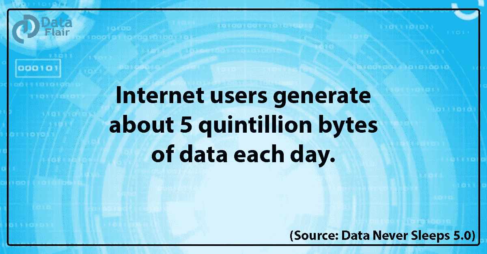
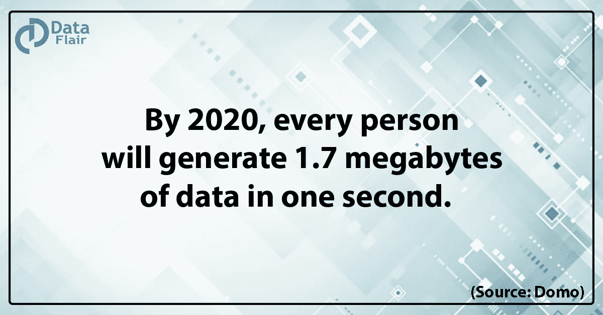
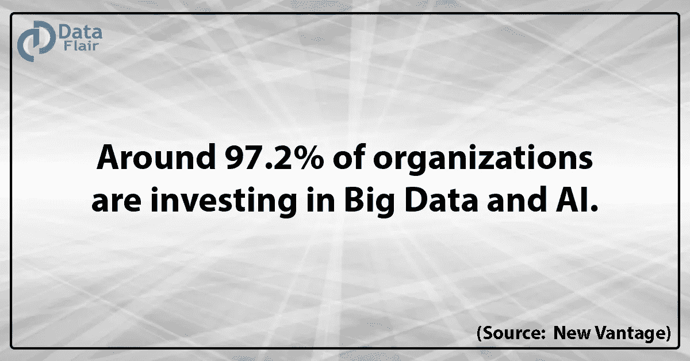
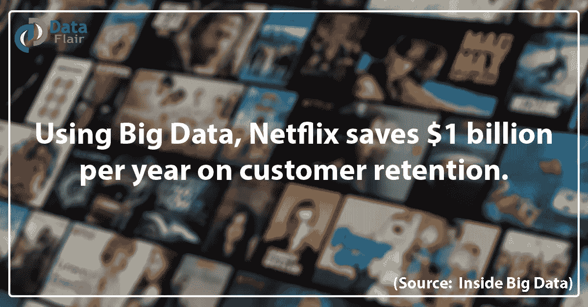

# 苹果，领英，网飞的大数据声明

> 原文：<https://towardsdatascience.com/apple-linkedin-netflixs-big-data-statement-fe937b7e96db?source=collection_archive---------25----------------------->

## 大数据证明其价值

## 介绍

我们生活在一个数字世界中，公司通过多个来源(如社交媒体、交易、客户反馈、医疗保健、教育机构)以评论、赞、视频、音频、文件、XML、二进制文件等形式收集大量数据，这些数据超过了 Pb 和 EB 的大小。

这些关于大数据的数字将让您深入了解我们今天所处的数据量。

*   每秒在谷歌上进行 63，000 次网络搜索。
*   脸书的 20 亿活跃用户每天产生 500 的数据。
*   Twitter 上每天产生 12tb 的数据。
*   Snapchat 用户分享 527，760 张照片/分钟。
*   每分钟有超过 120 名专业人士加入 LinkedIn。
*   用户每分钟观看 414.66 万个 YouTube 视频。
*   Instagram 用户每分钟发布 46740 张照片。

[***征服你的数据科学梦想***](https://data-flair.github.io/python-tutorial/)

# 顶级公司的大数据努力

# 苹果

苹果是大数据世界的后来者，但苹果凭借 iWatch 的进入将可穿戴设备带入了主流。有了 iWatch，苹果通过其灵敏的传感器收集用户的所有数据。

收集的数据是关于其产品——iphone、Macbooks、iPads 和 iWatches 的使用方式、时间和地点。根据这些信息，他们决定应该添加哪些新功能，以及如何调整它们的操作方式，以提供最舒适、最合理的用户体验。

苹果的 Siri 收集所有用户的语音数据，并试图分析这些数据，将用户与他们正在寻找的信息联系起来。这些数据用于通过改善用户的语音识别模式来为用户提供信息。

凭借其 iWatch，苹果与 IBM 联手促进健康相关移动应用的开发。苹果公司希望用这个来监测所有顾客的健康状况，改善他们的生活方式，到目前为止已经挽救了许多人的生命。

**iTunes** 是苹果利用大数据分析来分析客户的音乐品味并据此向他们提供建议的又一个例子。

[***是时候选择大数据了***](https://data-flair.training/blogs/switch-career-to-big-data/)

# 商务化人际关系网

LinkedIn 拥有超过 5.75 亿的用户群，由此，你可以想象它定期处理的数据量。

凭借大数据，LinkedIn 开发了许多产品或服务，帮助用户在需要的时候联系和找到更多有用的人和工作。

## **LinkedIn 使用的一些服务有:**

*   **你可能认识的人**
    LinkedIn 收集用户数据，如登录详情、电子邮件、申请的工作、查看的个人资料、浏览器设置等。运行分析数据的作业，并向用户提供关于他们可能想要联系的人的建议。 **LinkedIn 有 5 个连续运行的测试算法，为*“你可能认识的人”*功能生成 700 GB 的输出数据。**
*   这是 LinkedIn 最有帮助的功能，对于许多招聘人员来说，这是提取他们可以雇佣的最合适的资源的关键。用户可以为其网络中的另一个用户背书某项技能，该技能在用户的个人资料中显示为**“技能&背书”**。
*   **你可能感兴趣的工作** 90%的财富 100 强公司使用 LinkedIn 招聘顶尖人才，89%的专业人士使用 LinkedIn 寻找工作。该网站约 50%的参与度来自这一功能，大数据是其支柱。

**使用大数据和机器学习，LinkedIn 根据用户的个人资料设置和搜索历史向用户显示工作建议。**

[***让你的下一次数据科学机会盘点***](https://data-flair.training/blogs/data-science-interview-questions/)

# 网飞

在大数据和分析的帮助下，网飞已经成为在线流媒体之王。网飞有超过 1 亿的用户，他们使用来自这些用户的数据为他们的用户提供推荐，这些推荐影响了网飞 80%的观看内容。网飞会员在选择观看内容的 60 到 90 秒后失去兴趣，已经查看了 10 到 20 个标题，这是大数据分析最大限度利用的时间。每个主页通常有大约 40 行，每行最多 75 个视频。

网飞从收视率、搜索、观看电影/节目的日期、在哪个设备上观看、节目何时暂停、演职员表是否被跳过等方面收集所有数据。

网飞在《纸牌屋》上花费了 1 亿美元，这对它来说是一个福音，因为他们能够通过使用大数据分析吸引许多订户。

网飞试图为观众寻找下一部热门剧集。以个性化的方式为每个会员档案订购整个网飞系列。每个成员的同一流派行有完全不同的视频选择。

然后，网飞从整个目录中挑选出最个性化的推荐，只关注排名靠前的标题。

Sort 的客户最近观看了一些标题，并估计客户是否会继续观看或再次观看，或者他们是否会因为某些内容没有他们想象的有趣而停止观看。

网飞推荐相似的视频，只是因为你看了一个视频，你可能也喜欢相似的视频。即使相似性排名不是个性化的，它也可以根据成员先前观看的内容，很好地估计他们可能喜欢的内容。

# 尾注

像苹果、LinkedIn 和网飞这样的大公司在各自的领域都是无可争议的王者，现在它们必然会将大数据分析引入自己的组织，这本身就充分说明了大数据在全球范围内获得的地位。我不知道还有什么能比这更好地定义大数据的重要性。

**那么，你还在等什么？**

## [***用大数据让你的职业身量变大***](https://data-flair.training/blogs/big-data-tutorials-home/)