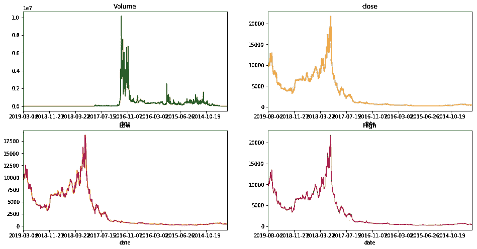

# 使用 FB 的 Prophet 预测苹果股票和比特币价格——使用 Python

> 原文：<https://towardsdatascience.com/apple-stock-and-bitcoin-price-predictions-using-fbs-prophet-for-beginners-python-96d5ec404b77?source=collection_archive---------6----------------------->

## **初学者指南—逐步分析**

# **时间序列分析**

这篇文章是关于使用脸书先知预测苹果股票和比特币价格使用 python API。

1.  先知是什么？
2.  苹果股价预测
3.  比特币价格预测
4.  使用 Matplotlib 和 Seaborn 的基本数据可视化。

# ***关于先知:***

P 是一个开源包(Python 和 R 都适用),用于基于加法模型预测时间序列数据，其中非线性趋势符合每年、每周和每天的季节性，加上假日效应。它最适用于具有强烈季节效应的时间序列和几个季节的历史数据。Prophet 对缺失数据和趋势变化非常稳健，通常能够很好地处理异常值。Prophet 是由脸书核心数据科学团队发布的开源软件。它可以在 CRAN 和 PyPI 上下载。

**使用 Prophet 的优势**

> *准确快速
> 
> *全自动
> 
> *可调预测。
> 
> *提供 R 或 Python 版本

F 预测是一项常见的数据科学任务，可帮助组织进行容量规划、目标设定和异常检测。尽管它很重要，但在生成可靠和高质量的预测方面存在严重的挑战，尤其是当存在各种时间序列并且具有时间序列建模专业知识的分析师相对较少时。为了应对这些挑战，我们描述了一种实用的“大规模”预测方法，该方法将可配置模型与分析师在回路中的性能分析相结合。我们提出了一个模块化的回归模型，其可解释的参数可以由具有时间序列领域知识的分析师直观地调整。我们描述了性能分析，以比较和评估预测程序，并自动标记预测以进行人工审查和调整。帮助分析师最有效地利用他们的专业知识的工具可以实现对业务时间序列的可靠、实用的预测。

资料来源:泰勒 SJ，Letham B. 2017 年。大规模预测。 *PeerJ 预印本*5:e 3190 v2 https://doi . org/10.7287/PeerJ . Preprints . 3190 v2

 [## 大规模预测

### 预测是一项常见的数据科学任务，可帮助组织进行容量规划、目标设定和异常情况预测…

peerj.com](https://peerj.com/preprints/3190/) 

Prophet 针对我们在脸书遇到的业务预测任务进行了优化，这些任务通常具有以下特征:

*   至少有几个月(最好是一年)历史的每小时、每天或每周观察
*   强烈的多重“人类尺度”季节性:星期几和一年中的时间
*   提前知道的不定期发生的重要节日(如超级碗)
*   合理数量的缺失观测值或较大的异常值
*   历史趋势变化，例如由于产品发布或记录变化
*   趋势是非线性增长曲线，趋势达到自然极限或饱和

Prophet 程序是一个[加法回归模型](https://en.wikipedia.org/wiki/Additive_model)，有四个主要组成部分:

> *呈分段线性或逻辑斯蒂增长曲线趋势。Prophet 通过从数据中选择变化点来自动检测趋势的变化。*
> 
> *使用傅立叶级数建模的年度季节性分量。*
> 
> *使用虚拟变量的每周季节性组件。*
> 
> *用户提供的重要节假日列表。*

 [## 预言家:大规模预测

### 预测是一项数据科学任务，是组织内许多活动的核心。例如，大…

research.fb.com](https://research.fb.com/blog/2017/02/prophet-forecasting-at-scale/) 

# ***先知安装***

*   首先，安装 Pystan
*   然后安装 Fbprophet

1.安装 Pystan

 [## 详细的安装说明- PyStan 2.19.0.0 文档

### 这是因为 PyStan(和许多 python 工具)需要具有 C 依赖关系的包(即模块)。这些类型的…

pystan.readthedocs.io](https://pystan.readthedocs.io/en/latest/installation_beginner.html) 

2.安装 fbprophet

我在 windows 中安装时遇到了问题。请按照文档说明正确安装 pystan，然后安装 fbprophet。

 [## Windows 上的 PyStan-PyStan 2 . 19 . 0 . 0 文档

### PyStan 在 Windows 下得到部分支持，但有以下警告:Python 2.7:不支持并行采样…

pystan.readthedocs.io](https://pystan.readthedocs.io/en/latest/windows.html) 

# **实现先知**

我正在使用

*   Python 3.6
*   Jupyter 笔记本
*   熊猫
*   马特普利卜
*   海生的
*   Plotly

# **步骤:**

1.  安装所有需要的软件包，包括 prophet 和 alphavantage。
2.  从 Alphavantage 获取 API 密钥。
3.  使用 API 获取苹果股票= AAPL 数据。
4.  使用 API 获取比特硬币= BTC 数据。
5.  如果需要，将其保存为 CSV 文件。
6.  数据在熊猫数据框中提供。
7.  确保将数据框转换为 prophet 要求的格式-ds 和 y 两列。
8.  ds 是日期，它应该是日期时间数据类型。
9.  y 是收盘价，应该是浮点数。
10.  选择预测周期，如您希望进行预测的时间范围，如 3 个月或 1 年等。
11.  符合模型。
12.  预测模型的预测期，如 3 个月或 1 年等。
13.  预测模型—为您提供预测收盘价、收盘价的上限和下限。
14.  调用先知绘图方法并进行一些绘图。

# 苹果股价预测

1.  首先导入所有的库

2.获取苹果股票价格

我们可以使用免费的 API

> **alpha vantage API**
> 
> ***Quandl API***
> 
> ***熊猫 _datareader***

我使用的是 Alphavantage API

获取 API 密钥

Alphavantage 文档

 [## Alpha Vantage API 文档

### Alpha Vantage 的 API 文档。Alpha Vantage 为实时和历史股票和权益提供免费的 JSON APIs

www.alphavantage.co](https://www.alphavantage.co/documentation/) 

您可以将数据输出到

*   ***CSV***
*   ***Json***
*   ***熊猫数据框***

此外，您可以指定输出大小

*   **压缩** —返回最近 100 天
*   **完整** —返回最近 20 年的数据

数据框如下所示

3.把它写到一个文件里，以防你将来需要它。

4.做一些基本的绘图

收盘价柱状图

## **技术分析**:

**SMA:简单移动平均线**

简单移动平均线(SMA)是一种算术[移动平均线](https://www.investopedia.com/terms/m/movingaverage.asp)，其计算方法是将最近的收盘价相加，然后除以计算平均值中的时间段数。

## 相对强度指数

J. Welles Wilder 开发的相对强弱指数(RSI)是一种动量振荡器，用于衡量价格运动的速度和变化。RSI 在 0 到 100 之间震荡。传统上，RSI 在 70 以上被认为超买，在 30 以下被认为超卖。信号可以通过寻找分歧和失败摆动来产生。RSI 也可以用来识别大趋势。

5.现在将数据帧转换成 fbprophet 期望的格式。Prophet 的输入总是一个包含两列的 data frame:`ds`和`y`。`ds`(日期戳)列应该是熊猫所期望的格式，理想情况下，日期应该是 YYYY-MM-DD，时间戳应该是 YYYY-MM-DD HH:MM:SS。`y`栏必须是数字，代表我们希望预测的测量值。

6.先知遵循`sklearn`模型 API。我们创建了一个`Prophet`类的实例，然后调用它的`fit`和`predict`方法。我们通过实例化一个新的`Prophet`对象来适应这个模型。预测过程的任何设置都被传递到构造函数中。然后调用它的`fit`方法并传入历史数据帧。安装需要 1-5 秒钟。

7.未来一年的预测。然后在数据帧上进行预测，数据帧中有一列`ds`包含要进行预测的日期。您可以使用 helper 方法`Prophet.make_future_dataframe`获得一个合适的数据帧，该数据帧延伸到未来指定的天数。默认情况下，它还将包括历史中的日期，因此我们将看到模型也是合适的。

预测 df 将包含未来一年的日期。最后 10 条记录如下所示

8.`predict`方法将为`future`中的每一行分配一个预测值，并将其命名为`yhat`。如果您传入历史日期，它将提供样本内拟合。这里的`forecast`对象是一个新的 dataframe，它包括一个包含预测的列`yhat`，以及组件和不确定性区间的列。

9.您可以通过调用`Prophet.plot`方法并传入您的预测数据帧来绘制预测。

10.如果您想查看预测组件，您可以使用`Prophet.plot_components`方法。默认情况下，您将看到时间序列的趋势、年季节性和周季节性。如果你包括假期，你也会在这里看到。

11.可以用 plotly 创建预测的交互式图形。您需要单独安装 plotly，因为默认情况下它不会与 fbprophet 一起安装。

12.创建比特币数据集

记录数量

13.一些基本的数据可视化

14.现在拟合模型，做预测。代码是

剧情是

# 理解情节:

首先标出日期和价格

情节看起来像

预测图看起来像

绘图功能是

有个博客在剧情上解释的很清楚。链接在下面

 [## 先知情节解释

### 第一次看 Prophet 生成的一个剧情的时候，我很失落。我开始在…中寻找解释

www.mikulskibartosz.name](https://www.mikulskibartosz.name/prophet-plot-explained/) 

# **验证**

使用`cross_validation`功能，可以对一系列历史临界值自动进行交叉验证程序。我们指定预测范围(`horizon`)，然后可选地指定初始训练期的大小(`initial`)和截止日期之间的间隔(`period`)。默认情况下，初始训练周期设置为三倍范围，每半个范围进行一次截止。

在每个模拟预测日期和每个截止日期，`cross_validation`的输出是具有真实值`y`和样本外预测值`yhat`的数据帧。特别是对`cutoff`和`cutoff + horizon`之间的每个观测点进行预测。然后，该数据帧可用于计算`yhat`对`y`的误差度量。

在这里，我们进行交叉验证以评估 365 天范围内的预测性能，从第一个截止日期的 730 天训练数据开始，然后每隔 180 天进行预测。在这 8 年的时间序列中，这相当于 11 次总预测。

df 看起来像

您可以看到实际值 y 和预测值 yhat。

# **绩效指标**

`performance_metrics`实用程序可用于计算预测性能的一些有用的统计数据(`yhat`、`yhat_lower`和`yhat_upper`与`y`的比较)，作为离截止点的距离的函数(预测距离未来有多远)。计算的统计数据包括均方误差(MSE)、均方根误差(RMSE)、平均绝对误差(MAE)、平均绝对百分比误差(MAPE)以及`yhat_lower`和`yhat_upper`估计值的覆盖范围。

*   RMSE(均方根误差)
*   平均绝对误差
*   MAPE(平均绝对百分比误差)

# **结论:**

这篇文章的主要目的是安装 prophet，提取历史股票价格数据和加密货币数据，做一些基本的可视化和使用 prophet 做预测。请参考 fbprophet 文档

 [## 快速启动

### Prophet 遵循 sklearn 模型 API。我们创建一个 Prophet 类的实例，然后调用它的 fit 和 predict…

facebook.github.io](https://facebook.github.io/prophet/docs/quick_start.html#python-api) 

你可以通过改变参数来玩它

*   假期建模
*   使用自定义季节性
*   使用[逻辑增长](https://en.wikipedia.org/wiki/Logistic_function)趋势模型等

参考资料:

[1] Sean J. Taylor 和 Benjamin Letham 按比例预测，脸书，美国加利福尼亚州门洛帕克

链接:

 [## 先知

### Prophet 是一个用 R 和 Python 实现的预测程序。它速度很快，并提供完全自动化的预测…

facebook.github.io](https://facebook.github.io/prophet/)