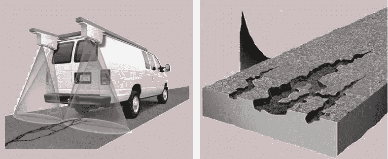
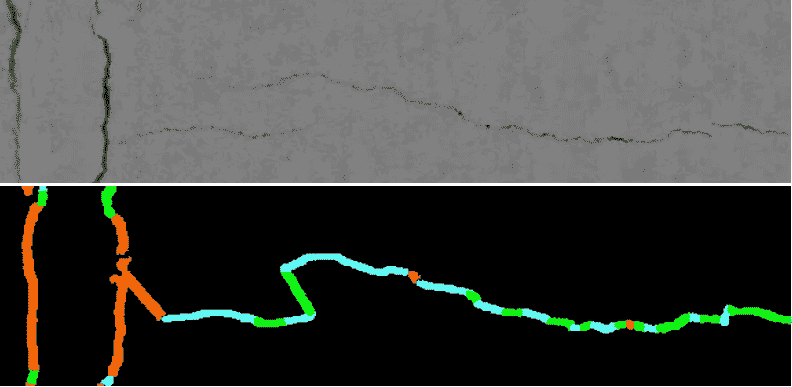
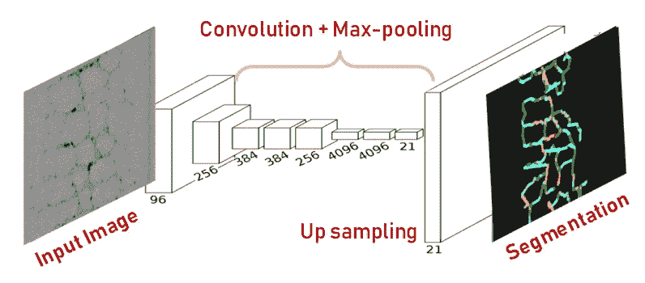
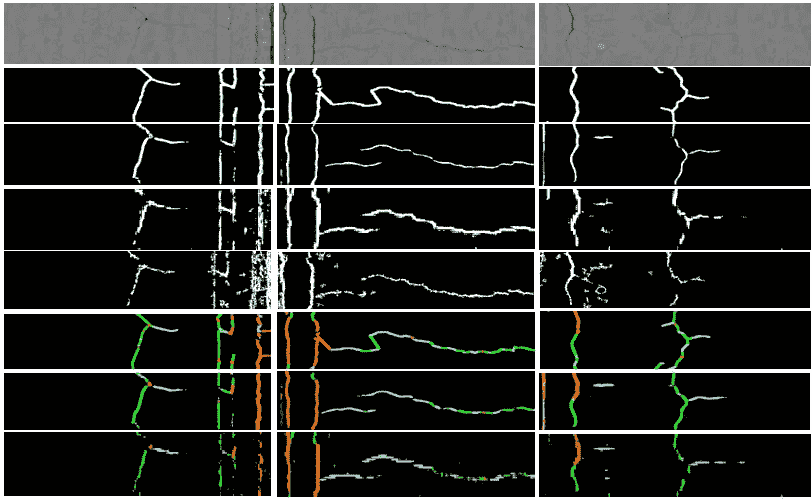

# 深度学习在道路裂缝识别中的应用

> 原文：<https://towardsdatascience.com/application-of-deep-learning-in-identifying-road-cracks-8153e50ce9e2?source=collection_archive---------23----------------------->

最近，作为我研究的一部分，我有机会使用一个非常酷的道路裂缝检测数据集。一家公司(姑且称之为道路裂缝和其他重要事物部，简称 MRCOIS)😑)正在寻求一种自主系统来定位道路裂缝，并根据 3 种裂缝严重程度(低、中、高)对其进行分类。他们非常慷慨地向我们提供了安大略省四条主要公路上的裂缝路面。数据集是使用由 *Furgo Inc* 设计的 *ARAN 9000* (自动道路分析仪 9000)道路勘测系统收集的。 *ARAN 9000* 是一种基于激光雷达和相机的集成系统，通常用于执行道路勘测。

*Illustration of data collection from the ARAN 9000 system. The system uses an integrated LiDAR and camera based sensor to detect road cracks.*

数据集被分成 3 个不同严重程度的裂缝(低、中、高)。相机和激光雷达数据共同用于检测道路裂缝。然后根据裂缝的宽度和深度确定裂缝的严重程度(*深而宽的裂缝被确定为严重或高严重程度，而浅而窄的裂缝为低-中等严重程度)*。

*Instances of road cracks (Top Image: LiDAR range image, Bottom Image: Detected instances of road cracks) (Red: Hight severity, Green: Medium severity, Blue: Low severity)*

MRCOIS 目前使用的系统是基于裂缝定位阈值技术的组合，然后是基于裂缝平均宽度和深度的多标签分类，以识别裂缝的严重程度。阈值方法对噪声非常敏感，因此道路标记经常被错误地提取为图像中的道路裂缝。阈值技术也已知产生不完整的边缘，因此该方法使用边缘连通性来连接不连续的边缘。这种方法经常导致在没有任何裂缝的区域产生假边缘。

为了解决这些问题，我和我的朋友使用了两种流行的深度学习架构(改进的 CNN 和 FCN)来检测和分类道路裂缝。我总共获得了大约 3000 张照片。由于数据集非常小，我广泛使用数据扩充技术将数据集的大小增加到大约 220，000 张图像。大量的数据是通过将原始图像裁剪成较小的小块而生成的，相邻小块之间有 75%的重叠。因为不是每个小块都包含裂纹像素，所以使用进一步的过滤来去除包含少于 0.5%裂纹像素的图像。然后，为了训练和验证的目的，将补丁分成 9:1。

# **方法 1:具有结构化预测的卷积神经网络**

第一种方法基于具有结构化预测的卷积神经网络(CNN)。提出该方法的[原始论文](https://arxiv.org/pdf/1802.02208.pdf)进行了二元分类定位裂纹像素(即裂纹或非裂纹)。在我的论文中，改进了架构以检测不同级别的裂缝严重性。利用更深的网络来学习更复杂的特征，并输出对应于不同裂纹严重程度的多个类。该架构如下图所示。

*CNN with structured prediction modified to detect multiple instances of crack severity*

# 方法 2:全卷积神经网络

本研究中使用的第二种方法是基于 VGG-16 的 FCN-8([全文](https://people.eecs.berkeley.edu/~jonlong/long_shelhamer_fcn.pdf))。FC 网络的结构基于编码器-解码器架构，其中网络的最初 7 层是典型 CNN 的层，后续层用于通过解卷积对结果进行上采样来生成分割图。

在这项研究中，我们使用了 FCN-8 结构。该网络包含 7 个回旋和 5 个汇集层。由于我们使用 FCN-8 架构，我们有 3 个反卷积层，跳过了第 3 层和第 4 层的连接。

*Fully Convolutional Network for road crack severity detection*

# 结果和验证

该网络在 GTX-1070 GPU 和 16 GB 内存上进行训练。对结果进行定位和严重程度分类评估。

*Top row: Original Image, 2nd row: Binary ground truth, 3rd row: Binarized results from FCN, 4th row: Original CNN with structured prediction, 5th row: Morphological detection, 6th row: Ground truth with crack severity, 7th row: Severity detection from FCN, 8th row: Severity detection from improved CNN with structured prediction*

计算裂缝定位(即二元分类)和严重性分类结果的精确度、召回率和 F1 分数。**验证数据集**的准确性指标如下表所示。

*Accuracy metrics for binary crack classification*

*Accuracy metrics for crack severity classification*

尽管结果表明了准确的检测结果，但是仍然存在导致错误分割的问题。在训练网络时，我面临的一个关键问题是训练数据集的质量很差。地面真实数据集包含道路标记和虚假边。因此，整体裂纹定位精度较差，进而导致裂纹严重程度分类精度较低。训练数据的数量也不够，因为最初提供了一些图像，并且不是每个图像都包含裂纹像素。

虽然获得了有希望的结果，但仍需要进行一些改进(获得更好的训练数据集将是一个开始😅).如果你们喜欢这项工作或者需要更多信息，可以在这里找到我的完整出版物。