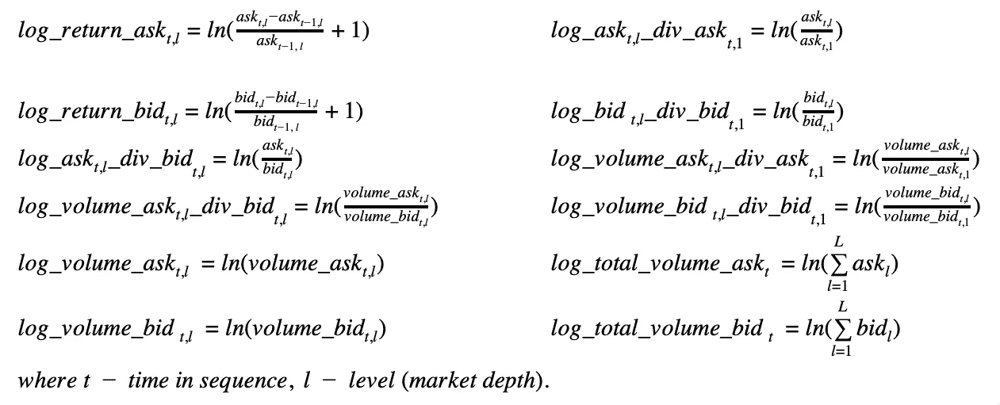
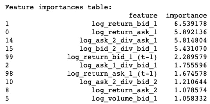

# 梯度推进在订单建模中的应用

> 原文：<https://towardsdatascience.com/application-of-gradient-boosting-in-order-book-modeling-3cd5f71575a7?source=collection_archive---------2----------------------->

今天，我们将创建一个预测订单簿中价格变动的 ML 模型。本文包含了一个完整的研究周期:获取数据、可视化、特征工程、建模、算法的微调、质量评估等等。

# **什么是订单簿？**

订单簿是一个电子列表，列出了按价格水平组织的特定证券或金融工具的买卖订单。订单簿列出了每个价位或市场深度的出价或出价股票数量。市场深度数据有助于交易者确定特定证券的价格走向。例如，交易者可以使用市场深度数据来了解证券的买卖差价，以及高于这两个数字的交易量。具有强大市场深度的证券通常具有强大的交易量和相当的流动性，允许交易者在不显著影响市场价格的情况下下大量订单。更多信息请点击[这里](https://www.investopedia.com/terms/m/marketdepth.asp)。

Pricing scheme

市场深度看起来像这样，可视化可能是不同的，它取决于软件

BTC market depth on GDAX

另一种可视化订单簿的方式是一个包含出价和报价的列表

Order book list

中间价是介于股票或商品的卖方的最优价格或卖价和买方的最优价格或买价之间的价格。它可以简单地定义为当前报价的平均买价和卖价。

**我们的目标是创建一个预测中间价的模型。**

# 获取数据

让我们从[龙虾](https://lobsterdata.com/info/DataSamples.php)下载数据样本。该服务以谷歌、苹果、亚马逊、英特尔、微软资产为例，提供 3 个级别的市场深度(1、5、10 级)。

首先，我建议将所有可用资产的中间价和买卖差价可视化。我们需要导入必要的库

下一段代码从文件中加载给定资产和级别的数据

之后，我们可以可视化每个资产

Mid-price and ask-bid volume difference

MSFT 和 INTC 有稍微奇怪和不同的分布。中间价图没有单一的钟形曲线，它看起来像两个分布的混合。还有，量差太对称，和其他资产不一样。

# 特征工程

这一部分非常重要，因为模型的质量直接取决于它。我们应该在这些新特性中反映出价、要价、交易量以及不同深度数据之间的广泛关系。

接下来的公式允许创建这些特征

Features

这些特征是特征工程的第一部分。第二部分是添加滞后组件。这意味着我们在时间上有一些滞后地移动给定的特征，并作为列添加。此示例显示了它在原始数据集(非新要素)上的工作方式。

Lag components example

接下来的代码提供了特征工程的这两个部分，并添加了目标列 *log_return_mid_price* 。

通常，特征看起来像这样

Features example

# 通过梯度增强和微调进行建模

> 我们的目标是表明训练 GBM 是在我们的真实目标， **y，**和我们的近似之间的一些损失函数上执行梯度下降最小化，

> 这意味着增加弱模型，

> 我们的 GBM 添加剂模型:

> 正在以某种方式进行梯度下降。这是有意义的，推动我们的逼近，越来越接近真正的目标 **y** 将执行梯度下降。例如，在每一步，残差变小。我们必须最小化一些与真实目标和我们的近似值之间的距离相关的函数。让我们重温一下高尔夫球员的类比，想象一下近似值和真实值之间的平方误差

更多信息你可以在这里找到[。](https://explained.ai/gradient-boosting/descent.html)

我们将使用 Yandex 的梯度增强实现，它调用 [CatBoost](https://catboost.ai) 。在大多数情况下，这个库在速度和质量上都优于其他库

Libraries performance

该算法有几个对质量有巨大影响的参数:

*   *n_estimators* —解决机器学习问题时可以建立的最大树数；
*   *深度* —树木的最大*深度*；
*   *learning_rate* —该设置用于减少梯度步长。它影响训练的整体时间:值越小，训练需要的迭代次数越多；
*   *l2_leaf_reg* —成本函数的 l2 正则项的系数。允许任何正值。

此外，我们还有特性的参数:

*   *水平* —市场深度；
*   *时间步数* —建立多少个滞后。

理论上，我们的每个资产都有唯一的一组参数。对于这项任务，我们应该定义评估模型质量的目标函数

定义最佳参数的最佳方法之一是贝叶斯优化。我在[上一篇文章](http://One of the best ways to define the optimal parameters is Bayesian optimization. I described this approach in the previous article.)中描述了这种方法。

损失函数是这样的 RMSE

训练集从一开始就包含 50%的数据。验证数据用于模型的微调。测试最终结果所需的最后 25%的数据，这是保留数据。

在微调步骤之后，我们在两个部分(训练集和验证集)上训练最终模型，并使用最后一个部分测试模型。让我们编码这个

*do_experiment* 函数是本次研究的主要函数之一。该函数另外建立最佳模型的特征重要性，并估计模型的质量。

> 通常，重要性提供了一个分数，该分数指示每个特征在模型内的增强决策树的构造中有多有用或有价值。在决策树中，一个属性被用来做关键决策的次数越多，它的相对重要性就越高。
> 
> 这种重要性是为数据集中的每个属性显式计算的，允许对属性进行排序和相互比较。
> 
> 对于单个决策树，重要性通过每个属性分割点改进性能度量的量来计算，通过节点负责的观察的数量来加权。性能测量可以是用于选择分裂点的纯度(基尼指数)或另一个更具体的误差函数。
> 
> 然后，对模型中所有决策树的特征重要性进行平均。来源[这里](https://machinelearningmastery.com/feature-importance-and-feature-selection-with-xgboost-in-python/)。

# 结果分析

成功的基本衡量标准是使误差小于基线。意味着最终的模型质量很好。

第一个问题是如何衡量质量。可能是平方误差。之后就可以用 bootstrapping 法估计区间了。bootstrap 采样、计算统计和区间估计在上面的 *bs_interval* 函数中实现。

Bootstrapping

第二个问题是应该使用什么值作为基线预测。许多研究声称市场是不可预测的。通常，预测的下一个价格与上一个价格相同，加上一些噪声，如下所示

Bad stock prediction result

这意味着，如果我们想要预测回报，它将是 0 加上噪声左右。你可以在 Rafael Schultze-Kraft 的这篇[文章](https://hackernoon.com/dont-be-fooled-deceptive-cryptocurrency-price-predictions-using-deep-learning-bf27e4837151)中找到这个结果。

我们的基线是相似的。这种方法在 *do_experiment* 函数中实现。让我们运行这个实验*do _ experiment(asset _ name)*，其中 *asset_name* 来自列表(AAPL、AMZN、GOOG、INTC、MSFT)。

将重要的参数和指标收集到此表中

Final result table

AMZN 和 GOOG 具有相同的最佳参数。通常，水平和深度具有最大值或接近最大值。

正如我们所记得的，在开始的探索阶段，前三个资产(AAPL、AMZN、GOOG)具有良好的买卖价格和交易量分布。最后两个资产(INTC，MSFT)有奇怪的分布。

该表显示，我们在 AAPL、AMZN、GOOG 和**的误差方面获得了统计上的显著差异。** **基线被击败**(绿色)。建模间隔的上限低于基线的下限。

对于 INTC，我们没有显著的结果，区间是交叉的(灰色)。在 MSFT 的情况下，给定的结果比基线差(红色)。**可能，其原因是检测到的分布模式**(可能是做市商的一些活动或其他事情)。

让我们看看这些模型最重要的特征

Top features for AAPL

Top features for AMZN

Top features for GOOG

Top features for INTC

Top features for MSFT

正如我们所看到的，对于成功的模型，最重要的特征与最近的值相关联 *log_return_ask* ， *log_return_bid* ， *log_ask_div_bid* 等等。

# 结论

1.  提出了基于梯度推进的订单簿建模方法。你可以在 [GitHub](https://github.com/lamres/orderbook_modeling) 上找到的代码。
2.  描述和形式化的特征工程方法。显示了特征的重要性。
3.  演示质量评估。对于一些资产，获得了良好的结果。

**如何提高成绩:**

1.  在优化中更改 *max_evals* 的数量。
2.  在拟合中改变*最大 _ 深度*，*n _ 估计量*。
3.  添加比当前功能更好的新功能，或给定功能的组合。
4.  使用更多数据进行实验，以获得更好的模型。
5.  在订单簿中查找具有更多*级*的历史。
6.  使用专门为时间序列开发的模型(如 LSTM、GRU 等)。

最诚挚的问候，

谢尔盖