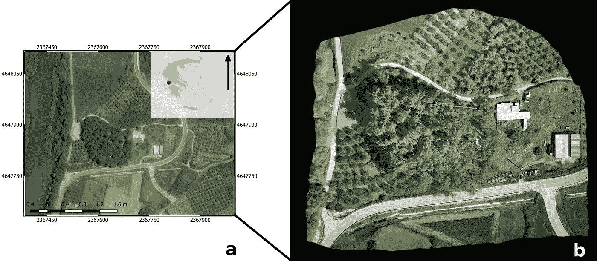
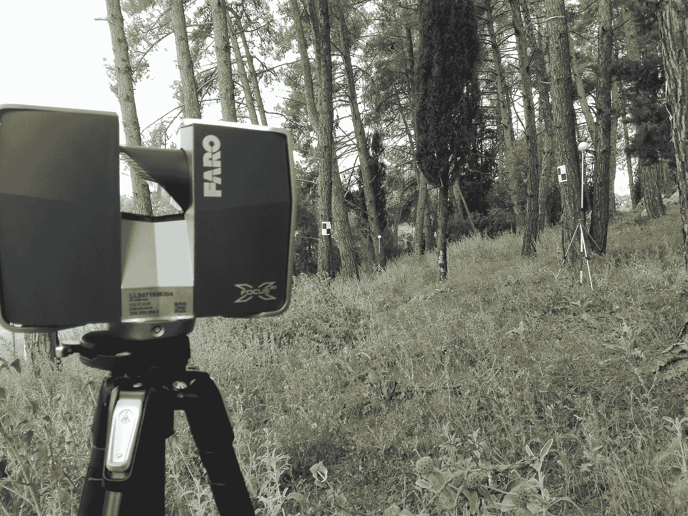
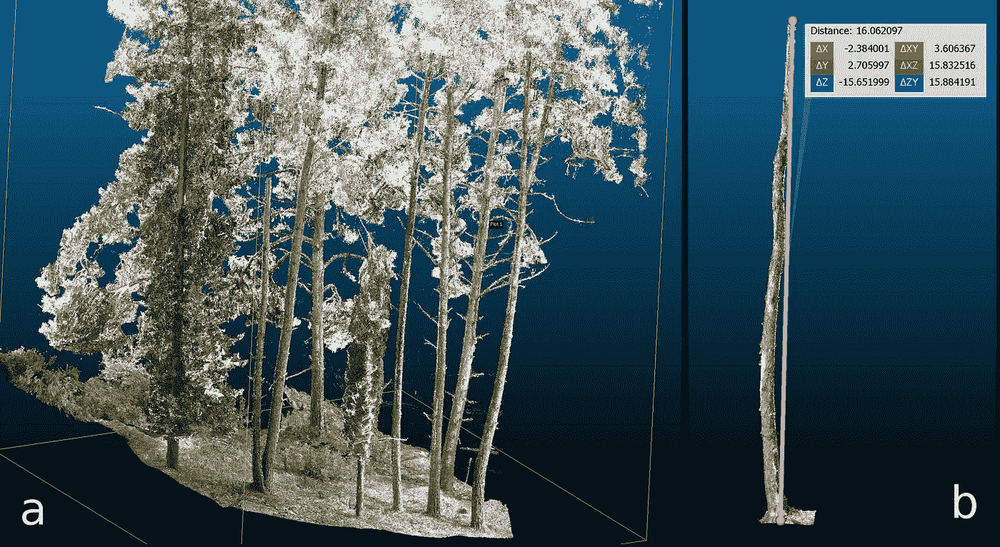
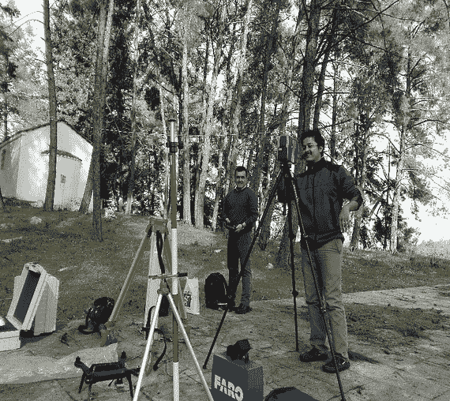
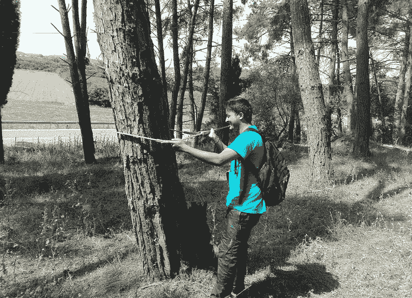
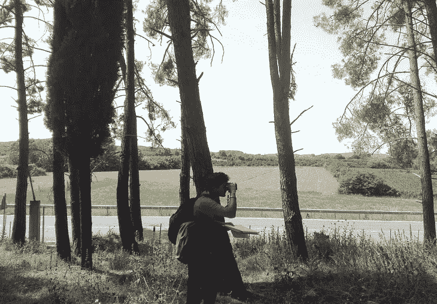

# 激光雷达在林业中的应用。

> 原文：<https://towardsdatascience.com/applications-of-lidar-in-forestry-13686e1b15a7?source=collection_archive---------10----------------------->

Llight Detection and Ranging(激光雷达)是一种主动遥感传感器，它发射激光信号，根据返回的激光脉冲的时间延迟来计算距离。他们能够记录密集的距离回波值阵列(例如，在 50 米范围内每平方厘米几个激光回波的数量级)，这些数据被组合成表面的高度详细的 3D 重建。这些在林业中有多种应用，例如:

1.  为森林规划和管理生成高分辨率数字高程产品(DSM，DTM)的详细表面建模。
2.  激光雷达技术为精确的生态和土地利用分类提供了更准确的信息。
3.  激光雷达可以通过测量树冠的垂直结构和密度来绘制森林地图。这些模型有助于我们了解复杂的森林结构，并生成准确的森林清单。
4.  激光雷达可以用来监测森林中的火灾模式，使消防部门意识到下一次可能的森林火灾。
5.  针对特定森林区域的精准林业可以帮助我们提高树木质量和总产量。
6.  这样的例子不胜枚举……

# 用于精确森林调查的地面激光雷达

在这里，我想给你们概述一下我在希腊西部地中海针叶林的研究，该林位于希腊 Aetolia-Acarnania 村 Gouria 附近，使用地面激光扫描仪(TLS)进行研究。我们只对白皮松进行了研究，因为它是我们项目区最主要的物种(90%)。这项研究中使用的地面激光扫描仪是 Faro Focus 3D 330，它具有 300°和 360°的垂直和水平视场。它的范围从 0.6 米到 330 米，距离精度达到 2 毫米，噪音降低 50 %。下图展示了研究区域和 TLS 的视觉信息。

Study Area in Aetolia-Acarnania village of Greece

Terrestrial Laser Scanner ( Faro Focus 3D 330 )

此外，使用照片级真实感漫游从 TLS 进行密集 3D 重建的示例如下所示:

**TLS based 3D point cloud dataset of a small section of the study area.**

使用密集 3D 重建，我们应用聚类、过滤和圆柱拟合算法来自动计算距离树基部 1.3 米处的胸径(DBH)。对于树高的测量，首先，从 TLS 导出的点云中分割出单棵树。然后，使用点云两端之间的差异来测量个体树。DBH 和树高结果的直观演示可使用下图进行评估:

***Automatic Detection of DBH (white color), tree trunk (red color)***

***Tree Height Computation from TLS point cloud data***

我们使用 DBH 和树高的实地测量来验证结果，使用的树测径器与树干成直角，距离树基部 1.3 米。同样，使用激光测距仪测量树高的实地估计值。下图展示了这两种情况。

Field measurements of DBH and Tree Height to validate the findings.

当将从现场数据测量的 DBH 与从 TLS 导出的 DBH 进行比较时，R 平方值的范围为 0.75 至 0.96。同样，当比较 TLS 和田间数据之间的树高时，获得 0.80 和 1.07 的平均 R 平方和 RMSE 值。

最后，本研究得出结论，TLS 在更精确地获得森林资源调查变量(DBH 和树高)和结构特征(如蓄积量)方面具有很大的潜力。结果证实，TLS 可以提供一个非破坏性的，高分辨率和精确的森林调查参数的确定。这项研究的结果将有助于研究人员更好地理解由于所提供的处理参数的变化而导致的森林清查变量检索准确性的偏差，并进一步促进森林管理的决策。

这项研究的结果已经发表在 SpringerLink 的《摄影测量、遥感和地理信息科学杂志(PFG)》上。日记账可以使用:【https://link.springer.com/article/10.1007/s41064-017-0024-1】进行评估

干杯！

苏曼·吉米尔

地理空间现场数据分析员

国际山区综合发展中心

尼泊尔加德满都邮政总局信箱 3226 号

**电话**+977–1–5275222 转 214 **传真**+977–1–5275238**网页**[www.icimod.org](http://www.icimod.org/)