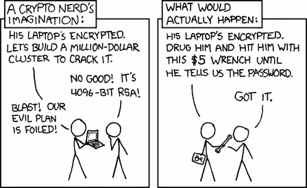
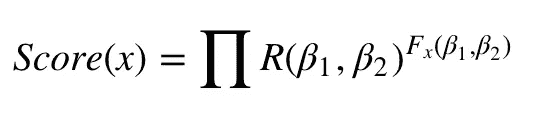
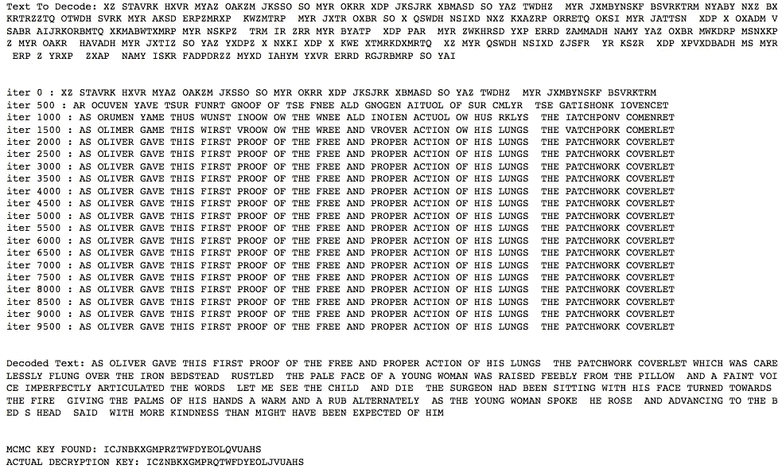
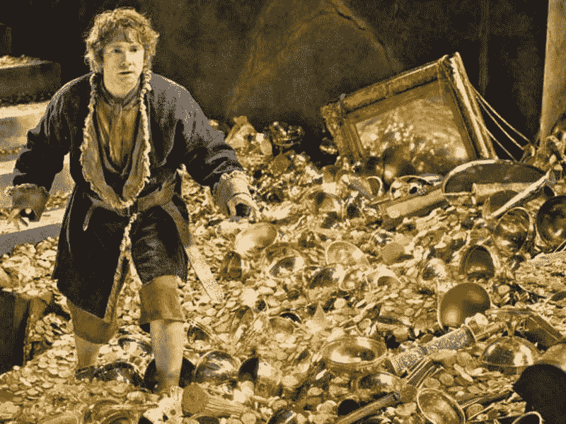
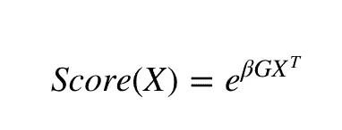

# MCMC 在密码学和最优化中的应用

> 原文：<https://towardsdatascience.com/applications-of-mcmc-for-cryptography-and-optimization-1f99222b7132?source=collection_archive---------3----------------------->

## 增进理解的例子


Photo by [Balázs Kétyi](https://unsplash.com/@balazsketyi?utm_source=medium&utm_medium=referral) on [Unsplash](https://unsplash.com?utm_source=medium&utm_medium=referral)

MCMC 是一个很难理解的话题，但是例子确实很有帮助。

上次我写了一篇[文章，直观地解释了 MCMC 方法](/mcmc-intuition-for-everyone-5ae79fff22b1)。在那篇文章中，我展示了如何使用 MCMC 链来模拟分布部分已知的随机变量，即我们不知道归一化常数。

我还讲述了如何使用 MCMC 的 ***来解决大型状态空间的问题。*** *但没有给出例子。*

在这篇文章中，我将提供一些真实的用例。

如果你到目前为止还没有真正欣赏 MCMC，我希望我能在这篇博文结束时激起你的兴趣。

***这个帖子是关于借助一些计算机科学问题来理解 MCMC 方法的。***

# 1.密码学——你是一个密码迷吗？



我喜欢密码学。

解谜一直是我的一个爱好，这个例子帮助我更好地理解了许多关于 MCMC 的想法。

这个问题也有很大的渊源，因为这个方法是由数学魔术师佩尔西·戴康尼斯提出的。

所以问题是:

***有人带着下面的文字来找你。这条短信看起来像是胡言乱语，但实际上，这是一条可以拯救数百万人生命的秘密短信。他还告诉我们，它是用替代密码解密的。***

> XZ STAVRK HXVR MYAZ oak zm JKSSO SO MYR OKRR XDP JKSJRK XB masd SO YAZ tw dhz MYR JXMBYNSKF BSVRKTRM nya by NXZ BXKRTRZZTQ OTWDH SVRK MYR AKSD ERPZMRXP KWZMTRP MYR JXTR OXBR SO X QSWDH NSI xd NXZ kx azzrp or retq OKSI MYR jat tsn XDP X OXA DM vs ABR aijkorb mtq xkmabwttxmrp MYR NSKPZ TRM XDP MYR 女士

你能解密它吗？

让我们运用我们新发现的 MCMC 的力量。

> ***关于替代密码的一个注意事项:替代密码就是我们用一个字母替代另一个字母。比如 A 变成 I，B 变成 C 等等。在原文中。***

为了创造这个例子，这些数据实际上取自《雾都孤儿》。我们使用随机加密密钥对数据进行加密，加密后我们忘记了密钥，我们希望使用 MCMC 链对加密文本进行解密。真正的解密密钥实际上是

" ICZNBKXGMPRQTWFDYEOLJVUAHS "

所以让我们稍微思考一下这个问题。

解密密钥可以是任何 26 个字母的字符串，所有字母只出现一次。像这样的字符串排列有多少种？这个数字将会是 26！大约 10 个⁶排列。

这是一个相当大的数字，因此这个问题有一个 ***大的状态空间*** (本质上是我们可能需要解析的大量排列)。

如果我们使用暴力的方法，也许我们的孙子或者他们的孙子会得到解决方案。那么我们能做什么呢？

谁是 MCMC？

我们将设计一个链，其状态理论上可以是这些排列中的任何一种。然后我们将:

1.  从选择一个随机的当前状态开始。
2.  通过交换当前状态中的两个随机字母来创建新状态的提议。
3.  使用 ***评分函数*** 计算当前状态`Score_C`和建议状态`Score_P`的得分。
4.  如果建议状态的分数大于当前状态，则移动到建议状态。
5.  否则抛硬币决定哪个有正面的可能性`Score_P/Score_C`。如果它来了，头移动到提议的状态。
6.  从第二步开始重复。

如果我们幸运的话，我们可能会达到一个稳定的状态，在这个状态下，这个链具有所需状态的稳定分布，这个链所处的状态可以作为一个解。

## 什么是评分函数？


这里我们需要担心的主要是评分函数。我们如何计算一个提议是否是一个好的提议？

还记得我上一篇文章中的 hill 例子吗？

我们想搬到最高的山上，并在那里呆很长时间。我们应该为每个状态(解密密钥)使用一个评分函数，该函数为每个解密密钥分配一个正的分数。

如果使用这个解密密钥解密的加密文本看起来更像真实的英语，这个分数直观上应该更高。

那么我们如何量化这样一个函数呢？

英语有一种特殊的结构。我们假设某一对字母一起出现的次数可能遵循某种特定的模式。因此“TH”比“ZF”更有可能出现。


我们将检查一个长文本并计算这些统计数据。

我们将会看到在像《战争与和平》这样合法的长文本中，一个字母一个接一个出现了多少次。这里文本的选择并不重要。

例如，我们希望找出“BA”在文本中出现了多少次，或者“TH”在文本中出现了多少次。

对于每对字符β₁和β₂(例如β₁ = T 和β₂ =H)，我们让 R( β₁,β₂)记录该特定对(例如“TH”)在参考文本中连续出现的次数。

类似地，对于解密密钥 x，我们让 Fₓ(β₁,β₂)记录当使用解密密钥 x 解密密文时该对出现的次数

然后，我们使用以下公式对特定的解密密钥 x 进行评分:



这个函数可以被认为是对解密文本中的每个连续字母对乘以该对在参考文本中出现的次数。

直观上，当解密文本中的配对频率最接近地匹配参考文本中的配对频率时，得分函数较高，因此解密密钥最有可能是正确的。

为了使我们的计算生活更容易，我们将计算 log(Score(x))

让我们开始逐步解决这个问题。

首先，让我们加密一些文本来创建我们的例子。在这个残酷的世界上，我们必须自己做所有的事情。

我们可能希望首先为我们的评分函数和评分函数本身创建一些统计数据。

我们还想有一个功能来创建提案国和随机硬币投掷。

最后，这是我们使用 Metropolis-Hastings 算法运行的 MCMC 函数。

现在让我们使用上面的所有函数运行整个代码。

输出:



这个链大约在第 2000 次迭代时收敛，我们能够解读代码。

太棒了。

现在，正如您看到的，找到的 MCMC 密钥并不完全是加密密钥。因此，该解决方案不是确定性的，但我们可以看到，它实际上并没有减少 MCMC 方法提供的任何值。

现在让我们帮助比尔博。

# **2。背包问题**



所以比尔博·巴金斯去了史矛革的巢穴。

**他发现了 M 宝藏。**

每个宝藏都有一定的重量和黄金价值。

但问题是比尔博真的承受不了这些。

他只能承受一定的最大重量。

但是作为一个聪明的霍比特人，他想最大化他拿走的财宝的价值。

考虑到重量和宝藏的价值以及比尔博能携带的最大重量，你能找到一个好的解决方案吗？

这就是计算机科学中的背包问题。

所以在这个问题中，我们有一个 ***1xM*** 数组的重量值 W，黄金值 G，以及一个比尔博可以携带的最大重量 w_MAX 的值。

我们想找出一个由 1 和 0 组成的 ***1xM*** 数组 X，它保存着比尔博是否携带了某个特定的宝藏。

该数组需要遵循以下约束:

WX < w_MAX

i.e. the total weight Bilbo Carries is less than Max Weight.

and we want to maximize

GX

i.e. the total Gold value for a particular state X.


Now as earlier this problem also has a **大境界空间。**如果我们尝试用蛮力来做，我们需要的排列数是 2^M.，我们可以看到它会变得很大。

如前所述，这是我们可以使用 MCMC 方法的地方。

因此，让我们首先讨论如何从先前的状态创建一个提案。

1.  从状态中选择一个随机索引并切换索引值。
2.  检查我们是否满足约束。如果是，则该状态是建议状态。
3.  否则选择另一个随机索引并重复。

我们还需要考虑评分函数。

我们需要给黄金价值高的州以高价值。我们将使用:



分数越高，我们给予的价值就越大。这里的β是一个+ve 常数。(T 代表转置)

但是β怎么选呢？

如果β很大，我们会给好的解决方案一个很高的分数，链将不能尝试新的解决方案，因为它会陷入局部最优。

如果我们给一个小的值，这个链不会收敛到非常好的解。

因此，我们使用一种称为 [**模拟退火**](https://en.wikipedia.org/wiki/Simulated_annealing) 的优化技术，即我们将从一个较小的β值开始，随着迭代次数的增加而增加。

这样，链将在开始阶段探索，并在后期阶段停留在最佳解决方案。

现在，我们已经有了开始行动所需的一切。

让我们从创建一个建议函数和得分函数开始。

以及 MCMC 项目。

运行主程序:

```
OUTPUT
________________________________________________________________MCMC Solution is : [0, 0, 0, 1, 1, 0, 0, 1, 1, 1, 1, 0, 0, 0] with Gold Value: 2435
```

现在我不会说这是最好的解决方案。

使用 DP 的[确定性解决方案](https://www.sanfoundry.com/python-program-solve-0-1-knapsack-problem-using-dynamic-programming-memoization/)对于这种用例来说是最好的，但是有时当问题变大时，拥有这样的技术变得非常有价值。

# 结论


在这篇文章中，我试图用 MCMC 解决计算机科学中的两个问题。

密码学本身是一个庞大的课题，有很多应用。背包问题出现在各种领域的现实世界决策过程中，例如寻找最少浪费的方法来切割原材料，选择[投资](https://en.wikipedia.org/wiki/Investment)和[投资组合](https://en.wikipedia.org/wiki/Portfolio_(finance))，选择互联网下载管理器中的数据块以及其他优化。

这两个问题都有一个很大的状态空间，不可能用蛮力来解决。

你对 MCMC 方法有什么看法？

此外，如果您发现任何好的应用程序，或者想将这些技术应用到某个领域，我真的很乐意了解它们，并在可能的情况下提供帮助。

你可以在 [GitHub](https://github.com/MLWhiz/data_science_blogs/tree/master/MCMCApplications) 或者 [Google Colab](https://colab.research.google.com/drive/1P7kBAfZxGJ7jRSZixaLRVr7Zaf2EZvcW) 上找到全部代码。


你可以关注的最新和最好的资源之一是 [**高级机器学习专业化**](https://www.coursera.org/specializations/aml?siteID=lVarvwc5BD0-AqkGMb7JzoCMW0Np1uLfCA&utm_content=2&utm_medium=partners&utm_source=linkshare&utm_campaign=lVarvwc5BD0) 中的 [**贝叶斯机器学习方法**](https://www.coursera.org/specializations/aml?siteID=lVarvwc5BD0-AqkGMb7JzoCMW0Np1uLfCA&utm_content=2&utm_medium=partners&utm_source=linkshare&utm_campaign=lVarvwc5BD0) 课程

我以后也会写更多这样的帖子。让我知道你对这个系列的看法。在 [**媒体**](https://medium.com/@rahul_agarwal) 关注我，或者订阅我的 [**博客**](http://eepurl.com/dbQnuX) 了解他们。一如既往，我欢迎反馈和建设性的批评，可以通过 Twitter [@mlwhiz](https://twitter.com/MLWhiz) 联系。

# 参考

1.  [**概率导论约瑟夫·K·布利茨泰因、杰西卡·黄**](http://www.amazon.com/Introduction-Probability-Chapman-Statistical-Science-ebook/dp/B00MMOJ19I)
2.  [**百科**](https://en.wikipedia.org/wiki/)