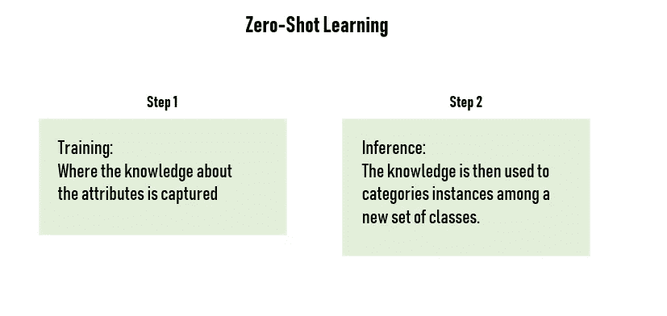

# 零起点学习的应用

> 原文：<https://towardsdatascience.com/applications-of-zero-shot-learning-f65bb232963f?source=collection_archive---------5----------------------->

作为计算机视觉研究小组的成员，我想写这篇短文来简要介绍我们所谓的“零射击学习”(ZSL)，一种迁移学习的有趣变体，以及当前与之相关的研究。

今天，许多机器学习方法专注于分类实例，这些实例的类已经在训练中出现过。具体地说，许多应用程序需要对其类以前从未见过的实例进行分类。零炮学习是一种很有前途的学习方法，其中训练实例覆盖的类与我们要分类的类是不相交的。换句话说，零射击学习就是在没有额外训练数据的情况下利用监督学习。

> **零镜头学习**指的是机器学习的一个具体用例(*，因此深度学习*)，其中你希望模型基于很少甚至没有*标记的*例子对数据进行分类，这意味着动态分类。

让我们想想卷积神经网络(CNN)是如何工作的——它们将*例如*图像识别的一般任务分解为一系列由连续层执行的较小任务，其中每一层处理越来越复杂的特征。

当我们训练一个网络来识别一张*给定的图片时，例如一个*人，我们已经训练它来识别手臂、腿、*脸等等。*由于这一点，我们可以重复使用这些特征检测器，并重新排列它们来执行一些其他任务，而无需额外的培训。

> 换句话说，零射击学习是关于利用已经由监督学习以其他方式训练的深度学习网络，而不需要额外的监督学习。

零射击学习可以产生非常有趣的应用，尤其是在我们缺乏适当数据集的情况下。你可能知道，在几乎所有的计算机视觉项目中，缺乏数据是一个巨大的问题。如果要我用几句话来总结 ZSL，我会说是:

*   无训练样本的模式识别
*   基于语义转移

## 数据的自然稀缺

零射学习是人类已经具备的能力。事实上，我们可以用“最小数据集”学习很多东西。例如，你倾向于用每种水果的一些图片来区分同一种水果的不同品种(细粒度分类)和其他水果或外观相似的水果(常规分类)。**机器的情况不同...他们需要大量的图像来学习适应自然发生的变化。**

这种天生的能力来自于我们现有的语言知识库，它提供了对一个新的或未见过的类的高层次描述，并在它和见过的类和视觉概念之间建立了联系。

# 为什么我们需要零拍学习？

如你所知，在许多领域中有大量且不断增长的类别。因此，很难为每个类别收集大量带注释的数据。

在一些项目中，类的数量可以达到数千个，并且为每个类获取足够的训练数据是复杂的。零炮学习旨在仅使用来自一小组类的标记数据和关于类关系的外部知识来预测大量未看见的类。此外，类别的数量不断增加，为每个新类别收集新数据的难度也在增加。在需要大量数据的深度学习中尤其如此…

> 同一物体的不同种类可能很快变成一场噩梦，在这种情况下，无监督学习无法提供帮助。

此外，在正常的对象识别过程中，我们必须确定一定数量的对象类别以提高我们的准确性，并为选定的对象类别收集尽可能多的样本图像。此外，这些样本图像应该包含在各种环境中从不同角度拍摄的元素，以便丰富数据集。

在某些情况下，标签只能由专家来完成。像特定物种的识别这样的细粒度对象识别任务可以被认为是在专家的监督下进行标记的例子。

> 人们对用于扩大视觉识别的机器 ZSL 越来越感兴趣。

# 它是如何工作的

不需要太多的细节，零射击学习依赖于一个有标签的训练集的存在，这个训练集包括看得见的类和看不见的类。可见类和不可见类在一个叫做语义空间的高维向量空间中是相关的，可见类的知识可以转移到不可见类中。

> 零触发学习方法被设计成学习中间语义层及其属性，并在推理时应用它们来预测新的数据类别。

通常情况下，零炮学习算法首先将实例映射到中间属性，中间属性可以是可见的类(带标签数据的类)，人类指定的或数据依赖的属性。然后通过知识库将预测的属性映射到大量的未知类别。通过这种方式，对未知类别的预测成为可能，并且这些类别不需要训练数据。

零投学习是一个两阶段的过程:训练和推理。在训练阶段，获取关于属性的知识，在推理阶段，这些知识用于在一组新的类别中对实例进行分类。**人们似乎已经做了很多努力来改善训练阶段，而推理阶段却很少受到关注。**例如，许多方法不能充分利用属性的辨别能力，并且不能利用在第一阶段获得的属性预测的不确定性。

# 研究

从研究的角度来看，我已经看到一些团队在研究更精确的 ZSL 模型，该模型使用称为生成对抗网络(GANs)的神经网络架构来读取和分析来自网络的文本，然后在视觉上识别它们描述的对象。这种新方法使系统能够根据类别对对象进行分类，然后使用该信息来识别其他类似的对象。

受益于这项研究的另一个重要因素是偏见。事实上，训练数据的收集和标记可能非常耗时，并且因为仍然难以收集足够多的统计上不同的训练图像，所以未标记的*目标*类(即，之前未见过的图像或对象)通常被归类为标记的*源*类，这导致了一般化设置中的不良准确性。

当可用的训练图像很少时，现有的对象识别模型很难做出正确的预测，而 ZSL 主要是作为解决这个问题的手段而开发的。

由于我们的研究，我们设法建立了一个原型，可以通过分析相关的网络文章来识别物种。只看那些文字描述(没有看到物种的图像)，系统提取关键特征，如动物的头部形状。然后，该系统可以以某种方式想象物种的样子，生成一个合成的视觉模型。

很重要的一点是，图像和文本理解的结果并没有消除训练的需要，但这是一个 ZSL 如何减少训练并帮助系统在面对意外数据时保持准确的例子。

随着 ZSL 的继续发展，我希望看到更多的应用程序，如更好的推荐和更先进的解决方案，自动标记社交媒体类别中的不良内容。我还预见了 ZSL 在机器人领域的强劲发展。

零镜头学习方法在许多方面与人类视觉相似，因此可以用于机器人视觉。不是在有限的一组对象上执行识别，而是使用零射击学习来识别每个对象是可能的。

我毫不怀疑 ZSL 能帮助人工智能从今天有限的应用领域过渡到对人类来说如此自然的多功能领域。

更多信息，我推荐这个视频:【https://www.youtube.com/watch?v=jBnCcr-3bXc】-[t = 626s](https://www.youtube.com/watch?v=jBnCcr-3bXc&t=626s)