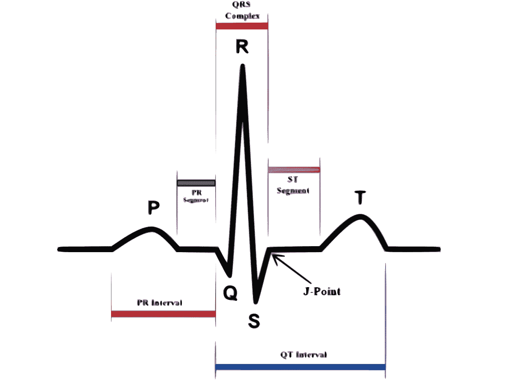

# 将拓扑数据分析应用于深度学习？动手心律失常分类！

> 原文：<https://towardsdatascience.com/applied-topological-data-analysis-to-deep-learning-hands-on-arrhythmia-classification-48993d78f9e6?source=collection_archive---------19----------------------->

## 医疗保健是一个令人兴奋的工作领域。每一次受控的性能增强都多少意味着拯救或改善生命。因此，足够好的概括不是你可以沾沾自喜的。

现在的问题是如何去做。有些人通过扩大数据集的规模来增强他们的推断，有些人提高了质量，有些人使用全新的模型，还有一些人发明了自己的技术。不用引用，深度学习的兴起大概就是最好的例子。今天，我将着眼于最后一个选项:在数据描述方面进行创新。我给你介绍一个:**拓扑数据分析**。也被缩写为 **TDA** ，这是从应用拓扑学和计算几何的各种研究中出现的一个新领域。它的目的是提供良好的数学，统计和算法的方法来利用数据中的拓扑和潜在的几何结构。TDA 通常在三维数据上可视化，在其他情况下也很有用，例如时间序列。感兴趣吗？:D

 [## 从拓扑数据分析到深度学习:不劳无获

### 今天，我将尝试给出一些关于 TDA(用于拓扑数据分析)的见解，这是一个快速发展的数学领域…

towardsdatascience.com](/from-tda-to-dl-d06f234f51d) 

因为我希望这篇文章实用，所以我将向您推荐我以前写的一篇文章，它揭示了一些理论概念。请随意花几分钟时间沉浸在 TDA 为您提供的多个主题中。这篇文章摘自我在东京富士通人工智能实验室与 INRIA(法国研究所)的 Datashape 团队合作时所做的工作。很不幸，当我不能分享整个工作时，泪水顺着我的脸颊流下，但是你应该有你需要的一切，用那个 [Github](https://github.com/Coricos/TdaToolbox) 和那个[论文](https://arxiv.org/abs/1906.05795)。

# **什么是心律失常？**

这并不奇怪，但是你应该知道心脏病和中风是美国五大死亡原因之一。因为它关系到外面的每个人，难怪像苹果这样的公司正在通过开发他们自己的智能显示器来瞄准这个领域。事实证明，你的心脏可能是你全身最牛的肌肉:它 24/24 7/7 不间断地工作，并且以非常有节奏的方式工作。然而，它有时会跟不上节奏，这可能是因为酒精、闪电式恋爱、剧烈运动或恐怖电影。其中一些失败可能会致命。**心律失常**是一种衰竭，是一组描述心律不齐状况的总称，在形状或频率方面。检测这些事件并监测它们的频率可能对监督你的健康有巨大的帮助，并确保你在需要时获得正确的健康干预。然而，这需要智能监控。

# **弄脏你的手！**

M 机器学习！这听起来像是智能监控的方式！但这需要的不仅仅是一个漂亮的模特。这是一件好事，人们一直在努力通过提供一系列开源数据集来促进研究。这些可在 [Physionet 平台](https://physionet.org/data/)上获得，并以它们描述的条件命名:麻省理工学院-BIH 正常窦性心律数据库、麻省理工学院-BIH 心律失常数据库、麻省理工学院-BIH 室上性心律失常数据库、麻省理工学院-BIH 恶性室性心律失常数据库和麻省理工学院-BIH 长期数据库。这些数据库由**单通道心电图**组成，每一个都以 360 Hz 采样。两个或更多的心脏病专家独立地注释每个记录，他们的分歧被解决以获得每个搏动的参考注释。我们可能已经心存感激了！

注释还有一个好处，就是让我们从心跳检测的问题中解脱出来，这并不是一个很大的障碍:**基线漂移**和**小波变换**或 **1D-CNN** 作为一个解决方案，它们都工作得很好。

# 如何描述心跳？

在我们的例子中，CGs 是一维时间序列，如何描述它们的形状和时间关系？这是一个非常普遍的问题，可以转移到许多领域。这就是**拓扑**将会有所帮助的地方！

[Credits](https://www.google.com/url?sa=i&source=images&cd=&cad=rja&uact=8&ved=2ahUKEwjUm5Ga34PmAhVxFjQIHQknA9gQjhx6BAgBEAI&url=https%3A%2F%2Fwww.wikilectures.eu%2Fw%2FElectrocardiogram&psig=AOvVaw0vrNB0Ju3OrHwEqitDSdV0&ust=1574715681907108)

让我们从我们想要从这些心跳中得到的时间信息开始。在单个事件的范围内，检索到的间隔是左侧描述的间隔( **PQRST 事件**)。该信息已经与形状高度关联。在 ECG 本身的范围内，我们还需要检索 **RR 间隔**，这是连续 R 峰之间的延迟，从而量化总体节律(及其异常)。

从那以后，你可能已经在考虑使用上面展示的特性来构建你的模型了(在等式中添加一些 FFT /小波/混沌理论/ …)。从这些特征(结合 SVM、增强树或神经网络)获得的结果是好的，但还不够令人满意。时间信息不是问题所在:问题在于心跳的形状。它们表明心脏本身有一个非常复杂的机制，而**个体差异**从一开始就意味着巨大的可变性。因此，我们需要一个模型，能够捕捉模式，而不会过度拟合由我们拥有的单个个体池产生的平均模式。这无疑是**拓扑数据分析**的魅力达到顶峰的地方，至少在时间序列方面。

在心律失常分类一般化所面临的主要挑战中，我们发现了个体差异，特别是**心动过缓**和**心动过速**。TDA，更准确地说是**持续同源理论**，以简洁的方式有力地描述了 ECG 信号的形状，避免了复杂的几何特征工程。由于持久同源性的基本稳定性，TDA 特征对于 ECG 信号中感兴趣模式的变形，尤其是时间轴方向上的扩展和收缩，显得非常稳健。这使得它们对于克服个体差异和由心动过缓和心动过速引起的潜在问题特别有用。

Process Visualization: From **ECG** to **Barcode Diagram** to **Betti Curve**

**持续同源**理论来了(在这篇[文章](/from-tda-to-dl-d06f234f51d)中提出)。它允许我们用一个**持久性** **条形码**唯一地表示一个过滤的单纯复合(在我们的例子中，ECG 信号被转换成一个图形)的持久性同源性。条形码图用一条水平线表示每个持久性生成器，该水平线从它出现的第一个过滤级别开始，到它消失的过滤级别结束。现在，就过滤而言，我们有两种可能的图表:从上到下或从下到上。上图直观地分解了自上而下的策略，显示了使用 1D ECG 信号构建的条形码。不幸的是，条形码图表不能被机器学习直接利用，因为它们的尺寸不一致。为了使它们成为有用的形式，我们将图表转换成**贝蒂曲线**。

> ***贝蒂曲线*** *:让我们考虑一个* ***持久性条形码*** *，为此我们对半径空间进行矢量化。条形码图的每个组成部分都被称为一个函数，在定义它的半径上取值为 1，在其他任何地方取值为 0。矢量化空间上的这些函数之和定义了贝蒂曲线。*

对于每个心跳，我们现在有两条 Betti 曲线，它们的**大小是一致的，并且是可控的**。我个人倾向于 100 点矢量化，这样我可以将之前训练的模型重新应用到类似的问题中，这些问题将类似的分布曲线作为输入。

# 将深度学习带入等式

现在的问题是如何利用贝蒂曲线。除了作为一种奇特的数据表示，曲线**在一维信号中包含了关于形状**的复杂信息。寻找开发这些资源的最佳模式已经开始！

利用一维信号并不令人头痛。唯一不同的是，在这里，维度不是时间，而是**空间**。在您所拥有的选择中，您可以选择具有欧几里德或动态时间弯曲度量的 kNN，直接使用提升的树或使用 CNN 网络，这可能是在这些情况下最好的网络(可以通过 CNN 可以访问的多个尺度进行解释，这对于空间信息来说可能比时间更方便)。

我当时设计的模型可能更像是我想说的火箭筒，但它明确强调了我构想大多数深度学习问题应该基于的**所需模块化**的方式。你可以选择像斯坦福大学的[论文](https://stanfordmlgroup.github.io/projects/ecg/) (34 层)那样走向堆叠策略，或者走向更水平的多模块方法，混合人类直觉(特征工程)和不可及的统计考虑(深度学习)。这正是下面描述的模型的全部内容:**扩大你处理信息的范围**。

# TDA 对归纳有多大影响？

您现在可能想知道 TDA 是否真的带来了我在本文开始时提到的性能提升。对于这一部分，我们花了大量时间进行实验:)

我们采取的第一步是试图评估 TDA 对我们深度学习架构的**影响。突出了两个问题:**二元分类** (~心律失常检测)，包括从正常心跳中识别心律失常心跳，以及**多类分类**，包括将正确的标签归属于每个异常心跳。我们在交叉验证框架的基础上运行，让患者接受训练，一些进行验证，另一些进行测试。每个 ID 代表一个三重分裂(基于 240 名可用患者，训练 60%，验证 10%，测试 30%)和一个从头开始训练的模型。**

第一个结论很有趣:尽管添加 TDA 确实有助于**泛化**，但最受影响的问题是实际的分类。解释这一结果的一种方式是将 TDA 视为拓扑和形状的高度专业化的度量。第一个问题主要是关于检测异常心跳，这又回到异常检测，而第二个问题更多地依赖于拓扑信息，因为形状是区分异常心跳的巨大组成部分。

当然，撇开这一步不谈，我们实际上陷入了比较。我在下面附上我们的总体架构的结果，但不会在这里讨论所有的细节。[实际上，我不喜欢在论文之间设计评分系统的方式，基于围绕泛化稳健性的度量和考虑的快速发展，将我们的评估限制在这些方面甚至不再有意义。]

# 结论被高估了

我希望这篇应用拓扑数据分析的介绍引发了你对**潜在理论**的兴趣，以及它实际上可以用于的无限问题集。当形状直观地涉及到问题时，使用 TDA 最有意义。会不会通过**持久性图**、**条形码图**、**持久性景观**、**持久性轮廓**或**贝蒂曲线**，TDA 可以被用来作为机器学习管道的一部分。不幸的是，无论你的创新水平如何，最大的限制因素是数据。让我们开始考虑集中的高质量数据源，然后我们肯定会改变赌注！

# 参考

*   [***GitHub 资源库***](https://github.com/Coricos/TdaToolbox)
*   [*Scikit-为 TDA 学*](https://scikit-tda.org/)
*   [*从拓扑数据分析到深度学习:不劳无获*](/from-tda-to-dl-d06f234f51d)
*   [*持续理论:从颤动表象到数据分析*](https://g.co/kgs/vKCHcd) *是*
*   [***孤质项目***](https://project.inria.fr/gudhi/)
*   [*同调与拓扑持续*](http://citeseerx.ist.psu.edu/viewdoc/download?doi=10.1.1.224.2050&rep=rep1&type=pdf)
*   [*几何和拓扑推理*](https://geometrica.saclay.inria.fr/team/Fred.Chazal/papers/CGLcourseNotes/main.pdf)

*有兴趣保持联系？*:D[Twitter](https://twitter.com/DindinMeryll)|[LinkedIn](https://www.linkedin.com/in/dindin-meryll/)|[Github](https://github.com/Coricos)|[Medium](https://medium.com/@merylldin)