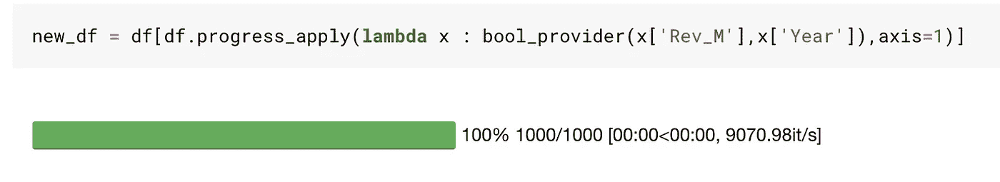

# 熊猫的应用和λ的使用

> 原文：<https://towardsdatascience.com/apply-and-lambda-usage-in-pandas-b13a1ea037f7?source=collection_archive---------0----------------------->


Photo by [chuttersnap](https://unsplash.com/@chuttersnap?utm_source=medium&utm_medium=referral) on [Unsplash](https://unsplash.com?utm_source=medium&utm_medium=referral)

## 学习这些来掌握熊猫

熊猫是你可以随意使用的一个很好的工具。

我已经和熊猫一起工作了很多年，它的新功能、快捷方式和做一件特定事情的多种方式一直让我感到惊讶。

但我意识到，坚持我学到的一些惯例多年来对我很有帮助。

`apply`和`lambda`是我在熊猫身上学到的一些最好的东西。

每当我为一个新的列或过滤器构建复杂的逻辑时遇到困难，我就会使用`apply`和`lambda`。

当企业向您提出定制请求时，这种情况经常发生。

***这个帖子是向你展示*** `***apply***` ***和*** `***lambda***` ***的威力。***

我将使用 IMDB 上过去 10 年中 1000 部流行电影的数据集。你也可以跟随在 [Kaggle 内核](https://www.kaggle.com/mlwhiz/apply-and-lambda-for-pandas)中。

# 创建列


Complex columns

您可以通过多种方式创建新列。

如果你想要一个列是列的和或差，你可以使用简单的基本算法。在这里，我得到了基于 IMDB 和标准化 Metascore 的平均评级。

```
df['AvgRating'] = (df['Rating'] + df['Metascore']/10)/2
```

但是有时我们可能需要围绕新列的创建构建复杂的逻辑。

举一个复杂的例子，假设我们想要基于各种因素构建一个自定义的电影评分。

***比如说，如果电影是惊悚片，我想在 IMDB 评分保持小于等于 10 的条件下，在 IMDB 评分上加 1。如果一部电影是喜剧，我想从评分中减去 1。***

***我们怎么做呢？***

每当我掌握了如此复杂的问题，我就使用`apply/lambda`。让我首先向您展示我将如何做这件事。

```
def custom_rating(genre,rating):
    if 'Thriller' in genre:
        return min(10,rating+1)
    elif 'Comedy' in genre:
        return max(0,rating-1)
    else:
        return rating

df['CustomRating'] = df.apply(lambda x: custom_rating(x['Genre'],x['Rating']),axis=1)
```

一般结构是:

*   您定义了一个函数，该函数将接受您想要处理的列值，以得出您的逻辑。在这里，我们最终使用的两列是流派和评级。
*   沿着 axis=1 的行使用带有 lambda 的应用函数。一般语法是:

```
df.apply(lambda x: func(x['col1'],x['col2']),axis=1)
```

您应该能够使用 apply/lambda 创建几乎任何逻辑，因为您只需担心自定义函数。

# 过滤数据帧


Filtering….

熊猫使过滤和子集化数据框架变得相当容易。您可以使用普通运算符和`&,|,~`运算符对数据帧进行过滤和子集化。

```
# Single condition: dataframe with all movies rated greater than 8df_gt_8 = df[df['Rating']>8]# Multiple conditions: AND - dataframe with all movies rated greater than 8 and having more than 100000 votesAnd_df = df[(df['Rating']>8) & (df['Votes']>100000)]# Multiple conditions: OR - dataframe with all movies rated greater than 8 or having a metascore more than 90Or_df = df[(df['Rating']>8) | (df['Metascore']>80)]# Multiple conditions: NOT - dataframe with all emovies rated greater than 8 or having a metascore more than 90 have to be excludedNot_df = df[~((df['Rating']>8) | (df['Metascore']>80))]
```

很简单的东西。

但有时我们可能需要进行复杂的过滤操作。

有时我们需要做一些操作，而仅仅使用上面的格式是做不到的。

例如:我们假设 ***我们想要过滤电影标题中字数大于或等于 4 的那些行。***

***你会怎么做？***

尝试下面的会给你一个错误。显然，你不能做任何简单的事情，比如用一个系列分割。

```
new_df = df[len(df['Title'].split(" "))>=4]
-------------------------------------------
AttributeError: 'Series' object has no attribute 'split'
```

一种方法是首先使用 apply 创建一个标题中包含字数的列，然后对该列进行过滤。

```
#create a new column
df['num_words_title'] = df.apply(lambda x : len(x['Title'].split(" ")),axis=1)#simple filter on new column
new_df = df[df['num_words_title']>=4]
```

这是一个非常好的方法，只要你不需要创建很多列。但是，我更喜欢这个:

```
new_df = df[df.apply(lambda x : len(x['Title'].split(" "))>=4,axis=1)]
```

我在这里做的是 ***我的 apply 函数返回一个可以用来过滤的布尔值。***

现在，一旦你理解了你只需要创建一个布尔列来过滤，你就可以在你的`apply`语句中使用任何函数/逻辑来得到你想要构建的复杂逻辑。

让我们看另一个例子。我会试着做一些稍微复杂的事情来展示它的结构。

我们想找到收入低于该年平均收入的电影？

```
year_revenue_dict = df.groupby(['Year']).agg({'Rev_M':np.mean}).to_dict()['Rev_M']def bool_provider(revenue, year):
    return revenue<year_revenue_dict[year]

new_df = df[df.apply(lambda x : bool_provider(x['Rev_M'],x['Year']),axis=1)]
```

这里有一个函数，可以用来写任何逻辑。只要我们能够处理简单的变量，这就为高级过滤提供了强大的功能。

# 更改列类型

我甚至使用 apply 来更改列类型，因为我不想记住更改列类型的语法，也因为它让我可以做更复杂的事情。

在 Pandas 中，改变列类型的正常语法是`astype`。因此，如果我的数据中有一个名为 price 的列，格式为`str`。我可以这样做:

```
df['Price'] = newDf['Price'].astype('int')
```

但有时并不会如预期般奏效。

你可能会得到错误:`ValueError: invalid literal for long() with base 10: ‘13,000’.`也就是说你不能把一个带有`“,”`的字符串转换成一个整型。要做到这一点，我们首先要去掉逗号。

在一次又一次地面对这个问题之后，我现在已经完全停止使用`astype`了，只使用 apply 来改变列类型。

```
df['Price'] = df.apply(lambda x: int(x['Price'].replace(',', '')),axis=1)
```

# 最后还有`progress_apply`


`progress_apply`是`tqdm`包附带的单一功能。

这为我节省了很多时间。

有时，当您的数据中有很多行，或者您最终编写了一个非常复杂的 apply 函数时，您会发现 apply 可能需要很长时间。

我见过应用程序在使用 Spacy 时花费数小时。在这种情况下，您可能希望看到带有应用的进度条。

你可以使用`tqdm`来实现。

在笔记本顶部的初始导入之后，只需将`apply`替换为`progress_apply`，一切都保持不变。

```
from tqdm import tqdm, tqdm_notebook
tqdm_notebook().pandas()df.progress_apply(lambda x: custom_rating_function(x['Genre'],x['Rating']),axis=1)
```

你会看到进度条。



# 结论

`apply`和`lambda`功能让你在操作数据的同时处理很多复杂的事情。

我觉得用熊猫不用担心很多事情，因为我可以很好地使用`apply`。

在这篇文章中，我试图解释它是如何工作的。可能还有其他方法来做我上面做的事情。

但是我喜欢用`apply` / `lambda`来代替`map` / `applymap`，因为我觉得它可读性更强，也更适合我的工作流程。

如果你想了解更多关于 [Python](https://amzn.to/2XPSiiG) 3 的知识，我想从密歇根大学调出一门关于学习 [**中级 Python**](https://coursera.pxf.io/RyEZZX) 的优秀课程。一定要去看看。

我以后也会写更多这样的帖子。让我知道你对这个系列的看法。在 [**媒体**](https://medium.com/@rahul_agarwal) 关注我或者订阅我的 [**博客**](https://mlwhiz.ck.page/a9b8bda70c) 了解他们。一如既往，我欢迎反馈和建设性的批评，可以通过 Twitter [@mlwhiz](https://twitter.com/MLWhiz) 联系。