# 将数据科学应用于网络安全网络攻击和事件

> 原文：<https://towardsdatascience.com/applying-data-science-to-cybersecurity-network-attacks-events-219fb6312f54?source=collection_archive---------11----------------------->

网络世界是一个需要理解的巨大概念。当时，我决定在大学期间进入网络安全领域。让我感兴趣的是理解恶意软件、网络安全、渗透测试的概念&在网络安全中真正发挥作用的加密方面。

能够保护基础设施很重要，但也很有趣。当然有编码，但我从来没有真正学会如何将代码应用到网络安全原则中。这是我接下来真正想知道的，可以扩展我在信息技术和计算机科学方面的知识。我学到了更多关于编码的知识，尤其是 Python。我涉猎了一点 Scala &我在大学期间已经有了 Sequel 和 Java 应用程序的良好基础，在新兵训练营期间学习它让我对它感觉更舒服一些。

数据科学沉浸式项目教会我如何通过 Sequel、JSON、HTML 或 web-screwing 应用程序收集数据，我在这些应用程序中清理数据&然后应用 Python 相关代码进行统计分析。然后，我能够对数据进行建模，以发现趋势、做出预测或提供建议/推荐。我想把这一点应用到我在思科 NetaCad、网络安全原则和软件开发的背景中

然后我想把这和我的网络安全背景联系起来。我决定从 Data.org 收集大量关于联邦通信委员会(FCC)的网络攻击的数据。在这篇博文中，我决定写一写我是如何将我的数据科学知识与我在现实行业中的网络安全背景联系起来的。我将提供这个项目的一些背景，一段代码&一些关于 FCC 如何像我一样更好地理解这些数据的见解。这可能对未来的情况或其他政府相关的网络安全项目有用。

据我所知，FCC 使用 CSRIC 最佳实践搜索工具，该工具允许您使用各种标准搜索 CSRIC 的最佳实践，包括网络类型、行业角色、关键字、优先级和 BP 编号。

通信安全、可靠性和互操作性委员会(CSRIC)的任务是向 FCC 提供建议，以确保通信系统的最佳安全性和可靠性，包括电信、媒体和公共安全。

CSRIC 的成员专注于一系列公共安全和国土安全相关的通信事务，包括:(1)通信系统和基础设施的可靠性和安全性，特别是移动系统；(2) 911、增强型 911 (E911)、下一代 911(ng 911)；& (3)紧急警报。

CSRIC 的建议将解决有害网络事件的预防和补救、提高整体通信可靠性的最佳实践的开发、通信服务的可用性和性能以及在自然灾害、恐怖袭击、网络安全攻击或其他导致通信基础设施异常紧张的事件期间的紧急警报、在出现大范围或重大中断时通信服务的快速恢复以及通信提供商可以采取的帮助保护最终用户和服务器的步骤。

对我来说，处理这个项目的第一步是理解我需要完成什么&这个项目让我走什么样的方向。我记得我需要向 FCC 提供建议，以确保电信、媒体和公共安全领域通信系统的最佳安全性和可靠性。

在尝试这个项目时，我考虑了不同的方法。第一步是直接进入，以便更好地理解数据本身，我只关注事件的优先级&对其应用大量的机器学习分类模型。第二种方法是能够将自然语言处理技术应用于事件的描述&看看这与事件的优先级有什么关系。

有了这个，我们就可以做出预测&然后，提出更好地预防、理解或控制事件的建议。我的想法是，如果我们可以通过修复不太复杂的事件来关注更关键的事件，我们就可以节省足够的资产来进一步改善系统，以应对更复杂的事件。

需要什么:

*   Python IDE
*   机器学习和统计软件包
*   精通数据科学概念
*   一些网络安全和网络相关概念的知识

我们开始吧！让我们首先从导入我们打算使用的任何包开始，我通常复制并粘贴对我以前的数据科学项目有帮助的有用模块的列表。

```
import pandas as pd 
import numpy as np  
import scipy as sp  
import seaborn as sns
sns.set_style('darkgrid') 
import pickle       
import regex as re  
import gensimfrom nltk.stem import WordNetLemmatizer
from nltk.tokenize import RegexpTokenizer
from nltk.stem.porter import PorterStemmer
from nltk.stem.snowball import SnowballStemmer
from nltk.corpus import stopwords
from sklearn.feature_extraction import stop_words
from sklearn.feature_extraction.text import CountVectorizer, TfidfVectorizerimport matplotlib.pyplot as plt 
from sklearn.model_selection import train_test_split, GridSearchCV
from sklearn.preprocessing import StandardScaler 
from sklearn.naive_bayes import MultinomialNB  
from sklearn.linear_model import LinearRegression,LogisticRegression
from sklearn import metrics
from sklearn.ensemble import RandomForestClassifier, BaggingClassifier, AdaBoostClassifier, GradientBoostingClassifier
from sklearn.neighbors import KNeighborsClassifier
from sklearn.tree import DecisionTreeClassifier
from sklearn.pipeline import Pipeline
from keras import regularizers
from keras.models import Sequential
from keras.layers import Dense, Dropoutimport warnings
warnings.filterwarnings('ignore')%matplotlib inline
```

然后，我们需要加载数据，并通过以下方式查看数据:

```
# Loads in the data into a Pandas data frame
fcc_csv = pd.read_csv('./data/CSRIC_Best_Practices.csv')
fcc_csv.head()
```

现在我们有了数据，我们可以探索、清理和理解这些数据。下面，我提供了一个基础数据探索性分析的功能。我们希望这样做是为了充分理解我们正在处理的数据&需要达到什么样的总体目标。

以下函数将允许我们查看任何空值、用下划线替换任何空格、重新格式化数据框索引、查看每列的数据类型、显示任何重复的数据、描述数据的统计分析并检查形状。

```
# Here is a function for basic exploratory data analysis:def eda(dataframe):
    # Replace any blank spaces w/ a underscore.
    dataframe.columns = dataframe.columns.str.replace(" ", "_")
    # Checks for the null values.
    print("missing values{}".format(dataframe.isnull().sum().sum()))
    # Checks the data frame range size.
    print("dataframe index: {}".format(dataframe.index))
    # Checks for data types of the columns within the data frame.
    print("dataframe types: {}".format(dataframe.dtypes))
    # Checks the shape of the data frame.
    print("dataframe shape: {}".format(dataframe.shape))
    # Gives us any statistical information of the data frame.
    print("dataframe describe: {}".format(dataframe.describe()))
    # Gives us the duplicated data of the data frame. print("duplicates{}".format(dataframe[dataframe.duplicated()].sum()))
    # A for loop that does this for every single column & their 
    # values within our data frame giving us all unique values.
    for item in dataframe:
        print(item)
        print(dataframe[item].nunique())# Let's apply this function to our entire data frame.
eda(fcc_csv)
```

根据这些数据，我们认为这是一个不平衡的分类问题！我们接下来需要做的是消除任何“NaN”或空值&在某种程度上平衡我们的类。根据我们的探索性数据分析，我们可以看到大多数数据在对象类型列中都有“NaN”值。我们可以用下面的函数来解决这个问题！

```
# Here's a function to convert NaN's in the data set to 'None' for 
# string objects.
# Just pass in the entire data frame.
def convert_str_nan(data):
    return data.astype(object).replace(np.nan, 'None', inplace = True)convert_str_nan(fcc_csv)
```

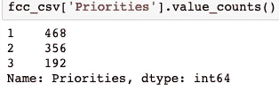

Checking the amount of values in the Priorities column

查看优先级列，我们有一个与对象相关的列，它将事件的严重性分为重要、非常重要和关键。对应于该优先级列的另一列将它们排序为 1-3，1 表示重要，2 表示非常重要，3 表示关键。根据优先级的不同，我们看到数据是不平衡的。我们通过重命名我们的专栏来解决这个问题，以便更好地理解，然后在我们关注高度重要和关键事件的地方进行平衡。

```
# Let's rename the 'Priority_(1,2,3)' column so we can utilize it.
fcc_csv.rename(columns = {
    'Priority_(1,2,3)': 'Priorities'
},
inplace = True)# Let's view the values & how the correspond to the 'Priority' 
# column.
fcc_csv['Priorities'].value_counts()# We notice that we have an unbalanced classification problem.
# Let's group the "Highly Important" (2) & "Critical" (3) aspects 
# because that's where we can make recommendations.
# Let's double check that it worked.
fcc_csv['Priorities'] = [0 if i == 1 else 1 for i in fcc_csv['Priorities']]
fcc_csv['Priorities'].value_counts()
```

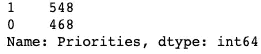

Result of the above code after we’ve balanced the class

## **第一种方法(理解数据)**

在下一节中，我将讨论我理解优先级列的最初方法。我很快了解到，这种方法并不是最好的，但在提出建议时，当我查看攻击的优先级时，这种方法非常有用。

我的下一步是了解哪些列与我的优先级列最符合模式和趋势。似乎所有运行良好的列都是二进制的！描述列是文本相关的&机器不喜欢处理文本对象。使用下面的代码，我们可以看到哪些列与我们的预测列最正相关&最负相关。

```
# Let's view the largest negative correlated columns to our 
# "Priorities" column.
largest_neg_corr_list = fcc_csv.corr()[['Priorities']].sort_values('Priorities').head(5).T.columns
largest_neg_corr_list# Let's view the largest positive correlated columns to our 
# "Priorities" column.
largest_pos_corr_list = fcc_csv.corr()[['Priorities']].sort_values('Priorities').tail(5).T.columns.drop('Priorities')
largest_pos_corr_list
```

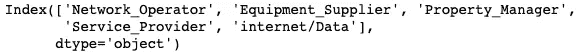

Most Negatively Correlated

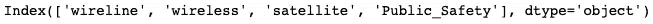

Most Positively Correlated

现在，我们可以开始制作我们的模型，看看我们所做的会给我们准确的预测或足够的建议信息。让我们首先从训练测试分割开始，这些相关的列作为我们的特征&我们的优先级列作为我们的预测变量。

```
# Let's pass in every column that is categorical into our X.
# These are the strongest & weakest correlated columns to our 
# "Priorities" variable. 
X = fcc_csv[['Network_Operator', 'Equipment_Supplier', 'Property_Manager', 'Service_Provider', 'wireline', 'wireless', 'satellite', 'Public_Safety']]
y = fcc_csv['Priorities'] # Our y is what we want to predict.# We have to train/test split the data so we can model the data on 
# our training set & test it.
X_train, X_test, y_train, y_test = train_test_split(X, y, test_size = 0.3, random_state = 42)# We need to transpose the trains so they contain the same amount of # rows.
X = X.transpose()
```

既然我们已经训练测试分割了我们的特征，让我们应用网格搜索在**朴素贝叶斯分类器、随机森林分类器、Adaboost/梯度增强分类器** & a **Keras 神经网络**上找到完全准确的最佳参数或特征！但是这些分类器模型到底意味着什么呢？

简单来说，**朴素贝叶斯**分类器假设一个类中特定特征的存在与任何其他特征的存在无关。让我们看看我们的数据吧！

```
# Instantiates the Naive Bayes classifier.
mnb = MultinomialNB()
params = {'min_samples_split':[12, 25, 40]}# Grid searches our Naive Bayes.
mnb_grid = {}
gs_mnb = GridSearchCV(mnb, param_grid = mnb_grid, cv = 3)
gs_mnb.fit(X_train, y_train)
gs_mnb.score(X_train, y_train)# Scores the Naive Bayes.
gs_mnb.score(X_test, y_test)
```

**随机森林分类器**从随机选择的训练集子集创建一组决策树，然后汇总来自不同决策树的投票，以决定测试对象的最终类别。随机森林中的每棵树都给出一个类别预测，拥有最多票数的类别成为我们模型的预测。我们来建模吧！

```
# Instantiates the random forest classifier.
rf = RandomForestClassifier(n_estimators = 10)# Grid searches our random forest classifier.
gs_rf = GridSearchCV(rf, param_grid = params, return_train_score = True, cv = 5)
gs_rf.fit(X_train, y_train)
gs_rf.score(X_train, y_train)# Our random forest test score.
gs_rf.score(X_test, y_test)
```

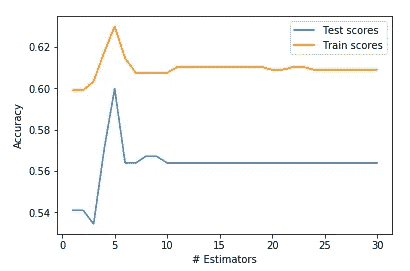

Graph of our Adaboost Model, it’s overfit!

**AdaBoost** 是自适应增强的简称。它基本上是一种用作分类器的机器学习算法。每当你有大量的数据，你想把它分成不同的类别，我们需要一个好的分类算法来做到这一点。因此有了“boosting”这个词，因为它可以提升其他算法！

```
scores_test = []
scores_train = []
n_estimators = []for n_est in range(30):
    ada = AdaBoostClassifier(n_estimators = n_est + 1, random_state = 42)
    ada.fit(X_train, y_train)
    n_estimators.append(n_est + 1)
    scores_test.append(ada.score(X_test, y_test))
    scores_train.append(ada.score(X_train, y_train))# Our Ada Boost score on our train set.
ada.score(X_train, y_train)# Our Ada Boost score on our test set.
ada.score(X_test, y_test)
```

**神经网络**是一组算法，大致模仿人脑，设计用于识别模式。他们通过一种机器感知、标记或聚类原始输入来解释感官数据。我们甚至可以应用正则化来解决**过度拟合**的问题！

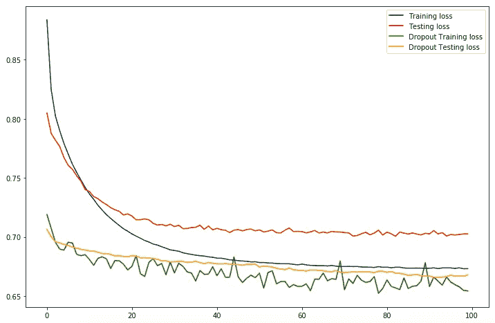

Our regularized Neural Network, it’s overfit!

```
model_dropout = Sequential()n_input = X_train.shape[1]
n_hidden = n_inputmodel_dropout.add(Dense(n_hidden, input_dim = n_input, activation = 'relu'))
model_dropout.add(Dropout(0.5)) # refers to nodes in the first hidden layer
model_dropout.add(Dense(1, activation = 'sigmoid'))model_dropout.compile(loss = 'binary_crossentropy', optimizer = 'adam', metrics = ['acc'])history_dropout = model_dropout.fit(X_train, y_train, validation_data = (X_test, y_test), epochs = 100, batch_size = None)
```

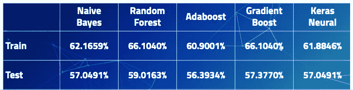

The Accuracy of Our Models

这告诉我们什么？！根据训练分数和测试分数，我们可以看到我们的模型**过度拟合** &不擅长预测或分析趋势。我们的模型**过适合**是什么意思？我们有**高方差** & **低偏差**！**高方差**会导致算法对训练数据中的随机噪声建模，而不是对预期输出建模。我们仍然不能对此提出建议，因为它并没有给我们提供太多的信息！

## 第二种方法(自然语言处理)—最佳途径

我的第二个方法是关注描述栏。在我第一次尝试后，我想看看攻击的优先级与描述中给出的内容是如何关联的。描述栏给了我们一个简短的解释，说明发生了什么&一个建议的 FCC 兼容的解决方案，他们可以做些什么来阻止类似的事件。

为了更好地理解描述栏，我需要应用自然语言处理(NLP ),因为计算机和统计模型不喜欢处理文本和单词。但是我们可以解决这个问题！在清理数据和平衡优先级列时，我的方法是类似的，但是我应用了一些 NLP 概念来更好地理解描述、分析它、提出建议&甚至根据特定于事件的单词的出现来预测下一个事件是什么。

一些概念包括:

*   **预处理**是将原始数据转换成干净数据集的技术。
*   **Regex，**正则表达式是一个文本字符串，允许您创建模式来帮助匹配、定位&管理文本。另一种清理文本的方法。
*   T21 是将一个单词的词形变化组合在一起的过程，这样它们就可以作为一个术语来分析。
*   **词干化**是将屈折词缩减为词干、词根或词根形式的过程。
*   **计数矢量化**统计词频。
*   **TFIDFVectorizer** 是一个词的值随着计数成比例增加，但被该词在语料库中的出现频率所抵消。

让我们从将正则表达式概念应用到已经清理过的数据开始。我们还想剥离或清除有用但在每一个描述中零星出现的常用词。

```
# Let's clean the data using Regex.
# Let's use regex to remove the words: service providers, equipment # suppliers, network operators, property managers, public safety
# Let's also remove any mention of any URLs.fcc_csv['Description'] = fcc_csv.Description.map(lambda x: re.sub('\s[\/]?r\/[^s]+', ' ', x))
fcc_csv['Description'] = fcc_csv.Description.map(lambda x: re.sub('http[s]?:\/\/[^\s]*', ' ', x))
fcc_csv['Description'] = fcc_csv.Description.map(lambda x: re.sub('(service providers|equipment suppliers|network operators|property managers|public safety)[s]?', ' ', x,  flags = re.I))
```

现在我们已经清理了我们的数据，我们应该应用一些预处理技术来更好地理解在事件的每个描述中使用的单词。

```
# This is a text preprocessing function that gets our data ready for # modeling & creates new columns for the 
# description text in their tokenized, lemmatized & stemmed forms. 
# This allows for easy selection of 
# different forms of the text for use in vectorization & modeling.def preprocessed_columns(dataframe = fcc_csv, 
                        column = 'Description', 
                        new_lemma_column = 'lemmatized', 
                        new_stem_column = 'stemmed',
                        new_token_column = 'tokenized',
                        regular_expression = r'\w+'): 

    tokenizer = RegexpTokenizer(regular_expression)     
    lemmatizer = WordNetLemmatizer()                     
    stemmer = PorterStemmer()                            

    lemmatized = []                                      
    stemmed = []                                         
    tokenized = []

    for i in dataframe[column]:                        
        tokens = tokenizer.tokenize(i.lower())           
        tokenized.append(tokens) lemma = [lemmatizer.lemmatize(token) for token in tokens]     
        lemmatized.append(lemma)        stems = [stemmer.stem(token) for token in tokens]            
        stemmed.append(stems)                                         

    dataframe[new_token_column] = [' '.join(i) for i in tokenized]    
    dataframe[new_lemma_column] = [' '.join(i) for i in lemmatized]   
    dataframe[new_stem_column] = [' '.join(i) for i in stemmed]   

    return dataframe
```

然后，我们希望对词干化、词汇化和标记化的描述词应用 countvectorize，以便控制英语中常见的停用词，我们可以使用下面的代码来实现这一点。然后我们可以看到整个数据集中最常见的单词是什么。

```
# Instantiate a CountVectorizer removing english stopwords, ngram 
# range of unigrams & bigrams.cv = CountVectorizer(stop_words = 'english', ngram_range = (1,2), min_df = 25, max_df = .95)# Create a dataframe of our CV transformed tokenized words
cv_df_token = pd.SparseDataFrame(cv.fit_transform(processed['tokenized']), columns = cv.get_feature_names())
cv_df_token.fillna(0, inplace = True)cv_df_token.head()
```

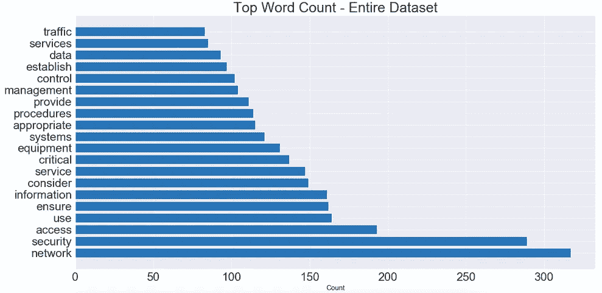

Top Word Count in the Entire Data Set

我们可以看到，弹出来的词大部分都是网络或安全相关的。我们可以利用这些信息更好地了解这些事件的范围！是网络攻击吗？它们与网络仓库有关吗？等等。

但是如果我们想要更多的信息呢？我们可以根据事件重要性的紧急程度或严重性对描述进行分组。也许这没什么严重的，所以它被列为 0(不重要)或非常糟糕被列为 1(非常重要)。我们可以使用下面基于预处理列的代码来实现这一点。然后我们可以想象最常见的真正重要的单词是什么。

```
# Split our data frame into really "important" & "not important" 
# columns.
# We will use the "really_important" descriptions to determine 
# severity & to give recommendations/analysis.
fcc_really_important = processed[processed['Priorities'] == 1]
fcc_not_important = processed[processed['Priorities'] == 0]print(fcc_really_important.shape)
print(fcc_not_important.shape)
```

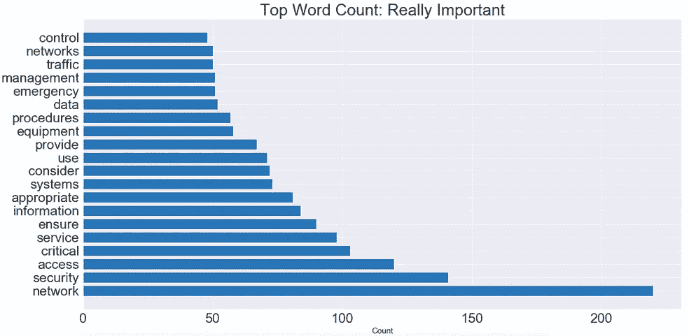

Top Word Count of the Really IMPORTANT words

最后，我们可以开始对标记化的数据建模回归和分类度量。让我们从通过管道应用逻辑回归模型开始，在管道中可以应用网格搜索工具来调整我们的最佳特性或最佳参数。让我们建立我们的 X 变量，我们的特征！我们将在上面创建的经过处理的数据框的标记化列中使用单词或要素。经过处理的数据帧是一个全新的数据帧，它包含了我们的标记化、词干化和词汇化的列。

在这里，我决定将重点放在标记化的列上，因为这个特定的列在参数调优和准确性方面表现最好。为了缩短这篇博文的时间长度，我决定把重点放在符号化上，也就是效果最好的地方！让我们也对它进行测试分割。

```
X_1 = processed['tokenized']# We're train test splitting 3 different columns.
# These columns are the tokenized, lemmatized & stemmed from the 
# processed dataframe.
X_1_train, X_1_test, y_train, y_test = train_test_split(X_1, y, test_size = 0.3, stratify = y, random_state = 42)
```

现在让我们创建我们的**管道**,它使用网格搜索概念来寻找最佳超参数。一旦网格搜索适合(这可能需要一段时间！)我们可以从网格搜索对象中拉出各种信息和有用的对象。通常，我们会希望将几个转换器应用于一个数据集&，然后最终构建一个模型。如果您独立地完成所有这些步骤，那么在预测测试数据时，您的代码可能会很混乱。它也容易出错。幸运的是，我们将有**管道**！

在这里，我们将应用一个逻辑模型，该模型可以考虑拉索和山脊惩罚。

**你应该:**

1.  拟合并验证数据的默认逻辑回归的准确性。
2.  对不同的正则化强度、套索和山脊惩罚进行网格研究。
3.  将优化的逻辑回归测试集的准确性与基线准确性&默认模型进行比较。
4.  看看找到的最佳参数。选了什么？关于我们的数据，这说明了什么？
5.  查看优化模型的(非零，如果 Lasso 被选为最佳)系数和相关预测值。最重要的预测因素是什么？

```
pipe_cv = Pipeline([
    ('cv', CountVectorizer()),
    ('lr', LogisticRegression())
])params = {
    'lr__C':[0.6, 1, 1.2],
    'lr__penalty':["l1", "l2"],
    'cv__max_features':[None, 750, 1000, 1250],
    'cv__stop_words':['english', None],
    'cv__ngram_range':[(1,1), (1,4)]
}
```

现在，我们可以在网格搜索对象中的逻辑回归模型上应用管道。请注意正在实例化的 countvectorize 模型。我们这样做是因为我们想看看这是如何影响我们的准确性和我们与网络攻击相关的词的重要性的因素。

```
# Our Logistic Regression Model.
gs_lr_tokenized_cv = GridSearchCV(pipe_cv, param_grid = params, cv = 5)
gs_lr_tokenized_cv.fit(X_1_train, y_train)
gs_lr_tokenized_cv.score(X_1_train, y_train)gs_lr_tokenized_cv.score(X_1_test, y_test)
```

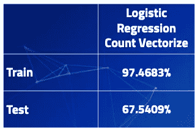

Our Improved Accuracy of our Logistic Model

那么由此可以推断出什么呢？看起来我们已经看到训练数据的模型精度大幅提高，测试数据的精度也提高了 10%。但是，车型还是**过合身**！但仍然做得很好！我们的最佳参数是什么？如果我们想调整未来的物流模型，我们可以使用这些信息！下面的代码将告诉我们这一点！

```
gs_lr_tokenized_cv.best_params_
```

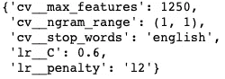

Our BEST Hyper Parameters from our Logistic Gridsearch within the Pipeline

使用 **L1** 正则化技术的**回归**模型称为 Lasso **回归**，使用 **L2** 的模型称为 Ridge **回归**。从我们的最佳超参数，我们的模型有利于岭回归技术。现在我们想根据我们的逻辑回归做出预测&能够提出建议。我们如何继续做那件事？让我们看看与我们的特征相关联的系数，这些系数将预测最佳 y 变量的结果。

```
coefs = gs_lr_tokenized_cv.best_estimator_.steps[1][1].coef_
words = pd.DataFrame(zip(cv.get_feature_names(), np.exp(coefs[0])))
words = words.sort_values(1)
```

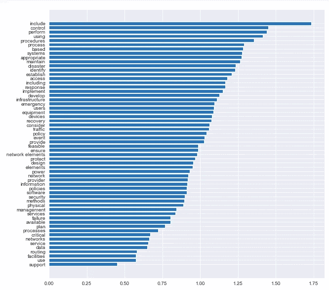

Predictions for Suggestions Based off Occurrence & Importance of Words

## 建议和结论

既然我已经完成了数据建模和分析，我现在可以向 FCC 以及任何其他计划进行类似项目的数据科学家或数据分析师提出建议。

未来的数据科学家做一个类似的项目。获取更多数据，更好的数据样本，增加/降低模型的复杂性& **正则化**。这有助于解决我在这个项目中经历过的**过度拟合**你的数据的问题。了解不平衡分类问题。这样可以引出你解决问题的主要方向。

对于 FCC 的 CSRIC 的最佳实践，我的最佳建议是先解决简单的问题，这样它们就不会经常发生&耗尽您的资源。这可以让他们专注于更重要和复杂的事件或攻击。基于我的预测和对给定数据的分析。

简单的问题:

*   不同的电缆
*   彩色编码电缆
*   仓库通风更好
*   增加功率容量
*   更好的硬件
*   天线间距

中度问题:

*   利用网络监控
*   在可行的情况下提供安全的电气软件
*   寻找新硬件和软件的门槛
*   病毒防护

复杂:

*   最大限度减少单点故障和软件故障
*   设备管理架构
*   安全网络/加密系统