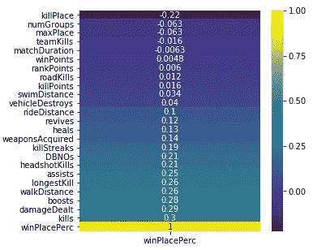
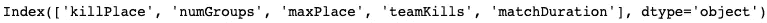
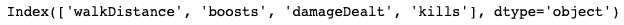
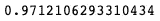
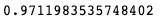
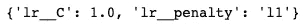

# 将人工智能应用于电子竞技(PUBG)

> 原文：<https://towardsdatascience.com/applying-data-science-to-esports-pubg-b7950330423a?source=collection_archive---------21----------------------->

我们都是玩电子游戏长大的，对吗？那么，我们如何将数据科学和数据分析应用于视频游戏呢？PlayerUnknown's Battleground 也被称为 PUBG，可以说已经彻底改变了皇室战争电子游戏领域！关于 PUBG 如何开启《皇室战争》竞技游戏模式有一个争论，其他视频游戏设计者、创造者&制造商，如*&*【Apex 传奇】*，仅举几个例子，都复制了重新设计的&，使自己更加独特！我决定从 Kaggle 举办比赛的网站上获取数据，看看我们能否根据单个玩家的特征统计数据，找出一个人在比赛中的排名。*

*在 PUBG 游戏中，每场比赛最多有 100 名玩家开始(matchId)。玩家可以加入在游戏结束时(winPlacePerc)排名的队伍(groupId ),排名是基于当他们被淘汰时有多少其他队伍还活着。在游戏中，玩家可以捡起不同的弹药，救活倒下但没有被击倒的队友，驾驶车辆，游泳，跑步，射击&体验所有的后果——例如摔得太远或撞倒自己&消灭自己。*

*我们得到了大量匿名的 PUBG 游戏统计数据，格式化后每行包含一个玩家的赛后统计数据。数据来自各种类型的比赛:单人赛、双人赛、团队赛和定制赛；不能保证每场比赛有 100 名球员，也不能保证每组最多有 4 名球员。我们必须创建一个模型，根据球员的最终统计数据预测他们的最终排名，范围从 1(第一名)到 0(最后一名)。我创建了一个数据字典来获取更多关于数据的信息&让我们的生活更简单。*

*在整篇文章中，我打算提供允许我创建这样一个模型的代码——其他模型可能对其他人来说表现得更好。我的下一个目标是创造视觉效果&提供任何进一步的见解！这个项目和文章类似于我的关于爱荷华州房价的项目和文章！感兴趣的话，点击[这里](https://medium.com/datadriveninvestor/regression-modeling-with-python-66780f118097)！*

*理解这篇文章需要什么:*

*   *丰富的 Python 经验和知识*
*   *Python 统计数据包的中级知识*
*   *IDE*
*   *熟悉数据科学、分析和统计*

*让我们从进口开始吧！*

```
*import pandas as pd 
import numpy as np  
import seaborn as sns 
import matplotlib.pyplot as plt 
from sklearn.model_selection import train_test_split, GridSearchCV 
from sklearn.preprocessing import PolynomialFeatures, StandardScaler, LabelEncoderfrom sklearn.pipeline import Pipeline
from sklearn.linear_model import LinearRegression, LogisticRegression, LassoCV, RidgeCVfrom sklearn.ensemble import RandomForestClassifier, BaggingClassifier, AdaBoostClassifier, GradientBoostingClassifier%matplotlib inline*
```

*接下来，我们需要导入我们的文件。在这个项目中，我们使用了两个文件。一组训练数据和一组测试数据。训练集和测试集非常相似，除了我们在训练集中缺少了一列，球员的最后落点！请记住，无论我们对训练数据集做什么，我们都必须对测试数据做什么，以保持我们的数据无偏、精确和相似。*

```
*# Imports the csv files from Kaggle
# Files are stored locally
pubg_train = pd.read_csv('./data/pubg_train.csv')
pubg_train.head()pubg_test = pd.read_csv('./data/pubg_test.csv')
pubg_test.head()*
```

*接下来，我们希望对数据显示的任何内容应用一些数据清理、探索性数据分析和常识。下面我写了一个简单的数据清理和探索性数据分析的函数，我将它应用于两个 csv 文件。*

```
*# Here is a function for basic exploratory data analysis:
def eda(dataframe):
    # Replace any blank spaces w/ a underscore.
    dataframe.columns = dataframe.columns.str.replace(" ", "_")
    # Checks for the null values.
    print("missing values: {}".format(dataframe.isnull().sum().sum()))
    # Checks the data frame range size.
    print("dataframe index: {}".format(dataframe.index))
    # Checks for data types of the columns within the data frame.
    print("dataframe types: {}".format(dataframe.dtypes))
    # Checks the shape of the data frame.
    print("dataframe shape: {}".format(dataframe.shape))
    # Gives us any statistical information of the data frame.
    print("dataframe describe: {}".format(dataframe.describe()))
    # Gives us the duplicated data of the data frame. 
    print("dataframe duplicates: {}".format(dataframe[dataframe.duplicated()].sum()))

    # A for loop that does this for every single column & their values within our data frame giving us all 
        # unique values.
    for item in dataframe:
        print(item)
        print(dataframe[item].nunique())# Let's apply this function to our entire data frame.
eda(pubg_train)
eda(pubg_test)*
```

*经过一些探索性分析，我们意识到我们有一些“NaN”或空值，由于不准确的数据、创建者的错误输入或不适用于训练数据集中的某个球员而留空。记住，我们必须对训练集和测试集做同样的事情。我们的数据非常“脏”*

*下面，我创建了一个函数来解决这个问题。我们可以通过删除行来删除这些值，看看这些值是否扭曲了数据，这些值是否是某种异常值，或者我们可以手动编辑和替换它们。我决定将“NaN”值转换为 0.0 浮点类型。*

```
*# Here's a function to convert NaN's in a specific column in the data # set to 0.0 for floats.
# Just pass in the entire data frame & specify a specific column w/ a # float NaN.
def convert_float_nan(data):
    return data.replace(np.nan, 0.0, inplace = True)
convert_float_nan(pubg_train["winPlacePerc"])*
```

*清理完数据后，我们已经清除了训练集的所有空值数据，因此它将与测试数据集相似！两者都没有空值&都有八行，但是记住训练数据集有 24 列，而测试数据集有 25 列。但是，我们还没有定下来！让我们改变位于两个数据集中的列的类型！转换类型使分析更容易，有效和正确！*

```
*pubg_train['damageDealt'] = pubg_train['damageDealt'].astype(int)
pubg_train['longestKill'] = pubg_train['longestKill'].astype(int)
pubg_train['rideDistance'] = pubg_train['rideDistance'].astype(int)
pubg_train['swimDistance'] = pubg_train['swimDistance'].astype(int)
pubg_train['walkDistance'] = pubg_train['walkDistance'].astype(int)
pubg_train['winPlacePerc'] = pubg_train['winPlacePerc'].astype(int)pubg_test['damageDealt'] = pubg_test['damageDealt'].astype(int)
pubg_test['longestKill'] = pubg_test['longestKill'].astype(int)
pubg_test['rideDistance'] = pubg_test['rideDistance'].astype(int)
pubg_test['swimDistance'] = pubg_test['swimDistance'].astype(int)
pubg_test['walkDistance'] = pubg_test['walkDistance'].astype(int)*
```

**

*既然两个集合的数据都是干净的& set，我们是否可以可视化所有列与“winPlacePerc”列的关系？这是我们希望预测的仅位于定型数据集中而不在测试数据集中的列。以下代码将完成这项工作:*

```
*# Let's make a simple heat map on what column we're trying to 
# predict to see correlations.
plt.figure(figsize = (5,5))
sns.heatmap(np.round(pubg_train.corr()[['winPlacePerc']].sort_values('winPlacePerc'), 30), annot = True, cmap = 'viridis')*
```

*上图显示了我们想要预测的内容&每列如何与该列正相关和负相关。某一列的接近程度&该列中的数据量如何准确地与排名第一或最后相关？这是我们的目标！让我们看看哪些列为我们提供了最强的相关性:*

```
*# Let's view the largest negative correlated columns to our 
# "winPlacePerc" column.
largest_neg_corr_list = pubg_train.corr()[['winPlacePerc']].sort_values('winPlacePerc').head(5).T.columns
largest_neg_corr_list*
```

**

*Largest Negatively Correlated Columns*

```
*# Let's view the largest positive correlated columns to our 
# "winPlacePerc" column.
largest_pos_corr_list = pubg_train.corr()[['winPlacePerc']].sort_values('winPlacePerc').tail(5).T.columns.drop('winPlacePerc')
largest_pos_corr_list*
```

**

*Largest Positively Correlated Columns*

*出于特征工程的目的，我们需要这样做！特征工程是机器学习算法中使用的特征(变量)的创建和操作。(集思广益或测试特征，决定要创建的特征，检查特征如何与模型配合工作，改进特征(如果需要)。我们的特征，我们指定的相关列&它们的数据有助于预测和显示关系，在这种情况下是我们试图预测的关系！*

*现在我们已经得到了我们的特性，让我们从训练/测试分割数据开始&然后扩展它。我们可以通过将样本数据分割成子集来执行模型验证，这也称为训练/测试分割。这是我们可以用来训练模型和测试模型的代表性数据。这可以帮助表示未来的数据，避免某些调整的过度拟合，并提高我们预测的质量。*

*当我们缩放数据时，我们实质上是将我们的列转换成 Z 分数。这意味着您正在转换我们的数据，使其符合特定的范围，如 0-100 或 0-1。当您使用基于测量数据点之间距离的方法时，您希望缩放数据。*

```
*# Here we can feature load our best correlated variables.
# Our y-variable is what we want to predict.
X = pubg_train[['killPlace', 'matchDuration', 'winPoints', 'killPoints', 'rankPoints', 'damageDealt', 'weaponsAcquired', 'boosts', 'walkDistance']]
y = pubg_train['winPlacePerc'] # What's being predicted# Let's train test split our data.
X_train, X_test, y_train, y_test = train_test_split(X, y, random_state = 42)# Scales our data.
# Feature scaling is a method used to normalize the range of 
# independent variables or features of data. 
# In data processing, it is also known as data normalization.
ss = StandardScaler()
ss.fit(X_train)
X_train = ss.transform(X_train)
X_test = ss.transform(X_test)*
```

*现在，我们已经完成了所有的预处理步骤，让我们开始创建我们的模型，该模型将帮助我们根据我们已经训练/测试的特性来预测胜率。对于这个项目，我决定使用逻辑回归函数，也称为 Logit 函数，因为我们能够处理带有分类标签数据的数字数据。分类标签数据是我选择的特征！*

*为什么是 Logit 模型？除了简单的线性回归，逻辑回归是一种替代方法。逻辑回归使用比值比的概念来计算概率。这被定义为一个事件发生的几率与它不发生的几率之比。我决定通过网格搜索来运行我的 Logit 模型，以找到最佳参数&在这个范围内，有一条优化的管道！*

```
*# A pipeline that instantiates a tuned Logistic Regression model.
pipe_cv = Pipeline([
    ('lr', LogisticRegression())
])
# Here are our parameters we've tuned.
params = {
    'lr__C':[1.0],
    'lr__penalty':["l1"]
}# Our Logistic Regression Model ran through a Grid Search Object.
gs_lr = GridSearchCV(pipe_cv, param_grid = params, cv = 3)
gs_lr.fit(X_train, y_train)
gs_lr.score(X_train, y_train)*
```

*这是我们基于跑步或 Logit 模型对训练/测试分割功能中的训练数据得出的分数。请记住，分割允许我们使用部分训练数据集作为测试数据集，因为整个训练数据集代表整个测试数据集！*

**

*Pipeline Gridsearch Training Score*

*注意我们的训练分数有多高！那太好了，如果我们的测试分数相似，那么我们就不是过度健康或不健康！更多了解过度拟合和欠拟合模型，查看我的数据科学家指南[这里](/a-guide-for-data-scientists-concepts-statistics-prep-more-911298d8ee70)！这将展示如何避免过度装配&装配不足。*

*现在让我们给测试数据打分吧！*

```
*# Let's run our model on the test data.
gs_lr.score(X_test, y_test)*
```

**

*Pipeline Gridsearch Testing Score*

*我们的模型既不是过合身也不是欠合身！干得好！现在，我们对管道的最佳调整参数是什么？*

```
*# Give's us our best parameters.
gs_lr.best_params_*
```

**

*Best Parameters Based off of a Logit Model Pipeline*

*我们的 Logit 模型像一个套索逻辑回归特征，在调整参数中用“l1”表示！现在我们已经有了模型集，清理了数据，并发现基于这些特征预测成功率的可能性很大，我们的下一步是将它们可视化！这将在本文后面出现，所以请继续关注！*