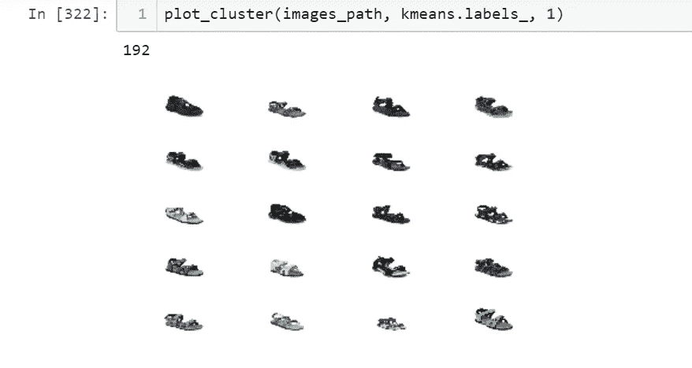

# 应用深度学习优化服装电子商务流程

> 原文：<https://towardsdatascience.com/applying-deep-learning-for-fashion-e-commerce-7e9e28692172?source=collection_archive---------24----------------------->

## 自动选择鞋类的缩略图。


Image courtesy : [https://www.myntra.com/](https://www.myntra.com/zipper-shoes)

当我学习无监督学习方法时，我遇到了不同的聚类方法，如 KMeans，层次聚类。在学习阶段，我想在现实世界的问题上实现这种方法。此外，电子商务系统已经占据了我的心灵一段时间，了解这个系统是如何工作的非常有吸引力。所以我决定解决一个我将在本文中描述的问题。

在这篇博客中，我将分享我在为时尚电子商务(鞋类)选择缩略图的自动化过程中的经验和收获。它将涵盖以下内容:

*   如何使用用于聚类过程的深度学习从图像生成特征
*   如何找到 KMeans 的最佳聚类数(肘方法)
*   选择哪种架构进行特征提取

# 问题陈述:

想象一下，为一家时尚电子商务公司工作，每天都能从供应商那里获得成千上万张鞋类图片。为缩略图选择正确的图像很重要，这样才能吸引用户进一步查看或购买产品。


Lace-Up shoes .

任务是从一堆鞋的图像中识别将被用作缩略图的最佳视图图像，并且还对鞋的类型进行分类。在上面的图像中，右侧图像是最好的图像，它将被用作缩略图。

## W 为什么这是必要的？

*   每个产品都有多个视图(前视图、后视图、左视图、右视图)，只有少数视图有产品的信息，因此选择产品的最佳视图将是缩略图。它将自动完成某些手动完成的过程。
*   当训练分类器来识别鞋的类型时，选择最佳视图也是有益的。通过这样做，分类器将仅从具有最多信息的视图(如前视图或侧视图)中学习特征。如果你给分类器提供描述鞋的鞋底的视图，那么它将不会学习对分类鞋的类型更重要的特征。像系带鞋一样，具有系带信息的视图将是对分类器最有用的特征，而不是鞋底信息。

## 数据

数据由[Fynd](https://blog.gofynd.com/machine-learning-internship-challenge-2019-6b4e9dddb637)-时尚电子商务公司提供。 [CSV](https://drive.google.com/file/d/1fIvFZigDx18sRg70TpCooPJ6omOblQL0/view?usp=sharing) 文件，列名为“类”，图像 URL 指向不同的视图(5 个不同的视图)。从网址下载图片，并保存为以下格式: **footweartype_id_viewid.jpg。**此外，通过查看图像，view_1 将始终是鞋类的前视图也是不必要的。


数据集中总共有 6 类鞋。


Image Courtesy : Fynd . Types of Footwear

## 方法

在数据中，我们**没有**给出任何关于缩略图选择哪个视图的信息。我们只能从不同的角度来看特定的鞋子和它的类型。那么，如果数据没有用最佳视图标记，如何训练分类器呢？这类问题属于无监督学习。对于无监督学习，我们可以使用聚类等方法来标记数据。

在跳到任何非监督方法之前，有必要将问题一般化，以便方法变得简单。在观察数据集之后，我遇到了某些事情:

*   对于系带鞋、便鞋、带扣鞋、钩环鞋、后带鞋，**前**或**侧**视图将是最重要的视图。


*   对于 zip 类型，包含 zip 信息的视图将是最重要的视图。


现在我们已经决定了某些事情，这将概括我们的问题。现在转向无监督的方法来识别上述鞋的类型。

## 如何使用聚类？

**现在的任务是将具有相同视图的图像聚集在一起**。我决定使用 KMeans 进行聚类。要使用像 KMeans 这样的聚类算法，我们必须传递图像的某些特征。诸如形状上下文、要点、HOG、启发式等特征，并将这些特征提供给聚类算法。在可视化每种鞋类的聚类后，有一些不属于这些聚类的坏图像。

在这一切之后，我决定使用深度学习方法进行聚类。**什么？怎么会？**

基本思想是将图像传递给预训练的网络，然后移除模型的顶层，并将最后一层的输出传递给聚类算法。


使用预先训练的深度学习网络的好处是，在层中学习的抽象将捕捉一切，形状，模式等。所以我们不必手动从图像中提取特征。就像魔法一样。


有不同的预训练模型，如 VGG16、VGG19、ResNet50 等。为了决定选择哪种架构，我们可以使用 [**剪影得分**](https://kapilddatascience.wordpress.com/2015/11/10/using-silhouette-analysis-for-selecting-the-number-of-cluster-for-k-means-clustering/) 来找到最佳集群。

**剪影得分**是一种衡量一个聚类中的每个点与其相邻聚类中的点的接近程度的方法。这是在 k-means 聚类过程中找出 k 的最佳值的一种简洁的方法。轮廓值在[-1，1]范围内。值+1 表示样本远离其相邻聚类，而非常接近其所分配的聚类。同样，值为-1 表示该点与其相邻的簇的距离比其所分配的簇的距离更近。并且，值为 0 意味着其在两个集群之间的距离的边界处。值+1 是理想值，-1 是最不理想的值。因此，该值越高，集群配置越好。


在上图中，随着聚类数的增加，可以观察到 ResNet 的性能优于 VGG16。因为 ResNet50 更深入，它捕捉到更多的信息。

## 集群的可视化

从 ResNet 传递特征，并找到具有相同视图的集群。



Same Views of Hook Type Closure


Same views of Laceup Closure


Same views of Backstrap closures

```
model = ResNet50(weights='imagenet', include_top=**False**)# function to load a particular type of footwear . And pass the return the features from last layer**def** get_vec_footwear(footwear_dir):

    resnet50_feature_list = []
    filenames = listdir(footwear_dir)
    **for** i,fname **in** enumerate(filenames):
        **try** :
            img = image.load_img(footwear_dir+'/'+fname,target_size= (224,224))
            img_data = image.img_to_array(img)
            img_data = np.expand_dims(img_data,axis=0)
            img_data = preprocess_input(img_data)
            resnet50_feature = model.predict(img_data)
            resnet50_feature_np = np.array(resnet50_feature)
            resnet50_feature_list.append(resnet50_feature_np.flatten())

        **except** **IOError** :
            **continue**

    resnet50_feature_list_np = np.array(resnet50_feature_list)
    **return** resnet50_feature_list_np#Feature vectors from above function is passed into this function to get clusters**def** get_clusters(a,b,resnet50_feature_list_np):
    silloute_score = []
    objects = []
    cluster_errors = []
    **for** i **in** range(a,b):
        objects.append(i) 
        print(i)
        kmeans = KMeans(n_clusters=i, random_state=0, n_jobs=-1).fit(resnet50_feature_list_np)
        silloute_score.append(metrics.silhouette_score(resnet50_feature_list_np , kmeans.labels_,metric='euclidean'))
        cluster_errors.append( kmeans.inertia_ )

    **return** silloute_score , objects , cluster_errorsresnet50_feature_list_np = get_vec_footwear('lace_data_rgb')

silloute_score , objects , cluster_errors = get_clusters(2,20,resnet50_feature_list_np)
```

在上面的代码中，我们将目录名传递给 **get_vec_footwear** 函数。它返回图像的特征向量。在获得特征向量之后，它们被传递给 **get_clusters** 函数，该函数将特征向量传递给聚类算法。

您可以在这里找到进一步的实现:

[](https://github.com/amitpeshwani/footwear-best-view-classification) [## amitpeshwani/鞋类-最佳视角-分类

### 在 GitHub 上创建一个帐户，为 amitpeshwani/鞋类最佳视角分类的发展做出贡献。

github.com](https://github.com/amitpeshwani/footwear-best-view-classification) 

对于每种类型的鞋，基于轮廓得分的 [**肘分析**](https://bl.ocks.org/rpgove/0060ff3b656618e9136b) **来决定最佳的聚类数。**

肘方法的思想是对数据集的一系列值*k*(*k-聚类数*)运行 k 均值聚类，并对每个值 *k* 计算误差平方和(SSE)。然后，为每一个 *k* 值绘制一个上证指数的折线图。如果折线图看起来像一只手臂，那么手臂上的“肘”就是最好的 *k* 的值。


[https://bl.ocks.org/rpgove/0060ff3b656618e9136b](https://bl.ocks.org/rpgove/0060ff3b656618e9136b)

在上图中，K 的最佳值是 5。在 k=5 的值之后，随着我们增加 *k .* ，SSE 趋向于向 0 下降，因此的目标是选择一个较小的值 *k* ，该值仍然具有较低的 SSE，并且肘部通常代表我们通过增加 *k* 开始具有递减收益的地方。

在聚类的基础上，图像被分成

*   Typeoffootwear _ bestview
*   Typeoffootwear _ nobestview


Laceup-best-views

按照上面的方法，我把每种鞋的相同视图的图片分开，保存到名为**typeofootware _ best/nobestviews**(上图中的 lace up _ best)**的文件夹中。**因此，我们为每种鞋类标注了最佳和非最佳视角的数据。现在，我们可以训练一个分类器，它不仅可以识别最佳视图，还可以对鞋的类型进行分类。将无监督学习问题转化为有监督学习问题。

在上面的图片上训练 VGG19。以下是模型的输出示例:


Laceup


Hook & Loop

# 最后的话

我在剪影评分的基础上使用了预先训练好的 ResNet50。resnet 的输出直接馈入聚类算法。使用肘分析找到了最佳聚类数。然后，在聚类的基础上分离图像，并用特定的视图标记每个聚类。现在有了带有鞋的类型的视图的标记信息，使用正常的 VGG 体系结构进行分类任务。**进一步的** **改进:**我们可以使用在时尚 MNIST 数据集上训练的模型，而不是使用在 imagenet 数据集上训练的预训练 resnet，因为它将捕获鞋类的形状和纹理的更多信息，并使用该模型进行聚类。

希望本文概述了我解决这个特殊问题的实现。请随意纠正我的实现。

## **感谢阅读，**

## 艾米特。

**想聊天？在**[**Linkedin**](https://www.linkedin.com/in/amit-peshwani-36a1b1127/)**上找我。**

我的一些有趣的作品:

[](https://github.com/amitpeshwani/Movie-Recommendation-Casestudy) [## amitpeshwani/电影推荐案例研究

### 在 GitHub 上创建一个帐户，为 amitpeshwani/电影推荐案例研究的发展做出贡献。

github.com](https://github.com/amitpeshwani/Movie-Recommendation-Casestudy) [](https://github.com/amitpeshwani/NLP-Amazon-Food-Reviews) [## amitpeshwani/NLP-亚马逊-食品-评论

### 在 GitHub 上创建一个帐户，为 amitpeshwani/NLP-Amazon-Food-Reviews 的发展做出贡献。

github.com](https://github.com/amitpeshwani/NLP-Amazon-Food-Reviews)