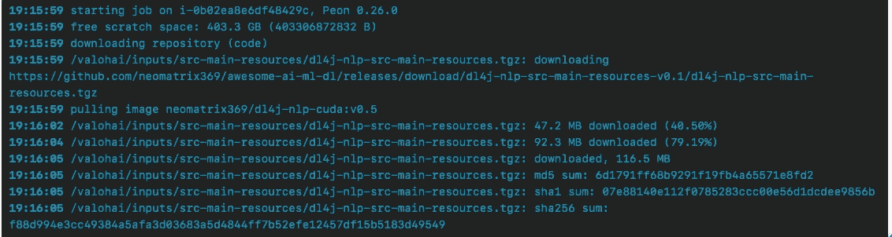
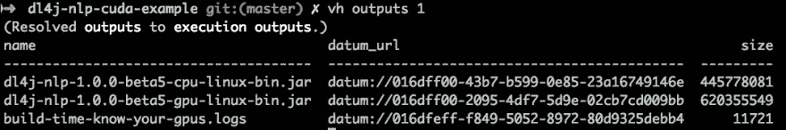
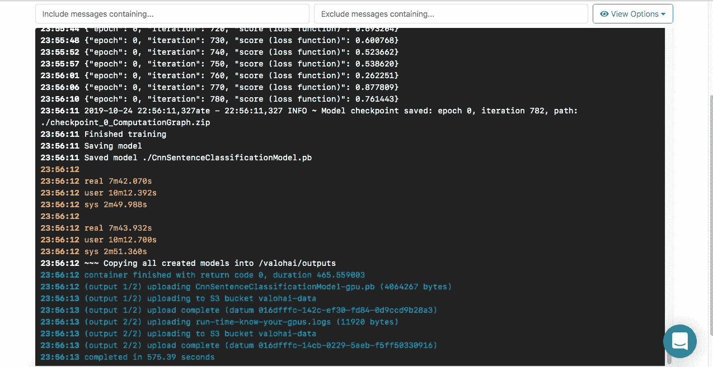
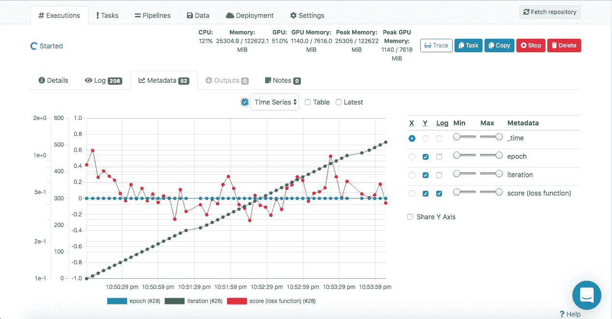
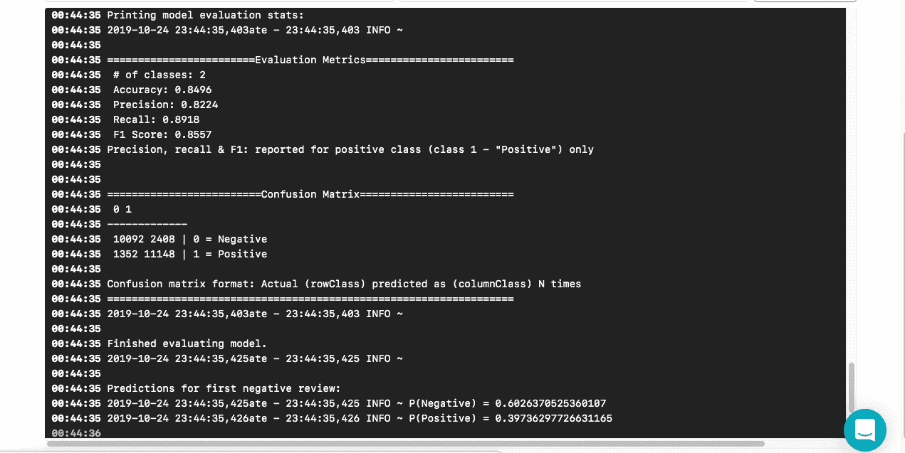
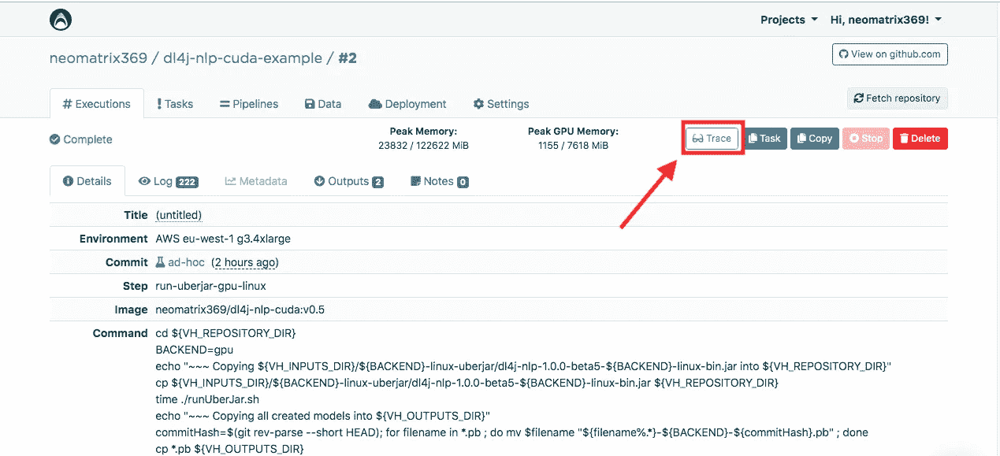
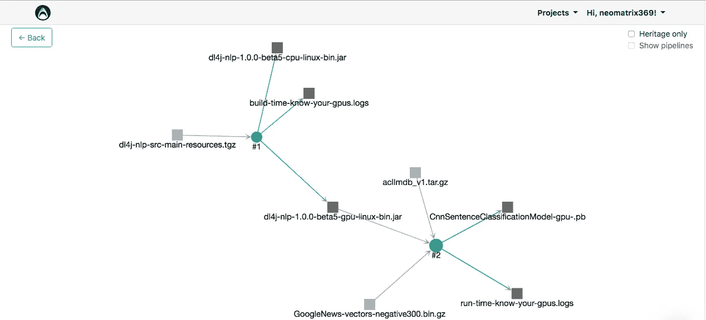

# 在 Java 中应用 NLP，全部来自命令行

> 原文：<https://towardsdatascience.com/applying-nlp-in-java-all-from-the-command-line-1225dd591e80?source=collection_archive---------27----------------------->


[Image source](https://unsplash.com/photos/ZzWsHbu2y80) by [Hannah Wright](https://unsplash.com/@hannahwrightdesigner)

# 介绍

我们都知道通过浏览器工作的机器学习工具和云服务，它们为我们提供了一个界面，我们可以使用它来执行日常数据分析、模型训练和评估以及其他不同程度的效率任务。

但是，如果您想在本地机器或组织中可用的基础设施上完成这些任务，您会怎么做呢？而且，如果这些可用的资源不能满足完成体面的端到端数据科学或机器学习任务的先决条件。这时，访问云提供商不可知的深度学习管理环境，如 [Valohai](https://valohai.com) 会有所帮助。此外，我们将使用所有人都可以使用的 [**自由层**](https://valohai.com/pricing/) 。


[**Create a free account**](https://get.valohai.com/cs/c/?cta_guid=18d3c2db-7630-414e-bbe4-e835f2ec42cb&placement_guid=ce53cbd9-210d-4576-91d8-f05ffce8e0f5&portal_id=2730768&canon=https%3A%2F%2Fblog.valohai.com%2Fnlp_with_dl4j_in_java_all_from_the_command-line&redirect_url=APefjpG1TUcWlv-eZxsAmaxlG9rqk38vQfsLAo3VQl7OzSuw2OUIBALvYxU3A69CoabsAMcniWEMdw5b8IVb6_S31r76TRKyqUaMNuD8Adq4yCgUtW2oaic2axBV2q8uZ80cmjDK-9D6&click=aeaa9976-80f2-4445-99fa-e4524f1f026b&hsutk=c7a00000164d193418f2016e273067b4&signature=AAH58kEvsi27jm-eKViSt0dBogTwMi0_4w&utm_referrer=https%3A%2F%2Fblog.valohai.com%2F&pageId=19375533141)

我们将执行构建 Java 应用程序的任务，然后使用它训练和评估 NLP 模型，我们将从命令行界面完成所有这些工作，减少与可用 web 界面的交互，基本上这将是一个端到端的过程，一直到训练、保存和评估 NLP 模型。我们不需要太担心设置、配置或管理任何环境。

# 目的或目标

在这篇文章中，我们将学习做一系列的事情，涵盖不同层次的抽象(没有特定的顺序):

*   如何在本地机器上构建和运行 NLP 模型？
*   如何在云上构建和运行 NLP 模型？
*   如何构建运行在 CPU 或 GPU 上的 NLP Java 应用？
*   大多数例子都不是基于 Java 的，更不用说基于 Java 的了
*   大多数例子都是基于 CPU 的，很少是基于 GPU 的
*   如何根据资源(即 GPU)的存在与否来执行上述操作？
*   如何为 Java 搭建一个 CUDA docker 容器？
*   如何从命令行完成以上所有工作？
*   通过单独的命令
*   通过 shell 脚本

# 我们需要什么，如何需要？

以下是我们开始行动所需要的:

*   可以在任何操作系统上构建和运行的 Java 应用程序
*   允许连接到远程云服务的 CLI 工具
*   管理上述所有内容的 shell 脚本和代码配置

一旦我们明确了我们的目标和需求，这个任务的*如何*部分就不难了，我们将在接下来的章节中展开。

# 面向 Java、DL4J 和 Valohai 的 NLP

# 面向 Java 的 NLP:DL4J

我们在 GitHub 上为你捕获了这篇文章[所需的所有代码和说明。以下是您熟悉该项目的步骤:](https://github.com/valohai/dl4j-nlp-cuda-example)

## 快速启动

为了快速开始，我们只需要做这些事情:

*   在[https://valohai.com](https://valohai.com)开户，见[https://app.valohai.com/accounts/signup/](https://app.valohai.com/accounts/signup/)
*   [在你的本地机器上安装 Valohai CLI](https://docs.valohai.com/tutorials/quick-start-cli.html)
*   克隆回购[https://github.com/valohai/dl4j-nlp-cuda-example/](https://github.com/valohai/dl4j-nlp-cuda-example/)

```
$ git clone https://github.com/valohai/dl4j-nlp-cuda-example/
$ cd dl4j-nlp-cuda-example
```

*   使用 [Valohai CLI](https://docs.valohai.com/tutorials/quick-start-cli.html?highlight%3Dcli) 工具创建一个 [Valohai](https://valohai.com) 项目，并为其命名

```
$ vh project create
```

*   在设置页面(https://app . valo hai . com/p/[your-user-id]/dl4j-NLP-cuda-example/Settings/Repository/)的存储库选项卡上，将您的 [Valohai](https://valohai.com) 项目与 GitHub repo[https://github.com/valohai/dl4j-nlp-cuda-example/](https://github.com/valohai/dl4j-nlp-cuda-example/)链接起来

```
$ vh project open### Go to the Settings page > Repository tab and update the git repo address with https://github.com/valohai/dl4j-nlp-cuda-example/
```

*   用来自 git repo 的最新提交更新 [Valohai](https://valohai.com) 项目

```
$ vh project fetch
```

现在，您已经准备好开始使用从命令行执行机器学习任务的能力了。

*参见自述文件* *中的* [*高级安装和设置部分，了解我们需要在您的系统上安装和配置什么，以便在您的本地机器上或 Docker 容器中运行应用程序和实验——目前这不是这篇文章所必需的，但您可以在以后尝试。*](https://github.com/valohai/dl4j-nlp-cuda-example/blob/master/README.md)

## 关于 [valohai.yaml](https://docs.valohai.com/valohai-yaml/index.html)

您可能已经注意到，我们在 git repo 中有一个 [valohai.yaml](https://docs.valohai.com/valohai-yaml/index.html) 文件，我们的 [valohai.yaml](https://github.com/neomatrix369/dl4j-nlp-cuda-example/blob/master/valohai.yaml) 文件包含几个您可以使用的步骤，我们已经按它们的名称登记了它们，我们将在运行我们的步骤时使用它们:

*   **build-cpu-gpu-uberjar** :在 [Valohai](https://www.google.com/url?q=https://valohai.com&sa=D&ust=1572263065713000) 上构建我们的 Uber jar(CPU 和 gpu 两个版本)
*   **train-cpu-linux** :在 [Valohai](https://www.google.com/url?q=https://valohai.com&sa=D&ust=1572263065714000) 上使用 uber jar 的 cpu 版本运行 NLP 训练
*   **train-gpu-linux** :在 [Valohai](https://www.google.com/url?q=https://valohai.com&sa=D&ust=1572263065714000) 上使用 gpu 版本的 uber jar 运行 NLP 训练
*   **evaluate-model-linux** :从上述 **train-*** 执行步骤之一评估经过训练的 NLP 模型
*   **了解您的 GPU**:在任何实例上运行为了收集该实例上与 GPU/Nvidia 相关的详细信息，我们对上面的其他步骤(构建和运行步骤)运行相同的脚本

## 从命令行构建 Java 应用程序

假设您已经设置好了，我们将从在命令提示符下在 [Valohai](https://valohai.com) 平台上构建 Java 应用程序开始，这就像运行两个命令之一一样简单:

```
$ vh exec run build-cpu-gpu-uberjar [--adhoc]

### Run `vh exec run --help` to find out more about this command
```

您将会看到一个执行计数器的提示，它不是一个数字:

```
<--snipped-->
😼  Success! Execution #1 created. See https://app.valohai.com/p/valohai/dl4j-nlp-cuda-example/execution/016dfef8-3a72-22d4-3d9b-7f992e6ac94d/
```


*注意:仅当您没有使用 git repo 设置您的*[*valo hai*](https://valohai.com)*项目或者有未保存的提交并且想要在确定配置之前进行试验时，才使用* `*--adhoc*` *。*

您可以通过以下方式观看处决过程:

```
$ vh watch 1

### the parameter 1 is the counter returned by the `vh exec run build-cpu-gpu-uberjar` operation above, it is the index to refer to that execution run
```

您可以看到，当执行开始时，我们或者在等待分配实例，或者控制台消息在屏幕上移动。你也可以通过网络界面看到同样的内容。

*注意:实例的可用性取决于它们的受欢迎程度以及您对它们的剩余配额，如果它们最近被使用过，则它们更有可能是下一个可用的。*



一旦该步骤完成，您可以看到它产生了一些工件，在 [Valohai](https://valohai.com) 术语中称为输出，我们可以通过以下方式看到它们:

```
$ vh outputs 1

### Run `vh outputs --help` to find out more about this command
```



在接下来的步骤中，我们需要类似于`datum://[....some sha like notation...]`的 URL。您可以看到，我们有一个日志文件，其中捕获了关于正在运行的实例的 GPU 相关信息，您可以通过以下方式下载该文件:

```
$ vh outputs --download . --filter *.logs 1

### Run `vh outputs --help` to find out more about this command
```

## 从命令行运行 CPU/GPU 的 NLP 训练过程

我们将使用构建的工件，即用于 CPU 和 GPU 后端的 uber jars 来运行我们的培训流程:

```
### Running the CPU uberjar
$ vh exec run train-cpu-linux --cpu-linux-uberjar=datum://016dff00-43b7-b599-0e85-23a16749146e [--adhoc]

### Running the GPU uberjar
$ vh exec run train-gpu-linux --gpu-linux-uberjar=datum://016dff00-2095-4df7-5d9e-02cb7cd009bb [--adhoc]

### Note these datum:// link will vary in your case
### Run `vh exec run train-cpu-linux --help` to get more details on its usage
```

*注:看看 Valohai CLI* *docs 的* [*输入，看看如何编写如上的命令。*](https://docs.valohai.com/valohai-cli/using-inputs.html)

如果我们喜欢，我们可以观看这个过程，但它可能会很长，所以我们可以切换到另一个任务。



上面的执行运行结束时，将模型保存到`${VH_OUTPUTS}`文件夹中，使其能够被 [Valohai](https://valohai.com) 归档。型号名称后面有后缀，以记录它们是如何生产的。

在我们构建、训练或评估步骤的任何时候，我们都可以通过这样做来停止正在进行的执行(排队或运行):

```
$ vh stop 3
(Resolved stop to execution stop.)
⌛   Stopping #3...
=>   {"message":"Stop signal sent"}
😁  Success! Done.
```

## 成功训练后下载保存的模型

我们可以通过计数器号查询执行的`outputs`,并使用以下命令下载:

```
$ vh outputs 2
$ vh outputs --download . --filter Cnn*.pb  2
```


*看你* [*如何在你的本地机器*](https://github.com/valohai/dl4j-nlp-cuda-example/blob/master/docs/running-local-machine.md#run-the-app-on-your-local-machine) *上评估下载的模型，既有由*[*CPU*](https://github.com/valohai/dl4j-nlp-cuda-example/blob/master/docs/running-local-machine.md#evaluating)*和*[*GPU*](https://github.com/valohai/dl4j-nlp-cuda-example/blob/master/docs/running-local-machine.md#evaluating-1)*创建的模型基于进程(各自的妖孽 jars)。只需将下载模型的名称作为参数传递给* [*提供的 runner shell 脚本*](https://github.com/valohai/dl4j-nlp-cuda-example/blob/master/runUberJar.sh) *。*

## 评估来自先前训练执行的保存的 NLP 模型

```
### Running the CPU uberjar and evaluating the CPU-verion of the model
$ vh exec run evaluate-model-linux --uber-jar=datum://016dff00-43b7-b599-0e85-23a16749146e --model=datum://016dff2a-a0d4-3e63-d8da-6a61a96a7ba6 [--adhoc]

### Running the GPU uberjar and evaluating the GPU-verion of the model
$ vh exec run evaluate-model-linux --uber-jar=datum://016dff00-2095-4df7-5d9e-02cb7cd009bb --model=datum://016dff2a-a0d4-3e63-d8da-6a61a96a7ba6 [--adhoc]

### Note these datum:// link will vary in your case
### Run `vh exec run train-cpu-linux --help` to get more details on its usage
```

在模型评估结束时，我们得到了下面的模型评估指标和在模型上运行测试集后的混淆矩阵:



*注:* [*源代码*](https://github.com/valohai/dl4j-nlp-cuda-example/tree/master/src/main) *以行内注释的形式包含了各阶段 ML 和 NLP 相关的解释。*

## 捕获关于 Nvidia 的 GPU 和 CUDA 驱动程序的环境信息

此步骤与在云上构建和运行 Java 应用程序以及使用客户端工具远程控制和查看它的整个过程无关，尽管能够了解我们在何种系统上运行培训是有用的，特别是对于培训的 GPU 方面:

```
$ vh exec run know-your-gpus [--adhoc]

### Run `vh exec run --help` to get more details on its usage
```

## 记录你的实验

*   在写这篇文章的时候，我做了几个实验，并以一种有效的方式跟踪成功和失败的实验，我能够使用 [Valohai](https://valohai.com) 的版本控制工具
*   过滤执行
*   通过“令牌”搜索具体执行
*   重新运行成功和失败的执行
*   确认执行是成功的，失败的原因是正确的
*   另外，在下面的 [Valohai](https://valohai.com) 平台上检查[数据目录](https://blog.valohai.com/blog-building-a-data-catalog-for-machine-learning)和[数据来源](https://blog.valohai.com/automatic-data-provenance-for-your-ml-pipeline)是我的项目的一个例子(寻找**跟踪**按钮):



## 比较基于 CPU 和 GPU 的进程

我们可以从以下方面讨论基于 CPU 和 GPU 的进程之间的比较:

*   应用程序构建性能
*   模型训练速度
*   模型评估准确性

但是我们不会在这篇文章中讨论这些话题，尽管你可以获得你需要的指标，如果你想进一步研究的话。

## 必要的配置文件和 shells 脚本

所有必要的脚本都可以在 [GitHub repo](https://github.com/valohai/dl4j-nlp-cuda-example) 上找到，它们可以在:

*   项目的根文件夹
*   docker 文件夹
*   资源-存档文件夹

也请看看 [README.md](https://github.com/valohai/dl4j-nlp-cuda-example/blob/master/README.md) 文件，了解更多关于它们的用法和其他我们在这篇文章中没有提到的信息。

# 瓦罗海——编排

如果我们注意到上述所有任务都是通过一些不同抽象层次的工具来编排的:

*   docker 管理基础设施和平台级配置以及版本控制管理
*   java 能够在任何选择的平台上运行我们的应用
*   shell 脚本能够以平台无关的方式再次运行构建和执行命令，并且能够在 MacOSX 上的 GPU 等资源缺失时进行例外处理
*   客户端工具，用于连接远程云服务，即 [Valohai CLI](https://docs.valohai.com/tutorials/quick-start-cli.html?highlight%3Dcli) ，并查看、控制执行和下载最终结果

您正在利用可用于完成各种数据和机器学习任务的工具和技术，从一个点协调您的任务。


[Image source](https://unsplash.com/photos/yri82tuk2TQ) by [Mark Rasmuson](https://unsplash.com/@mrasmuson)

# 结论

我们已经看到 NLP 是一项消耗资源的任务，拥有正确的方法和工具肯定会有所帮助。来自 [Skymind](https://skymind.ai) 的 [DeepLearning4J](https://deeplearning4j.org) 库和 [Valohai](https://valohai.com) 平台再次为我们服务。感谢两个平台的创造者。此外，我们可以看到这篇文章强调的以下好处(以及更多)。

# 利益

我们通过做上述事情获得了很多东西:

*   不必担心硬件和/或软件配置和版本控制管理— [docker 容器](https://hub.docker.com/r/neomatrix369/dl4j-nlp-cuda) FTW
*   能够运行手动一次性构建、培训和评估任务— [Valohai CLI](https://docs.valohai.com/tutorials/quick-start-cli.html?highlight%3Dcli) 工具 FTW
*   让您的团队定期自动执行任务，以便能够在远程云基础架构上运行任务— [基础架构即代码](https://github.com/valohai/dl4j-nlp-cuda-example/blob/master/valohai.yaml) FTW
*   克服旧的或缓慢的机器或无法访问板载 GPU 的 Mac 的限制— [支持 CUDA 的 docker 映像脚本](https://github.com/valohai/dl4j-nlp-cuda-example/tree/master/docker) FTW
*   克服本地或服务器基础设施上没有足够资源的情况，并且仍然能够运行需要高吞吐量和高性能环境的实验——与云提供商无关的平台，即[valo hai environments](https://docs.valohai.com/valohai-cli/using-environments.html?highlight%3Denvironment)FTW
*   运行任务，而不必等待任务完成，并且能够以经济高效的方式在远程资源上同时并行运行多个任务，这是一个与云提供商无关的平台，即[valo hai CLI](https://docs.valohai.com/tutorials/quick-start-cli.html?highlight%3Dcli)[tool FTW](https://www.google.com/url?q=https://docs.valohai.com/tutorials/quick-start-cli.html?highlight%3Dcli&sa=D&ust=1572263065733000)
*   远程查看、控制配置和执行，甚至在成功执行后下载最终结果——一个与云提供商无关的平台，即 [Valohai CLI](https://docs.valohai.com/tutorials/quick-start-cli.html?highlight%3Dcli) 工具 FTW
*   和许多其他你会发现自己

# 建议

*   **使用提供的支持 CUDA 的 docker 容器:**强烈建议不要在本地机器(基于 Linux 或 Windows)上安装 Nvidia 驱动程序或 CUDA 或 cuDNN 暂时搁置，留待以后试验
*   **使用提供的 shell 脚本和配置文件:**尽量不要执行手动 CLI 命令，而是使用 shell 脚本来自动执行重复的任务，前提是示例是一个很好的起点，并在此基础上更进一步
*   **尝试从提供的资源中学习尽可能多的**:关于 GPU、CUDA、cuDNN，并寻找更多(参见帖子底部的**资源**部分)
*   使用版本控制和基础设施即代码系统:git 和 [valohai.yaml](https://docs.valohai.com/valohai-yaml/index.html) 就是很好的例子

在做上述所有事情时，我感到非常高效，我的时间和资源得到了有效利用，最重要的是，我可以与他人分享，每个人都可以直接重用所有这些工作——只需[克隆回购](https://github.com/valohai/dl4j-nlp-cuda-example)和*就可以了*。

我们没有提到的，也可能是一个很好的话题，就是在未来的帖子中提到的[瓦罗海管道](https://docs.valohai.com/core-concepts/pipelines.html?highlight%3Dpipeline)！

# 资源

*   [dl4j-NLP-cuda-GitHub 上的示例](https://github.com/valohai/dl4j-nlp-cuda-example)项目
*   [在](https://hub.docker.com/r/neomatrix369/dl4j-nlp-cuda) [docker Hub](https://hub.docker.com/) 上启用 CUDA 的 Docker 容器(使用最新标签: [v0.5](https://hub.docker.com/layers/neomatrix369/dl4j-nlp-cuda/v0.5/images/sha256-fcfcc2dcdf00839d918a0c475c39733d777181abb1a3c34d8dea68339369b137) )
*   [GPU，Nvidia，CUDA 和 cuDNN](https://github.com/valohai/dl4j-nlp-cuda-example/blob/master/docs/gpu-related-resources.md)
*   [牛逼的 AI/ML/DL 资源](https://github.com/neomatrix369/awesome-ai-ml-dl/)
*   [Java AI/ML/DL 资源](https://github.com/neomatrix369/awesome-ai-ml-dl/blob/master/README-details.md#java)
*   [深度学习和 DL4J 资源](https://github.com/neomatrix369/awesome-ai-ml-dl/blob/master/README-details.md#deep-learning)
*   厉害了 AI/ML/DL: [NLP 资源](https://github.com/neomatrix369/awesome-ai-ml-dl/tree/master/natural-language-processing#natural-language-processing-nlp)
*   DL4J NLP 资源
*   [语言处理](https://deeplearning4j.org/docs/latest/deeplearning4j-nlp-overview)
*   [用于 GPU 和 CPU 的 ND4J 后端](https://deeplearning4j.org/docs/latest/deeplearning4j-config-gpu-cpu)
*   [Vocab 缓存如何工作](https://deeplearning4j.org/docs/latest/deeplearning4j-nlp-vocabulary-cache)
*   [Word2Vec，Doc2vec & GloVe:用于自然语言处理的神经单词嵌入](https://deeplearning4j.org/docs/latest/deeplearning4j-nlp-word2vec)
*   [深度学习中的 Doc2Vec 或段落向量 4j](https://deeplearning4j.org/docs/latest/deeplearning4j-nlp-doc2vec)
*   [句子迭代器](https://deeplearning4j.org/docs/latest/deeplearning4j-nlp-sentence-iterator)
*   [什么是标记化？](https://deeplearning4j.org/docs/latest/deeplearning4j-nlp-tokenization)
*   例子
*   [https://github . com/eclipse/deep learning 4j-examples/tree/master/dl4j-examples](https://github.com/eclipse/deeplearning4j-examples/tree/master/dl4j-examples)
*   [https://github . com/eclipse/deep learning 4j/tree/master/deep learning 4j/deep learning 4j-NLP-parent](https://github.com/eclipse/deeplearning4j/tree/master/deeplearning4j/deeplearning4j-nlp-parent)

**瓦罗海资源**

*   [瓦罗海](https://www.valohai.com/) | [文档](https://docs.valohai.com/) | [博客](https://blogs.valohai.com/) | [GitHub](https://github.com/valohai) | [视频](https://www.youtube.com/channel/UCiR8Fpv6jRNphaZ99PnIuFg/videos) | [展柜](https://valohai.com/showcase/) | [关于瓦罗海](https://github.com/neomatrix369/awesome-ai-ml-dl/blob/master/data/about-Valohai.md#valohai) | [懈怠](http://community-slack.valohai.com/)|[@瓦罗海](https://twitter.com/@valohaiai)
*   [在文档中搜索任何主题](https://docs.valohai.com/search.html?q=%3Cany+topic%3E)
*   关于如何使用 Valohai CLI 工具的博文:[【1】](https://blog.valohai.com/from-zero-to-hero-with-valohai-cli)|[【2】](https://blog.valohai.com/from-zero-to-hero-with-valohai-part-2)
*   [自定义 Docker 图像](https://docs.valohai.com/guides/build-docker-image.html)

**其他资源**

*   [牛逼的 Graal](https://github.com/neomatrix369/awesome-graal)|[graalvm.org](https://www.graalvm.org/)

**其他相关岗位**

*   [如何在 Valohai 平台上做 Java 的深度学习？](https://blog.valohai.com/how-to-do-deep-learning-for-java-on-the-valohai-platform)
*   关于如何使用 Valohai CLI 工具的博文:[【1】](https://blog.valohai.com/from-zero-to-hero-with-valohai-cli)|[【2】](https://blog.valohai.com/from-zero-to-hero-with-valohai-part-2)

# *最初发表于*[*【https://blog.valohai.com】*](https://blog.valohai.com/nlp_with_dl4j_in_java_all_from_the_command-line?from=3oxenia9mtr6)*。*