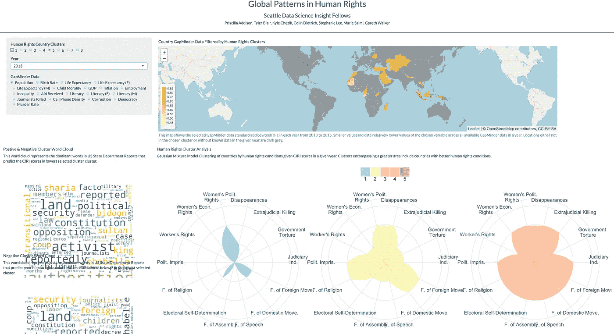
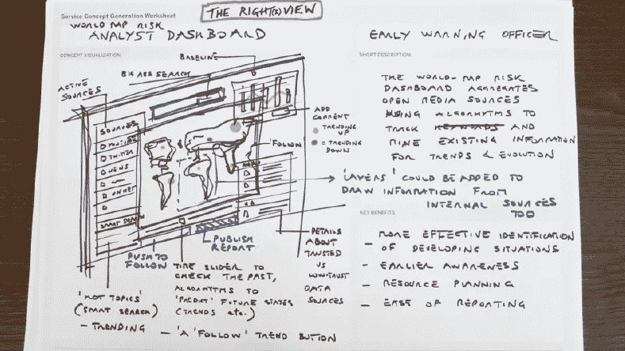
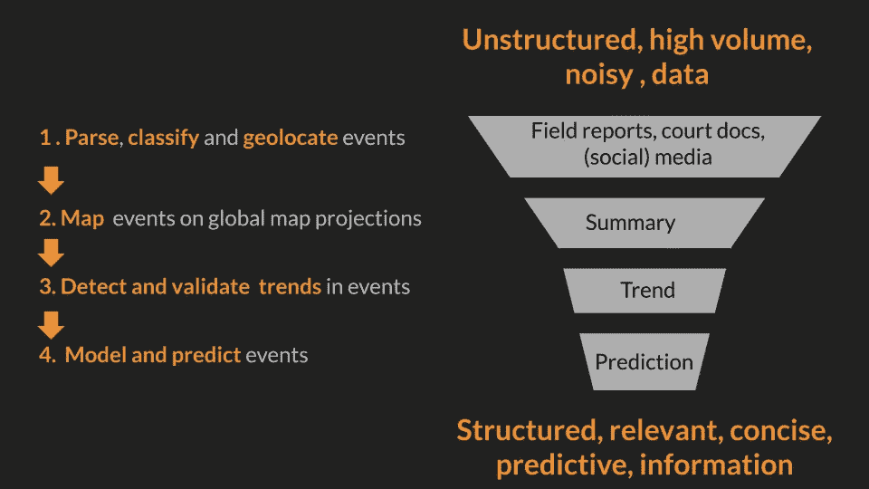
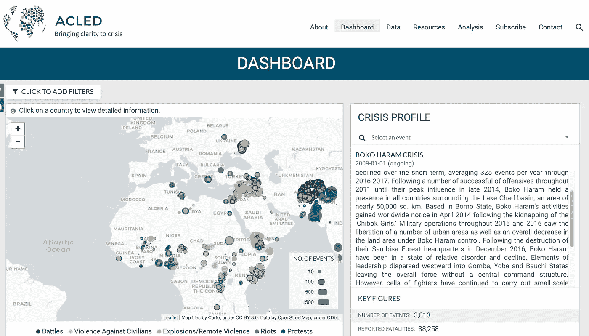
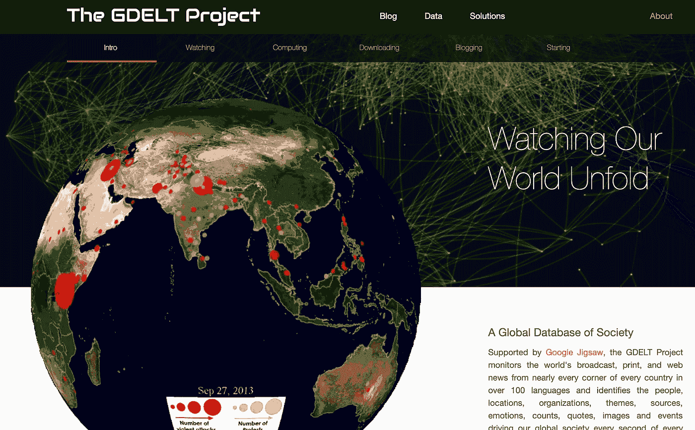
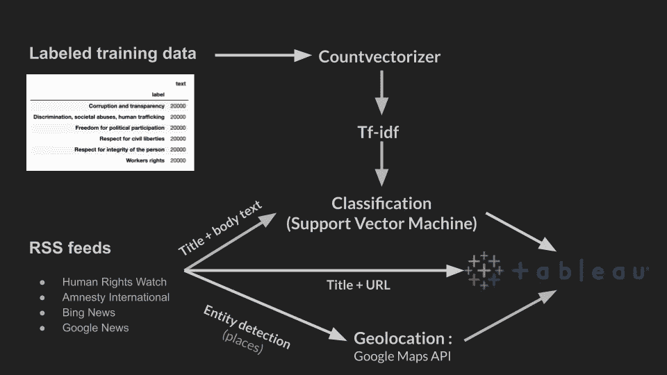
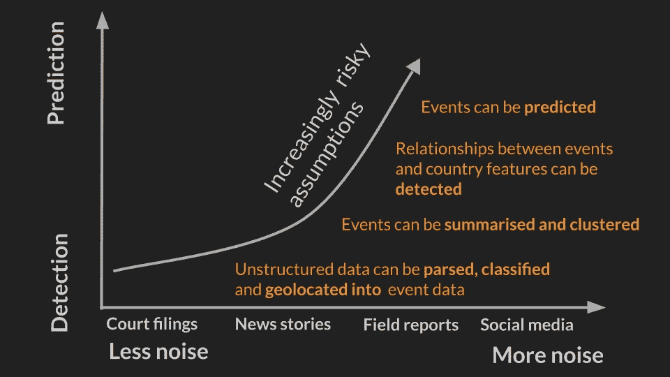
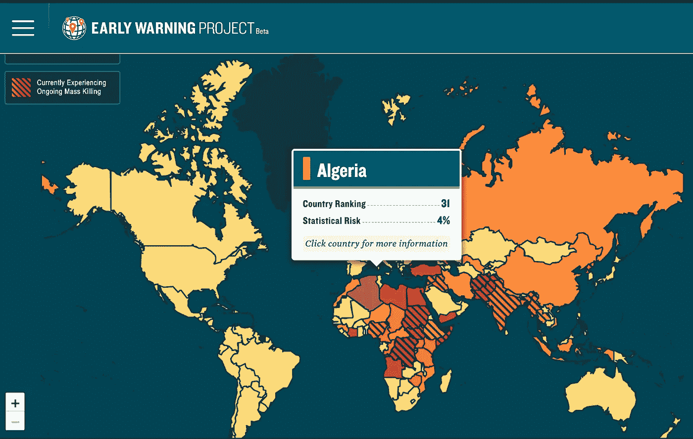
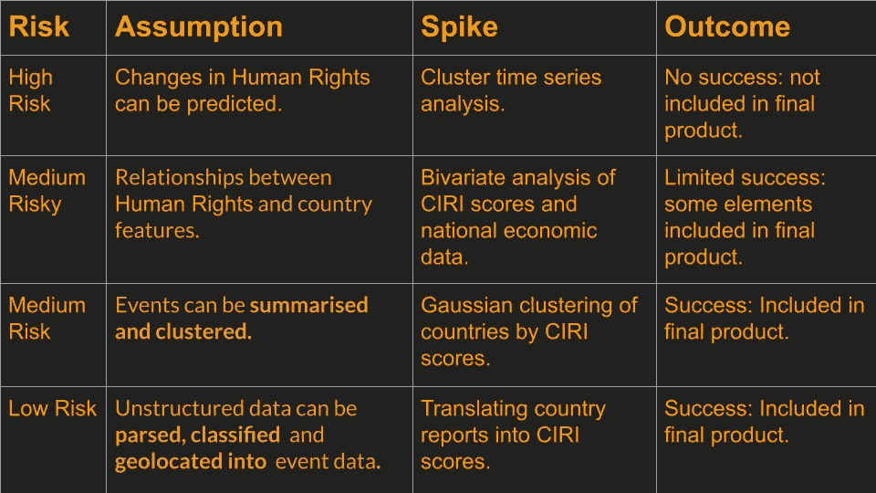

# 在数据科学中应用产品方法

> 原文：<https://towardsdatascience.com/applying-product-methodologies-in-data-science-a13aac70de0e?source=collection_archive---------17----------------------->

Photo by [Stefan C. Asafti](https://unsplash.com/@stefanasafti?utm_source=unsplash&utm_medium=referral&utm_content=creditCopyText) on [Unsplash](https://unsplash.com/search/photos/workshop-postit?utm_source=unsplash&utm_medium=referral&utm_content=creditCopyText)

什么是伟大的数据驱动产品？花式模特？开创性的想法？事实是，秘方通常在于成功实施产品方法论。

在这篇文章中，我回顾了最近的一次黑客马拉松经历，使用了最小可行产品、风险假设和峰值的精益和敏捷方法概念。我探索了这些方法如何帮助团队快速识别用例，映射所设想的解决方案的风险和复杂性，并快速迭代到可发布的产品。

GitHub 代码可用[此处](https://github.com/InternetGareth/SVM_Human_Rights)

# 黑客马拉松式的戏弄

> "世界上哪些地方发生了侵犯人权的行为，发生了哪些类型的侵犯人权行为？"

这是在最近与[微软的 AI for Good](https://www.microsoft.com/en-us/ai/ai-for-good) 倡议联合举办的黑客马拉松中，发给[洞察数据科学](https://www.insightdatascience.com/)研究员的一份不那么谦虚的简报。我是西雅图团队的一员，最初是由一屋子的博士组成的，他们摇着头，嘀咕着资源、范围，以及这份简报甚至是一个有效的研究问题的前提。我们勇往直前，走了很远，最终成为向微软展示的两个决赛团队之一。

我们的工作分析了[美国国务院关于各国人权状况的年度报告](https://2009-2017.state.gov/j/drl/rls/index.htm)，该报告每年为全球约 160 个国家发布。我们使用了一种量化评分方法，旨在总结每个人权领域的国家表现(使用来自 [Cingranelli-Richards (CIRI)人权数据项目](http://www.humanrightsdata.com/)的数据和方法)。然后，我们制作了一个仪表板，显示(1)侵犯人权的类型如何在各国聚集，(2)它们与宏观经济和发展指标的关系，(3)国务院报告中通常与这些聚集相关的关键词。

Final output of the Seattle hackathon team: credit to [Kyle Chezic](http://kchezik.github.io/) for data vis code

这是我们的第一次黑客马拉松。我为我们的团队和我们所做的工作感到非常自豪。然而，评委的反馈给我的印象是，虽然我们使用的方法和模型显示了强大的技术能力，但我们有时很难清楚地讲述我们做了什么以及为什么做。从那以后，我开始思考如何将产品思维应用到数据科学项目中，说实话，这往往会在展示技术实力的热潮中迷失。

# 医生和数据科学

[Insight](https://www.insightdatascience.com/) 是一项博士后培训奖学金，旨在弥合学术界和数据科学之间的差距。该项目的职权范围确保其组织者特别乐于将博士们置于他们过去的学术应对策略痛苦地死去的境地。作为一个物种，我们生来就不具备快速切入问题核心，理解解决方案的受益者，并在两者之间画出最短路线的能力。更好的做法是，在接下来的一年里仔细提炼研究问题……在接下来的四年左右时间里，在埋在付费墙后面的期刊上发表大量警告性的答案。

需要澄清的是，我不想加入数据科学博客的活跃交易，这些博客胜利地痛斥学术界。博士成为优秀的数据科学家是因为他们受过科学训练，而不是尽管如此。然而，从学术界向科技行业的转变包括决定在旅途中带什么工具，以及哪些工具应该亲切地存放在阁楼上“以备后用”，与面包机、攀岩用具和其他过去雄心的遗物放在一起。

学术研究思维必须进入阁楼，特别是通过对知识主体的潜在贡献来评估研究问题价值的本能，以及相应的信念，即只有在同行评议的火焰中锻造的深入方法才能通过检验。要保留的，是理解领域知识是必不可少的；不管你的代码和数学有多好，如果你不理解你正在建模的系统，以及你自己的偏见的影响，你仍然在黑暗中徘徊。

# 从研究项目到产品开发

那么，从微软的反馈中我们能学到什么呢？嗯，一个评论指出**用例**不清楚。*谁在使用这个产品，我们为他们解决了什么问题？*第二是我们的**产品方法不够清晰。我们需要讲述一个更好的关于特性优先级的故事，以及我们如何分配时间来开发它们。**

## 定义用例

回想起来，我们心中的用例是建立在微软已经与联合国人权事务高级专员办事处(人权高专办)完成的一些工作的基础上的。总之，微软和人权高专办举行了一次联合构思会议，以确定人权高专办工作人员真正需要的是什么。其成果是 RightsView，实质上是一个关于世界各地新出现和正在发生的侵犯人权行为的实时信息仪表板。研讨会引用的一段话表明，人权高专办想要仪表板；

> “对潜在的、新出现的或正在发生的危机提出明确的人权观点，并通过联合国其他部门和国际社会的更广泛参与，对这些危机作出适当的反应。”

会议还制作了仪表板模型的草图，这是决定产品开发方向的有用起点。

Product Vision: ‘The Right(s)View’, a dashboard for human rights monitoring. Source:[https://news.microsoft.com/features/technology-helps-un-advance-protection-human-rights-new-ways/](https://news.microsoft.com/features/technology-helps-un-advance-protection-human-rights-new-ways/)

## MVP 方法

给定一个经过充分研究的用户和用例，任务就变成了描述该产品的功能，并确定开发的当务之急。这样做的主要方法是开发最小可行产品(MVP)。这种方法规定识别满足早期用户的最小功能集，尽快发布这些功能，并通过建立成功和整合用户反馈来迭代产品。

看看 RightsView 仪表板的例子，首先映入我眼帘的是，这本质上是一个“从消防水管喝水”的问题；我们试图提供一种服务，它吸收大量具有高度可变性和噪声的非结构化数据，并向用户返回结构化、相关、简洁和可预测的信息，从而引导或支持他们采取行动。这种服务中潜在功能的深度是令人生畏的，我们可以将它描述为一种多阶段的方法，在这种方法中，我们越来越接近“结构化、相关、简洁和可预测”的最终目标(见下图)。)

When drinking from the firehose, use a funnel.

从 MVP 的角度来看，我们可能会问，*帮助用户消化所有这些数据的最小功能是什么？*我认为这是摄取所有非结构化数据并以某种方式将其转换为分类和地理定位事件的第一步，并结合结构化数据的表示层(最有可能是地图仪表盘)。)

Prioritized MVP functionality

应该注意的是，MVP 方法经常被指责为落入了削减产品的陷阱，以至于最初的发布有些琐碎，用途有限。因此，作为一个独立的产品，这种功能的例子值得在市场上寻找。

在公共非结构化数据的事件映射的情况下，实际上有一个相当健康的市场。例如，[武装冲突地点&事件数据项目](https://www.acleddata.com/) ( **ACLED** )就非常接近这第一步。然而，其数据依赖于研究人员手动编码提交给网站的非结构化报告。虽然这使它成为一个更值得信赖的数据来源和记者的最爱(例如[卫报经常使用其数据](https://www.theguardian.com/global-development/2015/jan/23/boko-haram-nigeria-civilian-death-toll-highest-acled-african-war-zones))，但其手动方式使其成为一个耗时和昂贵的产品。

The ACLED uses a mostly manual approach to codifying events data

另一个很好的例子是关于事件、语言和语气的全球数据库[(**GDELT**)，它代表了将公共媒体源解析为事件数据的过程完全自动化的尝试。该项目的创始人 Philip Schrodt 在](https://www.gdeltproject.org/) [2011 年的一篇论文](https://pdfs.semanticscholar.org/2231/7c1fb2e0339771cb6f263e58c31ea421054c.pdf)中概述了生成该数据集的必要步骤，该数据集现在可供任何人在这里[使用](https://www.gdeltproject.org/)。虽然 GDELT 几乎过于庞大，无法适用于正在发生何种类型的侵犯人权行为以及发生在何处的问题，但它确实表明，事件数据生产确实是它自己的研究领域，在政策分析和社会学方面拥有广泛的用户基础。

GDELT is an example of fully automated event detection

确定了一个 MVP，并从 Schrodt 的 [2011 年的论文中概述的步骤开始，](https://pdfs.semanticscholar.org/2231/7c1fb2e0339771cb6f263e58c31ea421054c.pdf)我选择进行一些我自己的进一步工作，看看工作的 MVP 迭代会是什么样子。有很多中型文章发布了文本分类程序的一步一步的过程，所以如果你感兴趣的话，我将只提供一个简短的概要和一个到 github 项目的链接。

MVP 从国务院 2015 年至 2018 年的年度人权国家中摘抄了文本。每年涵盖约 160 个国家，每份报告约 10，000 字，分为以下几节:

*   政府腐败和缺乏透明度
*   歧视、社会虐待和人口贩运
*   尊重公民自由
*   尊重人的完整性
*   工人权利
*   参与政治进程的自由

每个句子都由它出现的部分标记，然后形成标记的训练数据。在进行一些引导重采样以解决类别不平衡之后，数据被清理、矢量化并用于训练支持向量机。然后，这被用作从各种 RSS 提要中解析的新闻提要的分类算法。

同时，我使用自然语言工具包(NLTK)对每个新闻故事进行实体检测，特别是搜索地名。在找到一个名字的地方，这个名字被传递给谷歌地图的 API，以便对这个故事进行地理定位。结果存储在 pandas 数据框中，并使用 Tableau 可视化[。](https://public.tableau.com/profile/gareth.walker#!/vizhome/MappingHumanRightsNews-Updated/HumanRightsinthenews)

Outline of the process for event coding RSS newsfeeds

其结果是我刚刚调查的现有方法的基本版本，但特别关注新闻报道中报道的侵犯人权行为。在训练中，该模型在 6 个类别中实现了 76%的准确率，当应用于 RSS 提要时，这一准确率下降到 67%。

Demo of MVP for human rights events in RSS feeds

显然，这是一个比我们团队采用的方法简单得多的结果。但是有没有好一点呢？我们的时间是否应该更好地花在改进产品的“第一步”上，或者我们探索更大范围的功能是否正确？要回答这个问题，调动第二种产品开发方法是有帮助的…

## 最危险的假设方法

> 一个 MVP 用一个清晰的、线性的路径来诱惑一个优化的解决方案。最危险的假设测试把重点放在学习上…

从这个角度来看，MVP 部分中概述的漏斗现在可以被认为是关于什么可以做什么不可以做的风险越来越大的假设，特别是在分配的时间框架内。

Taking a Risky Assumption perspective means explicitly acknowledging the scale and risk of the challenge

再说一次，在评估什么是可能的，什么是不可能的时候，做一些市场调查是值得的。事实证明，预测国家支持的犯罪，特别是暴力的爆发的领域已经被几个团体尝试过了。例如，[早期预警项目](https://earlywarningproject.ushmm.org/)宣称自己是第一个此类公共系统，旨在“关注那些尚未发生大规模暴行，但这种暴力风险很高的国家。”

The Early Warning Project attempts to highlight countries ‘at risk’ of mass killings

我首先注意到的是该项目的发言人强调它是*而不是*预测模型的谨慎。吉尔·萨维特是主持这个项目的美国大屠杀纪念馆的馆长；

> “我们没有精确预测。这不是这个工具的目的，”Savitt 说。“我们正在做的是试图提醒政策制定者，这是一种恐怖发生的时机已经成熟的情况，并给他们一个警告，即可以采取行动来避免这种情况。”

类似的模型似乎在私营国防和安全部门略显模糊的水域中运行，它们的设计师显然不羞于预测它们的性能。例如，洛克希德·马丁公司宣传其综合危机预警系统(ICEWS)有 80%的准确率可以预测全球危机。这些“危机”实际上是什么的细节，或者如何测量准确性的任何意义都没有给出…

因此，看来我们的产品中确实存在一些有风险的假设，最值得注意的是，我们可以发现侵犯人权行为和社会经济指标之间的任何相关性，甚至可以预测人权表现随时间的变化。

## 探索有风险的假设和代码峰值的概念

我们的团队花了大量的时间来探索不同的方法，从描述到预测我们的数据，并在这个过程中消除了相当多的方法不起作用。这就是风险假设方法的本质:直接测试项目的核心假设，而不是从最简单/最少的元素开始，然后碰壁。正如一个描述所说，风险假设方法的关键是:

> …快速、小型测试。为了检验你最大的假设，你能做的最小实验是什么？

当这些测试是以编写一些框架代码的形式来测试一个想法是否“有腿”，就像我们的情况一样，那么这个测试也可以被描述为一个尖峰。简而言之，尖峰是一个从极限编程(XP)产品开发学派中出现的术语。它被描述为一个开放式的，但理想情况下简短而集中的编码练习，旨在测试一个假设。换个说法；

> “我们能编写的最简单的程序是什么，能让我们相信我们是在正确的轨道上？”⁴

回顾我们团队应对这一挑战的方式，识别风险假设的模型，结合使用尖峰来测试它们，是我们使用的直观方法。我们的团队分为四大任务，每个任务侧重于不同的假设和尖峰任务:

Risky Assumptions can be tested using Spikes

结果喜忧参半。我们找到了一个很好的方法来将结构化的文本转化为每个人权类别的“分数”,我们还找到了一个方法来将国家分组为不同类型的人权概况，我们至少开始探索社会经济变量在形成这些分组中的作用。预测，多少可以预见，是不可能的。

# 并列比较

在使用了 MVP 和最危险假设方法来描绘出产品是如何开发的之后，我们现在可以看看每种方法的结果，并反思其优缺点。

## 短期与长期风险

对我来说，一个收获是 MVP 方法似乎可以减轻短期风险，而处理风险最大的假设需要长远眼光。有了 MVP，你也许更有可能得到满足最少用户需求的东西。然而，你的路线图可能会掉下悬崖，因为你实际上试图做的事情——预测人权侵犯——最终可能无法实现。

## 管理速度

对于黑客马拉松来说，这是一个特别重要的问题，因为产品结果预计在几周之内就会出来。通常情况下，一个 MVP 将由一个复杂性和模糊性较低的用户故事组成，这样你就有更好的机会规划出需要多长时间。在精益方法中处理风险最大的假设本质上更具探索性，因此您需要更加积极地为每个代码峰值分配严格的时间余量。

## 功能膨胀

MVP 方法可以帮助你专注于一个单一的特性并抓住它。因为黑客马拉松是一场竞赛，所以我们不得不在我们最危险的假设中包含每个代码峰值的结果。因此，我们最终获得了大量的功能，展示了我们做了多少工作，但却淹没了微软的评委，以及潜在的未来用户。

# 感谢

非常感谢所有为我们的成功做出贡献的队友。请务必查看他们的个人资料:

普里西拉·艾迪森

[泰勒·布莱儿](https://towardsdatascience.com/@tyler7blair)

[凯尔·切齐克](http://kchezik.github.io/)

科林·迪特里希

[斯蒂芬妮·李](https://www.linkedin.com/in/stephanie-y-lee/)

[玛丽·萨尔米](https://www.linkedin.com/in/mariesalmi/)

1.  [https://news . Microsoft . com/features/technology-helps-un-advance-protection-human-rights-new-ways/](https://news.microsoft.com/features/technology-helps-un-advance-protection-human-rights-new-ways/)
2.  [https://hacker noon . com/the-MVP-is-dead-long-live-the-rat-233 D5 d 16 ab 02](https://hackernoon.com/the-mvp-is-dead-long-live-the-rat-233d5d16ab02)
3.  [https://www . NPR . org/sections/goatsandsoda/2018/12/20/675582639/is-种族灭绝-可预测-研究者-说-绝对](https://www.npr.org/sections/goatsandsoda/2018/12/20/675582639/is-genocide-predictable-researchers-say-absolutely)
4.  [http://agiledictionary.com/209/spike/](http://agiledictionary.com/209/spike/)