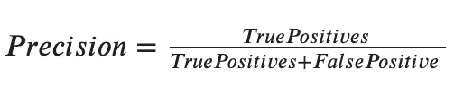
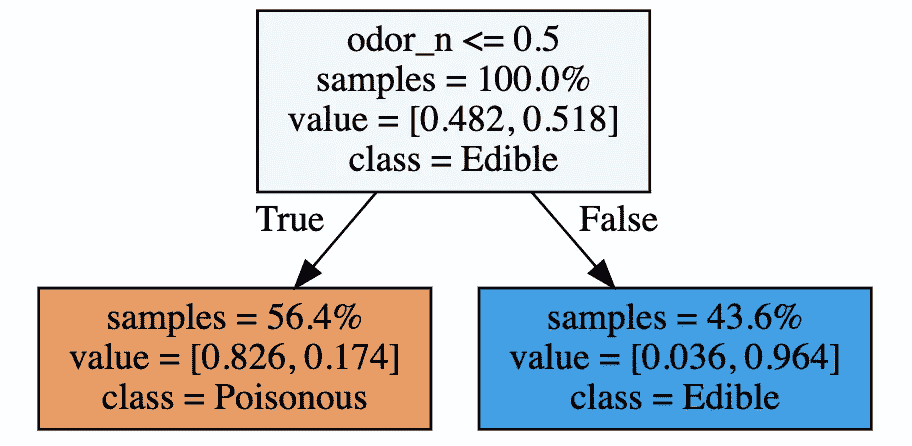
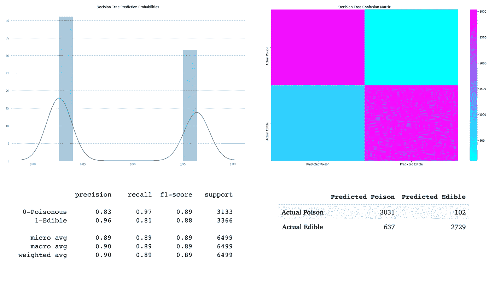
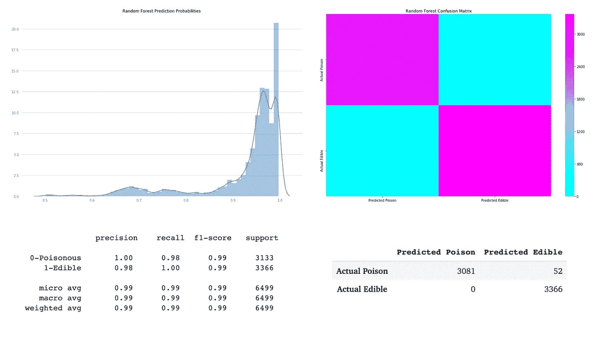
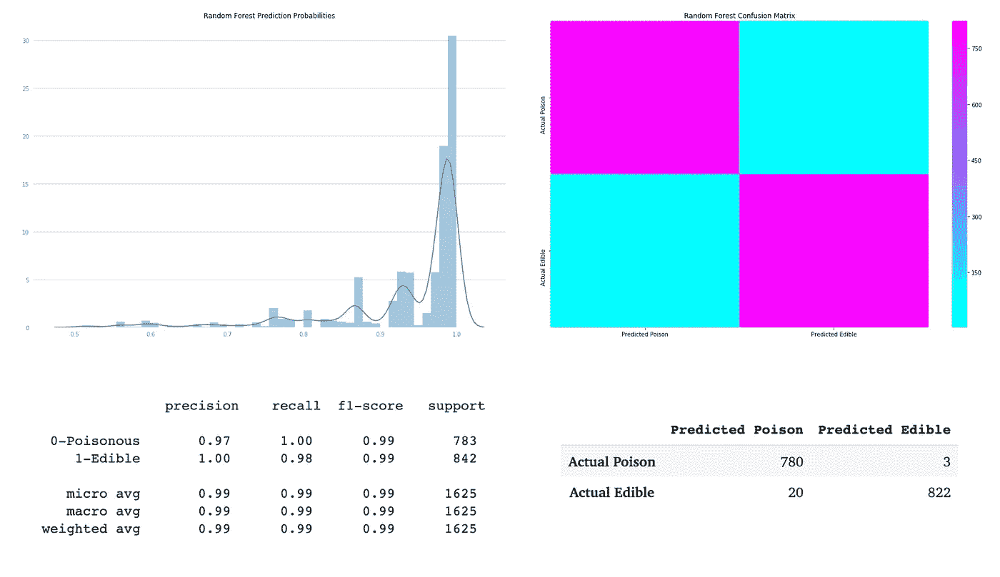

# 通用机器学习工作流

> 原文：<https://towardsdatascience.com/applying-the-universal-machine-learning-workflow-to-the-uci-mushroom-dataset-1939442d44e7?source=collection_archive---------12----------------------->


Photo by [Phoenix Han](https://unsplash.com/@phienix_han?utm_source=medium&utm_medium=referral) on [Unsplash](https://unsplash.com?utm_source=medium&utm_medium=referral)

## 一个将弗朗索瓦·乔莱的通用机器学习工作流程应用于 UCI 蘑菇数据集

W e 将使用来自 [UCI 的机器学习库](https://archive.ics.uci.edu/ml/index.php)的[蘑菇数据集](https://archive.ics.uci.edu/ml/datasets/mushroom)来执行我们的演示。本书面向至少对 Python 基础有基本了解并有一些机器学习经验的读者。也就是说，我将为门外汉提供大量支持来源的链接，以便任何人都可以利用所提供的信息。

在我们开始之前，我想感谢我的 Lambdonian 同事 Ned H 对这篇文章的所有帮助。

## 通用机器学习工作流

1.  定义问题并组装数据集
2.  选择衡量成功的标准
3.  决定评估协议
4.  准备数据
5.  开发一个比基线做得更好的模型
6.  开发一个过度拟合的模型
7.  正则化模型并调整其超参数

# 1.定义问题并组装数据集

简单地说，我们的问题是把蘑菇分为食用和有毒两类。我们得到了一个包含 23 个特征的数据集，其中包括蘑菇的类别(可食用或有毒)。

根据数据信息文件中列出的特性，我们可以为数据集创建一个列名列表。

```
column_names = ['class',
                'cap-shape',
                'cap-surface',
                'cap-color',
                'bruises?',
                'odor',
                'gill-attachment',
                'gill-spacing',
                'gill-size',
                'gill-color',
                'stalk-shape',
                'stalk-root',
                'stalk-surface-above-ring',
                'stalk-surface-below-ring',
                'stalk-color-above-ring',
                'stalk-color-below-ring',
                'veil-type',
                'veil-color',
                'ring-number',
                'ring-type',
                'spore-print-color',
                'population',
                'habitat']
```

让我们导入数据集，并从。数据文件使用`[pd.read_csv()](https://pandas.pydata.org/pandas-docs/stable/reference/api/pandas.read_csv.html)`

```
import pandas as pdurl = '[https://archive.ics.uci.edu/ml/machine-learning-databases/mushroom/agaricus-lepiota.data'](https://archive.ics.uci.edu/ml/machine-learning-databases/mushroom/agaricus-lepiota.data')mushrooms = pd.read_csv(url, header=None, names=column_names)
```

# 2.选择衡量成功的标准

鉴于我们问题的性质；分类蘑菇是否有毒，我们将使用[精度](https://scikit-learn.org/stable/modules/generated/sklearn.metrics.precision_score.html)作为我们成功的衡量标准。精度是分类器不将有毒蘑菇标记为可食用蘑菇的能力。我们宁愿人们丢弃我们的模型归类为有毒的可食用蘑菇，而不是食用我们的分类器标记为可食用的有毒蘑菇。



```
from sklearn.metrics import precision_score
```

# 3.决定评估协议

我们将使用 10 重交叉验证来评估我们的模型。虽然一个简单的拒绝验证集可能就足够了，但我怀疑它的可行性，因为我们有大约 8000 个样本。

```
from sklearn.model_selection import train_test_split, cross_validate
```

首先让我们把数据分成一个特征矩阵(X)和一个目标向量(y)。我们将使用`[OneHotEncoder](http://contrib.scikit-learn.org/categorical-encoding/onehot.html)`来编码我们的分类变量。

```
import category_encoders as ce#Drop target feature
X = mushrooms.drop(columns='class') #Encode categorical features
X = ce.OneHotEncoder(use_cat_names=True).fit_transform(X)

y = mushrooms['class'].replace({'p':0, 'e':1})print('Feature matrix size:',X.shape)
print('Target vector size:',len(y))____________________________________________________________________Feature matrix size: (8124, 117) Target vector size: 8124
```

接下来，我们将把数据分成[训练集和](https://scikit-learn.org/stable/modules/generated/sklearn.model_selection.train_test_split.html)测试集。

```
X_train, X_test, y_train, y_test = train_test_split(X, y, random_state=42, test_size=.2, stratify=y)print('Training feature matrix size:',X_train.shape)
print('Training target vector size:',y_train.shape)
print('Test feature matrix size:',X_test.shape)
print('Test target vector size:',y_test.shape)____________________________________________________________________Training feature matrix size: (6499, 117) 
Training target vector size: (6499,) 
Test feature matrix size: (1625, 117) 
Test target vector size: (1625,)
```

# 4.准备数据

我们几乎准备好开始训练模型，但是首先我们应该探索我们的数据，熟悉它的特征，并格式化它，以便它可以输入到我们的模型中。

我们可以使用`.dtypes()`、`.columns`和`.shape`来检查我们的数据集，但是 Pandas 提供了一个`[.info](https://pandas.pydata.org/pandas-docs/stable/reference/api/pandas.DataFrame.info.html)`功能，允许我们在一个地方查看所有这些信息。

```
print(mushrooms.info())____________________________________________________________________<class 'pandas.core.frame.DataFrame'> 
RangeIndex: 8124 entries, 0 to 8123
Data columns (total 23 columns):
class                       8124 non-null object
cap-shape                   8124 non-null object 
cap-surface                 8124 non-null object 
cap-color                   8124 non-null object 
bruises?                    8124 non-null object 
odor                        8124 non-null object 
gill-attachment             8124 non-null object 
gill-spacing                8124 non-null object 
gill-size                   8124 non-null object 
gill-color                  8124 non-null object 
stalk-shape                 8124 non-null object 
stalk-root                  8124 non-null object 
stalk-surface-above-ring    8124 non-null object 
stalk-surface-below-ring    8124 non-null object 
stalk-color-above-ring      8124 non-null object 
stalk-color-below-ring      8124 non-null object 
veil-type                   8124 non-null object 
veil-color                  8124 non-null object 
ring-number                 8124 non-null object 
ring-type                   8124 non-null object 
spore-print-color           8124 non-null object 
population                  8124 non-null object 
habitat                     8124 non-null object 
dtypes: object(23) memory usage: 1.4+ MB None
```

另一个有用的步骤是检查空值的数量以及它们在数据帧中的位置

```
print(mushrooms.isna().sum())____________________________________________________________________class                       0 
cap-shape                   0 
cap-surface                 0 
cap-color                   0 
bruises?                    0 
odor                        0 
gill-attachment             0 
gill-spacing                0 
gill-size                   0 
gill-color                  0 
stalk-shape                 0 
stalk-root                  0 
stalk-surface-above-ring    0 
stalk-surface-below-ring    0 
stalk-color-above-ring      0 
stalk-color-below-ring      0 
veil-type                   0 
veil-color                  0 
ring-number                 0 
ring-type                   0 
spore-print-color           0 
population                  0 
habitat                     0 
dtype: int64
```

一个也没有……这似乎好得令人难以置信。

由于我们勤奋好学，阅读了[数据集信息文件](https://archive.ics.uci.edu/ml/machine-learning-databases/mushroom/agaricus-lepiota.names)。我们知道所有缺失的值都标有问号。一旦清楚了这一点，我们就可以使用`[df.replace()](https://pandas.pydata.org/pandas-docs/stable/reference/api/pandas.DataFrame.replace.html)`来转换？敬 NaNs。

```
import numpy as np
mushrooms = mushrooms.replace({'?':np.NaN})
print(mushrooms.isna().sum())
____________________________________________________________________class                       0 
cap-shape                   0 
cap-surface                 0 
cap-color                   0 
bruises?                    0 
odor                        0 
gill-attachment             0 
gill-spacing                0 
gill-size                   0 
gill-color                  0 
stalk-shape                 0 
stalk-root               2480
stalk-surface-above-ring    0 
stalk-surface-below-ring    0 
stalk-color-above-ring      0 
stalk-color-below-ring      0 
veil-type                   0 
veil-color                  0 
ring-number                 0 
ring-type                   0 
spore-print-color           0 
population                  0 
habitat                     0 
dtype: int64
```

我们到了，`stalk_root`有 2480 个空白特征，让我们用`m`替换它们。

```
mushrooms['stalk-root'] = mushrooms['stalk-root'].replace(np.NaN,'m')print(mushrooms['stalk-root'].value_counts())____________________________________________________________________b    3776 
m    2480 
e    1120 
c     556 
r     192 
Name: stalk-root, dtype: int64
```

# 5.开发一个比基线做得更好的模型

**基线模型**

使用我们数据集中最常见的标签，我们将创建一个我们希望击败的基线模型。

首先让我们看看如何使用`[df.value_counts()](https://pandas.pydata.org/pandas-docs/stable/reference/api/pandas.Series.value_counts.html)`来分配类

```
mushrooms['class'].value_counts(normalize=True)____________________________________________________________________e    0.517971 
p    0.482029 
Name: class, dtype: float64
```

我们将使用 class 属性的模式来创建基线预测。

```
majority_class = y_train.mode()[0]baseline_predictions = [majority_class] * len(y_train)
```

让我们看看我们的基线模型有多精确。

```
from sklearn.metrics import accuracy_scoremajority_class_accuracy = accuracy_score(baseline_predictions,
                                         y_train)print(majority_class_accuracy)____________________________________________________________________ 0.5179258347438067
```

约 52%…这是给定初始数据集中类的分布后我们所期望的。

**决策树**

我们将尝试用[决策树](https://scikit-learn.org/stable/modules/generated/sklearn.tree.DecisionTreeClassifier.html)来拟合我们的训练数据，并产生大于 52%的准确率分数。

```
from sklearn.tree import DecisionTreeClassifier
import graphviz
from sklearn.tree import export_graphviztree = DecisionTreeClassifier(max_depth=1)# Fit the model
tree.fit(X_train, y_train)# Visualize the tree
dot_data = export_graphviz(tree, out_file=None, feature_names=X_train.columns, class_names=['Poisonous', 'Edible'], filled=True, impurity=False, proportion=True)graphviz.Source(dot_data)
```



现在，我们已经将决策树与我们的数据相匹配，我们可以通过查看分类器的预测概率分布来分析我们的模型。简单来说，预测概率表示模型对其分类标签的确信程度。

除了预测概率，我们还会看我们决策树的精度得分。Sklearn 为我们提供了一个简单的方法，用`[classification_report](https://scikit-learn.org/stable/modules/generated/sklearn.metrics.classification_report.html)`看到分类模型的很多相关分数。

我们还将使用 sklearn 的`[confusion_matrix](https://scikit-learn.org/stable/modules/generated/sklearn.metrics.confusion_matrix.html)`生成混淆矩阵。混淆矩阵显示了真假阳性和阴性的数量。

因为我们将再次使用这些工具，所以我们将编写一个函数来运行我们的模型分析。

```
import matplotlib.pyplot as plt
import seaborn as sns
from sklearn.metrics import classification_report, confusion_matrixdef model_analysis(model, train_X, train_y):
  model_probabilities = model.predict_proba(train_X) Model_Prediction_Probability = [] for _ in range(len(train_X)):
      x = max(model_probabilities[_])
      Model_Prediction_Probability.append(x) plt.figure(figsize=(15,10)) 

  sns.distplot(Model_Prediction_Probability) plt.title('Best Model Prediction Probabilities') # Set x and y ticks
  plt.xticks(color='gray') #plt.xlim(.5,1)
  plt.yticks(color='gray') # Create axes object with plt. get current axes
  ax = plt.gca() # Set grid lines
  ax.grid(b=True, which='major', axis='y', color='black', alpha=.2) # Set facecolor
  ax.set_facecolor('white') # Remove box
  ax.spines['top'].set_visible(False)
  ax.spines['right'].set_visible(False)
  ax.spines['bottom'].set_visible(False)
  ax.spines['left'].set_visible(False)
  ax.tick_params(color='white') plt.show();

  model_predictions = model.predict(train_X) # Classification Report
  print('\n\n', classification_report(train_y, model_predictions, target_names=['0-Poisonous', '1-Edible'])) # Confusion Matrix
  con_matrix = pd.DataFrame(confusion_matrix(train_y, model_predictions), columns=['Predicted Poison', 'Predicted Edible'], index=['Actual Poison', 'Actual Edible'])

  plt.figure(figsize=(15,10)) sns.heatmap(data=con_matrix, cmap='cool'); plt.title('Model Confusion Matrix')
  plt.show();

  return con_matrix
```

现在将这个函数应用到我们的决策树中。

```
model_analysis(tree, X_train, y_train)
```



我们将把我们的预测存储为一个`tree_predictions`变量，用于解释我们模型的准确性。

```
tree_predictions = tree.predict(X_train)accuracy_score(y_train, tree_predictions)____________________________________________________________________0.8862901984920757
```

88%的准确率已经不错了，但是让我们进入工作流程的下一步。

# 6.开发一个过度拟合的模型

我们将使用`[RandomForestClassifier](https://scikit-learn.org/stable/modules/generated/sklearn.ensemble.RandomForestClassifier.html)`作为我们的过度拟合模型。

```
from sklearn.ensemble import RandomForestClassifierrandom_forest = RandomForestClassifier(n_estimators=100, max_depth=5)cv = cross_validate(estimator = random_forest, X = X_train, y = y_train, scoring='accuracy', n_jobs=-1, cv=10, verbose=10, return_train_score=True)____________________________________________________________________ [Parallel(n_jobs=-1)]: Using backend LokyBackend with 2 concurrent workers.[Parallel(n_jobs=-1)]: Done   1 tasks      | elapsed:    2.6s [Parallel(n_jobs=-1)]: Done   4 tasks      | elapsed:    3.2s [Parallel(n_jobs=-1)]: Done  10 out of  10 | elapsed:    4.7s finished
```

现在我们可以看到我们的随机森林的准确性得分。

```
random_forest.fit(X_test, y_test)
test_predictions = random_forest.predict(X_train)accuracy_score(y_train, test_predictions)____________________________________________________________________ 0.9924603785197723
```

99%的准确率对我来说太过了。

我们可以使用前面的`model_analysis`函数来分析我们的模型。

```
model_analysis(random_forest, X_train, y_train)
```



# 7.正则化模型并调整其超参数

现在，我们将调整`RandomForestClassifier`的超参数，并尝试在欠拟合和过拟合之间游走。我们可以使用 sklearn 的`[RandmoizedSearchCV](https://scikit-learn.org/stable/modules/generated/sklearn.model_selection.RandomizedSearchCV.html)`在我们的`param_distributions`字典中搜索超参数。

```
from sklearn.model_selection import RandomizedSearchCVparam_distributions = {
    'max_depth':[1, 2, 3, 4, 5],
    'n_estimators': [10, 25, 50, 100, 150, 200]}search = RandomizedSearchCV(estimator = RandomForestClassifier(), param_distributions = param_distributions, n_iter=100, scoring='precision', n_jobs=-1, cv=10, verbose=10, return_train_score=True)

search.fit(X_train, y_train)
```

我们可以用`search.best_estimator_`来看看哪个模型的精度得分最高。

```
best_model = search.best_estimator_
best_model____________________________________________________________________RandomForestClassifier
(bootstrap=True, class_weight=None, criterion='gini', max_depth=5, max_features='auto', max_leaf_nodes=None, min_impurity_decrease=0.0, min_impurity_split=None, min_samples_leaf=1, min_samples_split=2,             min_weight_fraction_leaf=0.0, n_estimators=10, n_jobs=None,             oob_score=False, random_state=None, verbose=0,             warm_start=False)
```

从模型描述中我们可以看到，具有 5 和 10 个估计量的`max_depth`的`RandomForestClassifier`是我们的最优模型。现在我们可以运行我们的分析功能。

```
model_analysis(best_model, X_test, y_test)
```



3 次误报，不完美，但相当不错。

# 结论

重申我们的工作流程。

1.  定义问题并组装数据集
2.  选择衡量成功的标准
3.  决定评估协议
4.  准备数据
5.  开发一个比基线做得更好的模型
6.  开发一个过度拟合的模型
7.  正则化模型并调整其超参数

虽然 Chollet 将其描述为通用的机器学习工作流，但根据我们试图解决的具体问题，存在无限的变化。不过一般来说，你总是从定义你的问题和收集数据开始，(无论是从预先准备好的数据集还是自己收集的数据)。

我希望这篇文章展示了 Chollet 的通用机器学习工作流程的详细介绍。

感谢阅读！

在 T [witter](https://twitter.com/matt42kirby) 、 [GitHub](https://github.com/mkirby1995) 和 [LinkedIn](https://www.linkedin.com/in/mathew-kirby-082062ba/) 上关注我

附:这是我在这篇文章中使用的 [Colab 笔记本](https://colab.research.google.com/drive/1HztKbgWR-fZT3-Evc4t8ru16kOcueuH5)的链接。