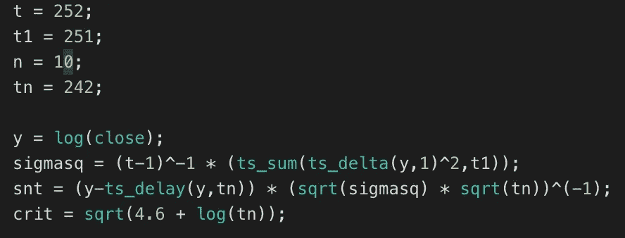
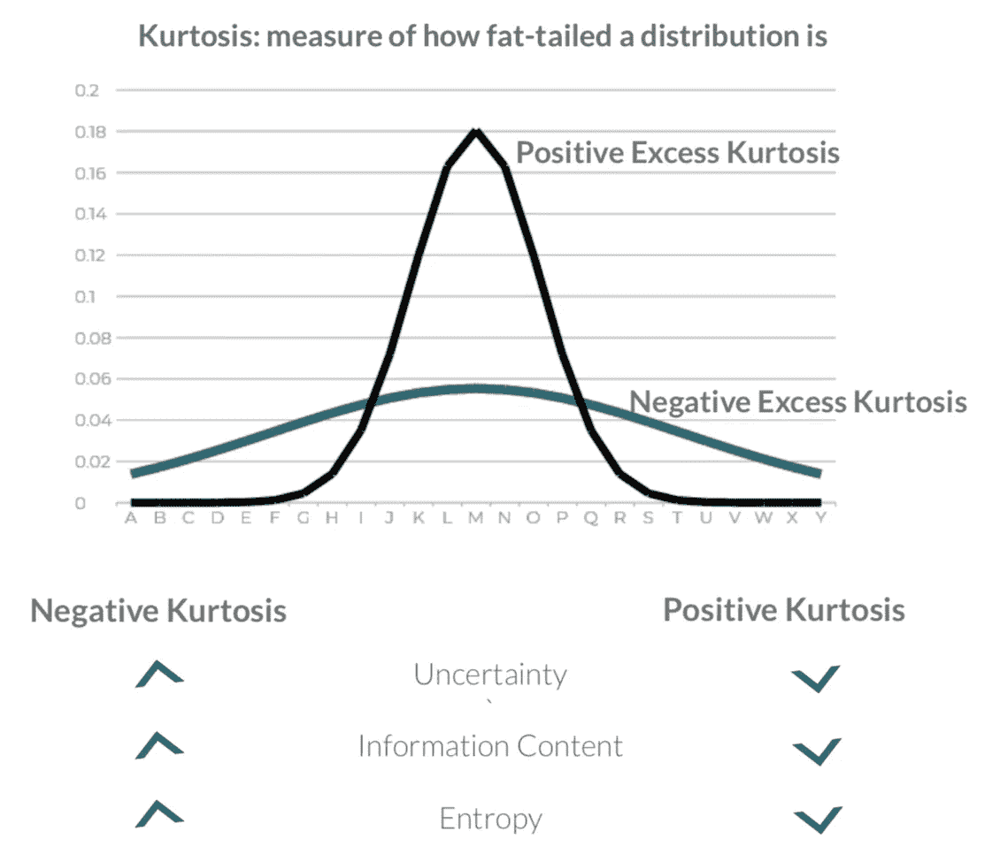
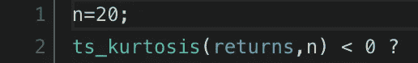

# 应用金融机器学习进展中的两个想法

> 原文：<https://towardsdatascience.com/applying-two-ideas-from-advances-in-financial-machine-learning-433c7950858a?source=collection_archive---------12----------------------->

## 寻找金融中的结构突变和测量熵

当我不调整我的足球博彩模式时，我会涉足金融。最近，我被这本[的书](https://www.oreilly.com/library/view/advances-in-financial/9781119482086/)《金融机器学习的进步》(AFML)迷住了——作者将学术严谨与实际执行相结合。这不是一个容易的阅读——我不得不重读几遍章节和参考文献，才能真正理解他在说什么，但这是非常值得的。

与此同时，我偶然发现了这个由 [WorldQuant](https://www.worldquant.com/home/) 发起的[在线交易挑战](https://websim.worldquantvrc.com)。起初，我感到不快，因为你必须用他们的专有语言而不是 Python 来编码，但当我使用这个平台时，我发现它非常容易掌握，并允许我专注于想法的产生和执行，而不用担心 Python 包和环境设置。

我将介绍 AFML 的两个特征提取思想，他讲述了如何使用结构突变和熵来提取特征。

**更新:**我的团队进入了新加坡的全国总决赛！在此处找到幻灯片中涵盖战略[的部分。](https://www.slideshare.net/neoyipeng/applying-two-ideas-from-advances-in-financial-machinelearning)

# 1.结构突变

当将机器学习应用于金融时，人们通常首先想到的是预测未来，通常是资产的未来价格。但是我们也可以用它来预测某些策略会更有效的情况。结构性断裂就是这样一个例子。

一个结构性的突变代表了一个制度的改变，意味着观察到的新价格不属于迄今为止价格序列的原始分布。破裂可能表明有气泡形成。在休息期间，会有意想不到的机会——市场参与者争相适应新的规范，因此某些策略可能会更有效。

我通过“累积和”测试计算结构突变，即测量跨越阈值的累积噪声，这意味着一个突变。Chu、Stinchcombe 和 White[1]描述了一种计算对数价格偏离的简单方法；我使用下面的 WorldQuant 平台实现了一个这样的迭代。

**snt**: Test Statistic; **crit**: Critical Value

# 2.使用峰度近似熵

熵最初用于热力学，作为不可逆热损失的量度[2]。信息论之父克劳德·香农(Claude Shannon)将这一概念应用于信息熵[3]，信息熵是一种基于概率的信息包含多少价值的量度——概率越低，信息含量越高，反之亦然。

那么这和市场有什么关系呢？一些人将市场效率与熵联系起来[4]，例如，当价格序列具有高熵时，它具有低冗余和高信息含量，因此不存在套利机会。在低熵或低效率时期，可能会形成泡沫。如果我们能测量价格序列的信息熵，我们就能创造出在高熵或低熵时期更有效的策略。

在我们测量熵之前，我们必须对我们的返回序列进行编码。我们使用收益序列而不是价格序列，是因为需要平稳性——《AFML》的作者着重强调了一个细微差别的价格序列以保持记忆——我很快就会尝试这种方法。

对 return 序列进行编码后，一个简单的方法是计算表示 price 序列所需的唯一位的数量，本质上是创建一个字典。熵也是压缩的一种度量，如果需要很多比特来解释一个价格序列，价格序列的熵就越高。

如果没有 Python 的灵活性，实际编码和计算熵是相当困难的，所以我在平台上使用峰度间接地实现了它。

峰度是对分布尾部有多厚的一种度量。峰度越高，越多的值以平均值为中心。如果我们对一只股票的价格序列进行编码，峰度较高的序列可能熵值较低。

Source: [outsmartingthemarkets.com](http://outsmartingthemarkets.com/uploads/1/2/3/6/123676209/afml_-_wqc.pptx.pdf)

请注意，下面的峰度公式测量的是超额峰度，因此如果您正在从头开始计算峰度，您将需要减去 3，这是一个正态分布的峰度。

with 2 lines of code, I can implement a kurtosis check over any time period!

现在你已经学会了从价格序列中提取特征的两种方法，你可以想出在结构突变或高/低熵时期有效的创造性策略。

你也读过《AFML》吗？你有什么想法可以让我的执行变得更好吗？或者你想看看书中的其他章节是如何执行的吗？请在下面的评论中告诉我。

# 参考

[1]朱家祥(1996)，斯廷奇科姆，赫伯特·怀特.[监测结构变化](http://links.jstor.org/sici?sici=0012-9682%28199609%2964%3A5%3C1045%3AMSC%3E2.0.CO%3B2-Z)。

[2]克劳修斯研究报告(1870 年)第十六卷。适用于热的一个力学定理。伦敦、爱丁堡和都柏林哲学杂志和科学杂志 40:122–127。DOI: 10.1080/147864470 08640370。

[3] Shannon CE (1948)一种数学理论的交流。贝尔系统技术杂志 27:379–423。DOI:10.1002/j . 1538–7305.1948 . TB 00917 . x

[4]古尔科，L. (1999 年)。熵市场假说。国际理论应用金融杂志，2，293–329。