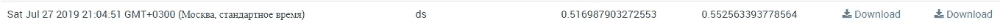
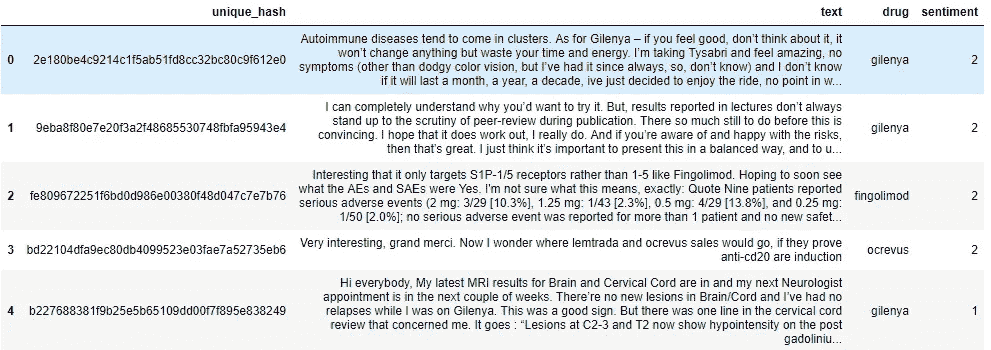
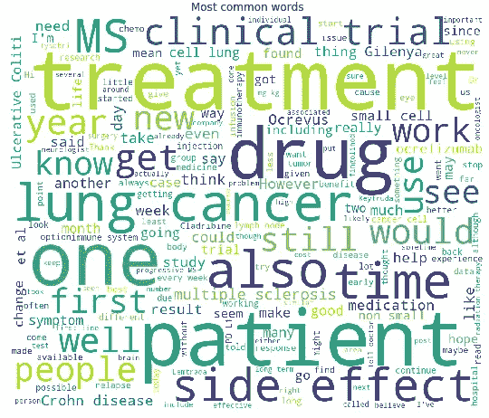
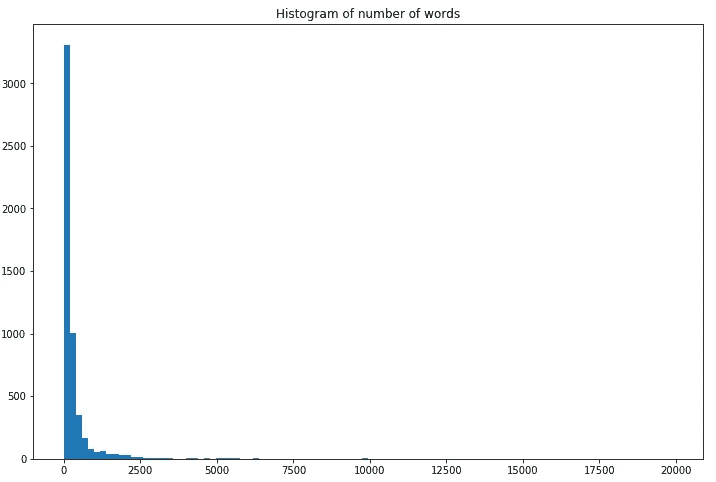
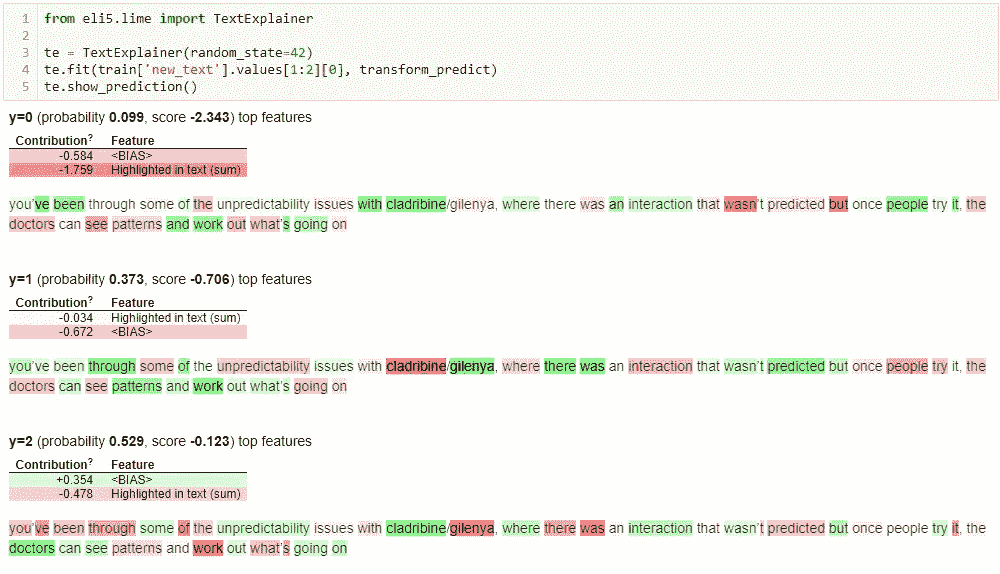

# 无需深度学习的小规模不平衡数据集情感分析方法

> 原文：<https://towardsdatascience.com/approaches-to-sentimental-analysis-on-a-small-imbalanced-dataset-without-deep-learning-a314817e687?source=collection_archive---------14----------------------->

## 让我们让 logreg 再次变得伟大！

# 介绍

现在有很多用于 NLP 的预训练网络，它们是 SOTA，并且击败了所有基准:BERT、XLNet、RoBERTa、ERNIE…它们被成功地应用于各种数据集，即使在数据很少的情况下。

在 7 月底(2019 年 7 月 23 日–2019 年 7 月 28 日),有一个关于分析 Vidhya 的小型在线黑客马拉松，他们让参与者对药物评论进行感性分析。这很复杂，原因有几个:

*   只有 5279 个样本在训练中，有 3 类(阴性、中性、阳性)不平衡；
*   一些标签似乎是不正确的，这种情况有时会发生在人工标注文本的时候；
*   有些课文很短，有些很长。在某些情况下，评论不仅包含评论本身，还包含人们回答的评论的引用；
*   另一个更有趣的问题是:一般来说，评论可能是积极的，但对一种药物有负面情绪(以及任何其他对情绪)；

一方面，如果情况复杂，需要对背景有深刻的理解，深度学习模型应该可以很好地工作；另一方面，我们只有几千个样本，这似乎不足以进行深度学习。

剧透:据我所知，winners 对 BERT 和 XLnet 进行了微调，但没有共享代码，具体的我就说不出来了。

我知道我不能在这个比赛上花太多时间，所以我决定尝试普通的方法(单词袋和逻辑回归)，看看他们能走多远。

排行榜可在此处获得(指标为 f1-macro):[https://data hack . analyticsvidhya . com/contest/innoplexus-online-hiring-hackathon/PVT _ lb](https://datahack.analyticsvidhya.com/contest/innoplexus-online-hiring-hackathon/pvt_lb)

我以 0.5274 的分数获得了第 21 名(第一名的分数为 0.6634)。我还提交了一份得分为 0.5525 的作品，这将使我获得第 12 名，但我没有选择它😞



# 数据概述

在任何项目的开始，我总是从 EDA 开始。所以我们来看看数据。我们有一些唯一的 id，评论的文本，药物的名称和情绪(1 是负面的，2 是中性的，0 是正面的)。



人们通常会写下他们的疾病、症状和药物。



训练和测试数据集中的药物有所重叠，但并不完全重叠，有些药物只出现在一个数据集中。

正如我在开始时所写的，大多数文本都很短，但也有一些很长的文本，可能是因为错误而出现在这里。



# 设置基线

写一个基线通常是一个好主意，它将在以后用作参考，并确保一切正常工作。

主要步骤如下:

*   处理数据，为建模做准备；
*   建立模型；
*   执行验证(可以与训练模型同时进行)；

基本的方法是跳过任何文本预处理，使用文本矢量器。我使用 NLTK 的 TweetTokenizer，因为它通常比默认的 sklearn tokenizer 更好。它可以提取表情符号和许多其他有用的令牌。而且使用 n 元单词比单词更好。

我们可以直接使用`sentiment`特征作为目标，因为它已经是数值，并且从 0 开始。

```
tokenizer = TweetTokenizer()
vectorizer = TfidfVectorizer(ngram_range=(1, 3), tokenizer=tokenizer.tokenize)
full_text = list(train['text'].values) + list(test['text'].values)
vectorizer.fit(full_text)
train_vectorized = vectorizer.transform(train['text'])
test_vectorized = vectorizer.transform(test['text'])
y = train['sentiment']
```

我们有一个多类分类问题。有两种主要的方法:为每个类或其他类建立二元分类器，或者为每对类建立二元分类器。我更喜欢第一种方法，并将它与逻辑回归一起使用。

```
logreg = LogisticRegression(class_weight='balanced')
ovr = OneVsRestClassifier(logreg)
```

现在有必要建立一种方法来检查我们模型的质量。我们可以简单地分割训练数据，一部分训练模型，另一部分检查质量。但是我更喜欢使用交叉验证。这样我们训练了 N 个模型，验证了 N 次，并且对模型的质量有了更好的度量。因此，我在我们的模型中使用了`cross_val_score`函数，使用了`f1_macro`指标，因此它将跟随排行榜分数，并定义简单的 3 倍分割。

```
scores = cross_val_score(ovr, train_vectorized, y, scoring='f1_macro', n_jobs=-1, cv=3)
print('Cross-validation mean f1_score {0:.2f}%, std {1:.2f}.'.format(np.mean(scores), np.std(scores)))
```

交叉验证的得分是 0.4580。现在我们可以对测试数据进行预测，生成提交文件并提交。

```
pred = ovr.predict_proba(test_vectorized)
sub['sentiment'] = pred.argmax(1)
sub.to_csv('sub.csv', index=False)
```

结果是 0.4499。这是一个好的开始，并且表明我们的验证方案足够好(具有相似的分数)。

## 改变超参数。第一步。

让我们努力提高分数。第一步是尝试改变预处理步骤。我使用带有 1-3 个 ngrams 和单词的`TfidfVectorizer`作为标记。有许多可能的方法来处理文本数据:

*   干净的文本。这可能包括将缩写改为完整的单词，删除数字/标点符号/特殊符号，纠正拼写错误等等；
*   词汇化或词干化以减少独特单词的数量；
*   使用字母/符号作为标记(相对于使用单词)；
*   许多其他想法；

作为第一个实验，我将`TfidfVectorizer`参数改为`TfidfVectorizer(ngram_range=(1, 5), analyzer='char'`。这使我的交叉验证分数增加到 0.4849，并将公共排行榜上的分数提高到 0.4624。对于改变一行代码来说，这是一个很好的改进，是吗？

下一个想法:我们可以同时使用单词和字符标记！我们简单地连接矩阵:

```
vectorizer = TfidfVectorizer(ngram_range=(1, 3), tokenizer=tokenizer.tokenize, stop_words='english')
full_text = list(train['text'].values) + list(test['text'].values)
vectorizer.fit(full_text)
train_vectorized = vectorizer.transform(train['text'])
test_vectorized = vectorizer.transform(test['text'])vectorizer1 = TfidfVectorizer(ngram_range=(1, 5), analyzer='char')
full_text = list(train['text'].values) + list(test['text'].values)
vectorizer1.fit(full_text)
train_vectorized1 = vectorizer1.transform(train['text'])
test_vectorized1 = vectorizer1.transform(test['text'])train_matrix = hstack((train_vectorized, train_vectorized1))
test_matrix = hstack((test_vectorized, test_vectorized1))
```

这给了我 0.4930 的交叉验证分数和 0.4820 的排行榜。

## 使用文本

正如我在开头所写的——课文包含了大量的信息，但并不是所有的信息都是有用的。人们可以引用其他文本，写长篇故事，比较几种药物等等。

几次尝试之后，我做了以下事情:

```
train['new_text'] = train.apply(lambda row: ' '.join([i for i in row.text.lower().split('.') if row.drug in i]), axis=1)
```

现在我们有了新的文本，其中只包含提到相关药物的句子。在此之后，我调整了超参数，并以这个矢量器结束:

```
TfidfVectorizer(ngram_range=(1, 3),  max_df=0.75, min_df=10, sublinear_tf=True)
```

这在交叉验证中得到 0.5206 分，在公共排行榜中得到 0.5279 分。是我选择的提交让我在排行榜上获得了第 21 名。

## 模型口译

了解模型预测的内容和方式通常是一个好主意，这可以带来一些见解，从而改进我们的模型。

[ELI5](https://eli5.readthedocs.io/en/latest/overview.html) 可以这样解释我们的模型并显示预测:



红色单词意味着这个单词减少了这个类的概率，绿色单词增加了这个类的概率。

**一个更好的解决方案**

我尝试了很多东西来提高分数:不同的模型(像 SGD)，超参数优化，文本清洗，欠采样，半监督学习和其他东西。让我们看看我的最佳解决方案是如何创建的。

*   更好的文本预处理

清理文本对我不起作用，但我能够改进我缩短文本的方法。现在我不仅用提到药物的那句话，还用下一句话——我觉得人们第一次提到药物后，一般会写点别的。我也只取前 10 个句子:大部分文本都在这个范围内，但也有一些巨大的文本，这会使训练变得更糟。

```
def get_text(row):
    splitted_text = row.text.lower().split('.')
    indices = [splitted_text.index(j) for j in [i for i in splitted_text if row.drug in i]]
    full_indices = []
    for i in indices:
        full_indices.append(i)
        if i < len(splitted_text) -1:
            full_indices.append(i + 1)
    full_indices = list(set(full_indices))
    full_text = []
    for i in full_indices:
        full_text.append(splitted_text[i])
    return ' '.join(full_text[-10:])
```

*   超参数优化

超参数优化总是很重要。Sklearn API 允许使用方便的语法构建管道并优化它们:

```
combined_features = FeatureUnion([('tfidf', TfidfVectorizer(ngram_range=(1, 3))),
                                  ('tfidf_char', TfidfVectorizer(ngram_range=(1, 3), analyzer='char'))])
pipeline = Pipeline([("features", combined_features),
                     ('clf', OneVsRestClassifier(LogisticRegression(class_weight='balanced')))])parameters = {
    'features__tfidf__max_df': (0.3, 0.75),
    'features__tfidf_char__max_df': (0.3, 0.75),    
    'clf__estimator__C': (1.0, 10.0)
}
grid_search = GridSearchCV(pipeline, parameters, cv=folds,
                               n_jobs=-1, verbose=1, scoring='f1_macro')
grid_search.fit(train['new_text'], train['sentiment'])
```

这样，我们可以优化两个矢量器和“OneVsRestClassifier”中的逻辑回归模型的参数。

*   欠采样

我已经决定，可能是阶级不平衡太严重了，应该对此采取一些措施。有许多方法可以处理它:欠采样，过采样，SMOTE，改变类不平衡。你可以注意到我使用了平衡类权重的逻辑回归，但是这还不够。经过几次尝试，我决定做一个简单的欠采样，随机抽取 2000 个中性类样本。

*   半监督学习

这个想法很简单:在我们训练了我们的模型之后，它应该给出很好的预测(嗯，至少我们希望如此:)，大多数有信心的预测应该是正确的，或者至少是大部分正确的。我选取了 1000 个最佳预测，并将它们添加到训练数据集中。在增加的数据集上训练了一个新模型后，我在公开排行榜上得到了 0.5169。这个提交在私人排行榜上的价值是 0.5525，但我没有足够的信任去选择它。

# 结论

一方面，使用更传统的 ML 方法可能获得高结果，另一方面，现在这些方法不足以击败使用预训练模型的深度学习。这是否意味着更简单的模型没有用武之地？我认为，有时在商业中使用逻辑回归可能是合理的:它建立起来更快，更容易解释，需要的资源更少。然而，从长远来看，使用深度学习是一种成功的方式。