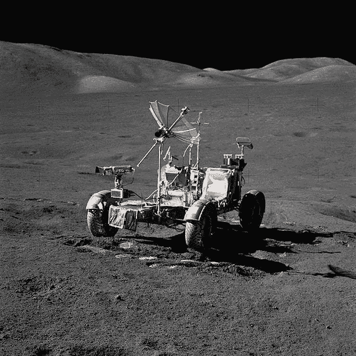
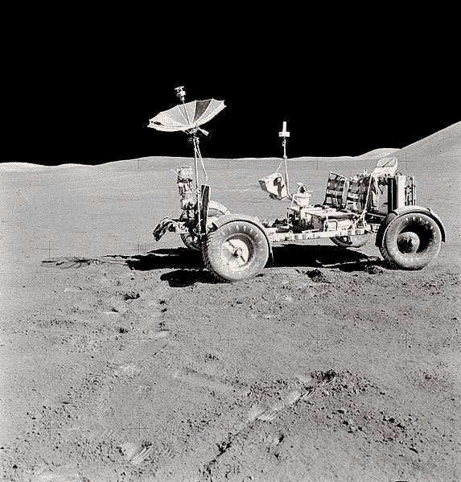
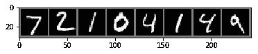
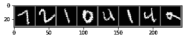
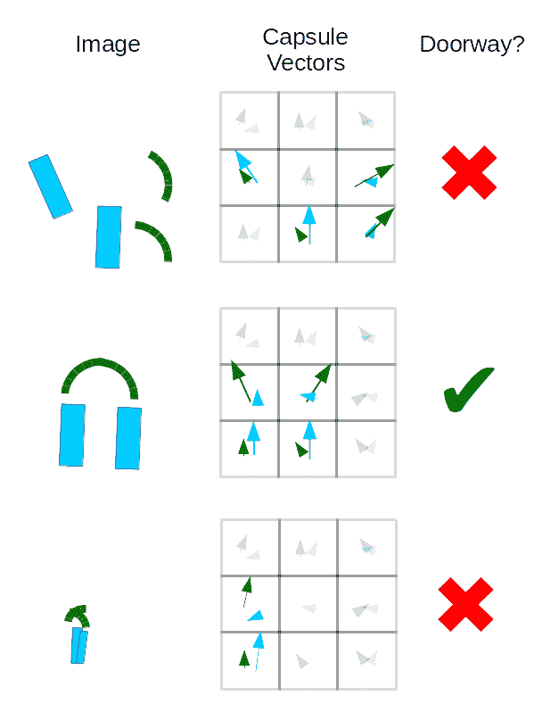

# 用 Hinton 胶囊网络探讨等方差问题

> 原文：<https://towardsdatascience.com/approaching-the-problem-of-equivariance-with-hintons-capsule-networks-b7f06b2abc57?source=collection_archive---------23----------------------->

看看这个:



现在看这个:



即使你从未去过月球，你也可能认出上面图像的主体是美国宇航局的[月球漫游车](https://en.wikipedia.org/wiki/Lunar_Roving_Vehicle)，或者至少是同一辆车在稍微不同的方向上的两个实例。您可能有一个直观的想法，知道如何操纵一个图像的视点来近似另一个图像的视图。这种认知转换对人类来说是毫不费力的直觉，但对于没有明确训练示例的卷积神经网络来说却非常困难。

# 卷积和最大池层的限制

标准的卷积神经网络，顾名思义，是由一系列的卷积运算组成的，这些卷积运算分层次地提取图像特征，如边缘、点和角。每个卷积将图像乘以像素权重的滑动窗口，也称为卷积核，每层中可能有几十到几千个核。通常，我们在每个卷积之间执行合并操作，降低图像维度。池化不仅减小了层的大小(节省了内存)，而且提供了一些平移不变性，使得给定的网络可以对图像主题进行分类，而不管它位于图像中的什么位置。然而，这与其说是一个功能，不如说是一个缺陷，因为池化操作混淆了关于图像中某个位置的信息(推动了 [U-nets](https://blog.exxactcorp.com/atrous-convolutions-u-net-architectures-for-deep-learning-a-brief-history/) 中 skip 连接的开发)，并且除了翻译之外，在处理图像转换方面表现不佳。

具有汇集的 conv 网络中的翻译不变性缺乏对象转换等价性，这是一种更一般化的认知能力，似乎更接近于我们自己理解世界的方法。事实上，conv 网在各种各样的计算机视觉任务中表现相当好，这掩盖了这个缺点。考虑 MNIST 手写数字数据集的经典例子。按照今天的标准，LeNet-5 是一个相对较浅和简单的 conv 网络设计，它很快学会正确识别测试数据集中 98%的数字。



```
Test predicted: seven two one zero four one four nine Test groundTruth: seven two one zero four one four nine Accuracy of the network on the 10000 test images: 98.68 %
```

然而，对测试图像进行简单的 35 度旋转，测试性能会急剧下降。



```
Test predicted: four two one zero four one four two Test groundTruth: seven two one zero four one four nine LeNet 5 accuracy on 10000 (rotated) test images: 76.05 %
```

所谓的“胶囊网络”在处理旋转数据方面做得更好:

```
Test predicted: nine zero one two three four five six Test groundTruth: seven two one zero four one four nine Accuracy of the network on the 10000 (rotated) test images: 84.09 %
```

缓解该问题的标准方法是数据扩充，即添加旋转、镜像、扭曲等。综合放大数据集以覆盖可能的示例的更大分布。这提高了给定视觉任务的性能，但它显然是一个杂牌，正如他们所说的“智力上不令人满意”

多年来 [Geoffrey Hinton](https://en.wikipedia.org/wiki/Geoffrey_Hinton) 一直直言不讳地表示他不喜欢汇集操作，并一直试图用一种更普遍的等方差来取代汇集的偶然平移不变性，他称之为“胶囊”，这是一种通过将卷积提取的特征重塑为多维向量来创建的场景内容的表示。胶囊网络的概念随着 conv 网络的兴起而发展，如[将自动编码器(2011)](http://www.cs.toronto.edu/~fritz/absps/transauto6.pdf) 转变为[用于训练胶囊的动态路由方法(2017)](https://arxiv.org/pdf/1710.09829.pdf) ，以及最近更新的称为[期望最大化(2018)](https://openreview.net/pdf?id=HJWLfGWRb) 的训练算法。

# 胶囊来拯救？

在胶囊网络中，每个向量学习表示图像的某些方面，例如形状图元，向量长度对应于对象在给定点存在的概率，向量的方向描述对象的特征。在 2017 年的实现中，第一层胶囊每个都试图通过动态路由来预测下一层胶囊的正确概率(例如，在人脸检测 CapsNet 中，“眼睛”和“鼻子”胶囊值将各自对下一层中每个点的“人脸”胶囊的预测有贡献)。考虑 2D 胶囊向量检测构成卡通门口的多边形的简化示例。这些胶囊代表两种形状(方块和四分之一圆)的存在和方向，它们将一起尝试预测下一个胶囊层中的正确分类，该胶囊层学习检测正确定向的门口。



而在 conv 网中，仅仅正确特征的存在(在训练数据中表示的方向上)就足以触发分类，而不管它们彼此之间的空间关系，胶囊向量都必须非常一致，以从其部分预测整体。我们还应该注意到*胶囊一次只能检测给定对象的一个实例*，因此一堆块将无法区分，并且 CapsNet 模型可能会因同一类型的重叠部分而混淆。这个缺点经常被比作人类感知中的[拥挤](https://en.wikipedia.org/wiki/Crowding)。

# 教程部分:针对旋转 MNIST 分类，训练和测试 LeNet5 与动态路由 CapsNet

比谈论胶囊更好的是修补它们。为了简单起见，我们将使用流行的 [MNIST 手写数字数据集。](https://en.wikipedia.org/wiki/MNIST_database)本节中的代码为在 5 层 LeNet5 conv 网络中熟悉的数据集和机器学习模型的上下文中理解 CapsNets 提供了可破解的基础。在对 CapsNet 在 MNIST 的表现有了一个大致的了解之后，我们建议增加不同的训练数据扩充例程，以了解每个模型在学习各种转换方面的表现。

首先，我们将使用 PyTorch 的转换库定义我们想要处理的数据集和我们需要的预处理。

```
import torch import torchvision import torchvision.transforms as transforms import numpy as np import matplotlib.pyplot as plt import time import torch.nn as nn import torch.nn.functional as F import torch.optim as optim #Download dataset (if necessary) and define test set transformation batch_size = 8 degrees= 15 transform_normal = transforms.Compose([torchvision.transforms.RandomAffine(0, translate=(0.0714,0.0714)),\ transforms.ToTensor(),\ transforms.Normalize((0.5, 0.5, 0.5), (0.5, 0.5, 0.5))]) transform_rotate = transforms.Compose([torchvision.transforms.RandomRotation([degrees,degrees+1e-7],\ resample=False,\ expand=False, center=None),\ transforms.ToTensor(),\ transforms.Normalize((0.5, 0.5, 0.5), (0.5, 0.5, 0.5))]) train = torchvision.datasets.MNIST(root='./data', train=True,download=True,transform=transform_normal) test = torchvision.datasets.MNIST(root='./data', train=False,download=True,transform=transform_rotate) test_norot = torchvision.datasets.MNIST(root='./data', train=False,download=True,transform=transform_normal) #Data iterator definitions train_loader = torch.utils.data.DataLoader(train, batch_size=batch_size,shuffle=True) test_loader = torch.utils.data.DataLoader(test, batch_size=batch_size,shuffle=False) test_loader_norot = torch.utils.data.DataLoader(test_norot, batch_size=batch_size,shuffle=False) #Define class labels classes = ("zero", "one", "two", "three", "four", "five", "six", "seven", "eight", "nine", "ten")
```

# 定义我们的 CNN: LeNet5

我们将从在 PyTorch 中实现一个名为 LeNet5 的小型卷积神经网络开始。该模型仅在几个训练时期后就为我们提供了 90%以上的测试集准确度，并且仅由 2 个卷积层和 3 个全连接层组成。

```
#define LeNet5 Conv-net architecture class lenet5(nn.Module): def __init__(self): super(lenet5, self).__init__() in_channels = 1 conv0_channels = 6 conv1_channels = 16 kernel_size = 5 pool_size = 2 pool_stride = 2 h_in = 256 h2 = 120 h3 = 84 classes = 10 self.conv0 = nn.Conv2d(in_channels, conv0_channels, kernel_size) self.pool = nn.AvgPool2d(pool_size, pool_stride) self.conv1 = nn.Conv2d(conv0_channels, conv1_channels, kernel_size) self.fc2 = nn.Linear(h_in, h2) self.fc3 = nn.Linear(h2, h3) self.fc4 = nn.Linear(h3, classes) def forward(self, x): h_in = 256 x = self.pool(F.relu(self.conv0(x))) x = self.pool(F.relu(self.conv1(x))) x = x.view(-1, h_in) x = F.relu(self.fc2(x)) x = F.relu(self.fc3(x)) x = self.fc4(x) return x def imshow(img,my_string=None): #Helper function for visualizing digits img = img / 2 + 0.5 # unnormalize npimg = img.numpy() plt.imshow(np.transpose(npimg, (1, 2, 0))) if(my_string is not None): plt.title(my_string) plt.show()
```

# LeNet5 的培训和测试程序

我们将使用 [Adam 优化](https://arxiv.org/abs/1412.6980)来最小化训练期间的交叉熵误差。同样，可以通过 PyTorch 轻松访问该功能。

```
def train_lenet5(lenet5,learning_rate=1e-4, epochs=10, try_cuda=True): t0 = time.time() if (try_cuda): if torch.cuda.is_available(): device = torch.device("cuda") else: device = torch.device("cpu") #Define training criterion and optimizer criterion = nn.CrossEntropyLoss() optimizer = optim.Adam(lenet5.parameters(), lr=learning_rate) #Send model to GPU if desired lenet5 = lenet5.to(device) for epoch in range(epochs): # loop over the dataset multiple times running_loss = 0.0 for i, data in enumerate(train_loader, 0): #get inputs inputs, labels = data inputs = inputs.to(device) labels = labels.to(device) #zero the parameter gradients optimizer.zero_grad() #forward pass + back-propagation + update parameters outputs = lenet5(inputs) loss = criterion(outputs, labels) loss.backward() optimizer.step() #print statistics running_loss += loss.item() if i % 2000 == 1999: # print every 2000 mini-batches print('[%d, %5d] loss: %.3f' % (epoch + 1, i + 1, running_loss / 2000)) running_loss = 0.0 print("Finished training for %i epochs on device %s took %.2f seconds"%(epochs,device,time.time()-t0)) def test_lenet5(lenet5): #We'll test on the cpu lenet5.to(torch.device("cpu")) #Get training set performance dataiter = iter(train_loader) images, labels = dataiter.next() #print images imshow(torchvision.utils.make_grid(images),"Training Example") pred_prob = lenet5(images) _, predicted = torch.max(pred_prob, 1) #report labels print('Predicted: ', ' '.join('%5s' % classes[predicted[j]] for j in range(batch_size))) print('GroundTruth: ', ' '.join('%5s' % classes[labels[j]] for j in range(batch_size))) #calculate accuracy correct = 0 total = 0 with torch.no_grad(): for data in test_loader_norot: images, labels = data outputs = lenet5(images) _, predicted = torch.max(outputs.data, 1) total += labels.size(0) correct += (predicted == labels).sum().item() print("LeNet 5 accuracy on (unrotated) training images: %.2f %%" % (100 * correct / total)) dataiter = iter(test_loader_norot) images, labels = dataiter.next() #print images imshow(torchvision.utils.make_grid(images),"Unrotated Test Data") #get probabilities and predictions pred_prob = lenet5(images) _, predicted = torch.max(pred_prob, 1) print('Test predicted: ', ' '.join('%5s' % classes[predicted[j]] for j in range(batch_size))) print('Test groundTruth: ', ' '.join('%5s' % classes[labels[j]] for j in range(batch_size))) correct = 0 total = 0 with torch.no_grad(): for data in test_loader_norot: images, labels = data outputs = lenet5(images) _, predicted = torch.max(outputs.data, 1) total += labels.size(0) correct += (predicted == labels).sum().item() print("LeNet 5 accuracy on 10000 (unrotated) test images: %.2f %%" % (100 * correct / total)) #test with rotation dataiter = iter(test_loader) images, labels = dataiter.next() #print images imshow(torchvision.utils.make_grid(images),"Rotated Test Data") pred_prob = lenet5(images) _, predicted = torch.max(pred_prob, 1) print("Test predicted: ", " ".join("%5s" % classes[predicted[j]] for j in range(batch_size))) print("Test groundTruth: ", " ".join("%5s" % classes[labels[j]] for j in range(batch_size))) correct = 0 total = 0 with torch.no_grad(): for data in test_loader: images, labels = data outputs = lenet5(images) _, predicted = torch.max(outputs.data, 1) total += labels.size(0) correct += (predicted == labels).sum().item() print("LeNet 5 accuracy on 10000 (rotated) test images: %.2f %%" % (100 * correct / total)) lenet5_model = lenet5() pre_trained = True # Change this flag to train from scratch if(pre_trained): lenet5_model.load_state_dict(torch.load("./lenet5_trained.pt")) else: #liy: learn-it-yourself pass print("LeNet5 Parameters: \n",lenet5) train_lenet5(lenet5_model,epochs=1) test_lenet5(lenet5_model) #save the model parameters #torch.save(lenet5_model.state_dict(), "./lenet5_trained.pt")#output [1, 2000] loss: 1.135 [1, 4000] loss: 0.521 ... [14, 6000] loss: 0.051
```

用于训练胶囊网络的动态路由算法在计算上比 conv 网要求更高。如果我们想在合理的时间内完成，我们肯定会想在 GPU 上训练。我们还为那些目前处于 GPU 之间或只想跳过测试的人预先培训了一个 CapsNet。为了训练和测试一个胶囊网络，我们分叉并修改了岩崎健太在 https://github.com/gram-ai/capsule-networks[的实现。通过输入(在命令行中)克隆本教程中使用的版本:](https://github.com/gram-ai/capsule-networks)

```
git clone [https://github.com/theScinder/capsule_networks_rotated_MNIST.git](https://github.com/theScinder/capsule_networks_rotated_MNIST.git)
```

之后，您可能希望启动 PyTorch visdom 服务器以实现可视化，方法是输入(在单独的命令行窗口中):

```
python -m visdom.server
```

最后，您可以通过在交互式 python 会话(仍在 capsule_networks_rotated_MNIST 目录中)中输入以下代码来训练和测试 CapsNet，或者将其保存为. py 文件以供使用，并通过命令行运行:

```
python run_capsnet.py
```

其中 run_capsnet.py 是新保存的脚本文件的名称。

```
from capsule_network import * from torch.autograd import Variable #change these parameters to train from scratch num_epochs = 0 load_model = True train_and_test_capsnet()#output #parameters: 8215570 WARNING:root:Setting up a new session... time to train CapsNet for 0 epochs = 0.04 seconds Test predicted: seven two one zero four one four nine Test groundTruth: seven two one zero four one four nine Accuracy of the network on the 10000 (unrotated) test images: 99.37 % Test predicted: nine zero one two three four five six Test groundTruth: seven two one zero four one four nine Accuracy of the network on the 10000 (rotated) test images: 92.12 %
```

# 结论

胶囊网络提供了卷积神经网络的通用特征提取属性的扩展。通过训练每个初级胶囊来预测下一层胶囊的输出，可以鼓励模型学习识别部分、整体之间的关系以及它们的实例化特征(例如位置和方向)的重要性。在许多方面，这感觉像是识别场景中的对象的更自然的方式，因为方向和其他属性可以作为由胶囊表示的场景对象的参数来学习，并且修改特征可以给我们视点、比例等方面的真实变化。相比之下，卷积激活开始看起来像一个非常粗糙的特征表示。

然而，用于训练的动态路由算法可能非常慢(一个历元可能需要超过 5 分钟，而在相同硬件上 LeNet5 需要 25 秒)，并且在实践中，它可能需要一点选择性表示(也称为挑选),以找到顶点网明显优于可比 conv 网的情况。使用 LeNet5 这样的简单 conv 网，数据扩充可以在训练和(旋转)测试 MNIST 数据集上产生超过 98%的准确性，并且基于所需的训练时间而不是模型大小来比较 CapsNets 和 conv 网可能更公平。总的来说，98%和 99%以上的准确率之间的差别可能看起来不大，但就解决问题而言，最重要的是最后几个百分点的误差，而不是学习一种近似的启发式方法。

培训顶网仍有很大的改进空间，高度的兴趣确保他们将得到大量的开发工作。我们很可能会看到顶网以类似于 conv 网的方式获得效用，首先在玩具问题上展示，如 MNIST，然后应用于更相关的领域。caps net 肯定会产生令人兴奋的结果，这是更快的硬件加速器和更好的训练算法/软件库的结合，使“深度 caps net”成为现实。

*从* [*获取的公开领域月球漫游车图片(NASA 生成)https://commons . wikimedia . org/wiki/File:Apollo _ 15 _ Lunar _ Rover _ final _ resting _ place . jpg*](https://commons.wikimedia.org/wiki/Category:Lunar_Roving_Vehicle#/media/File:Apollo_17_lunar_rover_near_station_8_AS17-146-22367HR.jpg)*和*[*https://commons . wikimedia . org/wiki/Category:Lunar _ Roving _ Vehicle #/media/File:Apollo _ 17 _ Lunar _ Rover _ near _ station _ 8 _ AS17-146 艾:*](https://commons.wikimedia.org/wiki/Category:Lunar_Roving_Vehicle#/media/File:Apollo_17_lunar_rover_near_station_8_AS17-146-22367HR.jpg)[](https://github.com/gram-ai/capsule-networks)

**原载于 2019 年 5 月 8 日 https://blog.exxactcorp.com**T21*[。](https://blog.exxactcorp.com/equivariance-and-hintons-capsule-networks/)*