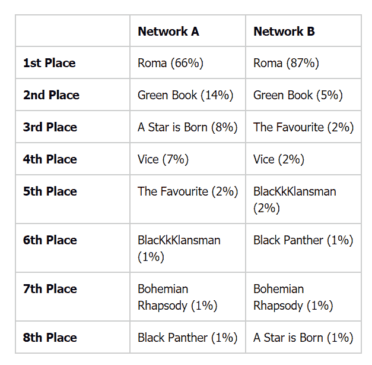

# 使用神经网络逼近 2019 年奥斯卡投票者的想法

> 原文：<https://towardsdatascience.com/approximating-the-minds-of-2019-oscars-voters-using-neural-networks-b922f3d6864c?source=collection_archive---------15----------------------->

Credit: Disney | ABC Television Group

# 介绍

提名公布后的一个月里，各大娱乐新闻媒体纷纷发表文章，证明预测奥斯卡奖得主是一项强迫性的运动。我从来没有密切关注过任何颁奖仪式，我一直以为每个被提名者都以大致相等的几率进入这场迷人的混战，而客观上最好的那个类别将获得胜利。不是这样的！事实证明，任何数量的因素都可以影响投票者，可以说，其中大多数因素都可以量化，并由神经网络来消耗。这些因素中的一些是工艺协会奖的获得者，但今年的奥斯卡奖之所以如此有趣，是因为有史以来第一次，他们都选择了授予不同的电影。

简单地说，神经网络是一种机器学习技术，旨在通过获取输入并判断它们的相对重要性来估计一条信息(或输出)，从而模仿人脑。以这种方式解决问题背后的理念是，每个问题的某些因素更重要。例如，如果你试图评估一个人是否患有糖尿病，那么他的身体质量指数将是一个比他的年薪更重要的因素。通过在已知输出的大数据集上训练网络，可以确定输入的重要性或权重。下面，我提出了一种利用神经网络预测奥斯卡最佳影片的方法。

# 放弃

截至 2017 年，该学院拥有 6687 名行业专业人士(根据维基百科)，他们都对今年的“最佳影片”提名有无数的个人意见。因此，不可能 100%肯定地说今年的 8 位提名者中哪一位会把桂冠带回家…所以请不要在我预测的这部电影上下注！

# 收集数据

当然，第一个问题是，有什么样的迹象表明一部电影可以赢得奥斯卡最佳影片奖？幸运的是，我在帝国在线找到了一篇名为[【如何预测奥斯卡奖】](https://www.empireonline.com/movies/features/predict-oscars/)的文章，这篇文章是好心人提供的。它规定，一部电影要赢得“最佳影片”，需要具备以下条件:

1.  这部电影的导演至少需要获得“最佳导演”提名，奥斯卡奖历史上只有四部电影无视这一规则。
2.  这部电影需要获得“最佳改编剧本”或“最佳原创剧本”提名。
3.  美国演员工会(SAG)与奥斯卡投票者有很大的交集。与“最佳影片”相对应的奖项是“演员在电影中的杰出表现”奖(也被称为“演员工会奖”)，根据《帝国》的说法，获得提名对于赢得“最佳影片”来说(几乎)是至关重要的。我说差不多……去年的获奖者*水的形状*没有获得这个奖项的提名。
4.  无论是动画还是外国电影都没有获得过“最佳影片”。这对今年(以及神经网络)有着有趣的影响！)作为墨西哥电影《T2 罗马》(T3)，T4 被广泛认为是领跑者(T5)。
5.  一部获得 SAG ensemble 奖、美国制片人协会“杰出制片人奖”和美国导演协会“故事片杰出导演奖”的电影可以有把握地获得“最佳影片”(有几个明显的例外)。

这篇文章中另一个有趣的地方是上述每一种预测奥斯卡最佳影片的成功率。影评人选择奖以 60%的准确率领先(然而，他们只是从 1996 年开始运行，所以样本量较低)，其次是英国电影电视艺术学院奖的 55%，美国演员工会奖的 50%和金球奖“最佳电影-戏剧”类别的 45%。值得注意的是，金球奖还颁发了一个名为“最佳音乐/喜剧电影”的奖项。《帝国》没有报道这个奖项的成功率。然而，根据维基百科，该奖项(或 1958 年至 1962 年间短暂脱钩的奖项之一)的 12 名获奖者在 72 个奖项中获得了“最佳影片”，命中率为 17%。因此，我打算在预测奥斯卡将颁发“最佳影片”方面胜过广播电影评论家协会的优秀成员——他们颁发了评论家选择奖。

在这篇文章中，我将训练两个神经网络。网络 A 将排除美国制片人协会奖(est。美国演员工会奖(美国东部时间 1989 年)1995)和评论家选择奖(est。1996)并且网络 B 将包括它们。这是因为他们作为一个整体只有 22 年的数据，而奥斯卡、英国电影电视艺术学院、金球奖和美国导演协会(Directors' Guild of America)都是从(至少)1948 年开始颁奖的，这大约会使数据点的数量增加一倍。

# 训练网络

做出这样的预测似乎是一个分类问题，有两种可能的结果——最佳影片奖，或者不是。然而，这并没有考虑到在一组精选的数据中只选出一个获胜者的限制，或者实际上的“被提名者”。因此，我认为这可以被视为一个回归问题，其中输出是一个连续变量，它转化为电影是“最佳影片”赢家的概率。然后，我们可以在一组被提名者中做出决定性的选择，选出可能性最大的一个。

前馈网络是第一种神经网络，简而言之，它是节点(或神经元)的有向图，首先接受输入，其中之一可能是“一部电影有多少项提名？”。然后，它将这些输入传递给网络隐藏层中的神经元，这些神经元应用一个激活函数，试图确定每个输入的重要性。最后计算输出值，例如这部电影有 0.2 的机会赢得“最佳影片”。我们可以通过计算网络输出和我们知道的输出之间的差异来衡量网络的成功。使用训练函数来执行训练，目的是最小化预测中的误差，并且尽可能快地训练网络。

为具有特定层数、神经元和最佳训练函数的网络选择一种架构并不是一门精确的科学。选择架构有几种不同的方法，这取决于您的问题有多严重。例如，如果您试图使用神经网络(如引言中所述)来诊断糖尿病，那么您可能希望仔细选择(可能使用遗传算法)一种具有高准确性和诊断糖尿病倾向的架构，而不是让潜在的患者在未诊断的情况下漏网。我的问题绝不是关键问题，所以我选择架构的方法将是不同技术组合的基本网格搜索。

# 网络 A

在选择训练数据方面，我决定从 1951 年开始，这是第一年颁发金球奖最佳音乐或喜剧电影奖。这给了我从那时到 2015 年的 65 个数据点，不包括独立验证的两年数据。注意，我对网络 A 使用了 12 个输入，如下所示:英国电影电视艺术学院奖“最佳影片”；获得金球奖最佳喜剧/音乐剧提名或奖项；金球奖最佳剧情类电影提名或获奖；这部电影获得的奥斯卡提名总数；奥斯卡最佳导演提名；这部电影的电影剧本获得奥斯卡提名；不管是动画还是外国电影；和美国导演协会奖或提名“故事片杰出导演奖”。

我首先尝试分离出这个问题的最佳训练函数，为此，我创建了许多具有不同训练函数的网络，并控制隐藏层数量(1)和神经元数量(10)的常量变量。然后我每个人训练五次，取他们表现的平均值。我选择多次训练网络，每次训练在优化前使用不同的权重和偏差进行初始化，这意味着每次训练网络都可能得到更好或更差的结果。通过取每次训练表现的平均结果，我可以为这个特定的问题建立最佳的训练函数。对于这个数据集，具有动量训练函数的梯度下降是最佳的。

接下来，我尝试了不同的层数和神经元数的组合。杰夫·希顿在他写的《*Java 神经网络导论*》中规定，一个神经网络只需一个隐层，输入层(12)和输出层(1)神经元的平均值就可以达到很好的性能。我决定对层的集合{1，2}和神经元的集合{1，3，6，10，12}进行采样，总共十个组合。因此，举例来说，对(2，6)将有两个隐藏层，每个层有六个神经元。我再次对每个不同的网络进行了五次训练，以找到最佳的层/神经元组合，令我颇为不安的是，结果是一个隐藏层有十个神经元——这是我建立最佳训练函数的原始控制变量。真是搪塞！

所以我为这个问题建立了最好的神经网络结构:一个隐藏层；十个神经元；和具有动量训练功能的梯度下降。这种架构在测试集上实现了 79.9%的准确率，在验证集上实现了 78.4%的准确率，总体平均准确率为 79.2%…比评论家选择奖好得多！

# 网络 B

由于这个网络中考虑的三个颁奖仪式的时间都不长，我只能使用 1996 年以来的数据，这给了我 20 个数据点——比以前少得多。要注意的是，我使用了 18 个输入，这些输入与上面列出的输入完全相同，但增加了以下六个:演员工会提名或“电影演员的杰出表现”奖，评论家选择提名或“最佳影片”奖，以及美国制片人工会提名或“杰出制片人”奖。

为了节省时间，并且考虑到训练数据与网络 A 的输入数据共享三分之二的输入数据，我决定仅使用之前的数据集测试我的前三个架构。这实现了以下目标:

1.  一个隐藏层；十个神经元，GDM——准确率 65.2%
2.  两个隐藏层；十二个神经元，GDM——49%的准确率
3.  三个隐藏层；十个神经元，GDM——58.7%的准确率

因此，再一次，具有 10 个神经元的单个隐藏层是最佳架构，尽管对于这样一个 20 点的精简数据集，我相信结果比更大的数据集更不稳定。例如，在训练时，我两次看到验证集只有目标输出为 0 的数据点，换句话说，它没有“最佳图片”获胜者的数据。因此，我将更加怀疑网络 B 产生的结果。

# 独立验证

我为自己保留了两年的数据，以独立验证这些网络是否达到了上述精度。对 2016 年和 2017 年最佳影片奖的预测如下表所示:

关键:粗体显示最有可能的赢家，斜体显示第二有可能的赢家

我认为，从这一独立的核查工作中可以得出一些有趣的结论。首先，尽管第二个网络有一半的数据点和六个额外的输入，但在这里似乎网络的估计并没有太大的不同。有趣的是，虽然网络 A 比网络 B 更有信心预测错误的赢家(*啦啦地*)，但它也更有信心预测第二可能的赢家(*月光*)，即最终的赢家。两个网络都正确地确定了 2017 年的获胜者，网络 B 在确定性方面领先于网络 A。最后一点很简单，和 2016 年一样，奥斯卡有时会忽略统计风吹来的方式，给自己最喜欢的电影颁奖！毕竟，如果你知道谁会是赢家，那就没什么看头了。也就是说，我仍然会尝试预测赢家。

# 今年的冠军将会是…

*罗马*！

根据这两个神经网络, *Roma* 已经克服了前进道路上的障碍(这是奥斯卡奖历史上第十部获得“最佳影片”提名的外语片，此前没有获奖),摘得概率桂冠。他们也同意第二大可能的赢家，绿皮书。接下来还会有更多的差异，这可能会引发人们对美国演员工会奖等新设立奖项的影响的质疑。但现在，我屏住呼吸等待，直到 2 月 24 日，看看我是否正确…

任何想进一步了解我是如何得出这些结论的人，都可以查看我的 GitHub 库，里面包含了我所有的资源和脚本。我为此使用的网络训练工具是 MATLAB 的[深度学习工具箱](https://uk.mathworks.com/products/deep-learning.html)。

# 承认

非常感谢 http://www.ya-shin.com 的维护者，他们提供了截至 2006 年的奥斯卡奖、金球奖奖和英国电影电视艺术学院奖的完整名单。如果没有他们出色的电子表格(仅奥斯卡提名者和获奖者就有 8832 项记录)，我可能已经迷失了。