# APTOS 2019 失明检测

> 原文：<https://towardsdatascience.com/aptos-2019-blindness-detection-520ae2a4acc?source=collection_archive---------18----------------------->

## 使用人工智能检测糖尿病视网膜病变，在为时已晚之前阻止失明。

Image credits [http://medi-whale.com](http://medi-whale.com)

糖尿病视网膜病变是一种影响眼睛的糖尿病并发症。视网膜光敏组织的血管受损会导致这种并发症。糖尿病视网膜病变(DR)是全球失明的主要原因。全世界大约 2 . 85 亿糖尿病患者中有三分之一有 DR 的迹象。

想象一下，能够在灾难恢复造成问题之前检测到它。早期发现糖尿病视网膜病变可以挽救数百万糖尿病患者的视力，这也是亚太远程眼科学会(APTOS)在 Kaggle 中提出的一个问题的目标。

点击了解更多关于比赛[的信息。](https://www.kaggle.com/c/aptos2019-blindness-detection/overview)

我对检测高危患者失明的想法很感兴趣，这也是我试图使用人工智能解决这个问题的动机。APTOS 提供了大量在各种成像条件下拍摄的[眼底照相](https://en.wikipedia.org/wiki/Fundus_photography)视网膜图像。这些数据是多样的和广泛的。

临床医生对每张图像的糖尿病性视网膜病变的严重程度进行评分，等级为 0-4，其中数字代表并发症的程度，如下所示:

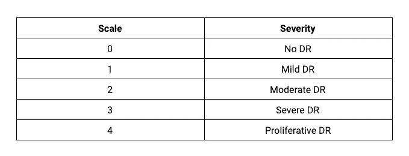

这是一个图像分类问题。

*图像分类处理理解图像及其与类别相关的上下文。为了将一组数据分组为不同的类或类别，机器学习算法理解数据和它们被分类到的类之间的关系。*

由于深度学习在准确性方面优于不同的预测方法，所以它越来越受欢迎，我决定使用深度学习解决方案来分类这些图像。这里有两个图表描述了传统机器学习和深度学习的区别。

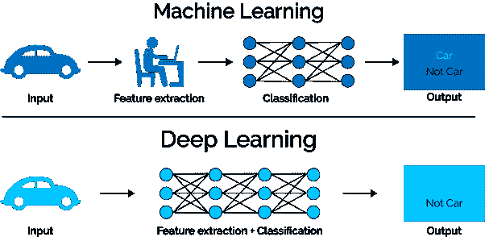

在传统的机器学习技术中，领域专业知识是必要的，因为大多数不同的特征和类别必须被标记。只有在你成功识别了相关特征之后，机器学习算法才能识别模式并给出准确的输出。

深度学习算法与传统的机器学习算法相比具有很大的优势，因为它们以增量的方式从数据中学习高级特征，无需领域专业知识和核心特征提取。特别是对于复杂的问题，如图像分类、自然语言处理和语音识别，需要深度学习算法才能做到准确和精确。

# 为什么要转学？

深度学习模型需要大量的数据和资源来进行适当的训练。一般来说，数据越多，输出越准确。例如，ImageNet ILSVRC 模型在 2-3 周的时间内跨多个 GPU 对 120 万张图像进行了训练。迁移学习是一种机器学习方法，其中工程师为一项任务开发一个模型，并将其作为第二项任务的模型的起点。

在深度学习中，一种流行的方法是使用预训练的模型作为起点，最后一个全连接层被移除并由自定义的全连接层取代，将原始 CNN 视为新数据集的特征提取器。一旦被替换，最后一个完全连接的层被训练为新数据集的分类器。

为了解决这个问题，我选择了 Inception v3。Inception-v3 是一个卷积神经网络，它在 ImageNet 数据库中的超过一百万张图像上进行训练。因此，该网络学习了各种图像的丰富特征表示。网络的图像输入大小为 299 x 299。

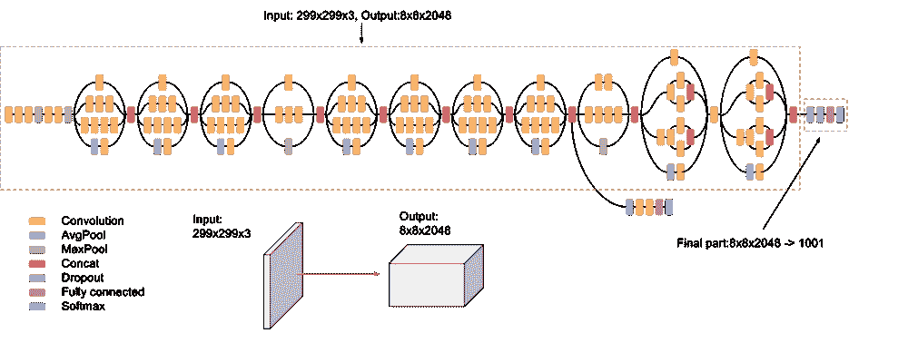

我建立了一个机器学习模型，使用一个名为 S [kyl](https://skyl.ai) 的端到端机器学习平台来加速疾病检测。我就是这么用的。

## 创建项目

Skyl 中的一个项目允许你根据你选择的模板来简化你的机器学习项目。因为这个问题是一个影像分类问题，所以我选择了影像分类(多类)模板，并根据我的需求配置了我的项目。

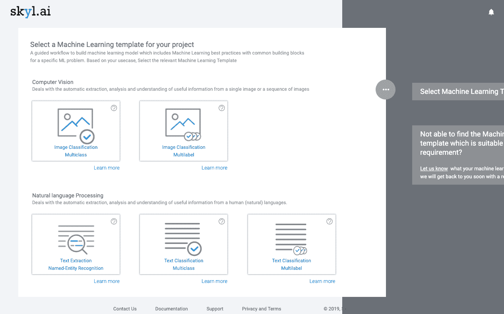

## 配置数据集

配置数据集意味着定义数据集的外观、内容以及分类值。输入数据集的名称、简短描述和类别值。我将我的数据集命名为:“失明检测数据集”，并将类别命名为无 DR、轻度、中度、重度、增生性 DR。

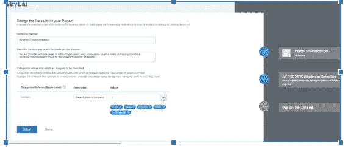

## 上传数据

Skyl 提供了许多收集数据的选项，如收集 API、CSV 上传、移动和基于表单的收集。我使用收集 API 选项来上传平台中的数据。

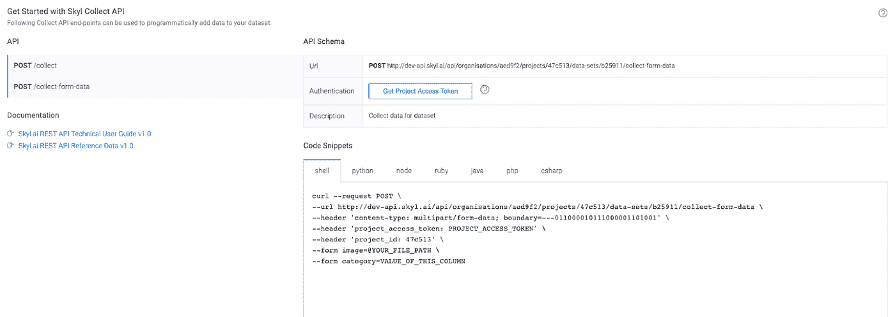

我从 Kaggle 下载了数据，并编写了一个脚本，将数据上传到之前在 Skyl 平台上创建的名为“失明检测数据集”的数据集中。

Skyl 为发现数据偏差提供了数据可视化。有偏见的数据会导致自我实现的预言和灾难性的结果，这是应该避免的。

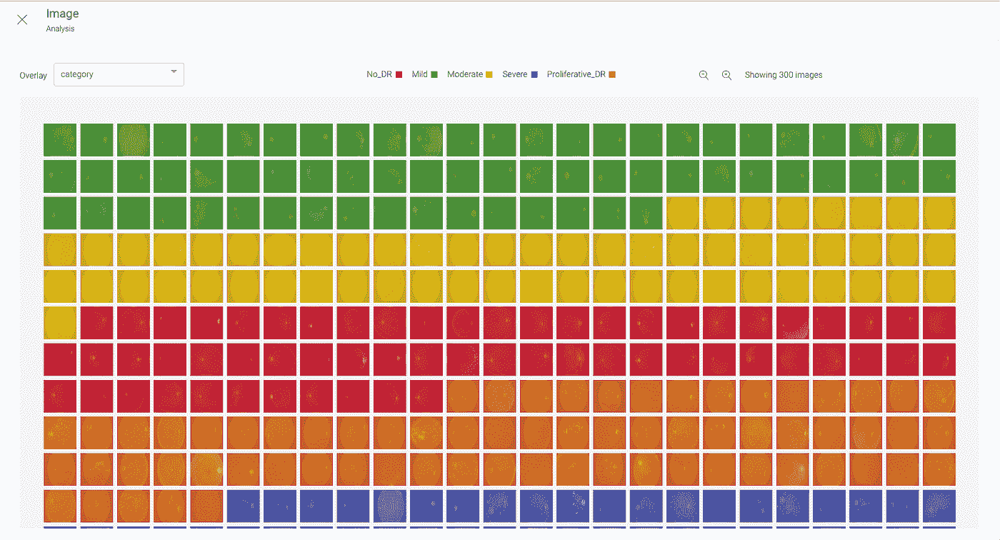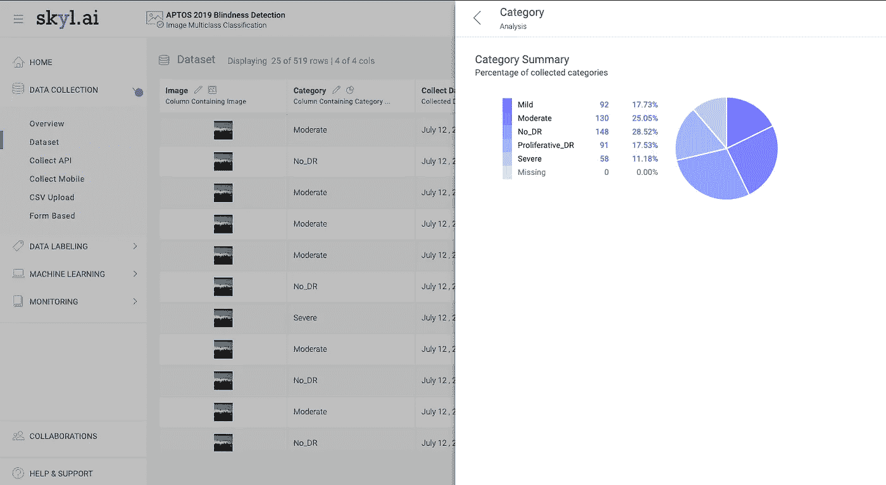

## 创建功能集

特征集是数据集的子集，最终用作训练模型的输入。我创建了特征集，并检查了数据是否是类平衡的，以在训练中获得最佳结果。

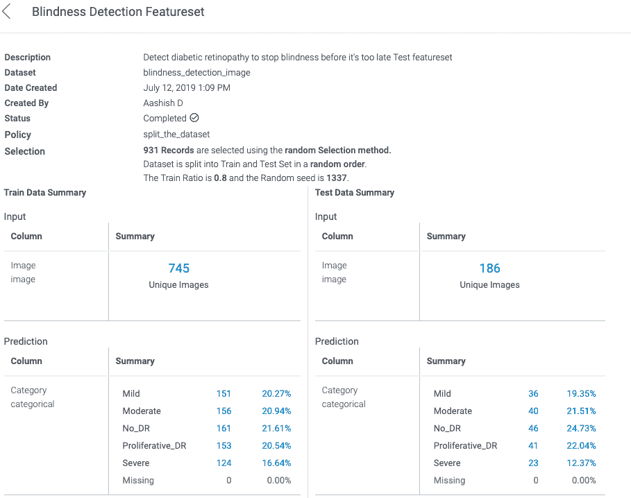

## 模特培训

前面说过，我选择迁移学习进行模型训练。我使用 Skyl 的优化算法来训练 ML 模型，这些模型是根据 ML 模板列出的。我选择了'*卷积神经网络(CNN) +迁移学习【T1]'作为算法，我通过其训练数据的特征集，历元数为 10，学习率为 0.001，添加模型名称和描述，最后初始化训练。*

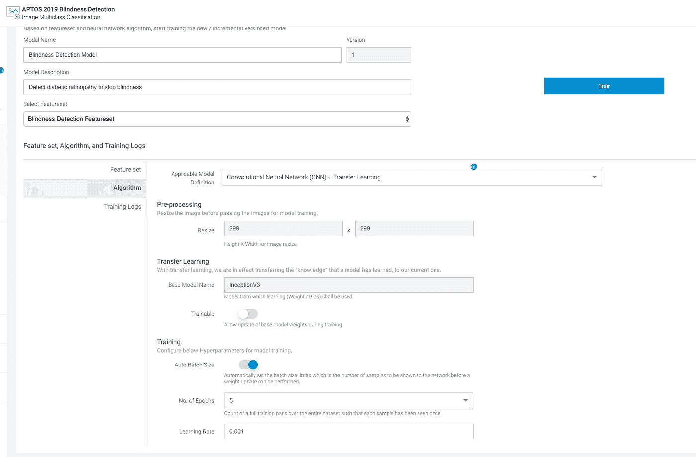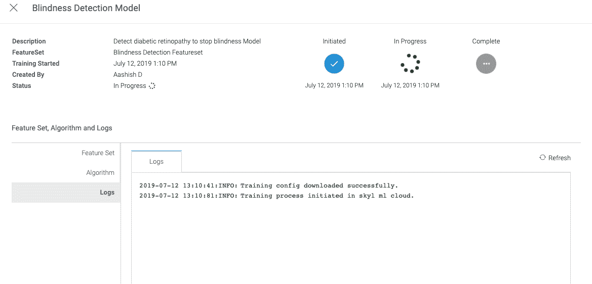

一旦训练完成，它就会创建一个机器学习模型，列在“模型”下。该模型达到了 72%的准确率——对于 25 分钟内没有工作的情况来说，这已经很高了。您还可以查看模型的培训总结报告。

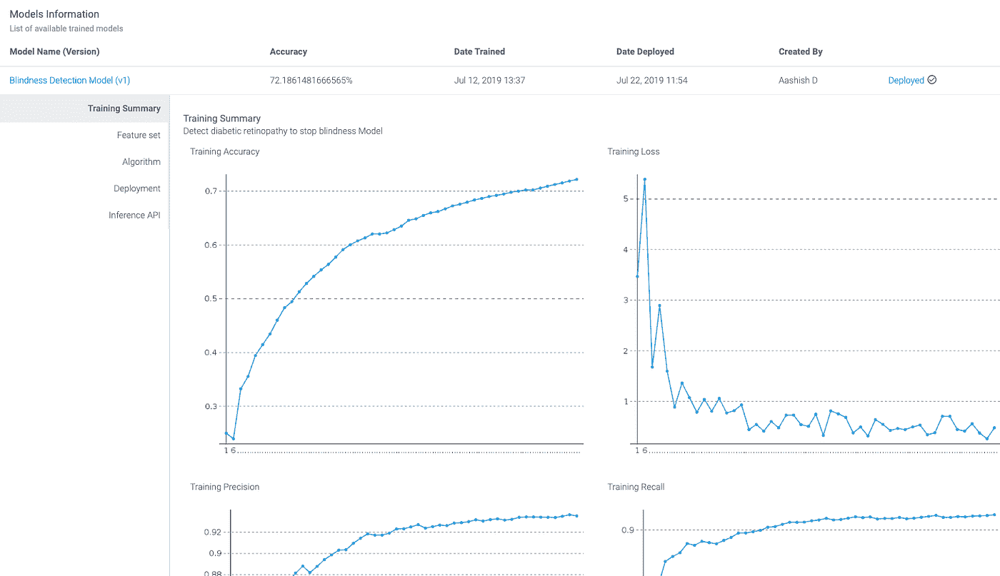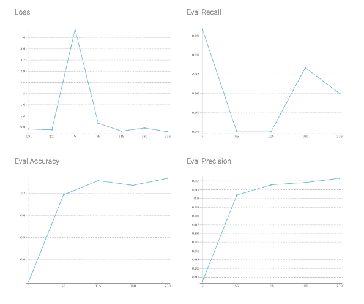

## 模型部署

训练结束后，我部署了模型，推理 API 被自动创建。我复制了 API，用它来做预测。

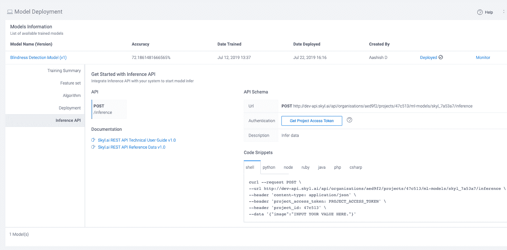

这就是我如何创建一个用于失明检测的深度学习模型。如果你们有任何问题或建议，请在下面的评论区联系我。
想看看我用的平台，这里有链接: [https://skyl.ai](https://skyl.ai)

通过联系 Skyl 的团队，您可以很容易地获得一个供个人使用的免费帐户。

快乐学习！！