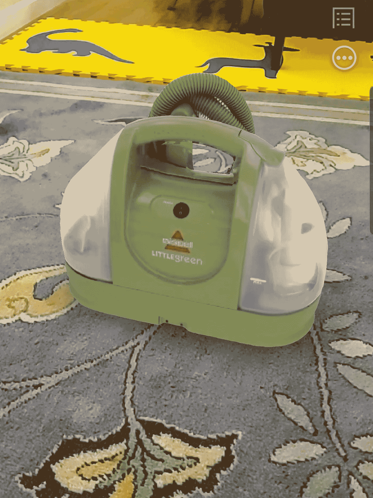
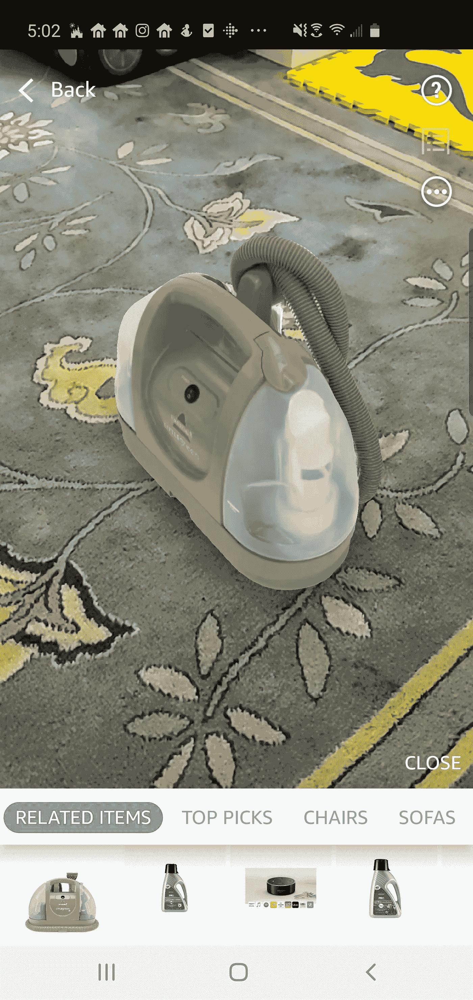
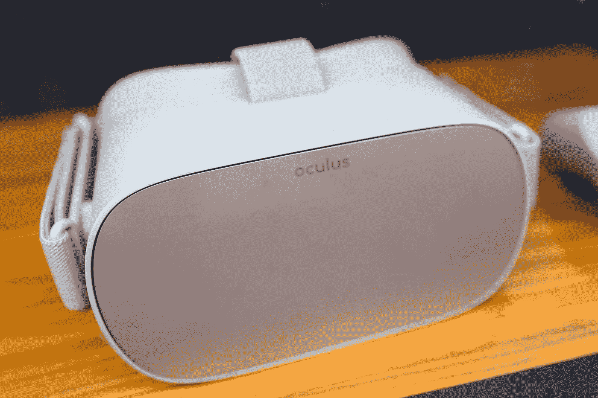
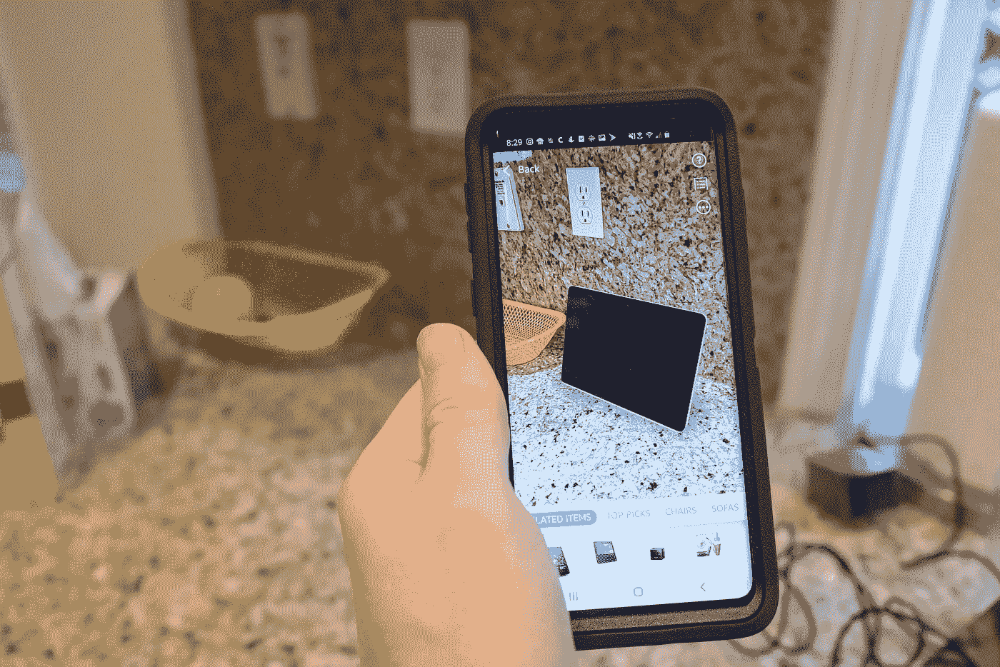
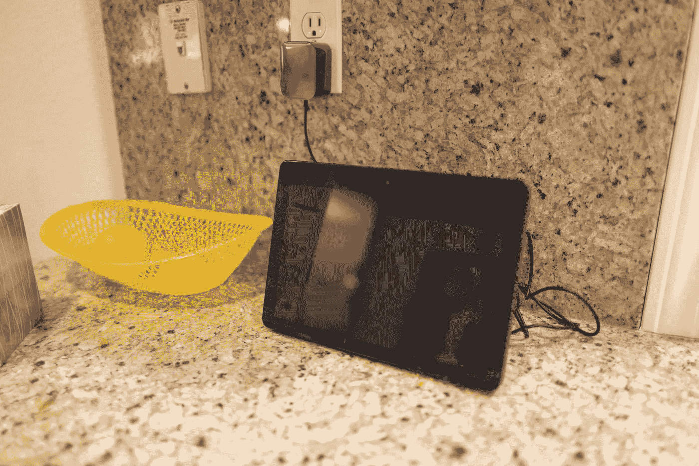
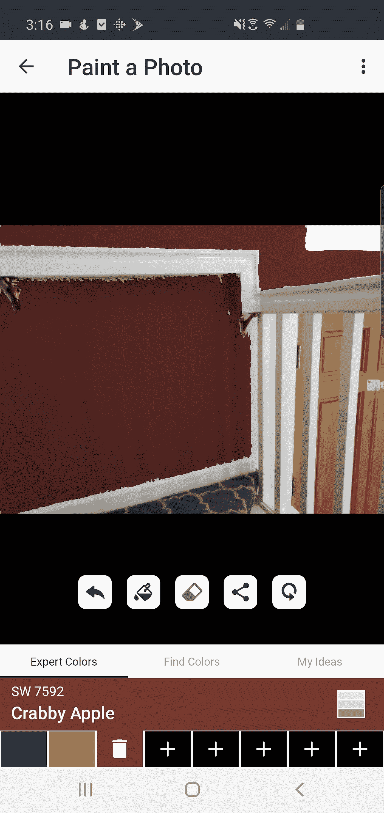

# AR 来了，准备卖给你一台吸尘器

> 原文：<https://towardsdatascience.com/ar-is-here-and-its-ready-to-sell-you-a-vacuum-cleaner-4bf23ee58c73?source=collection_archive---------36----------------------->

## 这不再仅仅是为了抓口袋妖怪

Credit: Gado Images

昨天，我在地毯上试用了一种地毯清洁剂。我知道，这听起来是有史以来最无聊的一篇文章。但是请原谅我。

有趣的部分来了。地毯清洁器其实不是我的。我没有买它，但它就在我家里。

不，这不是一个关于入店行窃的中篇报道。事实上，我家地板上的地毯清洁剂并不存在。

## 真实的地方，假的东西

我的地毯上怎么会有假家电？它是由电子商务巨头亚马逊购物应用程序的一个引人注目的新功能放在那里的。该功能被无害地标记为“在我的房间里看。”它允许你从亚马逊调出许多产品的虚拟版本，并在你的真实家中看到它们。

该功能是这样工作的。你选择一件你感兴趣的商品，然后把它加载到你的亚马逊应用程序上。然后你按下“在我房间里看”你的手机切换到相机视图，你把它指向你房间里你想要放置新的假物体的地方。出现一个绿色框，您点击将产品放下。

Moving your phone around allows you to see the virtual object from any angle. Credit: Gado Images

这就是事情变得不可思议的时候。当你四处移动你的手机摄像头时，看起来好像这个产品实际上是*坐在你的房间里*。你可以走来走去，从各个角度观察它，蹲下来从下面看它，甚至走进一个不同的房间，然后走回来。当你把手机放回你“放”产品的位置时，它仍然会在那里，就好像它一直在你的房间里一样。

## 现实，但更好

亚马逊的新功能是名为增强现实(AR)的虚拟现实子集的一部分。与试图将你从现实中转移到另一个沉浸式现实中的更传统的虚拟现实系统相比，AR 将现实带到你面前，并将其转化为不同的更好的东西。它正在迅速获得牵引力，部分原因是它不需要传统虚拟现实中笨重、昂贵的眼镜。

Traditional VR is immersive, but requires bulky hardware. Credit: Gado Images.

这项技术的工作原理是分析真实空间，并理解它们的物理参数。然后，它获取一个对象的虚拟 3D 模型，确定它在实际的物理空间中的外观，并虚拟地将该对象绘制进来。

当你四处移动手机时，系统会不断观察你在现实空间中的角度是如何变化的，并更新虚拟物体的位置，使其保持一致。虚拟物体实际上不断被重画，以适应你对空间不断变化的看法，这一切都是为了模拟它只是随意地坐在你的地板上的效果。

## 现实世界中的 AR

到目前为止，ar 主要应用于游戏等领域。全球现象口袋妖怪 Go 就是一个最好的例子。它使用 AR 和地理定位将虚拟口袋妖怪放置在现实世界的位置，促使一大群人挥舞着他们的手机在你当地的公园里闲逛。

Gotta catch ’em Credit: Gado Images

有了亚马逊这样的应用，AR 就成长起来了。我们知道它的真正目的是卖给你一台吸尘器。

看到一个虚拟的地毯清洁器叠加在我的地毯上真是太棒了。但是，对于亚马逊的新 AR 功能来说，有一些真正有用的应用程序，以及增强其面向零售的使命的应用程序。

一个显而易见的优势是能够看到新设备在空间中的外观和适合度。我用亚马逊回声秀的虚拟版本测试了这一点。通过 AR 功能，我可以将它放在我的厨房柜台上，并环顾四周，看看它与我的其他东西是否合适，它对于空间来说是否太大或太小，等等。

Credit: Gado Images

与我的真实回声秀相比，虚拟看台做得相当好。它大小合适，放置正确，甚至以与真实设备相似的方式反射光线。

The real Echo Show in the same space. Credit: Gado Images.

虽然它很适合查看电子产品，但亚马逊也希望你能把它用于更大的东西。让人们在网上购买像家具这样的大件商品——网站看不见——是一个巨大的挑战。

亚马逊希望，如果你能在你的空间里放置一个新沙发的虚拟副本，并确保它符合你的装饰，你会更倾向于购买它。他们可以避免拥有昂贵的实体展厅的成本。现在，如果他们能模拟你坐在上面的感觉，他们会是金色的…

## AR 的未来

今天的 AR 已经非常强大，但它的主要焦点是向现有的真实空间添加东西——无论是地毯吸尘器、口袋妖怪还是沙发。

未来的 AR 将超越这一点，实时无缝地改变你对空间的看法。

Sherwin Williams 已经在他们的 Colorsnap 应用程序中提供了一个版本。你可以打开应用程序，从他们的虚拟油漆样本中选择一种颜色，举起你的家，看到应用程序虚拟地“油漆”你选择的颜色。它并不完美，但它给人一种颜色看起来如何的感觉。同样，和亚马逊一样，它的目标是帮助你在不去实体店的情况下做出购买选择。

随着生成性敌对网络和其他快速改变图像的工具的增长，我相信我们会看到这种增加现实的概念走得更远。

想象一下，一家服装零售商有一个应用程序，你可以在那里打开自拍相机。该应用程序将实时使用 AR，让它看起来像你穿着零售商的任何服装。你甚至可以给每件新衣服拍一张自拍，然后发给朋友帮忙挑选。它就像一个 Snapchat 过滤器，但它可以帮助你购买一件衬衫，而不是让你吐彩虹。

这个概念可能会超越零售，产生更大的影响。美林(Merrill Lynch)等金融公司已经试验了人工老化客户照片的技术。人们希望，如果他们从每月的账单上看到 70 岁的自己，他们会为退休存更多的钱。

但是深入一点呢？有没有一款应用程序可以改变现实，通过展示你在身体残疾时的样子来建立同理心？还是在变性手术后？性别交换已经存在，可以用于这些更有益的目的。

其他技术也可能开始与 AR 更全面地集成。谷歌已经试验了一个增强现实版本的谷歌地图，在这个版本中，巨大的浮动箭头会自动出现在你手机屏幕上的真实世界视图中，当你走到目的地时，给你一个完美的方向感。借助 3D 成像技术，你可以在视频通话期间拍摄某人的实时 3D 视频，并使用 AR 将它们叠加到你的桌子上，就像莱娅公主/R2D2 风格一样。

平视显示器将数据嵌入到你对现实世界的视野中，也越来越受欢迎。在谷歌眼镜等技术的早期失误之后，AR 行业已经成功地将 hud 集成到滑雪眼镜、自行车头盔和高端汽车中。人们对智能眼镜的兴趣甚至有所复苏，尽管没有 Startrek 的外观，而且希望减少非法的更衣室快照。

## 我的虚拟真空

最后，我买了地毯清洁剂。真的和我在亚马逊应用上看到的假的看起来差不多。

是不是在 AR 看到的让我更有可能去买？我不确定。我认为更传统的因素，比如好评和合理的价格，是更大的激励因素。但在 AR 中看到它是一个考虑它而不是其他模型的理由，这需要我使用我的实际想象力来描绘它们在我的空间中会是什么样子。

虽然 AR 现在主要是一个令人惊叹的功能，但随着手机和可穿戴设备变得越来越强大，它的影响力将会越来越大——我们会花更多的时间粘在它们身上。随着新的图像处理技术的进步，比如 GANs，它们的输出将变得更加身临其境，也更加引人注目。

如果你还没有尝试过 AR，下载一个支持 AR 的应用程序，然后查看一下。而如果那个 app 竟然是 Pokemon Go，不用担心，我不会评判。