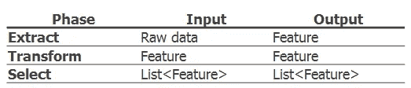
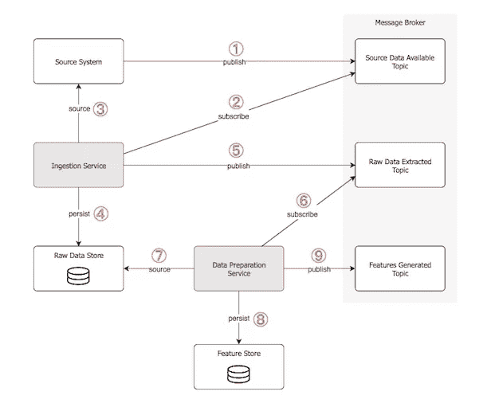

# 构建机器学习管道

> 原文：<https://towardsdatascience.com/architecting-a-machine-learning-pipeline-a847f094d1c7?source=collection_archive---------0----------------------->

## [现实世界中的数据科学](https://medium.com/towards-data-science/data-science-in-the-real-world/home)

## 如何构建可扩展的 ML 系统—第二部分

# 前言

在开发模型时，数据科学家在一些为统计和机器学习(Python、R 等)量身定制的开发环境中工作，能够在一个“沙盒”环境中训练和测试模型，同时编写相对较少的代码。这对于构建快速上市的交互式原型非常有用——尽管它们不是生产性的低延迟系统！

这是系列文章的第二篇，即“ ***”成为数据科学家并不能让你成为软件工程师！***’，涵盖了如何构建端到端的可扩展机器学习(ML)管道。

## 修订本

 [## 成为数据科学家并不能让你成为软件工程师！

### 如何构建可扩展的机器学习系统——第 1/2 部分

towardsdatascience.com](/being-a-data-scientist-does-not-make-you-a-software-engineer-c64081526372) 

希望您已经阅读了本系列的第 1 部分，在那里我们介绍了基本的架构风格、设计模式和坚实的原则。

**📌TL；DR:** 如果你没有读过，让我们重复一下“圣杯”——即一个生产就绪的 ML 系统应该试图解决的问题陈述:

> 主要目标是建立一个系统，该系统:
> 减少**延迟**；
> 与系统的其他部分集成但**松散耦合**，例如数据存储、报告、图形用户界面；
> ▸**可以水平和垂直缩放**；
> ？是**消息驱动的**，即系统通过异步、无阻塞的消息传递进行通信；
> 针对**工作量管理**提供高效的计算；
> 是**容错**和自愈即故障管理；
> 支持**批量**和**实时**加工。

**🎦场景设置:**至此，你已经了解了软件工程的基本概念，并且已经是一名经验丰富的数据科学家。

**事不宜迟，让我们把两个和两个放在一起…**

对于每一个 ML 流水线步骤，我将演示如何设计一个生产级架构。我将有意不提及任何特定的技术(除了几次出于演示的目的我举了一些例子)。

**✏️注意:**如果您需要更新 ML 管道步骤，请查看[该资源](/not-yet-another-article-on-machine-learning-e67f8812ba86)。

ML Pipeline

# 构建 ML 管道

传统上，管道涉及通宵批处理，即收集数据，通过企业消息总线发送数据，并对其进行处理，以提供预先计算的结果和第二天操作的指导。虽然这在一些行业中行得通，但在其他行业中确实不够，尤其是在 ML 应用中。

下图显示了应用于实时业务问题的 ML 管道，其中**功能和预测对时间敏感**(例如，网飞的推荐引擎、优步的到达时间估计、LinkedIn 的连接建议、Airbnb 的搜索引擎等)。

Real-Time ML

它由两个明确定义的部分组成:

*   **在线模型分析**:最上面一行代表应用的操作组件，即模型应用于**实时**决策制定的地方。
*   **离线数据发现**:最下面一行表示学习组件，即分析历史数据，以**批处理**模式创建 ML 模型。

我们现在将采用这个简化的图表并展开其内部工作原理。

# — ①:数据摄取

> 数据收集。

将传入的数据汇集到数据存储中是任何 ML 工作流的第一步。关键的一点是，数据是持久化的，根本不需要进行任何转换，以允许我们拥有原始数据集的**不可变**记录。数据可以来自各种数据源；或者通过请求(发布/订阅)获得，或者从其他服务流获得。

**NoSQL 文档数据库**非常适合存储大量快速变化的结构化和/或非结构化数据，因为它们是无模式的。它们还提供分布式、可扩展的复制数据存储。

## 脱机的

在离线层，数据通过**摄取服务**流入原始数据存储，这是一个复合编排服务，封装了数据源和持久性。在内部，存储库模式用于与数据服务交互，数据服务反过来与数据存储交互。当数据保存在数据库中时，一个唯一的 batch-id 被分配给数据集，以允许高效的查询和端到端的数据沿袭和可追溯性。

为了提高性能，摄入分布是双重的:

每个数据集都有一个专用的**管道，因此它们都是独立和并发处理的，并且
在每个管道内，数据被**分区**以利用多个服务器内核、处理器甚至服务器。**

将数据准备工作横向和纵向分布在多个管道中，可以减少完成工作的总时间。

摄取服务按照**计划**(每天一次或多次)或按照**触发器**定期运行:主题将生产者(即数据源)与消费者(在我们的例子中是摄取管道)分离，因此当源数据可用时，生产者系统向代理发布消息，嵌入式通知服务通过触发摄取来响应订阅。通知服务还向代理广播源数据已经成功处理并保存在数据库中。

## 在线的

在在线层，**在线摄取服务**是流架构的入口点，因为它通过提供可靠、高吞吐量、低延迟的功能，分离和管理从数据源到处理和存储组件的信息流。它作为企业级的数据总线。数据保存在长期原始数据存储中，但也是到下一个在线流媒体服务的**直通**层，用于进一步的实时处理。

这里使用的示例技术可以是 Apache Kafka(发布/订阅消息系统)和 Apache Flume(长期数据库的数据收集),但是您还会遇到更多，这取决于您企业的技术堆栈。

# — ②:数据准备

> 数据探索、数据转换和特征工程。

一旦接收到数据，就会生成一个分布式管道来评估数据的状况，即寻找格式差异、异常值、趋势、不正确、缺失或扭曲的数据，并在此过程中纠正任何异常。这一步还包括特征工程过程。特征管道中有三个主要阶段:提取、转换和选择。

Feature Engineering Operations

由于这是 ML 项目中最复杂的部分，引入正确的设计模式是至关重要的，因此就代码组织而言，拥有一个**工厂方法**来基于一些常见的抽象特性行为生成特性，以及一个**策略**模式来允许在运行时选择正确的特性是一个明智的方法。特征提取器和转换器的结构都应该考虑到组合和可重用性。

选择特征可以留给呼叫者，或者可以自动进行，例如应用**卡方**统计测试对每个特征对概念标签的影响进行排序，并在模型训练之前丢弃影响较小的特征。可以定义一系列选择器 API 来实现这一点。无论哪种方式，为了确保用作模型输入和评分的特征的一致性，为每个特征集分配一个唯一的 id**。**

概括地说，数据准备管道应该被组装成一系列不可变的转换，这些转换可以很容易地被组合。这就是测试的重要性和高代码覆盖率成为项目成功的重要因素的地方。

## 脱机的

在离线层，**数据准备服务**，由摄取服务的完成触发。它获取原始数据，承担所有特征工程逻辑，并将生成的特征保存在*特征数据存储*中。

同样的划分也适用于此(即专用管道/并行)。

可选地，来自多个数据源的特征可以被组合，因此“连接/同步”任务被设计为聚集所有中间完成事件并创建这些新的组合特征。最后，通知服务向代理广播这个过程已经完成，并且特性是可用的。

当每个数据准备管道完成时，特征还会被**复制**到在线特征数据存储中，因此可以低延迟地查询特征以进行实时预测。

## 在线的

原始数据从摄取管道流入**在线数据准备服务**。生成的特征存储在**内存** *在线特征数据存储*中，可在预测时以低延迟读取，但也保存在长期特征数据存储中，以备将来训练。此外，可以通过从长期特征数据存储中加载特征来预热存储器中的数据库。

继续前面的技术栈例子，一个常用的流媒体引擎是 Apache Spark。

**🔍离线钻取:**如果我们要钻取离线接收和数据准备服务交互，我们将得到如下内容:

**(1)** 一个或多个数据生产者向消息代理的指定“源数据可用”主题发布事件，表明数据可供使用。
**(2)**摄取服务在听题目。
一旦接收到相应的事件，它将通过以下方式进行处理: **(3)** 获取数据并 **(4)** 将其以原始格式保存在数据存储中。
**(5)**当流程完成时，它会向“提取原始数据”主题引发一个新事件，以通知原始数据已准备就绪。
**(6)**数据准备服务在听题目。
一旦接收到相应的事件，它通过以下方式进行处理: **(7)** 获取原始数据，准备原始数据并设计新功能，以及 **(8)** 将功能保存在数据存储中。
**(9)**当流程完成时，它会向“特性已生成”主题引发一个新事件，以通知特性已生成。

Offline Data Ingestion / Preparation Interactions

# — ③:数据隔离

> 拆分数据子集以训练模型，并进一步验证它对新数据的表现。

ML 系统的基本目标是使用基于其模式预测质量的精确模型来预测未经训练的数据。因此，通过将现有标记数据分成训练和评估子集，现有标记数据被用作未来/不可见数据的**代理**。

有许多策略可以做到这一点，其中四个最常见的是:

使用默认或自定义比率将其分成两个子集，**按顺序**，即按其在信号源中出现的顺序，确保没有重叠。例如，前 70%的数据用于训练，后 30%的数据用于测试。
使用默认或自定义比率，通过**随机**种子将其分成两个子集。例如，随机选择 70%的源数据用于训练，随机子集的补充数据用于测试。
使用上述方法中的任何一种(顺序或随机)，同时**在每个数据集中打乱**记录。
当需要对分离进行**显式控制**时，使用自定义注入策略分割数据。

数据分离本身并不是一个独立的 ML 管道，但是必须有一个 API 或服务来帮助完成这个任务。接下来的两个管道(模型训练和评估)必须能够调用这个 API 来取回所请求的数据集。就代码组织而言，策略模式是必要的，以便调用方服务可以在运行时选择正确的算法，并且显然需要能够**注入**比率或随机种子。此外，API 必须能够返回带有或不带有标签/特征的数据——分别用于训练和评估。

为了防止调用者指定导致**不均匀数据**分布的参数，应该发出警告并随数据集一起返回。

# — ④:模型训练

> 使用数据的训练子集让 ML 算法识别其中的模式。

模型训练管道是**离线**的，它的时间表根据应用程序的关键程度而变化，从几个小时一次到一天一次。除了调度器之外，该服务也是时间和事件触发的。

它由一个训练模型算法库(线性回归、ARIMA、k-means、决策树等)组成，以一种**可靠的**方式构建，为新模型类型的持续开发做准备，并使它们可以互换。使用 **facade** 模式的包容也是集成第三方 API 的关键技术(这也是 Python Jupyter 笔记本可以被包装和调用的地方)。

并行化有几个选项:

最简单的形式是为每个型号配备一个**专用管道，即所有型号同时运行。
另一个想法是将**训练数据**并行化，即数据被分区，每个分区有一个模型的副本。这对于那些需要实例的所有字段来执行计算的模型(例如 LDA、MF)是优选的。
第三种选择是将**模型**本身并行化，即模型被分区，每个分区负责一部分参数的更新。这是线性模型的理想选择，如 LR，SVM。
最后，可以使用一种**混合**方法，结合一个或多个选项。(要了解更多信息，我推荐你阅读[这本出版物](https://academic.oup.com/nsr/article/5/2/216/3052720))。**

在实施模型训练时，必须牢记**容错**，并且应启用训练分区上的数据检查点和故障转移，例如，如果之前的尝试由于某些瞬时问题(例如超时)而失败，则可以重新训练每个分区。

既然我们已经介绍了这个管道的功能，那么让我们打开工作流:**模型训练服务**从配置服务获得训练配置参数(例如，模型类型、超参数、要使用的特性等),然后从数据分离 API 请求训练数据集。该数据集被并行发送给所有模型，一旦完成，模型、原始配置、学习到的参数以及关于训练集和计时的元数据将被保存在*模型候选数据存储*中。

# — ⑤:候选模型评估

> 使用数据的测试子集评估模型的性能，以了解预测的准确性。

这条管道也是**下线**。通过使用各种度量标准将评估数据集上的预测值与真实值进行比较，来评估模型的预测性能。选择评估子集上的**“最佳”模型**来对未来/新实例进行预测。由多个评估者组成的库旨在提供模型的准确性度量(如 ROC 曲线、PR 曲线)，这些度量也根据模型保存在数据存储中。同样，同样的模式也适用于这里，允许在评估器之间灵活地组合和切换。

在编排方面，**模型评估服务**从数据分离 API 请求评估数据集，并且对于来源于模型候选库的每个模型，它应用相关的评估器。评估结果被保存回存储库。这是一个迭代过程，超参数优化以及正则化技术也被应用于最终模型。最佳模型被标记用于部署。最后，通知服务广播模型已经准备好进行部署。

这个管道还需要符合所有的反应特征。

# — ⑥:模型部署

> 一旦选定的模型产生，它通常被部署并嵌入到决策框架中。

模型部署不是终点；这只是开始！

选择的最佳模型被部署用于离线(异步)和在线(同步)预测。**可随时部署多个**模型，以实现新旧模型之间的安全过渡——即当
部署新模型时，服务需要继续服务预测请求。

传统上，部署中的一个挑战是操作模型所需的**编程语言**不同于开发它们所使用的语言。**将 Python 或 R 模型移植到 C++、C#或 Java 等生产语言中是一项挑战，通常会降低原始模型的性能(速度&准确性)。有几种方法可以解决这个问题。排名不分先后:**

用新语言重写代码[即从 Python 翻译成 CSharp]
创建自定义 DSL(领域特定语言)来描述模型
微服务(通过 RESTful API 访问)
API 优先方法
容器化
序列化模型并加载到内存中的键值存储中

更具体地说:

## 脱机的

在离线模式下，预测模型可以部署到**容器**中，并作为微服务运行，以按需或定期创建预测。
另一种选择是围绕它创建一个包装器，这样您就可以控制可用的功能。一旦发出了一个批量预测请求，您可以**将它作为一个单独的进程动态加载到内存**中，调用预测函数，从内存中卸载它并释放资源(本机句柄)。
最后，另一种方法是将库打包成一个 **API** ，让调用者直接调用它，或者将它打包到他们的服务中，以完全接管预测工具的控制权。

就可伸缩性而言，可以创建多个并行管道来容纳负载。这涉及到微不足道的工作，因为 ML 模型是无状态的。

## 在线的

这里，预测模型可以在容器中部署到**服务集群**，通常分布在队列后面的许多服务器中，用于负载平衡，以确保可伸缩性、低延迟和高吞吐量。客户端可以通过网络[远程过程调用](https://en.wikipedia.org/wiki/Remote_procedure_call) (RPC)发送预测请求。
或者，**键值存储**(例如 Redis)支持模型及其参数的存储，这大大提高了性能。

✳️关于实际的模型部署活动，它可以通过[连续交付](https://en.wikipedia.org/wiki/Continuous_delivery)实现来自动化:所需的文件被打包，模型被可靠的测试套件验证，最后被部署到运行的容器中。测试由自动化构建管道执行:首先评估简短的、自包含的、无状态的单元测试。如果它们通过，预测模型的质量将在更大的集成或回归测试中进行测量。当两个级别的测试都通过后，应用程序就被部署到服务环境中。

启用**一键部署**比较理想。

# — ⑦:模型评分

> 将 ML 模型应用于新数据集的过程，目的是揭示有助于解决业务问题的实际见解。又名模特服务。

✏️ *模型评分*和*模型服务*是业内可以互换使用的两个术语。在阅读了[这个资源](https://docs.microsoft.com/en-us/azure/machine-learning/studio-module-reference/machine-learning-score)之后，我想到了评分的真正含义，所以在继续之前，让我们快速地了解一下基础知识，以防你也不清楚:

模型评分是在给定模型和一些新输入的情况下生成新值的过程。使用通用术语*分数*，而不是*预测*，因为它可能导致不同类型的值:

推荐项目列表
时间序列模型和回归模型的数值
概率值，表示新输入属于某个现有类别的可能性
新项目最相似的类别或聚类的名称
分类模型的预测类别或结果。

继续……一旦部署了模型，就可以根据之前的管道或直接从客户端服务加载的特征数据进行评分。当提供预测时，模型在离线和在线模式下应该表现相同。

## 脱机的

在离线层，**评分服务**针对大数据集合的高吞吐量、一次性预测进行了优化。应用程序可以发送异步请求来启动评分过程，但需要等到批量评分过程完成后才能访问预测结果。该服务准备数据、生成要素，但也从要素数据存储中提取额外的要素。评分发生后，结果将保存在*评分数据存储器*中。向代理发送消息以通知评分已经完成。应用程序正在监听这个事件，并在收到通知时获取分数。

## 在线的

客户向**在线评分服务**发送请求。它可以有选择地指定要调用的模型的版本，因此**模型路由器**检查请求并将其发送给相应的模型。与离线层类似，服务会根据请求准备数据、生成要素，并根据需要从要素数据存储中提取额外的要素。一旦评分发生，结果被保存在*评分数据存储器*中，然后通过网络发送回客户端。

根据不同的用例，分数也可以异步交付给客户端，即独立于请求:
**Push**:一旦分数生成，它们就作为通知被推送给调用者。
**Poll**:评分一旦生成，就存储在低读取延迟的数据库中；呼叫者周期性地轮询数据库以获得可用的预测。

为了最大限度地减少系统在收到请求时提供评分的时间，采用了两种方法:
输入特征存储在低读取延迟的内存数据存储中，
缓存在离线批量评分作业中预先计算的预测，以便于访问【这取决于使用案例，因为离线预测可能不相关】。

# — ⑧:性能监控

> 该模型被持续监控，以观察其在现实世界中的表现，并相应地进行校准。

任何 ML 解决方案都需要定义良好的性能监控解决方案。我们可能希望看到的模型服务应用程序的信息示例包括:
·模型标识符、
·部署日期/时间、
·模型服务的次数、
·平均/最小/最大模型服务次数、
·所用特征的分布。
预测结果与实际/观察结果的对比。

此**元数据**在模型评分期间计算，然后用于监控。

这是另一个**离线**管道。**性能监控服务**在提供新的预测时得到通知，执行性能评估，保存结果并发出相关通知。评估本身是通过将分数与数据管道(训练集)生成的观察结果进行比较来进行的。监控的基本实现可以遵循不同的方法，最流行的是**日志分析** (Kibana、Grafana、Splunk 等)。

为了确保 ML 系统的**内置弹性**，新型号的**速度**表现不佳会触发先前型号生成的分数。采用了一种*“错总比晚好”*的哲学:如果模型中的一项计算时间太长，那么该模型将被一个先前部署的模型所替代，而不是阻塞。

此外，当分数变得可用时，它们会加入到观察到的结果中——这意味着会生成模型的连续**准确性**测量，并且与速度性能一样，任何下降的迹象都可以通过恢复到以前的模型来处理。

责任链模式可以用来将不同的版本链接在一起。

模型监控是一个连续的过程:预测中的变化可能会导致模型设计的重构。不断提供准确的预测/建议**以推动业务向前发展，这就是 ML 的优势所在！**

# **交叉问题**

**我们不能在结束这篇文章时不提及跨领域的关注。像任何其他应用程序一样，ML 应用程序有一些跨层/管道的通用功能。甚至在一个单独的层中，这样的功能可以跨所有的类/服务使用，**穿过**和**跨越**所有正常的边界。**

**横切关注点通常集中在一个地方，这增加了应用程序的模块性。它们通常由组织中的其他团队管理，或者是现成的第三方产品。**依赖注入**是在代码的相关地方注入这些的最好方式。**

**在我们的用例中，要解决的最重要的问题是:**

**通知
调度
日志框架(和警报机制)
异常管理
配置服务
数据服务(公开数据存储中的查询)
审计
数据沿袭
缓存
检测**

# **把所有这些放在一起**

**这就是了…一个生产就绪的 ML 系统:**

****

**End to End ML Architecture**

# **脚注**

**恭喜你！你坚持到了最后！我真的希望你喜欢数据科学的软件工程之旅！**

**感谢阅读！**

**🙏🏻 💎整理这篇文章花费的时间超过了我最初的预期；不得不应付各种事情——家庭/工作需求等。向我忍受了这么多深夜的丈夫大声欢呼吧！你是一块宝石！**

***我定期在媒体上写关于技术的&数据——如果你想阅读我未来的帖子，请*[*‘关注’我*](https://medium.com/@semika) *！***