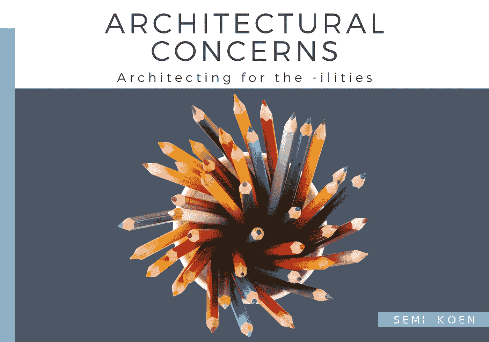
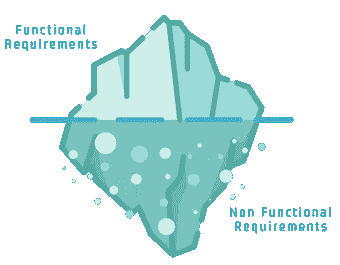
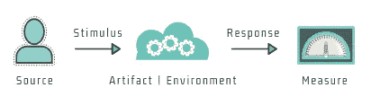
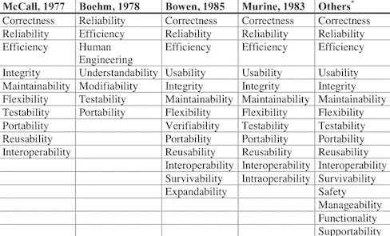
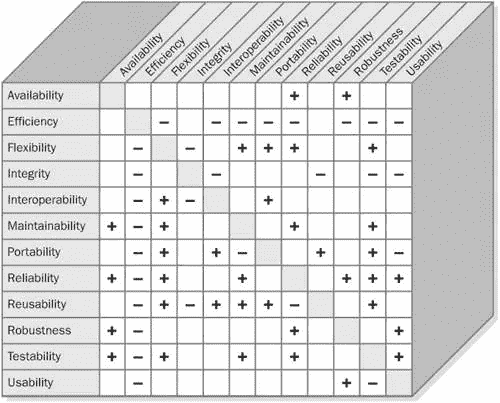
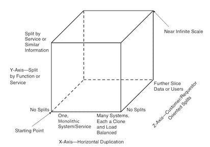
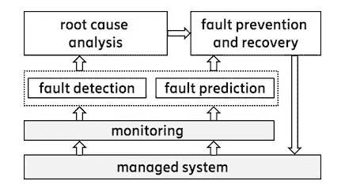
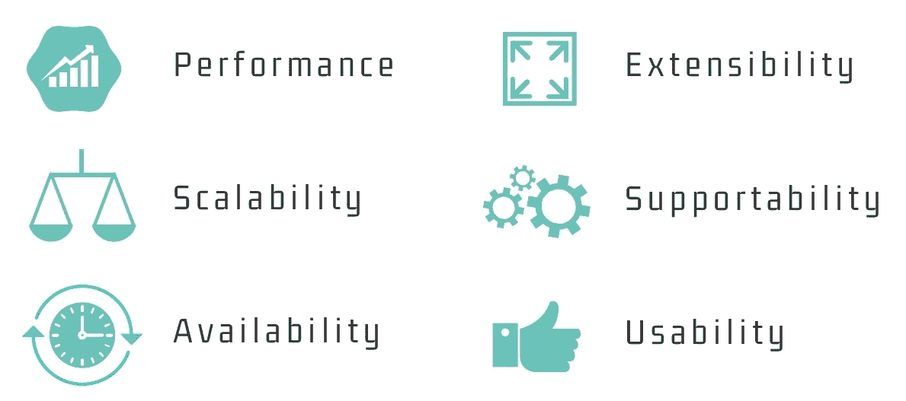

# 面向设施的架构设计

> 原文：<https://towardsdatascience.com/architecting-for-the-ilities-6fae9d00bf6b?source=collection_archive---------6----------------------->

## 6 个基本的软件质量

解决方案架构师在软件项目中起着举足轻重的作用，因为他们设定愿景并指导开发团队开发出最佳的解决方案。从许多不同的角度查看架构的能力是项目成功的基础。前面我们讨论了帮助架构师评估他们在整个项目生命周期中所做决策的五个关键原则。

今天我们将看到另一个同样重要的方面:T2 架构关注点 T3，或者 T5 质量属性 T6，T7，T8 系统能力 T9，或者 T11 非功能需求 T12，T13，并对其中最重要的做一个简短的概述。这些定性需求有时被命名为***-能力*** ，以单词 share(可用性、可维护性、可伸缩性等)的后缀 **𝕞𝕠𝕤𝕥** 命名。

> 功能和质量属性是正交的

# 𝕎𝕙𝕪 𝕤𝕙𝕠𝕦𝕝𝕕 𝕨𝕖 𝕔𝕒𝕣𝕖…

我最不喜欢的术语是“非功能性需求”(NFRs)——这完全是一个误称:谁会基于非功能性的需求来构建系统？？**这些要求指的是一个系统应该具备的*品质*和它必须运行的*约束*！因此，我更喜欢质量属性(QA)这个术语。**

it 项目通常资金不足，而在开发阶段最重要的是功能！质量属性很容易成为降低优先级的目标，但是忽略它们的后果会直接导致质量问题和技术债务的增加。

然而，这种选择是短视的:质量保证会对设计产生更大的影响，如果我们弄错了，它们会对交付产生连锁反应，因为它们会导致昂贵的返工。根据我的经验，系统被重新设计并不是因为它们在功能上有缺陷(通常计算和功能通常是相同的),而是因为它们无法扩展、难以维护、太慢……这样的例子不胜枚举！

Functional Requirements are just the tip of the iceberg

# 𝕌𝕟𝕒𝕞𝕓𝕚𝕘𝕦𝕠𝕦𝕤 𝕤𝕡𝕖𝕔𝕚𝕗𝕚𝕔𝕒𝕥𝕚𝕠𝕟

到目前为止，我们已经宽泛地定义了术语“质量属性”。这里有一个更具体的定义:

> 质量属性是一个系统的**可测量的**和**可测试的**属性，它表明系统满足其涉众需求的程度。

我在强调 QA 是*可测量的*和*可测试的* : 的重要性，为了指定一个有形的、明确的 QA，我们应该涵盖这六个重要部分:

→ *刺激*:到达系统时要考虑的条件。
→ *来源*:产生刺激的实体。
→ *环境*:刺激发生的环境，如正常运行、压力条件、故障等。
→ *神器*:被刺激的系统部分。
→ *响应*:刺激到达后发生的系统活动。
→ *测量*:响应满足要求的程度。

例如:“*正常运行时收到不可预见的外部消息。该消息被记录下来，系统继续运行，没有停机时间。*

✏️如果你想了解更多，这所加拿大大学有一个关于如何记录质保的浓缩章节。

# 𝕀𝕥’𝕤 𝕒 𝕓𝕒𝕝𝕒𝕟𝕔𝕚𝕟𝕘 𝕒𝕔𝕥…

维基百科记录了过多的问答，学术界多年来定义了多种分类法:

Courtesy: [Kennet Henningsson](https://www.diva-portal.org/smash/get/diva2:832582/FULLTEXT01.pdf)

同样，至少有几个 ISO 标准(据我所知)试图将质量保证体系分为不同的类别: **①** [ISO 25010](https://iso25000.com/index.php/en/iso-25000-standards/iso-25010) 和 **②** [ISO 9126](https://en.wikipedia.org/wiki/ISO/IEC_9126) 。

所有的质量保证都是至关重要的，但是正如一句老话所说:我们不能鱼和熊掌兼得！

一方面，成本会过高，上市时间会达到顶点，另一方面(也是最重要的一点)**一些 QA 往往会对其他 QA 产生负面影响**。例如，为了最大化可维护性，我们可能不得不牺牲效率；或者增加的可靠性可能对性能有负面影响；或者当软件在多个平台上运行时，可用性通常会受到影响(可移植性)。

Quality Attributes Trade Offs — Courtesy: [Implementing System Quality Attributes](https://blogs.msdn.microsoft.com/gabriel_morgan/2007/03/20/implementing-system-quality-attributes/)

> 这就是建筑发挥作用的地方！

我们做出的所有架构决策都会对最终系统的 QAs 产生直接影响。因此，根据我们所处的业务领域的需求，以及不同系统利益相关者的观点，确定优先级的方法非常重要。

虽然有几种方法可以对系统质量进行排名，但在本文中，我将涵盖在构建应用程序时，我在*和 ***实用性*** 方面排名最高的那些，尤其是在金融领域。*

# *𝟙 𐩑表演*

*性能是指系统在给定的约束条件下，如速度、精度、内存使用等，满足时序要求的能力。
它的得分是以:*

*   **吞吐量*:给定时间范围内执行的事件数量*
*   **延迟*:响应特定事件所花费的时间*
*   **容量*:在继续满足吞吐量和延迟需求的同时处理的事件数量*

*为了提高系统的性能，可以采用几种策略，例如:*

*◽缓存
◽增加硬件资源:内存、CPU、网络
◽负载平衡
◽引入并发性
◽数据分区/复制*

*性能是系统架构中的一个驱动因素，通常会影响其他 QAs 的实现。它通常与可伸缩性相关，即增加系统的工作能力，同时仍然表现良好。让我们继续看看这意味着什么:*

# *𝟚 𐩑可扩展性*

*可伸缩性允许系统优雅地响应对其提出的要求，并处理增加的工作负载，而不影响性能或其扩展架构以容纳更多用户、进程、数据等的能力。
挑战在于评估将对系统提出的**需求**的性质以及将受到**压力**的组件。在前期设计时，我们经常把重点放在错误的地方，我们试图在不测试预期系统行为的情况下进行优化。*

*有两种可伸缩性:*

*   **垂直*可扩展性(*纵向扩展*)指的是购买*更大的*硬件，例如向现有服务器添加更多内存/CPU/硬盘。*
*   **水平*可扩展性(*向外扩展*)是指添加*多组*硬件资源来划分负载并响应相同的请求，例如，向服务器集群添加另一台服务器。总的来说，它更具成本效益，因为它使我们能够从小处着手，然后随着时间的推移对系统的请求做出反应。*

**

*Courtesy: [The Art of Scalability](http://theartofscalability.com)*

*规划扩展时，需要考虑以下几点:*

*◽用户数
◽数据量
◽ CPU、内存、I/O 密集型操作
◽并发
◽异步而非同步
◽无状态
◽长时间运行操作(非高峰时间批量调度)*

*在设计可扩展性时，最容易忽略的是以下需求:*

*   **监控机制*:必须观察系统的健康状况！当资源利用率超过 80%时，应向运营和开发团队发出警告，以便采取补救措施。*
*   **压力测试*:当务之急是让系统达到极限，以找出哪些操作是密集的，断点在哪里，并确定系统在负载下将如何失败(我们正在寻找的是“优雅的故障转移”)。*

# *𝟛 𐩑可用性*

*可用性表示系统的**可访问**和**可用**的能力，尤其是在发生故障之后。反过来，这也意味着企业愿意接受多少停机时间。企业通常要求 24x7 全天候正常运行，但相关成本可能相当高。*

*以下是一些需要牢记的注意事项:*

*   *当服务不可用时，恢复过程是什么:是自动的还是手动的；停机时间有多长；能否满足 SLA(服务水平协议)？*
*   *执行 RCA(根本原因分析)后，有什么缓解计划来避免将来出现故障？*
*   *发生故障时需要哪种通知？*
*   *系统的恢复能力是什么，即系统多久出现一次故障？*

*必须检测到故障，根据应用程序的关键程度和故障类型，系统必须以可接受的方式做出响应。在故障转移的情况下，采用恢复技术。理想情况下，必须完全防止故障。*

**

*Courtesy: [Ericsson](https://www.ericsson.com/49d220/assets/global/qbank/2019/06/13/architecture-50-109173resize436234crop00436234autoorientquality90stripbackground23ffffffextensionjpgid8.jpg)*

*让我们来看一些增强系统可用性的方法:*

## *检测:*

*用于事件排序的◽时间戳
用于定期系统监控的◽心跳
用于数据验证的◽校验和
◽异常记录
等待时间超过预定义限制时的◽超时
◽自测正确性
◽ [机器学习检测](https://www.ericsson.com/en/blog/2019/6/automated-fault-management-machine-learning)*

## *恢复:*

*编程环境中的◽异常处理
◽回滚，即恢复到之前的良好状态
◽在出现暂时错误(如网络故障)的情况下重试
◽使用替代操作重试(如 t 的市场价格不可用，则尝试获取 T-1)
◽服务重启*

## *预防:*

*◽异常预防
◽事务
◽优雅地关闭并重新实例化
◽增加了测试覆盖率*

# *𝟜 𐩑延展性*

*可扩展性是指系统通过灵活的架构、设计或实现来迎合未来变化的难易程度。扩展可以通过添加新功能或修改现有功能来实现。快速上市对任何组织来说都是至关重要的，因为它会影响组织扩大与相关系统相关的收入的能力。*

*需要注意的一些关键因素是:*

*   *高内聚低耦合*
*   *应用可靠的原则(尤其是开闭原则和依赖倒置原则)和设计模式，这些原则和模式允许在不影响架构的情况下改变系统行为
    *[* [*本文*](/5-key-principles-of-software-architecture-e5379cb10fd5) *解释了可靠的原则如何也适用于架构——不仅仅是编程】**
*   *关注点的分离，例如将应用程序逻辑分离到不同的层(客户端、表示层、业务逻辑层)*
*   *使用抽象来设计那些易受变化影响的系统边界*
*   *模块化改进用户界面，以便不同的模块可以在影响最小的情况下可用*
*   *可插拔架构*
*   *利用带有动态规则的工作流引擎*
*   *通过 API 公开层、子系统和模块的功能*
*   *一键式部署，实现快速上市*
*   *高测试覆盖率证明没有副作用*

*可扩展性的线索是**在最初的设计阶段主动倾听**业务，寻找他们可能想要改变系统行为的地方。*

*✏️请不要将*可扩展性*和*可修改性*混为一谈:可修改性意味着有可能改变软件，而可扩展性意味着改变已经被计划好了，并且将(几乎)毫不费力！*

# *𝟝 𐩑支持度*

*可支持性是系统为**识别和解决问题**提供有用信息的能力。这里的主要要求定义如下:*

*   *记录持久环境中的所有故障(数据必须与用户和支持工程师相关)*
*   *启用时间线分析和错误跟踪的日志记录*
*   *能够在出现故障时对系统状态进行快照，以便在开发环境中重现该状况*
*   *符合标准、最佳实践、参考体系结构等*
*   *最新文档(包括架构图、接口、编码指南等)*
*   *技术债务管理*
*   *系统健康检查监控公司测试应用程序是否正确运行*

*请不要低估这种质量保证的价值:组织 IT 预算的很大一部分花费在关键软件的维护上，因此应用程序越容易维护，其 TCO ( **总拥有成本**)就越低。*

# *𝟞 𐩑可用性*

*可用性解决了建立软件提供增强用户体验的能力的因素。用户界面的设计必须考虑到预期的最终用户，这样它们才是直观的、一致的、易于学习和操作的。*

*用于实现质量指标的一些策略是:*

*   *异步 API 用于长时间运行的进程或后台任务，因此 UI 控件不会冻结*
*   *利用相关的 UI 设计模式，使用适当的组件/部件*
*   *可逆操作(取消/撤消)*
*   *自动完成*
*   *个性化和用户偏好持久性*
*   *认可而不是回忆*
*   *通知和反馈机制(特别是关于故障)*
*   *消除过多的点击*
*   *用户界面的美学和视觉外观*
*   *支持不同的交付媒介:手机、电脑、平板电脑*
*   *帮助和文档*

*架构对可用性的支持是用户满意度的关键，通常用效率(任务对速度)和产品的有效性来衡量。架构师通常会忽略这一点，他们主要关注服务器端架构，而将用户界面留给分析师。*

*这是大错特错！表示层与应用程序在架构上的分离不足以解决所有的可用性问题，这些问题会深入到应用程序的表示层之外。*

# *𝔼𝕡𝕚𝕝𝕠𝕘𝕦𝕖*

*选择正确的软件质量属性来关注，增加了应用程序持续更长时间的机会，并获得了提高组织投资回报的好处。*

> *质量不是一种行为；这是一种习惯——亚里士多德*

*通常有利于一个质量属性的决策会对另一个产生影响，因此从一组相互竞争和不断变化的需求中找到最佳解决方案是一项挑战。*

*但这正是软件架构成为真正的工程科学的原因！*

**

*My top 6 Quality Attributes*

*如果您想进一步了解我们介绍的一些主题，这里有一些不错的资源:*

## *参考资料:*

*   *如果你要回顾 QAs 上的一个人工制品，它必须是这个:
    [质量属性——软件工程研究所](https://resources.sei.cmu.edu/asset_files/TechnicalReport/1995_005_001_16427.pdf)*
*   *[体系的质量属性调查](https://pdfs.semanticscholar.org/c24c/cf04447b37632431034c76508376000c1bde.pdf)*
*   *[软件质量属性之间的关系](https://www.wohlin.eu/icsq02.pdf)*
*   *[通过软件架构实现可用性](https://resources.sei.cmu.edu/asset_files/TechnicalReport/2001_005_001_13859.pdf)*

*感谢阅读！*

**我经常在媒体上写关于技术的&数据——如果你想阅读我未来的帖子，请*[*‘关注’我*](https://medium.com/@semika) *！**