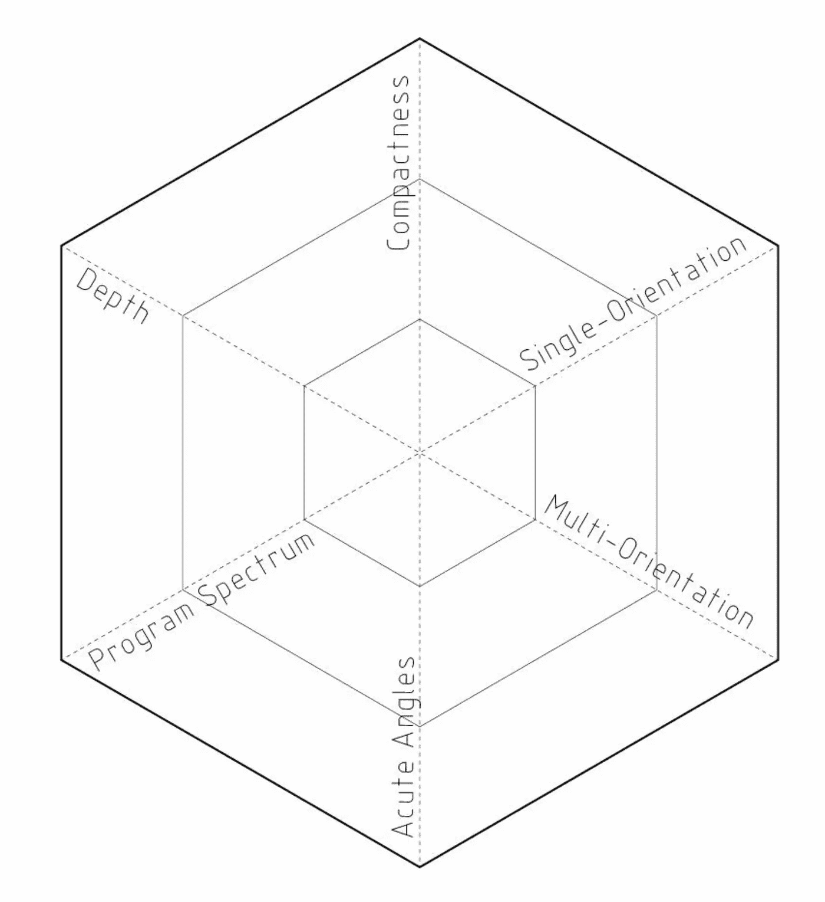
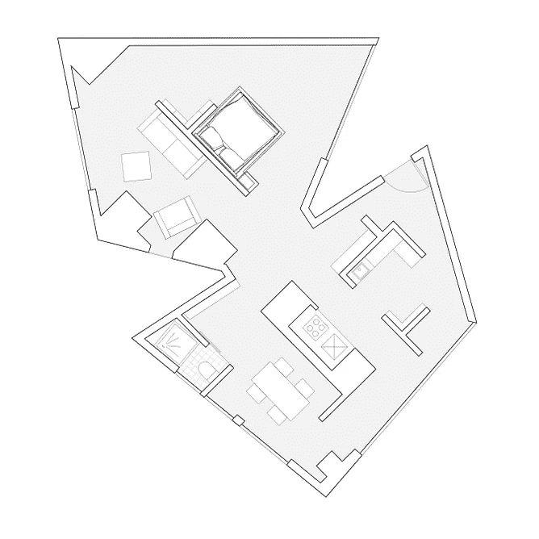

# 建筑和风格

> 原文：<https://towardsdatascience.com/architecture-style-ded3a2c3998f?source=collection_archive---------6----------------------->

## 人工智能在建筑领域的新前沿

[*斯塔尼斯拉斯·夏洛*](https://www.linkedin.com/in/stanislas-chaillou-b1931090/) *，哈佛大学设计研究生院| 2019 年 6 月 2 日*

**GAN-Generated Apartment Units, with Specific Styles** | Source: Author

*本文放出* [*我们的论文*](https://www.academia.edu/39599650/AI_Architecture_Towards_a_New_Approach) *的一部分，在哈佛开发，2019 年 5 月提交。这件作品是一个更大的作品的一个组成部分，调查艾在建筑上的开端，它的* [*历史背景*](/the-advent-of-architectural-ai-706046960140) *，它的潜在空间* [*组织*](/ai-architecture-f9d78c6958e0)*&*[*风格*](/architecture-style-ded3a2c3998f) *。*

我们 **在** [**上一篇**](/ai-architecture-f9d78c6958e0) **的基础上构建，我们的重点是围绕平面图的严格组织及其生成，使用人工智能，更具体地说是生成性对抗神经网络(GANs)。**当我们改进生成平面布置图的能力时，我们提出了模型固有偏差的问题，并在此提出将我们的研究扩展到简单的组织命令之外。**我们研究建筑风格学习，通过训练和调整**一系列特定风格的模型:*巴洛克风格、联排别墅、维多利亚郊区别墅、&曼哈顿单元*。除了每种风格的简单噱头，我们的研究揭示了风格的深层含义:不仅仅是它的文化意义，风格携带了一套基本的功能规则，定义了一个明确的空间机制，并控制着计划的内部组织。在这篇新文章中，我们将尝试证明建筑风格对平面布局构成的深远影响。

## 提醒:人工智能和生成对抗性神经网络

在研究人工智能及其对建筑实践的潜在整合的同时，我们建立了一个完整的生成方法，使用了**生成对抗神经网络****【GANs】**。当应用于二维信息生成时，人工智能的这个子领域已经被证明产生了巨大的结果。与任何机器学习模型一样，GANs 从提供给它们的数据中学习具有统计意义的现象。然而，它们的结构代表了一个突破:由两个关键模型组成，即*生成器*和*鉴别器*，GANs 利用两个模型之间的反馈回路来完善它们生成相关图像的能力。鉴别器被训练来从一组数据中识别图像。经过适当的训练，该模型能够区分从数据集中取出的真实示例、来自数据集外来的“*假*图像。然而，生成器被训练来创建类似于来自相同数据集的图像的图像。**当生成器创建图像时，鉴别器向其提供一些关于其输出质量的反馈。作为响应，发生器会进行调整以产生更真实的图像。**通过这个反馈回路，GAN 逐步建立其创建相关合成图像的能力，将观察到的数据中发现的现象考虑在内。

**Generative Adversarial Neural Network’s Architecture** | [Image Source](https://medium.freecodecamp.org/an-intuitive-introduction-to-generative-adversarial-networks-gans-7a2264a81394)

我们特别将这种技术应用于平面图设计，使用平面图的图像表示作为 GAN 模型输入和输出的数据格式。我们工作中使用的框架是 [Pix2Pix](https://phillipi.github.io/pix2pix/) ，这是一个标准的 GAN 模型，面向图像到图像的翻译。

# 一.组织

元素的空间布局是建筑学科的一个重要关注点。正如前一篇文章 中的 [*所证明的那样，这个练习并不是无足轻重的，可以按一系列步骤来离散化。每一步实际上都被一个训练有素的 GAN 模型所捕捉。对每个模型所学到的组织的仔细研究揭示了一个更深层次的偏见的存在，我们的学科称之为*架构风格*。打开我们的“世代堆栈”将帮助我们找到不同层次的风格，并分离出风格影响的基础。*](/ai-architecture-f9d78c6958e0)

## 管道和发电

首先，我们提出一条流水线，通过一个接一个地嵌套连续的模型，我们帮助建筑师生成一个连贯的房间布局(模型 I)和家具(模型 II)，最终将所有公寓单元重新组合成一个暂定平面图。

**Generation Pipeline**, Model I & Model II | Source: Author

对于整个流程中的每一步，我们都为用户提供了一个简单的界面。在左侧，他/她可以输入一组约束和边界，以在右侧生成结果计划。然后，设计师可以反复修改左边的输入，以优化右边的结果。下面的动画展示了为**型号 I.** 设置的这种界面和流程

*下面的界面也可以在下面的* [*地址试用。*](http://stanislaschaillou.com/thesis/GAN/unit_program/) *(性能取决于屏幕分辨率/浏览器版本— Chrome 建议)*

**Model I** Interface | Source: Author | [link](http://stanislaschaillou.com/thesis/GAN/unit_program/)

## 偏见，或风格的出现

T 考虑到一批生成的单元，**我们开始注意到我们的模型**的一些内在偏差:内墙结构始终如一地布置成一个正交的隔断系统，忽略了单元立面的潜在方向(见下图)。与此同时，项目的布局也始终如一，以至于“*服务于*”的空间- *浴室、厕所、壁橱、厨房* -被打包在地块的后面，而立面的奇怪几何形状被过大尺寸的客厅和卧室所吸收。

**Plan Wireframe** (*left*) & **Program Repartition** (right) of Generated Apartment Units | Source: Author

事实上，这些特征在我们最初的训练中随处可见。我们在这里将这种现实理解为对建筑学科核心概念的字面翻译:**风格**。

# 二。风格

我不去阻止这种偏见，而是努力创造一个*通用*或*目标*计划生成器——这不是我们在这里关心的——我们宁愿拥抱它，研究它的存在，最终利用它为我们所用。

为此，我们选择拓宽我们的研究，将其扩展到建筑风格学习。我们创造了一个新的渠道，使平面图能够从一种风格转换到另一种风格，从现代风格转换到巴洛克风格。

**Modern-to-Baroque** Translation & Subtraction | Source: Author

上面的例子更加揭示了建筑风格的深层含义:在这张 GIF 图中，我们从翻译的平面图(巴洛克)中减去了最初的墙壁结构(现代)。剩下的“ *poché* ”是巴洛克风格引发的添加:**它不仅仅是对现有人物墙的全新改造，而是对内部结构和空间组织的深刻重塑。**

事实上，我们在这里证明了 Farshid Moussavi 在她的书中所创造的风格的 [*功能。**每一种风格，除了其文化意义之外，对空间的处理方式也各不相同，对相似的限制也有不同的反应。***](https://www.amazon.com/Function-Style-Farshid-Moussavi/dp/1940291305)

**为了研究建筑风格的学习，**我们已经训练和调整了一系列特定风格的模型——*巴洛克、联排别墅、维多利亚郊区住宅、&曼哈顿单元*——能够模拟每一种特定的建筑风格。

对于每种风格，我们在下面显示了**初始训练集**(左)、**一些结果生成的公寓单元**(中)，以及相同公寓单元的物理模型(右)。

**Baroque** Apartment Units | Source: Author

**Manhattan** Apartment Units | Source: Author

**Row-House** Apartment Units | Source: Author

**Victorian** Apartment Units | Source: Author

在生成的单元中，我们可以在每种风格中识别出一些清晰的模式。对我们来说，这种适用于每种模式的“行为”是每种风格机制的直接翻译。不仅仅是在每个公寓单元上应用简单的纹理，每个模型都捕捉到了一系列的特征和规则。

**Characteristics Graph Template** | Source: Author

为了超越这种简单的观察，我们提供了每种风格的能力。每个型号都对应一系列优点&缺点，将它们记录下来将使我们能够真正评估每种风格的实际功能。此外，我们希望扩展我们对模型能力的理解，允许我们以后在给定一组新的约束和功能需求的情况下，有目的地使用每一个模型。

在 clear **中，我们提出了一个六轴图，反映了给定模型处理六种特定类型条件**的能力:*深度*、*紧凑度*、*单方向*或*多方向*(正面数量)、*锐角*(边界的尖锐几何形状)、*程序谱*(程序的宽度)。

在彻底测试了我们的四个模型之后，我们提出了以下图表…

**Styles’ Characteristics Graphs** | Source: Author

更具体地说，为了明确上述图表，**我们对每种风格的特征进行了深入的解释:**

## 巴洛克风格

*   可以处理深度和尖锐的几何边界。通过增加壁龛和壁龛，这种风格可以细分地块，并在地块的深度上雕刻出合适的空间。
*   然而，这种风格需要空间来展开其逻辑和内部结构，因此不能很好地响应紧凑的足迹。

## 曼哈顿风格

*   对单向或双向反应更好。
*   显示了广泛的编程范围。
*   在处理深度和尖锐的几何边界方面有问题。

## 排屋风格

*   可以充分利用紧凑的空间，将功能分散在楼层之间，并将每个功能限制在狭小的隐蔽空间内。
*   深度得到了很好的处理，并经常充满了垂直循环，周围的服务空间聚集。

## 维多利亚风格的郊区

*   轻松处理多个方向。
*   很好地处理了深度，通过居住在中心地带的服务空间。
*   展示了大量的房间和丰富的规划
*   但是，这种样式对紧凑轮廓线的反应很差，并且无法真正处理尖锐的几何边界。

**Building Massing** (North,East, South & West Elevations) | Source: Author

# 三。应用

最终，我们将所有这些直觉融合在一个最终的建筑项目中:一个位于曼哈顿下东区的大型住宅开发项目。地块的复杂几何形状给我们的设计增加了一定的复杂性。由于我们的聚集(上图)，我们获得了 380 个独一无二的公寓单元的目录(下图，右)。

# A.一栋建筑

**Sequence Of All Floors** (Left), Catalog of **Floorplates** (Center) and **Units** (Right) | Source: Author

我们首先尝试处理整个地板，每次使用不同的风格。下面显示的结果再一次揭示了谨慎使用风格的必要性，尊重每个环境的限制和特殊性。如果某些单位使用某种风格成功布局，其他单位则无法找到合适的内部组织。**通过在我们的公寓单元目录中选择不同的风格，我们希望为每一个特定的空间条件找到合适的答案。**

**15th Floor Processed Under Each Style**: *B*aroque *(Far*-Left), Manhattan (Center-Left), Row-House (Center-Right), Victorian (Far-Right) | Source: Author

了解每个 GAN 模型的优点和缺点，每个风格的潜力和缺点，我们现在使用最适合的模型处理每个公寓。每一层都变成了各种风格的拼布。**然后，我们的目标变成为每块瓷砖、每个单元组成我们的“马赛克”挑选，这是最合理的模型，将最好地处理约束。**在这个选择过程中，我们分离出一些结果选项，如下所示。

**3 Options: 10th Floor to 20th Floor**, Processed Differently | Source: Author

然后，我们缩小探索范围，精确选择所有地板的单元和风格，最终完成我们的最终设计。下面是三个典型的楼层…

**14th, 15th & 4th Story Floorplans** | Source: Author

**事实上，我们已经把风格变成了功能性工具**，能够解决我们开发过程中的特定情况。

然而，正如上述计划所建议的，**我们抛开某些约束，并做出明确的假设**。我们想澄清这些。

## 一.结构

这个结构留给了结构核心，而张力索沿着立面延伸。**因此，该计划不受垂直负载的干扰，并允许我们的算法自由生成每个单元的分区系统。**

***注*** *:回顾我们这一代管道，一个潜在的改进是将承重墙&柱的位置作为模型一的输入，这样我们的管道就可以让设计师控制建筑结构体系。或者，模型 I 可以分解成两个连续的模型，一个用于布置承重构件，另一个用于添加隔墙。*

## 二。效率的严格要求

**每种风格的丰富多彩和赋予我们模特的自由程度都没有解决我们行业中普遍存在的问题** : **空间效率**。然而，我们在这里主要关心的是最大化每种风格的表现力，让每个模型展开它的机制来展示它的“个性”。

***注*** *:为了调和 GANs 与效率，我们假设它们的输出构成了标准优化工艺的巨大初始化。参数化方法的典型缺陷是建立了一个过于宽泛的问题空间，再加上随机的初始化。在这些设置上运行的优化通常会收敛于局部最小解。我们的 GANs 背后的直觉带来了全新的初始化质量，在建立足够好的初始解决方案的同时，显著缩小了问题空间。*

## 三。聚集

体量的概念指的是我们建筑的外形。上述设计的非理性形式在这里意味着复杂性的触发，为我们的模型创造了实际的挑战。更理性的体量会对应更驯服的&现实的公寓单元设计。我们在这里的重点仍然是展示一个极端的情况，并测试我们的模型的极限。

# B.目录

**Generated Apartment Units Catalog** | Source: Author

我们 **最后翻到上面的单位目录，找到了我们对面的大楼。**由此产生的设计的连贯性和丰富性是惊人的。此外，在生成的单元中显示的"*智能*"或形式上的灵活性进一步证明了该方法的有效性: **GAN 模型确实可以封装一些以后可以使用的体系结构专业知识&风格，这取决于起作用的约束集。第二部分中描述的每个模型的“个性”在每个子集中都清晰可辨。**

为了结束这一部分，我们在下面提供了一系列的关键镜头，取自我们的目录。根据平面图的严格描述性质(*左*)，我们每次都将室内氛围的图像(*右*)联系起来，以此来协调我们的过程与建筑的更多体验性质。

**Baroque** Apartment Units’ Interior | Source: Author

**Manhattan** Apartment Units’ Interior | Source: Author

**Row-House** Apartment Units’ Interior | Source: Author

**Victorian** Apartment Units’ Interior | Source: Author

# 四。结论

如果说在严格意义上平面图是工程的产品之前，我们可以先把平面图看作是构图，那么**研究构图的驱动力也许是人工智能可以为我们提供一些有意义的答案的地方。根据这种直觉，我们在本文中证明了**建筑风格在更深层次上承载了一种隐含的空间机制，这种机制会显著影响任何平面布局的构成。很明显，选择一种特定的风格会产生空间上的后果。

在更基本的层面上，我们可以认为风格是建筑历史的副产品。如果在每一种风格中都有一套更深层次的功能规则，那么研究建筑历史就有可能理解这些隐含规则随时间的演变。能够封装每种风格可以让我们超越对先例的研究，并通过解开 GAN 模型(如这里训练的那些)的行为来补充它。他们模仿一些建筑潜规则的能力可以让我们解决嵌入建筑中的"无名质量"，这是克里斯托弗·亚历山大在他的书《永恒的建筑之道》中定义的。人工智能只是研究它的一种新方法。

## 最后，风格在每个 GAN 模型中的内在存在构成了最后一点:远离不可知论者的承诺&生成设计的客观实践，似乎风格不可逆转地渗透到任何生成过程的本质。明确地说:**风格不是附属的、表面的或装饰性的附录。风格是构图的核心。认识到这个证据是理解 AI 能给建筑带来什么的先决条件。换句话说，将不存在不可知论的人工智能架构，没有没有风格的机器，没有客观的生成式设计。相反，每一个模型或算法都有自己的特色、个性和诀窍。**

[*链接到 Academia.edu 的论文脚本*](https://www.academia.edu/39599650/AI_Architecture_Towards_a_New_Approach)

# 文献学

*   **文体的功能**，法希德·穆萨维，Actar 出版社，2016 年
*   **一种模式语言，关于合成形式的注释**，克里斯托弗·亚历山大，[链接](http://www.patternlanguage.com/ca/ca.html)
*   超越计算机的数字建筑
*   **数据驱动设计&构建**，兰迪·多伊奇，威利
*   **建筑智能，设计师和建筑师如何创造数字景观**，莫莉·赖特·斯汀森，麻省理工学院出版社
*   **建筑谷歌**，*超越网格——建筑&信息技术第 226–229 页*，Ludger Hovestadt，Birkhauser
*   **算法复杂性:凭空而来**，*复杂性，设计策略&世界观第 75–86 页*，Andrea Gleiniger&Georg Vrachliotis，Birkhauser
*   **代码&机器**，*代码，操作间&叙述第 41–53 页*，Andrea Gleiniger&Georg Vrachliotis，Birkhauser
*   **格罗皮乌斯的问题还是关于在建筑和艺术中揭示和隐藏代码**，*代码，介于操作&叙述第 75–89 页*，安德烈·格莱尼格&格奥尔格·弗拉赫利奥蒂斯，伯克豪斯
*   **软架构机器**，尼古拉斯·尼葛洛庞帝，麻省理工学院出版社
*   **建筑机器**，尼古拉斯·尼葛洛庞帝，麻省理工学院出版社
*   **地图的变质作用；或者输入 RoweBot** ，Andrew Witt，Log #36
*   **灰拳击**，安德鲁·威特，日志#43
*   **人类与人工智能中的暗示性绘画，**辜莞允·马丁内兹，哈佛 GSD 论文，2016
*   **启用替代架构:参与式设计的协作框架，** Nathan Peters，哈佛 GSD 论文，2017 | [链接](https://www.nathanpeters.us/enabling-alternative-architectures?fbclid=IwAR199qC4eGuxAx3V5EzOk5z-ZJOFpxAegeAJ2RtQoKm7g5lwbTy73e0yh4o)
*   **通过机器学习的建筑图纸识别与生成，**郑浩(宾夕法尼亚大学)，黄卫新(清华大学)，ACADIA 2018 [ [论文](https://www.researchgate.net/publication/328280126_Architectural_Drawings_Recognition_and_Generation_through_Machine_Learning) ]
*   **丹尼尔:自动分析和检索建筑平面图的深度架构**，迪维娅·夏尔马，尼廷·古普塔，奇兰霍伊·查托帕迪亚，萨梅普·梅塔，2017，IBM 研究，IIT·焦特布尔
*   **建筑平面图中的自动房间检测和房间标记**，Sheraz Ahmed、Marcus Liwicki、Markus Weber、Andreas Dengel，2012 年，凯泽斯劳滕大学
*   **使用空间索引的平面图自动解释**，哈南·萨梅特，Aya Soffer，1994，马里兰大学
*   **解析平面图图像**，塞缪尔·道奇，久旭，比约恩·斯坦格，2016，亚利桑那州立大学，乐天理工学院
*   **项目探索:生成性设计在建筑空间规划中的应用**，丹尼尔·纳吉，达蒙·刘，约翰·洛克，吉姆·斯托达特，洛伦佐·维拉吉，王雷，戴尔·赵和大卫·本杰明，2016，生活，欧特克工作室
*   **光栅转矢量:重访平面图转换**，刘晨，吴家军，普什梅特·柯利，川口恭誉·古川，2017，华盛顿大学，深度思维，麻省理工学院
*   **图形文档视觉理解的关系模型。建筑制图应用**，2014 年，巴塞罗那自治大学
*   **基于骨骼上下文的形状匹配与建模**，谢军，heng-Ann Heng，Mubarak Shah，2007，中佛罗里达大学，香港中文大学
*   **平面图解释的统计分割和结构识别**，Lluís-Pere de las Heras，Sheraz Ahmed，Marcus Liwicki，Ernest Valveny，Gemma Sánchez，2013，西班牙巴塞罗那计算机视觉中心
*   **结合使用统计和结构策略在平面图中进行无监督和独立于符号的墙壁分割**，llus-Pere de las Heras、Ernest Valveny 和 Gemma Sanchez，2014 年，西班牙巴塞罗那计算机视觉中心
*   **使用生成式对抗网络支持智能移动应用的路径规划**，Mohammadi，Mehdi，Ala Al-Fuqaha 和 Jun-Seok Oh。, 2018
*   **基于方形树形图算法的平面图自动实时生成**，Fernando Marson 和 Soraia Raupp Musse，2010 年，PUCRS
*   **建筑程序建模**，帕斯卡·穆勒，彼得·旺卡，西蒙·海格勒，安德烈亚斯·乌尔默，吕克·范·古尔，2015，苏黎世联邦理工学院，亚利桑那州立大学
*   **建筑空间规划的生成式设计**，Lorenzo Villaggi 和 Danil Nagy，2017，Autodesk Research