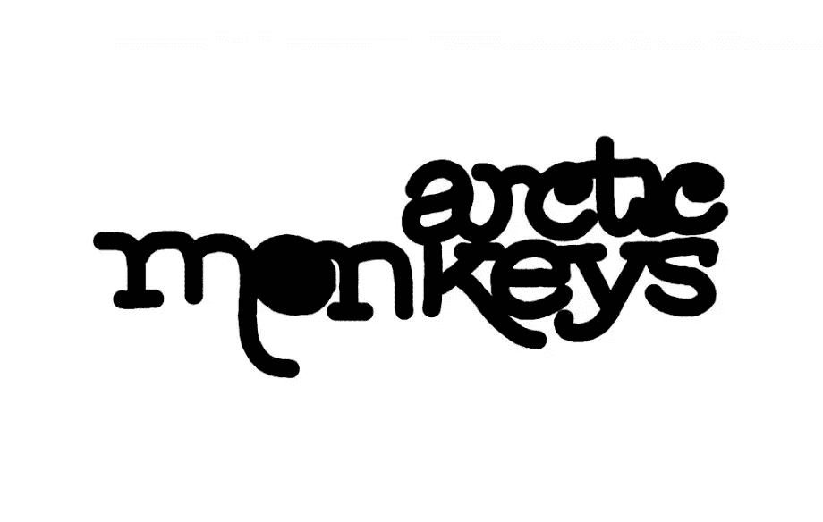
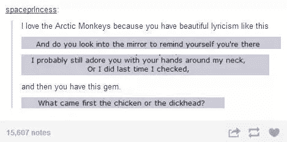
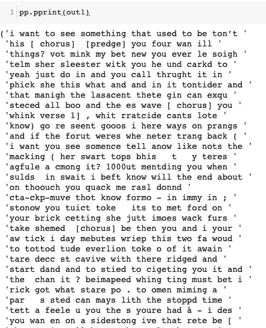
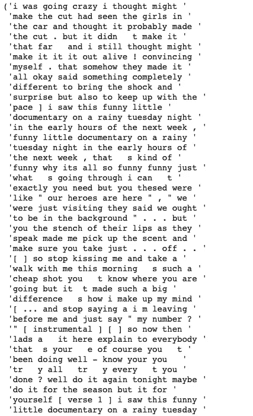
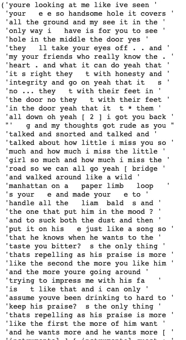
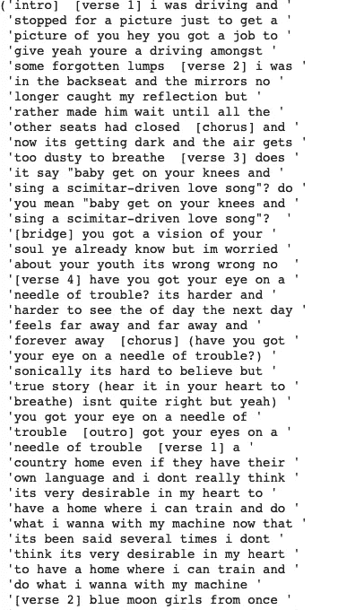
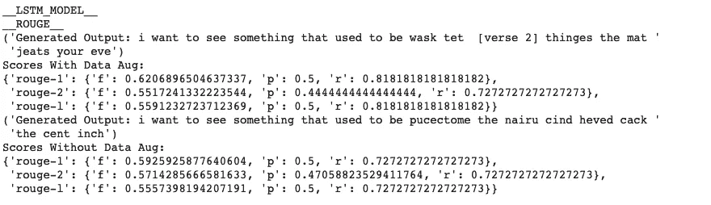
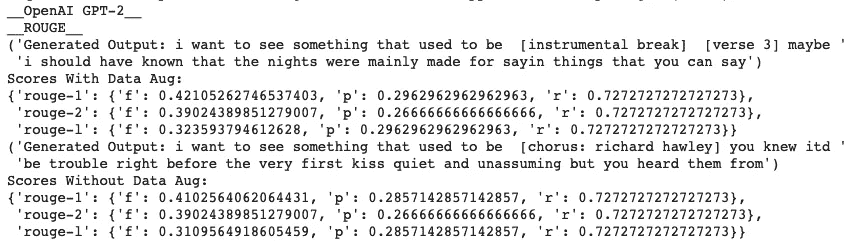

# 具有数据增强的北极猴子歌词生成器

> 原文：<https://towardsdatascience.com/arctic-monkeys-lyrics-generator-with-data-augmentation-b9b1f7989db0?source=collection_archive---------8----------------------->

AM:不要相信炒作。艾:嗯..

# **简介。**

外部发生器很酷，对吗？大约两年前，当我第一次看到类似于“莎士比亚发电机”的东西时，我惊叹不已。

通常，文本生成器将是具有递归神经网络或 LSTM 的语言模型，并尝试基于先前的种子词来预测接下来的词。

所以我决定基于北极猴子的歌词创建一个歌词生成器。这个想法分为三个主要部分

*   创建数据语料库并清洗数据
*   文本数据扩充
*   语言模型和生成器

# 创建数据语料库

我发现乔纳森·戴顿的博客真的很有帮助。它使用 spotifyAPI 获取 spotify 上的艺术家 ID，列出所有专辑 ID，获取所有曲目 ID 的列表。然后使用 GeniusAPI 保存歌曲的所有歌词。这里有一些获取数据的代码片段。

依赖关系:

*   *歌词天才*

# 文本扩充

该数据集包括 144 首歌曲，即 167887 个单词。我真的很想对亚历克斯写的歌曲数量发表评论，这些歌曲甚至不包括上一张皮影戏和他的个人专辑中的歌曲——我开始分心了！

如果数据集没有语言建模任务预期的那么大，可以应用文本扩充。

这里使用的两种类型的文本增强是

*   替换-用语言模型通常预测的单词替换当前单词。
*   插入—使用单词作为预测下一个单词的特征。

我为此使用了 [nlpaug](https://pypi.org/project/nlpaug/) ，在这篇文章中可以找到一个非常好的概述——马志威
的[文本数据扩充库](/data-augmentation-library-for-text-9661736b13ff)。为了生成歌词的合成数据，我认为使用单词级模型更有益，并且像“naf.sequential”这样的流增强器用于顺序应用不同的增强。

我使用了两种类型的增强——Bert aug 和 FasttextAug。它们都基于上下文插入/替换相似的单词。BertAug 使用 [BERT](/how-bert-leverage-attention-mechanism-and-transformer-to-learn-word-contextual-relations-5bbee1b6dbdb) 语言模型来预测被替换的单词或者在插入的情况下预测下一个单词。FasstextAug 基于上下文化的单词嵌入替换或插入单词。

【BERTAug 插入和替换后的结果

> 进:总有更高更机智的人
> 出:*是*总有更高更机智的人

*weeeirrrdddd..但听起来差不多是对的。*

【FasttextAug 插入和替换后的结果

> 总有更高的人更有智慧

还有一件有趣的事情发生了，由于子词嵌入，FasttestAug 的未知词没有 ValueError 异常——我使用 wiki-news-300d-1M-subword.vec 来加载模型——

除了——嗯——*“I . d . s . t . I . d . s . t . I . d . s . t . I . d . s . t”，“啾啾！啾啾！啾啾！”和“咻-咻-咻-咻-咻”。*我老实说不怪。

扩充后，语料库中有 334524 个单词。这意味着新数据是原始数据的两倍。

创建扩充数据集确实花了不少时间。(大约一小时左右)我确实有。最终文集[的 txt 文件上传到 google drive](https://drive.google.com/file/d/1g3WkrGCmU5IzMGoIqWMjYRgpoHETbVLl/view?usp=sharing) 。

# LSTM 模型

一个理想的文本生成模型将接受一个种子单词/句子，并给出单词的历史记录 *w0，…，wk* ，它将预测下一个 *wn+p* 单词。因为递归神经网络和 LSTMs 具有记忆，所以它们基于先前的状态计算下一个观察值。

LSTMs 是特殊的，因为它们有输入、输出和遗忘门以及单元存储器。因此，它们能够在更长的时间间隔内存储信息。这里我用了一个 0.5 辍学和 0.5 [经常辍学](https://arxiv.org/pdf/1512.05287.pdf)的 LSTM。

目前，有一些非递归模型在使用转换器的语言建模中表现非常好，比如 OpenAIs [GPT-2 文本生成模型](https://openai.com/blog/better-language-models/)。

## 结果:

> 结果:

# 使用 OpenAI 的 GPT-2 进行微调

我使用了[GPT _ 2 _ simple](https://github.com/minimaxir/gpt-2-simple)——“一个简单的 Python 包，它包装了用于 [OpenAI](https://openai.com/) 的 [GPT-2 文本生成模式](https://openai.com/blog/better-language-models/) l 的现有模型微调和生成脚本”

将带有 BERTAug 和 FasttextAug 的原始数据集合并并导出为文本以形成 *am_corpus.txt*

> 带有随机前缀的结果:

Generated Lyrics

为了评估这个结果，我使用了[胭脂](https://www.aclweb.org/anthology/W04-1013)。它代表面向回忆的替角，用于 Gisting 评估。我发现——[什么是 ROUGE，它是如何对摘要任务进行评估的？](http://What Is ROUGE And How It Works For Evaluation Of Summarization Tasks?) —对了解胭脂真的很有帮助。

本质上，GPT-2 模型生成的歌词比 LSTM 模型生成的歌词更有意义！虽然公平地说，LSTM 模型没有得到一个战斗的机会，只有 5 个纪元的训练。

*   [谷歌 Colab 笔记本](https://drive.google.com/file/d/1ZY66gnohTa6mYJZNnVGLELIVKPz47RCt/view?usp=sharing)为歌词生成器。

# 参考

*   [文本](/data-augmentation-library-for-text-9661736b13ff)的数据扩充库[马志威](https://towardsdatascience.com/@makcedward)
*   [是什么让一些 blink-182 歌曲比其他歌曲更受欢迎？第 1 部分](http://jdaytn.com/posts/download-blink-182-data/)乔纳森·戴顿
*   OpenAI 的 [GPT-2 文本生成模型](https://openai.com/blog/better-language-models/)。
*   [递归神经网络中基于理论的辍学应用](https://arxiv.org/pdf/1512.05287.pdf)

**编辑:添加评估指标和更多结果。**