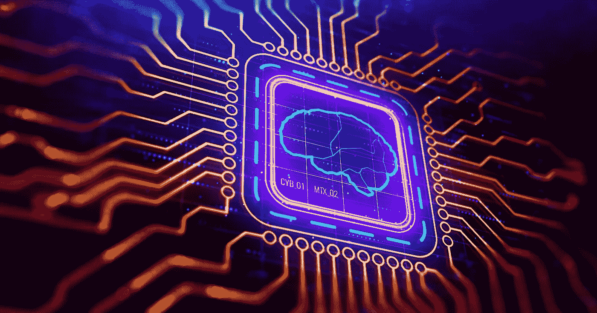
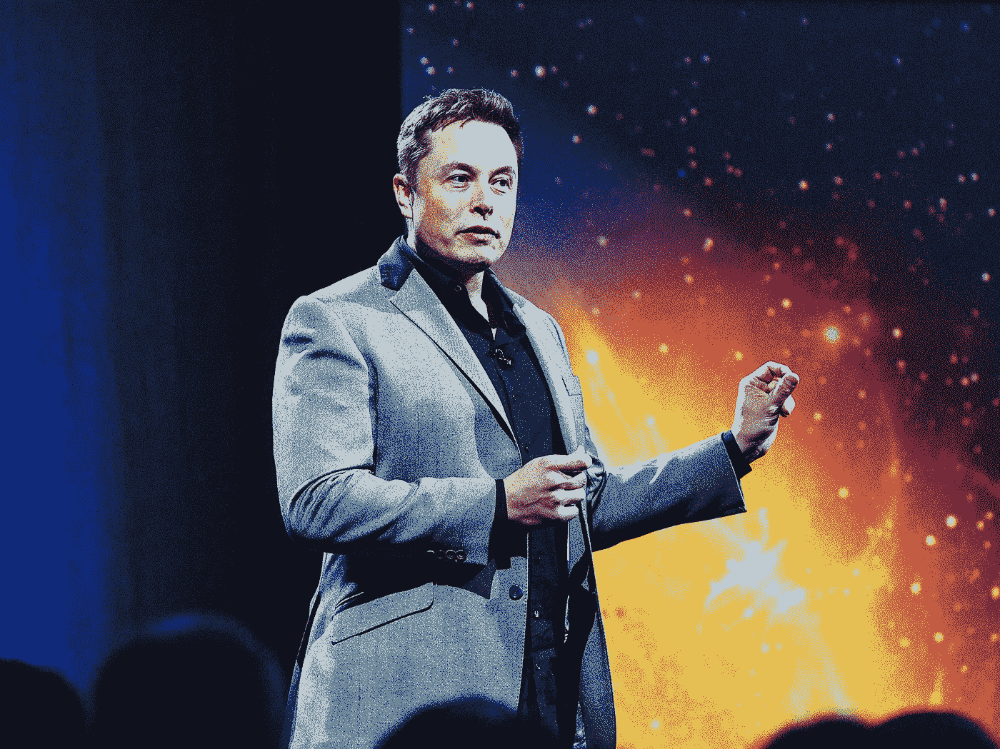
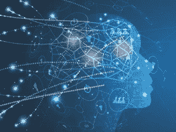
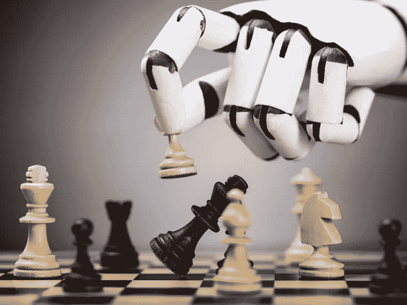

# 人工智能‘思维机器’真的会思考吗？

> 原文：<https://towardsdatascience.com/are-ai-thinking-machines-really-thinking-1fa9d758de6d?source=collection_archive---------16----------------------->

自从第一台通用计算机开发以来，科学家们就假设存在人工意识。一个可以反映人脑内部复杂互动的人造系统。虽然一些公众人物[公开对即将到来的电子人末日](https://www.vox.com/future-perfect/2018/11/2/18053418/elon-musk-artificial-intelligence-google-deepmind-openai)感到恐惧，但对大多数人来说，人工智能现在指的是可以帮助我们更快完成工作的工具和应用程序，而不是机器人和人造人。人工智能现在主要被认为是特定类型技术的狭义使用，不同于人工通用智能(AGI)，后者是一个更广泛的概念，包括合成意识。

Elon Musk: right to be afraid?

考虑到人工智能领域在过去十年左右的发展，以及大规模的持续投资，我们在通往终结者、[复制人](https://en.wikipedia.org/wiki/Replicant)和 R2-D2 的道路上走了多远，以及出现的问题，都值得探索。许多科学家和思想家相信 [AGI 是基于普遍性](https://aeon.co/essays/how-close-are-we-to-creating-artificial-intelligence)概念的科学必然性，而其他人则认为存在本体论[物理局限性](https://plato.stanford.edu/entries/neuroscience/)阻止了意识的再造。这种分歧实际上是哲学上的分歧；没有经验证据全面支持这两种假设。显而易见的是，科学家在再造甚至改进某些人类技能方面极其有效，但在复制其他技能方面却完全失败。

‘Artoo’ even had a sense of humour.

人工合成意识可能类似于类人智能的想法引发了令人难以置信的伦理和道德问题。这是一个庞大而有趣的话题，我不会在这里讨论。相反，我将考虑发展这样一个实体的实际障碍，以及它们的哲学含义。

人工智能是当今技术研究的主要发展趋势之一，以至于它渗透到了几乎所有其他技术。随着高级分析和自动化变得更加高效和可靠，人工智能将继续重新定义企业的运营方式，这意味着未能适应的公司将面临落后的风险。像自动驾驶汽车中发现的新人工智能技术，或者可以构建全新原创新奇事物的生成性对抗网络，可能会导致以前无法想象的应用和想法的发展。

这些进步是基于“思维机器”的核心思想；可以复制人脑某些认知功能的软件。人工智能没有单一的定义(甚至“智能”一词也是主观的)，但它通常被理解为是指能够感知其环境以实现其可编程目标的应用程序。能够*学习*的机器，即开发超出硬编码的理解能力，是人工智能发展的最大子集之一。机器学习或深度学习算法通常基于人工神经网络。这些是专门模仿人脑工作方式的计算系统。

我们称它们为“思维机器”,尽管它们不像人类那样思考。他们感知他们的环境，但是他们没有*意识到它们。计算机配备了*内存、*，就像有意识的生物一样，现代人工智能系统可以*根据信息输入预测*或*预测*(这是人工智能可以构建预测模型的方式之一，例如用于商业或医疗保健)。这些能力都被认为是意识的必要方面，但机器只能以极其狭窄的形式实现它们。人工智能是不灵活的，除了它明确的、有限的编程之外，它不能预测或记忆。例如，一个旨在预测道路交通模式的高度先进的机器学习算法无法重新利用其智能进行对话或玩游戏。*

Machines can be programmed to learn how to play chess but would be stumped if presented with your accounts.

以这种方式促进人工智能的灵活性似乎是一个巨大的挑战。然而，这可能不是意识最具挑战性的方面。主观体验的概念，也就是内在的、通常无法解释的精神状态和反应，经常被心理治疗师和哲学家认为是意识的“大问题”。托马斯·内格尔写道:

*“…一个有机体具有有意识的精神状态，当且仅当有某种东西就像那个有机体的***——某种东西就像那个有机体的***。”***

**换句话说，机器思考是不够的——它必须知道自己在思考，并且除了思想之外，还要有自己的存在感。笛卡尔有一句名言“我思故我在”，用来说明他有一个*头脑*，不同于物理思维的大脑。这个想法经常与 [*感受性*](https://en.wikipedia.org/wiki/Qualia) 的概念联系在一起——对感觉的主观解释，既不可解释也不可预测。哲学家们经常会描述我们感知红色时所体验到的疼痛感觉的“疼痛感”或天生的“发红感”。我们可以科学地描述光线与我们眼中的视锥细胞接触时会发生什么，我们可以将其与我们见过的其他类似颜色进行比较，但没有办法让两个人客观地比较他们对红色的个人体验。对于科学家来说，这个概念本身就有问题，他们大多倾向于忽略它。然而，它是许多无形的、不可定义的抽象概念中的一个，这些抽象概念无疑存在于人的头脑中，也存在于人的头脑之外，无法用科学来定义。**

****

**Red: perplexing philosophers for generations.**

**像创造力、人类欲望、社会认知(或共享理解)、意义和自由意志这样的抽象概念是任何有意识存在的必要考虑因素，但已经证明它们本身极其难以数学形式化。这使得它们不可能翻译成计算机代码，因此也不可能翻译成机器代码。它们不能用机器学习或深度学习算法来解释或再造；无论数据集有多大，软件都无法理解或获得人类特有的特性，如同情心或敏感性。要做到这一点，必须用内置的模型对其进行编程，用程序能够理解的术语来描述这些概念所代表的内容。**

**开发正确的知识结构是人工智能研究人员提高人工智能效率的一个领域，以进一步补充日益庞大的数据集。然而，科学家们要准确地将无形的、情绪化的高级现象描绘成正式的实例还有很长的路要走。**

**现代计算系统的潜在能力可以用一句格言(也许过于简单)来概括；“如果你能理解一项任务，你就能对它进行编程”。一方面，这表明了巨大的应用潜力，这种潜力来源于人类理解的全部广度并受到其启发。本质上，几乎所有可知的和明确的事物都可以用数学方法形式化和程序化。另一方面，它很自然地将我们的探索局限于植根于物质的明确概念，而不是形而上学和哲学的领域。**

**所有观点都是我自己的观点，不与甲骨文共享。 [请随时在 LinkedIn 上联系我](https://www.linkedin.com/in/mark-ryan101/)**