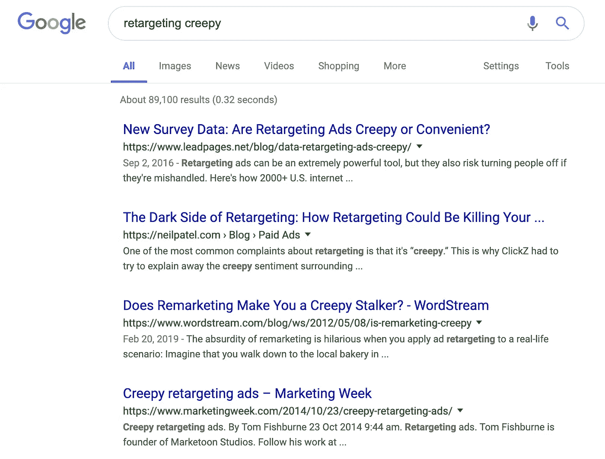

# 图表:数据隐私、营销投资回报率和令人毛骨悚然

> 原文：<https://towardsdatascience.com/are-creepy-marketing-methods-really-worth-the-risk-8de99556adea?source=collection_archive---------9----------------------->

## 如果你的数字营销策略令人毛骨悚然，你需要选择退出

ROI vs Creepy — A High-Level Diagram

在最近的一次行业活动中，我被邀请参加一个讨论基于位置的营销解决方案的小组。该小组面对 100 名当地营销专业人士，他们的任务是帮助当地企业或在当地有零售业务的国家品牌。他们通过各种数字营销活动将更多的人流量带到他们的实体场所。这是我们这个时代一些最重要的数据隐私问题的战场。

舞台上有我们三个人，老实说，这不是你友好的讨论之一。因为消费者位置数据在将潜在访客定位到特定商店位置方面非常有帮助，所以这种实时数据令大多数营销人员着迷。想象一下，每一个走在街上的消费者都被广告轰炸，告诉他们在哪里可以吃午餐、买咖啡，或者在哪里可以找到最便宜的汽油。谁不想要那种便利和好处呢？

事实证明， ***我不要。***

而台上所有的营销人员**做**。

# 你的位置和适当的价值交换

基于位置的营销的好处是显而易见的。你有一个消费者，他选择进入他们手机上的一个应用程序，这个应用程序深深埋藏在他们的隐私政策中，有权向第三方分享或出售这些数据。这极大地提高了针对该消费者的定位能力。因此，当你换轮胎时，你的孩子下载的用来打发时间的看似无害的游戏现在可以跟踪你的一举一动，并将其出售给营销人员，他们可以向你的浏览器发送广告，给你发送短信，或通过他们的应用程序联系你。有了这些信息(通常加上一天中的时间)，大多数营销人员可以提高他们的投资回报率。

但是他们应该吗？

这里的问题是关于适当的价值交换。当客户下载你的应用程序或访问你的网站(弹出窗口同意除外)时，他们期待某种形式的价值交换。消费者希望要么你的复古俄罗斯方块风格的游戏很棒，要么你的应用程序提供的天气信息是准确的。从本质上说，他们期望一些不花钱或免费的东西能很好地工作，并为他们提供价值。作为交换，他们可能会期待应用程序中的一些广告，偶尔的应用程序内购买优惠，或者其他一些对他们的钱包或注意力的成本。你设计的快速同意条款和隐私(被忽略)或**旨在“推动”消费者前进**甚至没有真正开始公平地表达价值的不平衡。

 [## 超级人类推动我们通过监视资本主义——一本畅销书文氏图

### 我喜欢维恩图，它们是终极的博学工具。

medium.com](https://medium.com/@wardchristianj/super-humans-nudging-us-through-surveillance-capitalism-a-bestseller-venn-diagram-9a1a6290e727) 

消费者没有想到的是，你的公司使用他们的实时位置数据来出售或与第三方共享。别告诉我他们不在乎。美国全国广播公司和华尔街日报的一项新研究清楚地表明，93%的美国人希望公司明确获得使用他们个人数据的许可。如果消费者知道你在跟踪他们，然后出售这些数据(不管你在条款中隐藏的匿名承诺)，他们可能会说“不”。在我们的行业小组讨论中，我的共同小组成员提出了如下评论:

> “老实说，只要人们得到了价值，他们就不会介意。”
> 
> "民意调查显示人们不关心隐私问题。"
> 
> “总体而言，人们不会为脸书或其他‘免费’应用付费，因此对位置追踪和定位没什么意见。”

这些说法的问题在于，它们倾向于引用【2017 年【Morning Consult 的旧民意调查，该调查称 67%的美国人不愿意为减少或删除广告而支付服务费用。这项调查似乎得出结论，[与互动广告局](https://www.iab.com/wp-content/uploads/2016/05/Value-of-Targeted-Ads-to-Consumers2.pdf) (IAB)的类似发现一样，能够在正确的时间将正确的广告瞄准正确的人是物有所值的理想结果。当然，IAB 在同一报告中也指出了以下几点…

> “近一半的人认为定向广告的最大好处是减少了不相关的广告”

这意味着，当被要求在更一般的广告和更有针对性的广告之间进行选择时，这些调查的受访者基本上都要求减少广告的数量。这类似于问…

> “你愿意被 100 只蜜蜂簇拥着，还是只有 20 只蜜蜂知道你喜欢户外生活方式？”

当然，我们选择 20 个，但是老实说，给我看一个实际上减少他们投放广告数量的营销商，一旦他们可以更有效地瞄准你。从来没有人这么做过。他们只是展示更多(现在有针对性的)广告。

更重要的是，被引用的研究不是关于基于位置的营销。它们是关于通过饼干、电视、路边广告牌和印刷广告的在线跟踪广告。这些研究不是关于实时的、基于位置追踪的广告。我认为这正是为什么他们不能被用作消费者对位置追踪态度的有效代理。在线追踪一个人的价值交换不同于基于位置的离线追踪。《纽约时报》关于追踪消费者位置的应用程序的文章对此进行了深入阐述，这是剖析真实价值等式的一个重要里程碑。

 [## 你的应用知道你昨晚在哪里，而且他们不会保密

### 地图上的数百万个点描绘了高速公路、小路和自行车道——每一个点都沿着一条…

www.nytimes.com](https://www.nytimes.com/interactive/2018/12/10/business/location-data-privacy-apps.html) 

# 营销投资回报率 vs“令人毛骨悚然”

在探讨基于位置的数据定位的潜在危害之前，也许有必要解释一下(广义上)营销人员是如何走到这一步的。首先，花在营销上的每一美元的投资回报(ROI)之间的平衡是一个难题。对于营销人员来说，他们的工作是推动流量(包括数字流量和步行流量)，更多数据和更好数据的吸引力是难以忽视的。他们不断希望转向更有针对性的解决方案，因为投资回报数字将会增加(如上图右侧所示。)

不幸的是，这必须用 y 轴来衡量，这是随着时间的推移，营销变得更加令人毛骨悚然的趋势。像这样的图表对每个公司来说都是独一无二的。与利用位置数据的快餐车相比，一家大型 CPG 公司可能会从经典营销策略中获得更好的投资回报，因为他们的位置不固定。不要纠结于线条的长度，也不要纠结于它们是否符合比例。更重要的是，关注每一步的主要数据类型。

在寒冷的几个月里，我们如何向东北地区的消费者推销雪铲。没有人真的介意这一点，我认为这一点也不令人毛骨悚然。事实上，这似乎是一件合乎逻辑的事情，许多营销人员从这些非人性化的综合努力中获得了绝大部分投资回报。另一个例子是在客户可能会花时间的地方购买广告。例如，如果你在银行业经营一家金融科技公司，你可以假设访问《美国银行家》( *disclosure:我为 SourceMedia 工作，是《美国银行家》*的所有者)、《金融时报》和《华尔街日报》网站的观众是很好的选择。

Your Weather & Location Apps are Stalking You.

从这里开始，大多数公司沿着 y 轴向上移动到 cookies。为什么？Cookies 真的可以帮助你从聚合达到个性化的下一个层次。它们允许在个体水平上理解数据点，如感兴趣的主题或先前的浏览会话数据。从很多方面来说，这是走向令人毛骨悚然的第一步，从这里开始是一个多么危险的斜坡。使用 cookie 数据有允许的方式，也有[过于激进的方式。](https://www.macworld.com/article/3152056/how-to-kill-the-evercookie-and-supercookie-the-cockroaches-of-tracking.html)无论如何，公众到目前为止还不一定会对 cookie 表示强烈抗议，尽管监管机构开始真正打击 cookie 的使用，但公众总体上似乎将此视为内容和价值之间正常价值交换的一部分。

然而，在下一个层面上，[我们看到了公众的一些真正担忧。由于我们使用 cookies 来跟踪和关注在线消费者，他们肯定有很多话要说。卡斯帕床垫广告已经跟随你几个星期了，即使你已经买了床垫，你也无法逃避它。Twitter 上有一些搞笑的例子，展示了重新定位出现偏差的例子。](https://www.forbes.com/sites/forbescommunicationscouncil/2018/03/22/reset-the-rules-of-retargeting/#541c5fc2299c)

Seriously, how do you even sleep at night, Casper? (SOURCE, PUBLIC TWITTER FEED)

类似的情况是，人们似乎接受他们在一处地产上被监视，但他们并不期望从那里开始就一直被跟踪。

> 当我走进现实世界中的百思买时，穿着亮黄色衬衫的商店员工并没有跟着我出了门回到我的家。我会注意到，类似地，人们会注意到重新定位。

这就是为什么我认为从 cookies 到重新定位的转变是消费者心目中的一个重要区别。**此时，这种活动转变为主动监视**，从主动监视到目前为止，要被动得多。消费者几乎立刻就意识到了这一点。有 90，000 个关于“重新定位令人毛骨悚然”的搜索结果，许多人解释说，当你过度使用这种策略时，愤怒可能是消费者的自然反应。

SOURCE: Google Search Results

尽管如此，仅仅是查找如何使用重定向广告就有超过 900 万个结果，因为它们是有效的。事实证明，跟随潜在客户重新介绍你的产品或服务是可行的，但这可能会很快失控。在潜在客户(或卡斯帕床垫的现有客户)访问你的网站很久之后，你还应该跟踪他们吗？

# 基于位置的营销数据

这使我们在我们绘制的图表上从重定位跳到实时的、基于位置的跟踪。而且，虽然图表没有按比例绘制，但我要说这是在“令人毛骨悚然”的 y 轴上的一个巨大飞跃。

对大多数人来说，在现实世界中被跟踪是不可接受的。它跨越了太多的界限，是我们技术的延伸。在跟踪孩子的地方做得更深入。去重读《纽约时报》的那篇文章吧，关于你的孩子在学校时从他们的设备上发出的所有定位信号，这是令人恐惧和不可接受的。

现在，位置数据空间中的许多人说，“等等，我们只使用匿名数据。”不幸的是，这也不准确。说数据是匿名的并不等于说它不能被轻易识别。仅仅因为他们在系统中使用唯一的标识符而不是某人的真实姓名，并不意味着这是匿名的。事实上，对于基于位置的数据，这与事实相去甚远。

 [## 谷歌面临 GDPR 对“欺骗性”位置跟踪的投诉

### 一个欧洲消费者监督组织对谷歌提出了隐私投诉——认为该公司使用了…

techcrunch.com](https://techcrunch.com/2018/11/27/google-faces-gdpr-complaint-over-deceptive-location-tracking/) 

人是有模式的。你醒来的地方，你上下班的地方，你喝咖啡的地方，你工作的地方。通常一周有 5 天，你在同一个地点起床，每个追踪你位置的应用都知道这一点。通过简单的公共记录财产或地址信息，从你的手机传回的 GPS 坐标，公司可以确定确切的地址和该地址的所有者。此外，如果您大部分时间都在同一个办公室或工作地点上班，这还可以确认您的身份。知道家庭地址和公司地址通常足以在基于位置的数据库中“重新识别”任何人。

# 等等，你怎么知道我的位置？

最近，Foursquare 推出了一款名为“[超趋势](https://9to5mac.com/2019/03/10/foursquare-hypertrending-feature/)”的新应用:

该热图旨在向您展示和分享来自使用其应用程序或利用其位置服务工具的人们的信息。在奥斯汀 SXSW，你可以看到热点在哪里，如果你是一个内向的人，最好不要去哪里。这些地图利用了 Foursquare panel 的数据，换句话说，它不一定拥有每个人的位置，更多的是利用一群选择加入的用户来推断数据的趋势。如果不从数学上探讨这种方法的问题，主要问题是 Foursquare 完全理解这里存在隐私问题，并使用这款应用程序作为与客户对话的方式。

一位行业专业人士的初步回应完美地表达了这种担忧:

Does GDPR Demand Apps Sharing Data to be Identified? (Source: Public Twitter Feed)

许多人仍然不明白的是，像 Foursquare 这样的公司向其他应用程序提供的 SDK 或软件开发工具包允许他们访问你的位置数据。换句话说，你可能不使用由 Foursquare 构建的或以 Foursquare 为品牌的应用程序，但你肯定仍然有他们的代码在你最喜欢的应用程序的后台运行。这也绝不是在敲打 Foursquare。他们已经建立了一个出色的框架来嵌入位置感知功能，问题是谁知道这一点，以及它的用途是什么？

问题比比皆是:

> 哪些平台使用 Foursquare 数据和位置服务？
> 
> 然后 Foursquare 把这些数据卖给谁？
> 
> 向应用程序提供这些位置服务的其他平台有哪些，我如何选择退出？

许多人意识到 Foursquare 正在试水，但也微妙地揭示了他们的 SDK 或位置服务平台正在不仅仅是他们自己的应用程序的背景下运行。正如他们所说，“[来自我们自己的应用程序或使用我们技术的其他应用程序的混合数据。](https://enterprise.foursquare.com/intersections/article/introducing-hypertrending/)

事实是，他们向世界展示的“令人毛骨悚然”的地图视图是每个基于位置的跟踪系统的一部分。Foursquare 只是首批让世界真正看到(并使用)他们多年来拥有的数据的后端视图之一。当处理位置数据的平台试图筹集资金或“惊艳”投资者或合作伙伴时，他们通常会展示这种类型的地图，对用户进行实时或接近实时的位置跟踪。我见过无数来自定位服务平台的“酷”地图视图，它们通过利用手机定位 pings 或 Wi-Fi 热点信号跟踪来显示人类群集效应。

## 伤害？

所有这些的真正问题是“有什么危害？”实际上，Foursquare 正在展示这一点，并声明所有这些数据都是完全匿名的，因此，在使用中是可以接受的。那可能是真的，也可能不是。例如，我当然认为我们在城市规划和紧急疏散或其他民事演习中看到的一些研究值得抓住机会。通过利用实时位置统计数据，以更智能的模式安排车辆的路线，甚至交通模式也发生了巨大变化([或者，不那么智能的](https://mashable.com/article/is-waze-apple-maps-google-safe-in-the-snow/))。

我们看到的危害不一定是 SXSW 的热点匿名地图。坏处是这永远不会停止。危害在于，应用程序不会通过访问个人的位置数据来匿名化个人，而是根据他们的位置专门针对这些个人提供广告和其他优惠。虽然 Foursquare 似乎没有分享使用其位置服务的每个应用程序的列表，但你可以肯定的是，他们正在使用位置数据，专门针对那些进出特定位置半径点或多边形的人投放广告。

底线是，你真的需要考虑这些活动，以及投资回报是否值得你的(目标)观众的潜在愤怒或担忧。仅仅通过优化上图中的蓝色阴影区域，就可以获得大量的投资回报。这些活动大多被你的受众接受为“经典”的营销活动，甚至是合乎逻辑的。

数据隐私正在继续发展，在美国，[广告集团正联合起来游说国会](https://adage.com/article/digital/ad-industry-groups-band-together-influence-congress-data-privacy/2162976)颁布一项国家隐私法。虽然他们的努力是帮助公司避免各州的隐私法规的拼凑，但营销人员必须接受他们在追求投资回报时已经越过了界限。数据隐私是关于理解人类的基本权利，基于位置的数据是一个关键的转折点。

 [## 了解数据的真实性质及其主体的权利

### 这是关于企业数据战略变化本质的三篇系列文章中的第二篇。摘自数据…

www.information-management.com](https://www.information-management.com/news/understanding-the-true-nature-of-data-and-the-rights-of-its-subject) 

在以后的帖子中，我们将讨论同意和围绕同意的价值主张交换。明确地说，当消费者主动允许并有意让你的公司跟踪他们的物理位置时，这不是问题。事实上，它可以是用户和你的公司之间的一个伟大的伙伴关系。我只是愿意打赌，价值交换，用户从你的公司分享他们的实时位置数据中获得的等式目前是错误的。如果他们真的知道你在追踪这些数据，他们可能会要求你的广告收入分成或其他类似的价值。他们没有问的事实恰恰突出了他们不知道你在用这些数据做什么。

同样，如果你在寻求投资回报的过程中采取的营销策略进入了“令人毛骨悚然”的领域，**我们强烈建议你退出**。