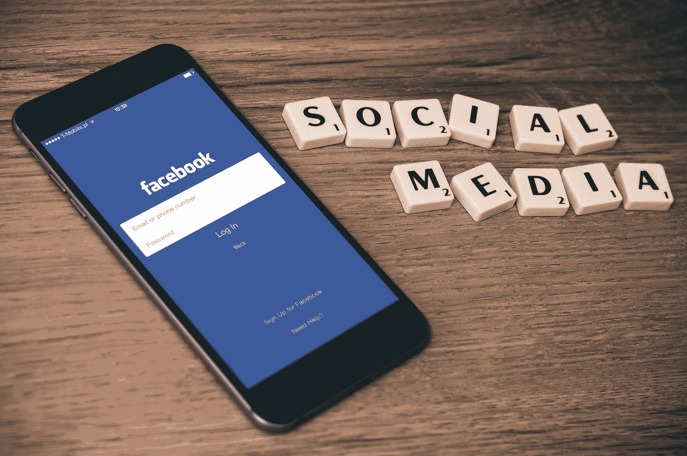

# 信息信托理论与市场

> 原文：<https://towardsdatascience.com/are-data-hoarders-the-modern-day-fiduciaries-d6a9c01b3990?source=collection_archive---------20----------------------->

Photo by [Firmbee.com](https://unsplash.com/@firmbee?utm_source=medium&utm_medium=referral) on [Unsplash](https://unsplash.com?utm_source=medium&utm_medium=referral)

不断变化的世界需要新的社会观。鉴于以技术为基础的公司的影响和审查，我们必须分析新提出的法律理论。消费者经常听说脸书的违法行为，最近导致美国联邦贸易委员会对 T2 罚款 50 亿美元。消费者委托这些机构充分保护个人信息。此外，这些机构继续向公众展示自己是负责任和正直的组织，致力于为用户提供最佳体验。它们为消费者提供了曾经被认为不可想象的服务，但这种服务是有成本的。他们的服务、公众表现和广泛的数据收集意味着他们可能确实是“[信息受托人](https://www.eff.org/deeplinks/2018/10/information-fiduciaries-must-protect-your-data-privacy)

耶鲁大学法学院宪法和第一修正案教授杰克·m·巴尔金在加州大学戴维斯分校题为“信息信托和第一修正案”的法律评论中讨论了“信息信托”一词。巴尔金的理论依赖于宪法律师之间关于特定隐私法是否违反第一修正案的争论。第一修正案法律是复杂的，它被分为三类，包括公共演讲，政治演讲和商业演讲。法院经常发现很难区分公共话语和商业言论，并推翻了限制“基于内容或基于说话人的对获取信息和用于营销目的的言论的限制”的法律。巴尔金的理论依赖于利用普通法理论，即在线服务提供商和社交网站(如脸书或谷歌)的受托人。这一理论几乎通过《纽约隐私法》变成了公共政策。

**什么是受托人？**

受托人(如律师或财务顾问)的任务是代表客户的最大利益，同时保持足够的灵活性来代表客户行事。在信托关系中，客户处于弱势地位，理所当然地信任和信赖受托人。正如巴尔金所写的，“在某些情况下，你可能与在线服务提供商有信托关系，特别是如果你必须信任和依赖他们，他们反过来会鼓励你的信任和依赖。”例如，谷歌知道大多数互联网用户依赖它的搜索引擎。如果谷歌直接[偏向](https://medium.com/swlh/google-versus-we-the-people-96c96b1cdbf5)他们的搜索算法以支持他们偏好的政治立场，那么他们将直接侵犯用户获得公平平台的权利。正如温斯顿·丘吉尔所说，“未来的帝国是思想的帝国。”

自由营销者会理直气壮地反驳互联网用户可以自由使用其他搜索引擎。尽管谷歌在市场份额上几乎完全占据主导地位，但用户可以使用搜索引擎，如必应或雅虎。这些平台的市场份额要小得多，但很少有关于其公司滥用职权的重大披露。的确，平台越大，出错的空间就越大。这正是信息受托人的理念如此引人注目的原因。如果像脸书这样的平台在法律上被要求充当用户的受托人，那么个人信息的收集将是透明的，网络安全将是优先事项，含糊不清地强制执行“[社区标准](https://medium.com/moments-of-passion/why-i-left-facebook-a6260882fb4c)”将是不可能的。

**市场可以解决这个问题**

实际上，这一法律制度可能是不必要的。社交媒体用户开始离开这些平台，因为他们的负面情绪和对令人发指的事件的持续关注。已经有[研究](https://www.psychologytoday.com/us/blog/what-mentally-strong-people-dont-do/201802/facebooks-changes-could-be-bad-your-mental-health)证明了社交媒体对心理健康的负面影响，因为它可能[加剧](https://www.psychologytoday.com/us/blog/the-athletes-way/201703/social-media-exacerbates-perceived-social-isolation)社会孤立感。由于这些问题，每天都有新的平台产生。虽然 Myspace 曾经是“美国访问量最大的网站”，但现在它在年轻人中基本上不为人知。社交趋势会随着时间而变化，除非平台遵循用户偏好，否则它们将变得无关紧要。“那么，Myspace 怎么了？“除了重新投资自己，并在今天的 Snapchat 过滤器和 Instagram 故事时代保持相关性之外，没有什么，”Sam Brodsky 在 Metro 的 [*中写道。*](https://www.metro.us/lifestyle/what-happened-to-myspace)

这就是资本主义的美妙之处，也是“创造性破坏”的理念。今天的主要技术公司并没有十年前的现代规模，十年后它们也完全有可能不再具有相关性。“公司希望保持竞争优势，”巴尔金指出。这是我们政策制定者辩论中遗漏的关键细节。雅虎旗下的互联网搜索引擎 AltaVista 领先于谷歌。Myspace 领先于脸书。易贝先于亚马逊。就在我们说话的时候，下一家大型科技公司可能正在筹建中。

将信托的法律理论应用于一些科技公司似乎是必要的，但正如约瑟夫·熊彼特[所说](https://fee.org/articles/creative-destruction/)，“我们正在处理一个有机的过程。”只要政府不进行不必要的干预，市场解决这类问题的能力是不可避免的。“通常被形象化的问题是资本主义如何管理现有结构，而相关的问题是它如何创造和摧毁它们，”熊彼特写道。为了充分把握我们当前的形势，我们必须认识到市场是如何随时间变化的。

信息信托理论为我们提供了一个监管这些公司的法律框架。鉴于资本主义的动态能力，我们必须要求这些公司在收集、出售和保护个人信息方面更加透明和严格。目前的情况肯定是行不通的，这就是为什么这些公司应该为用户提供“知情权”和“[选择退出](https://fee.org/articles/congress-wants-to-regulate-data-collection-but-is-it-worth-the-costs/)功能。不幸的是，这些平台中的一些似乎满足于政府干预，只要政府干预允许它们经受住政治和媒体的审查。政府干预可能会提供暂时的安慰，但是[的代价](https://reason.com/2019/07/12/the-end-of-the-free-internet-is-near/)可能会比预期的更大。历史表明，市场在解决我们社会的差距方面发挥了建设性的作用。只要有足够的压力，我们就有能力建设一个更加安全的未来。