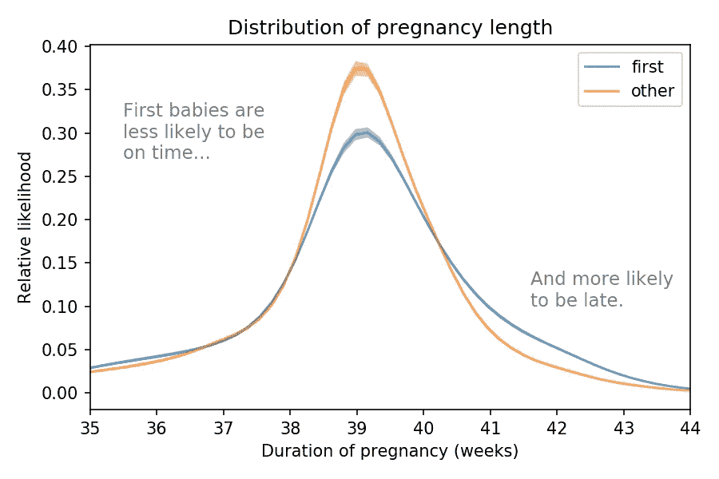
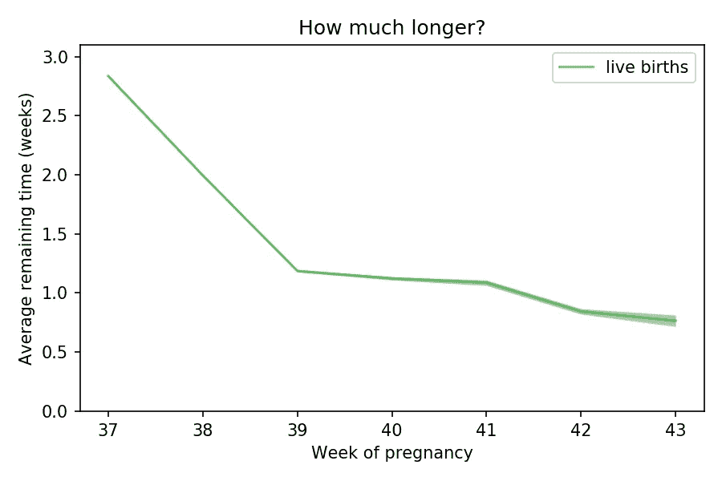
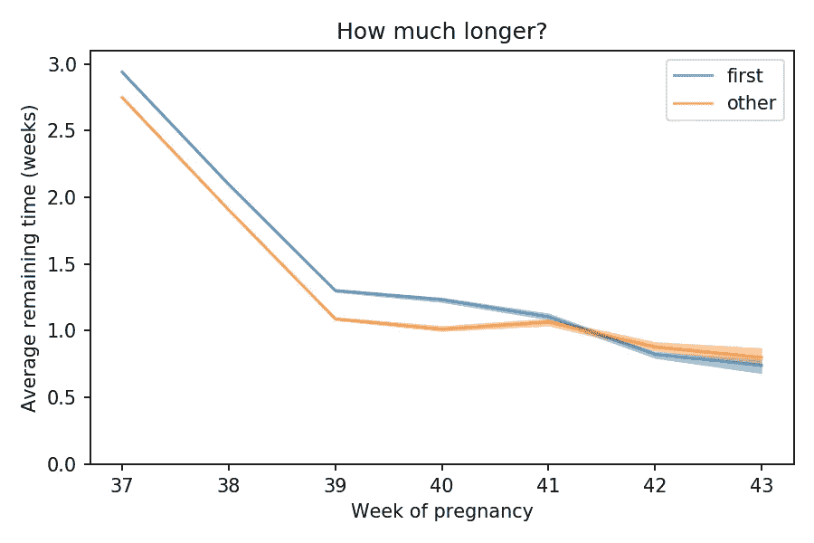
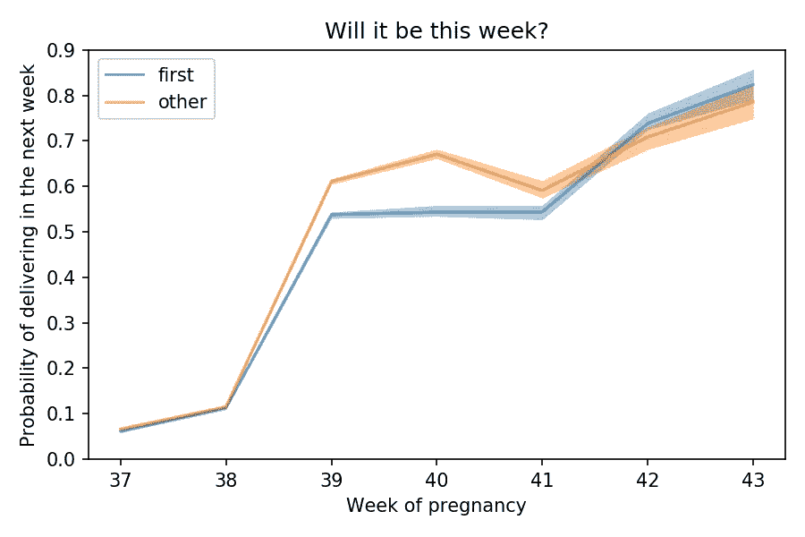

# 第一胎婴儿更有可能晚育吗？

> 原文：<https://towardsdatascience.com/are-first-babies-more-likely-to-be-late-1b099b5796b6?source=collection_archive---------0----------------------->

## 是的，也更有可能是早期的。但只是一点点。

如果你怀了第一个孩子，你可能听说过第一个孩子更容易晚育。此外，你可能听说过他们更有可能早到。事实证明，两者都是真的。

*   如果“早”是指早产——怀孕 37 周之前——第一胎婴儿更有可能是早的。根据全国家庭成长调查记录的活产婴儿，大约 12%的第一胎婴儿早产，相比之下，其他婴儿为 10%。
*   如果“晚”是指 40 周后，第一胎婴儿更有可能晚出生:大约 15%，相比之下其他婴儿只有 10%。

下图显示了活产儿(不包括多胞胎和剖腹产分娩)的妊娠长度分布情况:

Distribution of pregnancy lengths for full-term single births. The shaded areas show 90% confidence intervals.

第一胎婴儿在 39 周时不太可能“准时”，更可能晚一点，在 41 到 43 周之间。

在足月妊娠中，第一胎婴儿的出生平均要晚 1.3 天。但是平均并不能说明全部。

# 还要多久？

假设你在第 37 周的开始。此时距离分娩的平均时间为 2.8 周。

两周后，在第 39 周开始时，平均剩余时间为 1.2 周。如你所料，随着每一周的过去，平均剩余时间会减少。

但之后就停止了。

下图显示了产科最残酷的统计数据:怀孕每一周开始时计算的平均剩余时间:

Average remaining time at the beginning of each week of pregnancy, for live births, excluding multiple births and deliveries by C-section.

在第 39 周到 43 周之间，分娩前的剩余时间几乎没有变化。时间在流逝，但终点线却一直朝着未来前进。

在第 39 周，如果你问医生孩子什么时候出生，他们会说“任何一天”如果你在第 40 周再次询问，他们会给出同样的答案。在第 41 周。这听起来可能令人沮丧，但他们是对的；差不多五个星期，你总是差一个星期。

对于第一胎婴儿来说，这种情况更糟糕一些。下图显示了第一胎婴儿和其他婴儿的平均剩余时间:

Average remaining time at the beginning of each week of pregnancy for first babies and others.

在第 39 周开始时，头胎婴儿的平均剩余时间为 1.3 周，其他婴儿为 1.1 周。相差约 36 小时。

这种差距持续了一周左右，但在第 41 周之后，第一个婴儿和其他婴儿是无法区分的。

# 也许这个星期？

当你为怀孕的最后几周做计划时，到分娩的平均时间并没有太大的帮助。您可能更愿意在每周开始时知道在接下来的七天内交付的概率。

下图回答了第一个婴儿和其他婴儿的问题:

Probability of delivering in the next week, computed at the beginning of each week.

在第 37 周开始的时候，如果你想的话，你可以打包一个袋子，但是只有 6%的机会你会需要它，不管是不是第一个孩子。

在第 38 周开始时，下一周分娩的几率约为 11%，不会高太多。

但在第 39 周开始时，这一比例要高得多:头胎婴儿为 54%，其他婴儿为 61%。

这种差距持续一周左右；第 41 周后，两条曲线实际上是相同的。

# 这些差异是真实的吗？

这篇文章中的结果可能反映了第一胎婴儿和其他婴儿之间真正的生物学和医学差异。在这种情况下，它们很可能是预测性的:如果你正在期待你的第一个孩子，平均来说，你将不得不比随后的生育等待更长一点的时间。

但是这些结果可能是由于测量误差造成的。

*   按照惯例，怀孕的持续时间从母亲最后一次月经的第一天开始计算。报道的长度可能不准确，对第一次做母亲的人来说可能不太准确。
*   此外，NSFG 的数据是基于采访，而不是医疗记录，所以它依赖于受访者的记忆。对于第一胎婴儿，报道的长度可能不太准确。

但是，即使第一个婴儿的测量误差不同，也不清楚为什么他们会偏向更长的持续时间。

头胎婴儿和其他婴儿之间的明显差异也可能是由与怀孕时间相关的混杂因素造成的。

*   如果一个妇女的第一个孩子是通过剖腹产分娩的，那么随后的分娩更有可能被安排好，而不太可能晚。为此，我排除了剖腹产分娩。
*   如果第一胎婴儿不太可能被诱导，更多的婴儿将被允许晚育。我不知道他们会是什么原因，但数据集没有引产的信息，所以我不能确认或排除这种可能性。

我展示的结果具有统计学意义，这意味着如果第一胎婴儿和其他婴儿之间没有差异，我们就不太可能看到这些差异。从 2002 年到 2017 年的调查过程中，结果也是一致的。所以这种明显的差异不太可能是随机抽样造成的。

# 更多阅读

这篇文章基于我的书《Think Stats:用 Python 进行探索性数据分析》中的一个案例研究，你可以从[绿茶出版社](https://greenteapress.com/wp/think-stats-2e/)免费下载这本书。它也可以从[奥赖利媒体](http://shop.oreilly.com/product/0636920034094.do) ( [亚马逊联盟链接](https://amzn.to/2ZR8OuS))获得纸质和电子格式。

我在博客里发表了一篇[类似的分析](https://allendowney.blogspot.com/2015/09/first-babies-are-more-likely-to-be-late.html)(基于更老的数据) [*大概是想多了*](https://www.allendowney.com/blog/) ，在这里可以读到更多关于数据科学和贝叶斯统计的文章。

如果你喜欢这篇文章，你可能也会喜欢“[检验悖论无处不在](/the-inspection-paradox-is-everywhere-2ef1c2e9d709)”，这是关于一个令人惊讶的无处不在的统计错觉。

# 方法学

我使用了来自[全国家庭增长调查](https://www.cdc.gov/nchs/nsfg/index.htm) (NSFG)的数据，该调查“收集了关于家庭生活、结婚和离婚、怀孕、不孕、避孕措施的使用以及男女健康的信息。”

该数据集包括 43 292 例活产的记录，其中我排除了 737 例多胞胎和 11 003 例剖腹产。我还排除了 3 例妊娠持续时间超过 50 周的病例。这一分析是基于剩余的 31 906 个案例。

NSFG 是美国居民的代表，但它使用[分层抽样](https://en.wikipedia.org/wiki/Stratified_sampling)，所以一些群体被过度抽样。我使用了[加权重采样](https://en.wikipedia.org/wiki/Bootstrapping_(statistics))来校正过采样，并生成图中所示的置信区间。

数据清理、验证和重采样的[细节在这个 Jupyter 笔记本](https://nbviewer.jupyter.org/github/AllenDowney/FirstLateNSFG/blob/master/01_clean.ipynb)中。分析的[细节在本笔记本](https://nbviewer.jupyter.org/github/AllenDowney/FirstLateNSFG/blob/master/02_first.ipynb)中。

# 关于作者

艾伦·唐尼是马萨诸塞州奥林学院的计算机科学教授。他和妻子有两个女儿:第一个女儿提前一周出生；第二次是晚了两个星期，在一点鼓励之后。