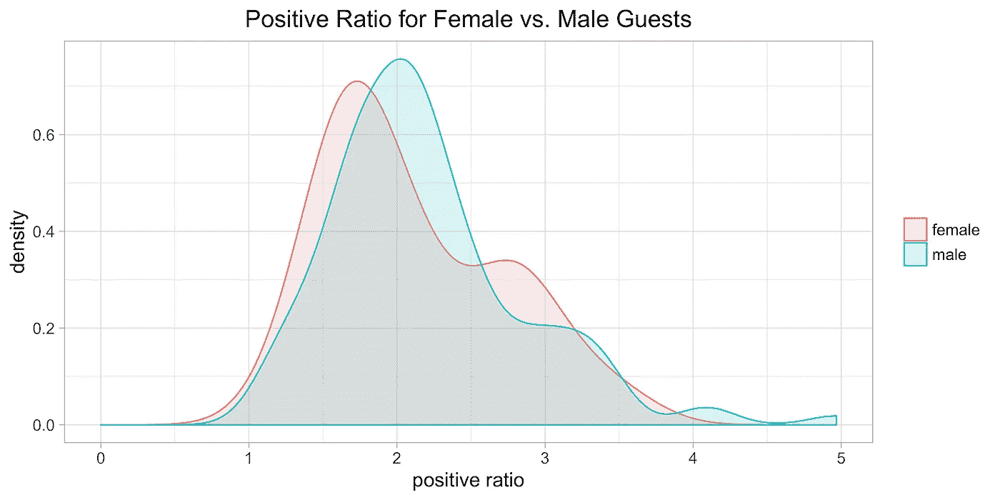
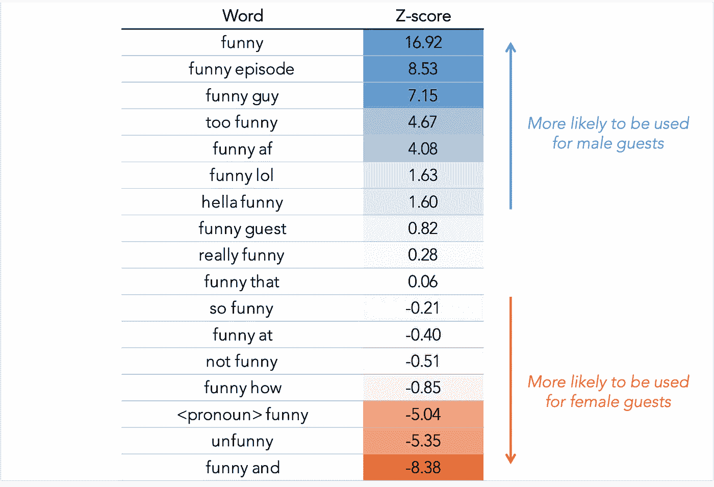

# 《辣妹》观众性别歧视吗？

> 原文：<https://towardsdatascience.com/are-hot-ones-viewers-sexist-2a1373b6b69?source=collection_archive---------17----------------------->

## [深入分析](https://medium.com/towards-data-science/in-depth-analysis/home)

## 根据对 YouTube 评论的文本分析，可能有一点

*热门人物*，“热点问题和更热翅膀的节目”，已经成为一个奇观。自 2015 年四年前首次亮相以来，YouTube 访谈节目的人气稳步增长。大约九个月前我看了我的第一集。从那以后，*这个热门词汇似乎每隔几周就会出现在人们的对话中。*

对于那些不熟悉的人来说，*热门人物*主持人肖恩·埃文斯每集采访一位名人。热门人物*和其他名人访谈有什么不同？首先，肖恩是一个优秀的面试官。第二，也是最明显的，肖恩和他的客人在整个采访中吃了一大盘越来越辣的鸡翅。它极具娱乐性——如果你从未看过，我推荐你先看看最近在 [*播出的一集，我们先来享受一下* YouTube 频道](https://www.youtube.com/playlist?list=PLAzrgbu8gEMIIK3r4Se1dOZWSZzUSadfZ)。*

最近，我的一个朋友提到，以女性为主角的热门剧集似乎比以男性为主角的剧集受到更多性别歧视(或者至少是负面的)评论。我很容易相信这种说法至少有些道理。找到一些证据当然并不困难——翻阅最近关于一集女嘉宾的评论，你会很容易找到性别歧视或物化评论的例子。

那次谈话让我开始分析思考。一些精心挑选的例子很容易成为确认偏差。有没有可能客观地显示女性客人比男性客人得到更多的性别歧视或负面评论？

# 定义目标

有一堆*热门的* YouTube 视频，其中一些有女嘉宾。每个视频都有一堆评论。我们的目标是使用统计学和数据科学来确定对女性客人的评论是否不同于对男性客人的评论，这种不同可以被描述为性别歧视。听起来很简单，但是…

计算机擅长处理黑白问题。它们非常擅长遵循定义的指令和执行复杂的计算，但它们不能像人类那样做出判断。性别歧视绝不是一个非黑即白的问题。看到就知道，但是很难定义。两个人有理由不同意某个评论是否是性别歧视。同样的评论在一种情况下可能是性别歧视，但在另一种情况下可能不是。这是一个微妙的概念。

换句话说，教计算机识别性别歧视(或种族主义、仇恨言论等。)是辛苦的。在社交媒体时代，这也是一个非常重要的问题，但还没有人提出一个很好的解决方案。如果你感兴趣的话，这篇由格伦达尔等人撰写的论文可以让你一窥该领域的研究现状。

# 方法和结果

与仇恨言论检测领域的前沿研究相比，我将采取一种简单的方法。大多数仇恨言论检测技术基于在标记数据集上训练的分类模型。这种方法可能是解决当前问题的最佳方式，但是在我的数据集上复制这些模型需要花费大量的时间和精力。相反，我将采取一种间接的方法来识别性别歧视，这种方法使用更快、更现成的技术，如下所述。

所有的分析都是使用 Python 完成的，并且可以在 [GitHub 库](https://github.com/djcunningham0/hot-ones-sexism-analysis)中获得。这篇文章中显示的数据和可视化可以在知识库中的 Jupyter 笔记本中找到。

## 数据概述

该数据集包含了 YouTube 上对前八个*热播*季视频的所有评论——总共有近 139 个视频和超过 100 万条评论。我根据视频中是否有女嘉宾将数据集分成两组。这意味着，如果其中一位嘉宾是女性，那么有多位嘉宾的视频将被归入“女性嘉宾”组。

总共有 23 个视频有女嘉宾，116 个没有。这是一个巨大的差异！*辣的*大概应该多争取点女嘉宾吧！(在最近几季中，女性出现的频率更高了，但仍没有一季是女性占 50%的。)

## 情感分析

我们寻找性别歧视迹象的第一种方法是进行情感分析，这是最基本的自然语言处理技术之一。情感分析获取一些文本——在我们的例子中是 YouTube 评论——并分配一个分数，将其情感分为积极、消极或中性。在该分析中，情绪得分从-1 到 1，其中-1 是最消极的，0 是中性的，1 是最积极的情绪。

我们潜在的假设是，性别歧视的评论通常会带有强烈的负面情绪。因此，如果有女性嘉宾的视频有大量性别歧视的评论，我们会认为这些视频的平均情感得分较低。

让我们通过看克莉茜·泰根事件中的几个例子来简单地检验情感分数是否是性别歧视的合理代表。我们从这个视频上情绪得分最低的评论开始。在一个巨大的 **-0.997** 情绪得分中，我们有这个宝石(有一些审查):

> 请不要再在这个节目里带一袋恶心的丑东西了！你为什么要带那个看起来像*** ****的花栗鼠来这里？她是如此令人讨厌，她的脸是可怕的，她的声音是可怕的，我个人甚至不知道她为什么出名，除了嫁给了 JL。我真希望这个*****会*******死你这个丑******* ***！你太恶心了你*******肥头大耳的荡妇淫妇***** ***！死啦死啦死啦死啦死啦

我认为那条评论是公然的性别歧视。所以至少，我们知道，通过寻找低情绪得分，可以找到极端性别歧视的评论。

然而，我们知道我们会遇到一个问题:评论可以是负面的，但不带有性别歧视。比如这条评论的情感分 **-0.94** :

> 地狱不吃大坝翼。你知道你要去辣的。什么？浪费翅膀。可惜删了一集。重拍第七季第一集 SMH。

这个人显然对 Chrissy 没吃鸡翅就把辣酱舔了下来很不高兴。负面情绪得分似乎是准确的，但这个评论在我看来没有性别歧视。像这样的评论会给我们的数据增加噪音。低情感分数会识别出大量性别歧视的评论，但它们可能会识别出更多负面但非性别歧视的评论。

另一个潜在的问题是情感分析器的质量。语言是复杂的，现代情感分析远非完美，所以我们应该预料到一些评论会被错误分类。例如，这条评论的情绪得分为 **-0.91** ，但它实际上似乎是积极的:

> 克里斯无疑是个野蛮人！！她杀了它！！光舔酱更糟糕

这里的观点是，评论者对 Chrissy 处理辣酱的能力印象深刻，所以这应该被归类为积极的评论。情绪分析者不同意，可能是因为像“野蛮人”和“被杀”这样的词，它们通常有负面含义。

因此，情感分析似乎给了我们一个体面的，但肯定有缺陷的，发现性别歧视评论的方法。回到手头的问题。*热门人物*评论中是否普遍存在性别歧视？让我们为每个视频计算一个“正面比率”，定义为正面评论的数量除以负面评论的数量。下图显示了男女嘉宾视频的正比率分布，不包括第一季的 outlier⁴:

Figure 1: Distribution of positive ratio for videos with male and female guests.

男性嘉宾的峰值更靠右，表明有男性嘉宾的视频往往有更高的阳性率。果然，有女嘉宾的视频平均正面比为 2.12，而有男嘉宾的视频平均正面比为 2.20。

然而，这不是一个很大的差异，我们的样本量相当小。t 检验(对不起，Bayesians)可以帮助我们决定两组(男性和女性)的平均阳性比率之间是否有任何有意义的差异。t 检验将返回 p 值-低于 0.05 的值通常被认为具有统计学意义。在我们的例子中，t 检验结果返回 0.58 的 p 值，表明我们的组之间没有统计学上的显著差异。

总之，基本的情感分析可能会显示出*热门视频*评论中性别歧视的*极小*数量的证据，但这些证据远非决定性的。

## 毒性分数

谷歌有一个名为[视角](https://www.perspectiveapi.com/#/home)的工具，专门用来识别“有毒”评论。Perspective 给可能被认为是虐待或骚扰的评论分配一个高毒性分数，性别歧视肯定属于这些类别。它在概念上类似于情感分析，但有更具体的重点，非常适合我们的用例。我将使用透视“毒性”和“严重毒性”评分，因为我认为这些是最类似于性别歧视的可用选项。

让我们看看毒性评分如何评价之前引用的克莉茜·泰根视频中的评论。记住，这些评论中有一条是性别歧视的，另外两条不是。我们的目标是找到一种度量标准，将性别歧视的评论与其他评论区分开来。

Table 1: VADER sentiment score and Perspective toxicity scores for comments on the Chrissy Teigen video.

正如我们之前看到的，情感分数在区分性别歧视评论方面做得很差——所有评论都有非常相似的情感分数。毒性评分，尤其是严重毒性，要好得多。性别歧视的评论得到了很高的毒性分数，而其他评论得到了较低的分数(尽管仍然没有那么低——毒性分数从 0 到 1)。

公平地说，这是一个经过精心挑选的例子。在数据集中还有其他例子，毒性分数并不比情感分数好，因为与情感分数非常相似，毒性分数仍然会与书面 language⁵.的细微差别相冲突也就是说，毒性评分似乎在区分性别歧视和负面但非性别歧视的评论方面做得更好。

让我们画出所有视频的毒性分数。下图显示了所有视频的平均毒性和严重毒性 scores⁶的分布，再次排除了第一季的 outlier⁴:

Figure 2: Perspective toxicity and severe toxicity scores for videos with male and female guests.

与男性分布相比，女性分布似乎向右侧偏移(尽管男性游客的最极端得分甚至更向右延伸)。事实上，女性客人的平均毒性为 0.306，平均严重毒性为 0.204，而男性客人的平均毒性略低，为 0.297 和 0.200。

然而，与之前的情绪得分一样，差异非常小。t 检验给出毒性评分的 p 值为 0.36，严重毒性评分的 p 值为 0.69。这两个 p 值都与传统意义上的统计显著性相差甚远，因此我们不能自信地声称毒性评分已经确定了两组之间的差异。

毒性分数让我们和情感分数处于几乎相同的位置。有一点证据表明，女性会收到更多恶毒的评论，但从统计学的角度来看，这一证据并不令人信服。

## 单词用法

让我们稍微改变一下。到目前为止，我们已经采取了非常量化的方法，试图找到一个量化性别歧视(或仇恨，有毒等)的度量标准。)评论在每个视频上。现在让我们看看我们是否能找到两组评论中使用的语言的差异。

总体思路很简单。对于评论数据集中的每个词，我们想知道这个词是在男性评论还是女性评论中出现得更频繁。我们将拟合一个模型，告诉我们任何给定的词在与女性嘉宾的视频评论中被使用的可能性有多高(或多低)。一旦我们有了自己的模型，我们就可以查看每组的热门词汇，并寻找它们之间的差异。

具体来说，我用多项似然性和信息量丰富的 Dirichlet 先验实现了贝叶斯模型，这在 Monroe 等人的[这篇](http://languagelog.ldc.upenn.edu/myl/Monroe.pdf)论文中有所描述。技术细节对于理解结果并不重要，但如果你的眼睛在上一句结束时没有呆滞，请阅读这篇论文——这是解决这类问题的一种优雅的方法。该论文的作者使用该模型来识别民主党人和共和党人的演讲差异，这与我们自己的任务没有太大区别。

在拟合模型之前，我执行了一些小的预处理步骤，比如词汇化和删除标点符号(NLP 中的常用技术)。我还用一个通用的<pronoun>符号替换了性别代词，用一个通用的<name>符号替换了客人的名字。通用标记防止这些术语主导结果——像“她”和“她”这样的词在女性嘉宾的评论中使用得更频繁，但这并不有趣。</name></pronoun>

下表显示了与女性和男性 guests⁷:相关的前 30 个词和二元模型

Table 2: Top 30 words and bigrams for female and male guests according to the informative Dirichlet model.

花些时间通读这些列表，看看你是否注意到任何有趣的不同。以下是我看到的一些例子:

*   女性名单中有很多描述身体外貌的词，如“美丽”、“可爱”、“华丽”。很高兴看到这些话是积极的，但这可能是评论者物化女性并主要关注她们的外表的证据(请注意男性是如何不包括“英俊”的)。
*   女单里有几个负面词，特别是“烦”。如果你在一个有女嘉宾的 *Hot Ones* 视频上看到一些评论，用不了多久就会发现一条评论形容她很讨厌，所以看到这个人上榜我一点也不奇怪。
*   男性排行榜榜首有很多骂人的话。我不太确定这是怎么回事，因为上下文对这些词很重要。这些评论中有很多可能是负面的，但其中一些可能会夸大男性毒性分数——当诅咒语用于正面的 context⁵.时，这些分数是不可靠的
*   男单有很多《有史以来最好的一集》的变奏。我认为这里有些隐含的性别歧视。平均而言，评论者似乎偏向于以男性为主角的剧集。
*   男性排行榜有“最搞笑”、“笑”，甚至还有😂表情符号。这符合男人比女人更有趣的文化观念(这[可能不是真的](https://slate.com/human-interest/2011/10/study-shows-that-men-aren-t-funnier-than-women-but-that-people-generally-believe-that-they-are.html))。

让我们更深入地探讨最后一点。下表显示了一些“有趣”的 bigrams⁷和它们在模型中相应的 z 分数，这告诉我们这个词在男性或女性评论中有多常见。

Table 3: A deeper look at “funny” comments.

在*热播节目*中有很多有趣的女性，但是很明显，评论者平均认为男嘉宾比女嘉宾更有趣。这位模特甚至将“不好笑”和“不好笑”与女嘉宾联系在一起。这很难证明，但我认为这里有一丝性别歧视。我怀疑许多评论者是故意宣称男人比女人更有趣，但似乎确实有一些潜意识的偏见。

# 结论

那么，我们在热门评论中找到性别歧视的证据了吗？算是吧，但不是压倒性的。情绪分析和毒性评分提供了一点点证据，但它很容易被认为是统计上无关紧要的。词汇用法分析说明了男性和女性视频评论之间的一些词汇差异。这些差异似乎有点性别歧视，但它们也是一个开放的解释。

如果被追问，我会说是的，在热门评论中有性别歧视的证据。我认为这个词的用法分析令人信服地确定了一些性别歧视的主题。你不同意吗？我是确认偏见的受害者吗？请在评论中告诉我。

## 脚注

[1]:具体来说，我的数据集包含了我在 2019 年 5 月中旬刮到的日期之前的所有评论。我只包括基本级别的评论，即不回复评论。我还从分析中排除了一些视频:第二季的假日特辑(没有任何嘉宾)，史蒂芬·科拜尔*深夜秀*集(不在*热门频道*播出，所以大概是不同的观众)，以及马雷欧·巴塔利集(在 YouTube 上不可用)。我写了一个 Python 脚本，它访问[这个](http://ytcomments.klostermann.ca)网络抓取器来抓取评论数据(谷歌提供了一个 API，但是它每天只能抓取 10000 条评论)。

[2]:我使用了 VADER 情感分析模型，这是一个为社交媒体文本设计的基于规则的模型。原纸这里是[这里是](http://comp.social.gatech.edu/papers/icwsm14.vader.hutto.pdf)。

[3]:Jupyter 笔记本随附的[中对正比率指标进行了更详细的描述。](https://github.com/djcunningham0/hot-ones-sexism-analysis/blob/master/data_for_writeup.ipynb)

[4]:第一季被排除在这个情节之外，因为我把它当作一个离群值。请参见 Jupyter 笔记本附带的[以了解理由。](https://github.com/djcunningham0/hot-ones-sexism-analysis/blob/master/data_for_writeup.ipynb)

[5]:例如，诅咒语几乎总是导致高毒性分数，即使实际上并没有毒性或仇恨情绪。参见前面提到的 grndahl 等人[论文](https://arxiv.org/pdf/1808.09115.pdf)中的表 7。

[6]:对于情感评分，我们使用了正比率指标，因为大多数评论的评分完全是中性的(得分= 0)。我们在毒性分数方面没有同样的问题，所以使用平均毒性分数作为我们的评估指标更简单。

[7]:为了给出更好的单词样本，这些列表被稍微编辑了一下。我根本没有打乱列表，但我确实删除了一些与列表中出现位置较高的单词非常相似的单词。完整结果可在 [GitHub](https://github.com/djcunningham0/hot-ones-sexism-analysis/tree/master/data) 上获得。

[成为媒体会员](https://medium.com/@djcunningham0/membership)访问成千上万作家的故事！