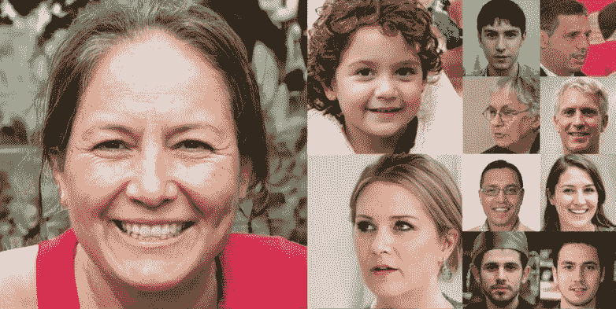

# 神经网络接近生产真正的艺术了吗？

> 原文：<https://towardsdatascience.com/are-neural-nets-close-to-producing-real-art-6a3943b915ed?source=collection_archive---------21----------------------->

神经网络是一种算法——一种获取信息、以某种方式处理信息并产生输出的过程。在我看来，它们是当今人工智能和机器学习领域最惊人成果的来源。这些算法的版本已经被设计用来完成以前认为计算机不可能完成的任务，例如制作假人脸，比世界上最好的医生更好地预测疾病，以及有一天可能让自动驾驶汽车塞满高速公路。

取决于你如何定义创造力，这些算法的版本正在被开发，可以说是创造性的。两个例子:

这些是从未存在过的人的照片。一个神经网络被展示了确实存在的人脸图像，它学会了如何编造自己的梦。

These people don’t exist ([https://bgr.com/2018/12/18/nvidia-ai-fake-faces-look-100-percent-real/](https://bgr.com/2018/12/18/nvidia-ai-fake-faces-look-100-percent-real/))

这个神经网络学会了如何接收一张照片并输出一幅看起来像同一场景的画的图像——如果你想让它看起来像莫奈、梵高、塞尚或浮世绘画的，你可以选择。它还可以做其他很酷的事情，比如让夏天的场景看起来像冬天的场景。

Style transfer and other cool applications ([https://junyanz.github.io/CycleGAN/images/teaser_high_res.jpg](https://junyanz.github.io/CycleGAN/images/teaser_high_res.jpg))

如果你把这些技术结合起来会怎么样？结果会是“自动艺术”吗？使用 Net A 生成假脸。然后使用网络 B 来设计它们，就好像梵高画了一幅假人物的肖像。瞧，你有了一个能快速想象肖像的网络。同样，假设你想要一幅梵高风格的风景画。训练一个制作假风景而不是人脸的 Net A 版本。然后用网 B 来定型。完成——自动景观生成器。

但这真的和人类制造艺术一样吗？当然，网 A 创造了一个新面孔。但它只能将以前见过的面孔的元素组合起来，组成一张新的面孔；鉴于它只看过老年人的脸，它无法运用创造力想象出一个孩子的脸。此外，B 网剽窃了一位真正的艺术家的“风格”，这位艺术家发展了这种风格。

这种过程离“真正的”、“创造性的”一代艺术还有多远？我不打算对这一点进行客观的论证。我觉得提出这样一个论点的想法既可笑又没有吸引力。我不确定这是否可能，因为“艺术”这个词对不同的人来说可能意味着很多不同的东西；当你使用的术语变化如此之大时，你如何展开一场辩论？此外，我认为真正的乐趣在于探索从这种思考中产生的有趣的思路。

例如，也许我们可以从“影响”的角度来看待这种情况。艺术、音乐等的历史学家。经常讨论是什么影响了艺术家的成就。有多少画家因为梵高的作品而改变了绘画方式？有多少音乐家开始演奏音乐是因为他们在埃德·沙利文秀上看到了甲壳虫乐队并听了他们的音乐？

我认为这是一个合理的假设，艺术家将他们影响的元素不同程度地融入到他们的作品中。在一个极端，我们有一个“非原创艺术家”,他试图精确地复制其他人的作品——他们所有的有意识的努力都是由之前的作品指导的(也许还有随机出现的错误)。在另一个极端，也许我们有创作非常新颖作品的新颖艺术家。我能想到产生这种创意的几种方式(我肯定还有其他方式):

小说艺术家 A)这位艺术家的独创性是将以前没有以那种方式结合的各种影响融合在一起的结果。也许这位艺术家通过从大量的影响中汲取一点点灵感来实现自己的风格，这样最终的结果与所有的个人影响截然不同。另一方面，也许它们融合了一种单一的影响，而这种影响以前没有与它们的其他影响结合在一起。

小说艺术家 B)这位艺术家融合了与他们之前的艺术家无关的外部影响；例如，小说艺术家可能会旅行到另一个星球，看到一种其他人从未见过的景观，然后将这种体验融入他们的艺术中。更一般地说，假设你有一位艺术家，他有一种别人从未体验过的体验，或者他们可能以一种别人从未体验过的方式处理一种体验。思想、情感等。从那次经历中得到的东西会给他们的作品注入新鲜感。

我认为网 A 类似于小说艺术家 A 是有争议的；网络可以看到大量的面孔，然后将它看到的每张面孔的一点“影响”结合起来，形成一张全新的、原始的面孔。Net B)更像是没有独创性的艺术家；他们只是试图复制。

现在假设你开发了“升级版网络 B”，一个可以将绘画风格应用到图像上的网络，然而它也可以将梵高和塞尚的风格结合起来。现在你可以用网络 A 生成原始的面孔，然后用升级后的网络 b 生成某种意义上新颖的风格。这是否符合计算机在艺术上真正具有创造性的条件？乍一看，这在我看来相当于小说艺术家 a。

我认为围绕这个话题有很多有趣的想法。比如计算机的情感缺失有什么作用？这是创作某种艺术的障碍吗？在这篇文章中，我考虑了肖像和风景。这种特定类型的艺术对神经网络创造艺术的能力有多大影响？