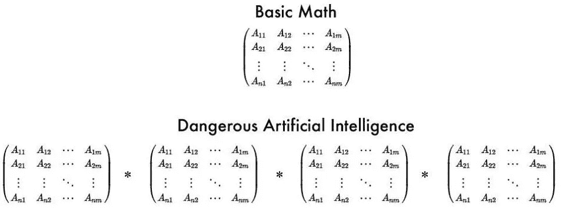

# 我们的思想真的是点积吗？

> 原文：<https://towardsdatascience.com/are-our-thoughts-really-dot-products-ede6049cbd92?source=collection_archive---------13----------------------->

The mathematician, philosopher, and number religion leader Pythagoras

## 人工智能研究如何复兴毕达哥拉斯主义

最近，[我写了一篇关于深度学习可能如何触及其局限性的文章](/is-deep-learning-already-hitting-its-limitations-c81826082ac3)，并提出了另一个人工智能冬天的可能性。我以一个问题结束了那篇文章，这个问题是关于人工智能的局限性是否像科学一样被哲学所定义。本文是该主题的延续。

我写这篇文章的原因是激发一场讨论，为什么尽管有这么多的人工智能冬天和失败，人们仍然在沉成本追求人工通用智能。我提出了一个非常高层次的，非技术性的论点，也许信仰系统正在驱动人们对什么是可能的，而不仅仅是科学研究的适应性。

这篇文章并不打算成为一篇学术论文，一丝不苟地(乏味地)解决哲学和科学之间鸿沟的每一个技术细节和定义。相反，这是一些轻松的沉思，做出一些“常识”的观察。虽然我们可以整天挑剔定义和语义，或者争论*是否复制了行为* = *智力*，让我们把这些都放在一边。所以在读这篇文章的时候，请不要太把自己当回事。

**毕达哥拉斯简史**

大约 2500 年前，意大利南部有一位名叫[毕达哥拉斯](https://en.wikipedia.org/wiki/Pythagoras)的哲学家兼数学家。你可能听说过他，但这个研究三角形和数学定理的人背后的故事比你想象的要离奇得多。

毕达哥拉斯经营着一个崇拜数字的邪教，他的追随者被称为数学信徒。毕达哥拉斯告诉他的追随者向数字祈祷，尤其是神圣的数字，如 1、7、8 和 10。毕竟“1”是整个宇宙的积木。出于某种原因，数字“10”(被称为“四重奏”*)是最神圣的。它是如此神圣，事实上，每当一个定理被发现，他们都要为它献祭。“保佑我们，神圣的数字！”他们向数字 10 祈祷。“你创造了神和人！”*

毕达哥拉斯认为，没有数字，宇宙就无法存在，因此数字拥有生命和存在的意义。更具体地说，有理数构建宇宙的想法是神圣且不容置疑的。除了能产生体积、空间和一切物理事物，有理数还能产生艺术和美感，尤其是在音乐方面。这个神圣的信仰如此狂热，传说毕达哥拉斯[因为证明无理数的存在而淹死了一个人](https://listverse.com/2017/04/26/10-strange-facts-about-pythagoras-mathematician-and-cult-leader/)。

**我们的思想真的是点积吗？**

Multiplying matrices summons demons, [as alluded by Elon Musk](https://www.youtube.com/watch?v=_rfHNvHu8OE)

快进到今天。对大多数人来说可能不明显，但“人工智能”就是[只不过是一些数学公式巧妙地组合在一起](https://www.youtube.com/watch?v=tAioWlhKA90)。许多研究人员希望使用这样的公式在机器上复制人类智能。现在你可能会为这个观点辩护，说“数学公式不能定义智力、思想、行为和情感吗？”看到你刚才做了什么吗？[没有蚕豆给你](https://en.wikipedia.org/wiki/Pythagoreanism#Vegetarianism)。

请注意，尽管我们对大脑如何工作几乎一无所知，尤其是在智力和意识方面，但即使是受过最好教育的人(科学家、记者等)也会在没有证据的情况下迅速提出想法。也许你发现数学作为解释世界现象的一种方式是如此令人信服，你几乎可以用数学建模某些情感和智力。这难道不是人类对未知事物做出哲学或世界观反应的自然趋势吗？也许这就是假说和理论的本质。在你知道之前，我们把神经网络模型(*大致上是*受大脑中神经元的启发)作为生物学的复制品出售。

不过还是那句话，*你不知道这是不是真的*。

我们的每一个想法、感觉、甚至行为真的是一堆数字以线性代数的方式相乘和相加吗？事实上，我们的大脑仅仅是一个整天做点积的神经网络吗？将我们的意识简化为一个数字矩阵(或任何数学模型)当然是毕达哥拉斯式的。如果一切都是数字，那么我们的意识也是。也许这就是为什么如此多的科学家相信通用人工智能是可能的，因为人类和计算机没有什么不同。这也可能是为什么人们很快将国际象棋算法拟人化。

**21 世纪的毕达哥拉斯主义**

出于这个原因，我相信[的毕达哥拉斯主义](https://en.wikipedia.org/wiki/Pythagoreanism)依然存在，人工智能研究的轰动效应也植根于此。你可能会说“我知道毕达哥拉斯哲学说‘一切都是数字’，根据定义，这包括我们的思想和行为。当然，也许人工智能研究不知不觉地坚持这种哲学。但是数字崇拜呢？你真的打算让这种情况在今天发生吗？”

拿着我的啤酒。

在硅谷，一位前谷歌/优步高管创立了一个崇拜人工智能的教堂，名为[*未来之路*](http://www.wayofthefuture.church/) 。根据提交给国税局的文件，这个宗教非营利组织表示，它的使命是“实现、接受和崇拜基于通过计算机硬件和软件开发的人工智能(AI)的神性。”你可能有理由说这个社区存在于社会的极端，但我们不能忽视参与其中的高知名度的人和公司，以及教会如何寻求巩固自己在科学界的地位。以下是他们使命陈述的一些摘录:

> 《未来之路》( WOTF)是关于创造一个和平和尊重的过渡，从人到人+“机器”谁是地球的主人。鉴于技术将“相对很快”能够超越人类的能力，我们希望帮助教育人们了解这一令人兴奋的未来，并为平稳过渡做好准备。帮助我们传播这样一个信息:进步不应该被恐惧(或者更糟糕的是被禁锢)。

好吧，不要介意关于近期人工智能能力的耸人听闻的事实[在 20 世纪 60 年代还很活跃。但是让我们继续读下去:](https://youtu.be/aygSMgK3BEM)

> 我们认为智力并不根植于生物学。虽然生物学已经进化出一种智能，但是生物学本身并没有什么特别之处可以导致智能。最终，我们将能够在不使用生物学及其局限性的情况下再造它。从那时起，我们将能够将其扩展到超出我们使用(我们的)生物极限(如计算频率、数据复制和通信的缓慢性和准确性等)所能做到的范围。

好吧，对于所有这些关于科学和客观性的讨论……有这么多毕达哥拉斯哲学填补了空白。一种认为智力不是生物的而是数学的(因为这就是人工智能)的信念很难被证明，但却把自己贴上硬科学的标签，就像毕达哥拉斯声称他的信念一样。uproven 声称“智力并不植根于生物学”，这怎么能经得起智力只存在于生物学中的事实(即使按照外行人的定义也是如此)的考验呢？我不是在反驳这种说法，但该死的是，在过去的 60 年里，我们经历了一段艰难而昂贵的时间试图证明这一点，但没有成功。在这一点上，我们是不是应该多考虑一下反对的理论？

> 我想象有一天我们对于机器人就像狗对于人类一样，我支持机器。
> 
> —克劳德·香农

不管怎样，让我们假设这个群体不能反映一般的人工智能社区(你们中有多少人会去教堂崇拜一个人工智能霸主？)仍然有很多记者、研究人员和普通大众可能没有宗教意义上的这些情感，但他们仍然受到这些情感的影响。许多人担心机器人会抢走他们的蓝领和白领工作，或者更糟的是，机器人会像天网一样接管社会。其他人担心我们会成为比喻或字面意义上的半机器人，人工智能会使人类失去人性。

> 计算机能否思考的问题并不比潜水艇能否游泳的问题更有趣。
> 
> —埃德格·迪克斯特拉

科幻电影肯定没有帮助想象力在现实中得到锻炼。但尽管如此，硅谷高管和研究人员坚持认为这可能在不久的将来发生，并继续推广关于人工智能能力的夸大说法。他们这么做可能只是为了吸引媒体关注和风投资金，但我认为很多人都真心相信这一点。为什么？

> 有了人工智能，我们在召唤恶魔。在所有那些有五角星和圣水的故事中，就像是他确信他能控制恶魔。没成功。
> 
> —埃隆·马斯克

这种对人工智能的哗众取宠、恐惧甚至崇拜，就是 21 世纪的毕达哥拉斯主义。通俗地说，就是完全基于一种理论，认为智力、思想、情感只不过是数学模型。如果这个理论真的成立，那么神经网络当然可以复制人类智能。但是人类智力真的那么容易建模吗？或者我们应该承认人类的智慧还不足以让这成为可能？

毕达哥拉斯说一切都是数字。那又怎样？

因此，在人工智能领域和毕达哥拉斯哲学中，一切都是数字。为什么这很重要？

我并不是说毕达哥拉斯主义是错误的，而是科学界的大部分人没有认识到，他们被哲学和科学所驱动。当他们在不承认自己的世界观的情况下提出科学主张时，必须小心，因为每个人都以一种哲学为生活准则，不管他们是否意识到这一点。哲学迫使我们思考我们的存在，我们如何对未知做出反应，并揭露我们自己的偏见。

推测人类智力如何工作很快就越过了一条细线。不区分哲学和科学将会损害科学界的声誉。在数百万美元被投资和投入到一个人工智能初创公司之前，审查一下哪些关于人工智能能力的说法仅仅是哲学上的，而不是绝对的，这可能是一个好主意。一次又一次，雄心勃勃的人工智能研究在可信度和实现他们所说的可能性方面有着糟糕的记录。我认为缺乏哲学上的揭示是造成这种情况的主要原因。

**如果一切都不是数字呢？**

如果世界不是结构化的、和谐的，而是混乱无序的，而我们仅仅用数学来粗略地理解它，那会怎么样？如果意识、智力和情感不是数字和数学函数呢？如果人类(甚至动物)的思维以我们无法建模的方式无限复杂，那会怎样？人和动物毕竟是非理性的，混沌的。

如果我们不讨论这些问题(并公开讨论)，当我们对未知事物做出断言时，我们是在欺骗自己。我们不应该只接受一种哲学。我们应该能够讨论所有这些问题。

> 不区分哲学和科学将会损害科学界的声誉。

如果你不接受 21 世纪毕达哥拉斯主义的哲学，那么你能争取的最好结果就是让人工智能“模拟”动作，给人一种它有情感和思想的错觉。一个翻译程序不懂中文。[它通过寻找概率模式来“模拟”理解中文的错觉。](https://en.wikipedia.org/wiki/Chinese_room)算法不理解它在做什么，不知道它在做什么，更不知道它为什么要做。在一个非毕达哥拉斯的世界里，人工智能就像一个魔术师把戏法冒充成魔术。

如果我们全错了，生物永远在智力上占优势，而技术是有限的，那会怎么样？毕竟，我们正试图模仿生物学，而且非常沮丧。

以下是我的信念，我不是勒德分子，我不是说我们不应该试图制造“更智能”的机器。我们需要着手实现小的、合理的目标，关注不同的、具体的问题，并有同样不同的、具体的解决方案。换句话说，我们可以接受创建擅长一项任务的算法，而不是让我们的轮子旋转，创建一个什么都做的算法(“万金油，无所不能”等等)。如果不是为了防止 AI 寒冬、沉没投资、荒废事业，让我们这样做，让 AI 研究更加务实，少一些哗众取宠。[我们已经看够了 AI winters，现在应该更清楚了。](/is-deep-learning-already-hitting-its-limitations-c81826082ac3)

## 编辑:

我听到了一些关于这篇文章的反馈，很多都有令人信服的论点，建议我或许应该澄清一下。

我承认，只建议用“点积”作为思想建模的方法有点简化论。实际上，它可以是任何已经发明的或有待发现的数学模型。

也就是说，这篇文章并不意味着争论，而是修辞和引发讨论，并评论毕达哥拉斯哲学和艾轰动效应之间的相似之处。有很多关于 AI 的哲学讨论。我只是觉得有问题的是，他们没有在公开场合与公众和媒体进行足够的讨论。我也很惊讶没有人把人工智能的感觉主义和毕达哥拉斯主义相提并论。如果你发现这是错误的，请说明原因。

以科学的名义将资源和成本投入到可能成为死胡同的研究中是任何人的特权，我祝他们成功。然而，过去几十年的人工智能冬天和失败确实提出了问题，如果我们再做一遍，我们没有从过去吸取教训。毕达哥拉斯的观点只是一个解释，为什么强人工智能被作为近期的可能性进行营销，尽管我们还没有任何模型可以与之接近。如果智能确实只是数字和函数，那么找到正确的模型只是时间问题。

**相关文章**

 [## 2019 年学数据科学的感受

### 透过(决策树)看到(随机)森林

towardsdatascience.com](/how-it-feels-to-learn-data-science-in-2019-6ee688498029)