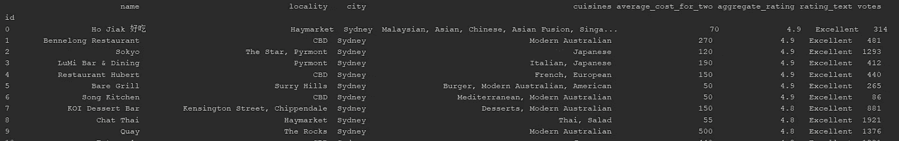
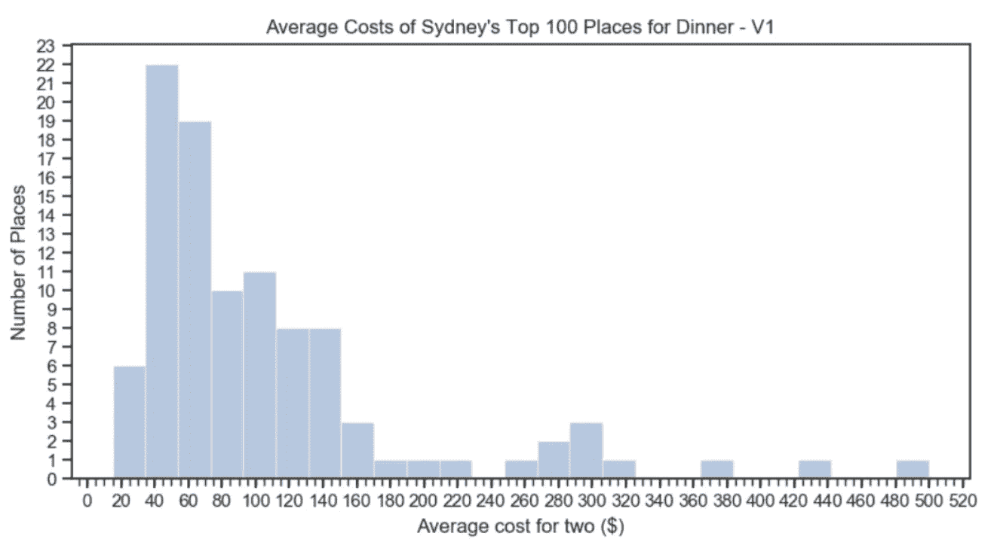
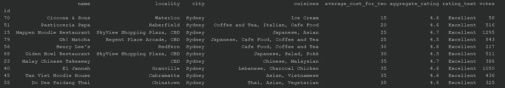
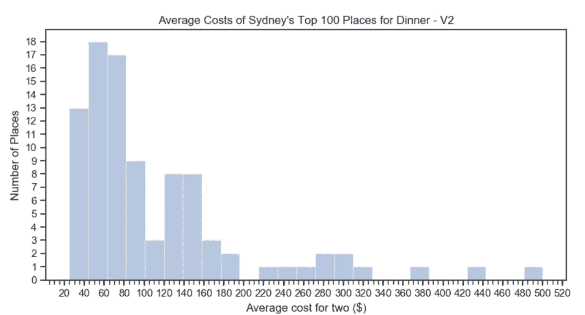

# 悉尼的顶级餐厅真的值得吗？

> 原文：<https://towardsdatascience.com/are-sydneys-top-restaurants-really-worth-it-9a1dee3705d1?source=collection_archive---------27----------------------->


Photo by [Peter Hershey](https://unsplash.com/@peterhershey)

## Zomato API 的应用和对数据的理解

在本文中，我们回答了上面的问题，我将带您了解从数据提取、转换到理解数据所涉及的步骤。这可以分为:

1.  **使用 Zomato API 提取数据**
2.  **转换数据**
3.  **理解数据(应用描述性统计)**

但是首先…

## Zomato 是什么？

这是一个[平台](https://www.zomato.com)，保存着全球超过 100 万家餐厅的信息，包括评级、评论等等。这是我在去一个新的地方吃饭之前，甚至是去了一个我尝试过的地方(只是想看看其他人对它的看法)之后访问的一个平台。

## Zomato API

要开始，您首先需要[请求一个 API 密钥](https://developers.zomato.com/api?lang=id)。一旦完成，直接进入 [*文档*](https://developers.zomato.com/documentation#/) 部分，看看你可以开始寻找的所有数据点！让我们来看一个:

**/cities**
该函数检索每个城市的详细信息。要搜索悉尼，我们输入以下内容:

*   *用户密钥*作为您的 API 密钥
*   *问*=‘悉尼’
*   *计数* = 1

```
{
  "location_suggestions": [
    {
      "id": 260,
      "name": "Sydney, NSW",
      "country_id": 14,
      "country_name": "Australia",
      "country_flag_url": "[https://b.zmtcdn.com/images/countries/flags/country_14.png](https://b.zmtcdn.com/images/countries/flags/country_14.png)",
      "should_experiment_with": 0,
      "discovery_enabled": 0,
      "has_new_ad_format": 1,
      "is_state": 0,
      "state_id": 128,
      "state_name": "New South Wales",
      "state_code": "NSW"
    }
  ],
  "status": "success",
  "has_more": 0,
  "has_total": 0
}
```

返回给我们的 JSON 内容看起来像是一个*字典*。我们将在本文后面讨论如何提取我们想要的数据点。

现在让我们回到回答这个问题:

## 分解它…

> 悉尼的顶级餐厅真的值得吗？

这是一个相当普遍的问题，可以有多种解释，所以当我们开始寻找数据点时，我们必须考虑:

*   我们把什么归类为顶级餐厅？我们用什么方法给他们排名？
*   我们考虑所有类型的餐馆吗？晚餐？咖啡馆？
*   什么是*值得*？我们需要考虑餐厅的*价格*吗？与它的*评级*相比如何？

在设计解决方案之前，正确定义我们的问题将有助于节省大量时间。(相信我，我以前也遇到过这个问题)

事不宜迟，让我们开始第一步吧！

# 1.使用 Zomato API 提取数据

我们将主要使用**搜索**功能，该功能返回餐馆的详细信息，允许我们最多获得 100 家餐馆，每次调用有 20 个结果。

下面是一个 python 脚本，它提取 Zomato 餐馆的数据，并将其转储到一个文件中供以后使用:

使用其他功能找到为*搜索*输入的参数，例如:

*   **/locations:** 为“悉尼”获取*纬度*和*经度*坐标
*   **/类别:**来获取晚餐*类别 id* = 10

除此之外，我选择按照***【desc】***的顺序，按照*对餐馆进行排序。*

*根据我的参数，你可以看到我已经回答了 ***分解*** 中的一些问题(在文章的前面——以防你错过),即*

*   **顶级餐厅*将基于它们的*评级**
*   *我们将只考虑*晚餐*餐厅类型*

**搜索*的返回值与*城市*相同，因为它返回一个字典。假设，我们想提取 100 家餐馆的信息，但每次呼叫只限于 20 家，我们该怎么办？我们获取返回的每个字典，并将其附加到一个列表中，直到得到 100 家餐馆。*

*一旦我们有了这个列表，我们就把它写入一个文件，这样我们以后就可以使用它了。*

*我们的 JSON 文件 *Top100SydneyDinners* 现在已经准备好进行转换了！*

# *2.转换数据*

*在我们这样做之前，我们应该首先知道我们的数据是什么样的。首先，让我们回到前面的*城市*输出，并理解它是如何构成的。*

*你想猜猜吗？*

> *这是一个**字典**，其中一个关键字，即*【location _ suggestions】*具有类型* **列表** *的值，而那个* **列表** *包含一个带有多个关键字对*的 **字典****

***有点困惑，我知道！但是它的好处是，它意味着它是**字典**和**列表**的组合，我们可以使用它们相应的方法来获得我们想要的数据。***

***现在…把*top 100 Sydney dinters*复制到这里会把这篇文章吹出来，所以这里有一个[链接](https://github.com/trinhjorwe/zomato-restaurants/blob/master/Top100DinnersInSydney.json)指向我的 GitHub 账户上的那个文件。将它的内容复制到一个 [JSON 格式化程序](https://jsonformatter.curiousconcept.com/)中也是有帮助的，这样可读性更好。***

***看到什么有趣的数据了吗？***

***我们的目标是将我们想要的数据从 JSON 格式中取出，放入一个可爱的、干净的表中进行分析。***

***首先，让我们加载 JSON 文件，在数据框架中定义我们想要的列，然后创建它！***

***我确实创建了比需要的更多的列(对不起，对我的数据有点贪婪)，但是要回答我们的主要问题，重点应该是:***

*   ***`average_cost_for_two`***
*   ***`aggregate_rating : This is the restaurant rating`***

***接下来，我们需要一种方法来填充当前空的数据帧。***

***为此，我们从每个餐馆中选择感兴趣的数据片段(例如*名称、菜系等。*)并形成一个单独的**列表。每个餐馆都有自己的清单，并作为一行添加到我们的数据框架中。*****

***让我们看看下面的代码…***

***记住，JSON 文件由一个包含**字典**的**列表**组成，这些字典是在之前提取数据时通过 python 脚本追加的。希望上面的代码足够清晰易懂，但如果不是这样，我将尝试解释下面的嵌套 for 循环:***

> ***当您完成这些步骤时，打开 JSON 格式的输出可能会有所帮助。***

1.  ***由于该文件是一个**字典** ( *allRestaurants* )的**列表**，我们需要遍历该列表以获取每个**字典** ( *restaurantSet* )。***
2.  ***在每个**字典** ( *restaurantSet* )中，我们需要 key — `"restaurants"`的值***
3.  ***这个值也是**字典** ( *餐馆*)的**列表**，所以我们需要再次遍历**列表**来获取每个**字典** ( *餐馆*)。***
4.  ***从这个**字典** *【餐馆】*，我们想要 key — `"restaurant"`的值***
5.  ***这个值也是一个**字典**，最后保存我们现在可以抓取的数据。如*名称、菜系、*等。(尽管有些值也是**字典**，例如*“位置”*)***

## ***瞧！我们有我们的佐马托餐厅数据集！***

******

# ***3.理解我们的数据***

***快速问题回顾:***

> ***悉尼的顶级餐厅真的值得吗？***

***我们已经检索了排名前 100 的餐厅，但是我们还没有查看它们的费用。***

***所以我们来分析一下`average_cost_for_two`***

***我们从计算平均值开始。***

```
***Average Cost for Two = $ 107.9
Percentage of restaurants below the mean is =  66.0 %***
```

***我们两个人的平均消费是 107.90 美元，其中 66%的餐馆消费低于这个数字。你觉得这样对吗？平均值是否恰当地描述了我们平均成本的中心？个人觉得好像不是。***

***让我们用柱状图来展示我们的数据，以便更好地理解。***

******

***您会看到数据向右倾斜(即右侧的尾部比左侧长)，这表明使用中位数而不是平均值作为中心趋势的衡量标准更合适。这是因为平均值对异常值很敏感，例如 440 和 480 附近的值，而中值则不敏感。数据集排序后，中位数就是中间值。***

***那么，我们要不要计算一下中位数？***

```
***The median cost is = $ 80.0
The percentage of values below the median is  48.0 %***
```

***酷！所以现在我们的成本中值是 80 美元，只有 48%的餐馆低于这个值。这似乎更合理，因为我们选择的集中趋势的度量现在越来越接近 50%的值在它之上和之下。***

> ***然而,…如果你回到柱状图，你会发现有些餐馆的两人平均消费在 20 美元左右。除非他们在做某种疯狂的特别节目，否则我很难相信..所以我们再深入调查一下。***

*****3.1 调查异常值*****

***我们挑选了两家餐厅中*平均成本最低的 10 家，并在数据框中查看它们。****

******

***哎呀！基于*美食*栏，我们似乎包括了*冰淇淋、咖啡和茶*的价值，这意味着这些餐馆实际上是咖啡馆或沙漠餐厅，而不是吃饭的地方。***

***让我们把这些从我们的数据集中去掉…***

***为此，我们创建了一个要删除的值列表 *(discardCuisines)* ，并检查它们是否存在于每个餐馆的菜系中，这就创建了一个**布尔向量**。对于我们想要保留的值，我们希望布尔向量为*真*，对于我们不想保留的值，我们希望布尔向量为*假*。将布尔向量插入我们的数据框架，这将过滤掉我们不想要的餐馆。***

> ***在下面的第 6 行中，我反转了 discardRestaurants 中的所有布尔值，因为要过滤掉的餐馆的值是“True”而不是“False”。***

```
***The size of our updated dataset is  (92, 8)***
```

***好像有 8 家咖啡馆被搬走了！(100–92 = 8)***

***现在我们的数据已经清理完毕，让我们再次计算一些描述性统计数据:***

```
***The average cost is = $ 114.1304347826087
The median cost is = $ 80.0
The percentage of values below the median is  43.47826086956522 %***
```

***删除最小值的结果是:***

*   ***现在，低于中位数的餐厅比例有所下降(从 48%降至 43%)，这也提高了平均水平(从 108 美元增至 114 美元)。***
*   ***显然，对于这个例子来说，中值是比平均值更合适的集中趋势的量度。***

***这是什么意思(双关语)？当你告诉你的朋友悉尼顶级餐厅的价格时，引用中位数而不是平均数。***

***直方图现在看起来像这样:***

******

# ***最后…***

> ***悉尼的顶级餐厅真的值得吗？***

***嗯，两个人的平均花费中位数是 80 美元，我会让你决定。***

> ***我希望这篇文章是令人愉快的和有帮助的。如果您有任何问题或改进建议，请告诉我，我非常乐意倾听！谢谢大家！***