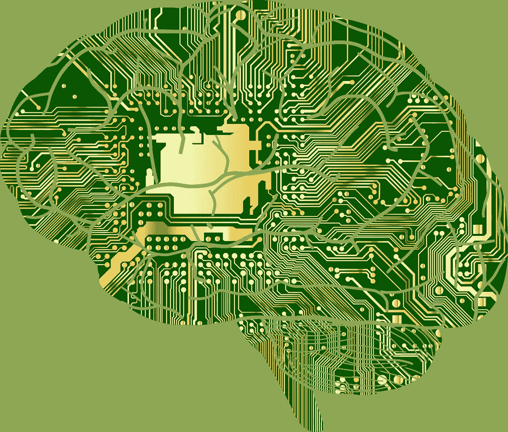

# 我们被编程了吗？

> 原文：<https://towardsdatascience.com/are-we-being-programmed-9f497531a449?source=collection_archive---------5----------------------->

## 简短阅读应用程序设计、数据科学和人类受条件限制的倾向的心理影响。

在我开始之前，让我问你几个问题。你多久使用一次智能手机？你是否有时会发现自己在任务间隙打开脸书、YouTube 或 Instagram，结果花费的时间比你想象的要多？你有没有发现自己重新加载提要，看看是否有更好的东西刚刚发布？你是否曾经关闭了一个脸书标签，几分钟后又打开了它？

对这些问题要诚实，因为只有你需要知道，我甚至没有问关于火绒或色情。

**根据脸书** **发布的** [**公告，用户平均每天花 50 分钟在这个应用上(这是全球 20 亿人中的一部分)。不仅仅是脸书。Youtube、Snapchat、Instagram 和 Twitter 都有用户日**](http://www.businessinsider.com/how-much-time-do-people-spend-on-facebook-per-day-2016-4)中的[大时间段，并且这些用户中有很多是重叠的。](http://mediakix.com/2016/12/how-much-time-is-spent-on-social-media-lifetime/#gs.JHeVVT0)

**那么我们在这些应用上花了多少时间？**

根据 dscout 的一项研究，智能手机用户平均每天花在屏幕上的时间为 2.42 小时，其中 15%的时间花在脸书身上。这超过了你醒着时间的 15%。

## 好吧，很明显我们在应用上花了很多时间，那又怎样？

我们不只是在我们的应用上花费时间，因为我们有意决定这样做，或者至少根据许多专家的说法不是这样。那些创造多巴胺驱动按钮的工程师和研究用户活动的数据科学家设计了他们的应用程序，让我们在那里呆得更久。

在过去的几年里，脸书、谷歌和推特的许多知名员工向公众展示了他们所创造的东西的危险性。

贾斯汀·罗森斯坦创造了类似脸书的按钮。从那以后，他禁止自己使用 Snapchat，并限制脸书的摄入量。为什么？因为他非常清楚社交媒体令人上瘾的一面，毕竟是他帮助创造了它。

脸书前总统肖恩·帕克在接受 Axios 的[采访时表示，脸书正在“*利用人类心理的一个弱点”*。**基本上，点击“喜欢”按钮会让我们的多巴胺激增。**我需要做对比吗？这就产生了帕克所说的“*社会认可反馈循环”*，这正是黑客们想出来的东西。](https://www.axios.com/sean-parker-facebook-was-designed-to-exploit-human-vulnerability-1513306782-6d18fa32-5438-4e60-af71-13d126b58e41.html)

Salesforce 首席执行官马克·贝尼奥夫告诉美国消费者新闻与商业频道[像脸书这样的社交网络应该像烟草业一样受到监管。像脸书这样的公司，政治可以被展示给用户的广告所操纵，政府监管的时机已经成熟。](https://www.cnbc.com/video/2018/01/23/salesforce-ceo-marc-benioff-there-will-have-to-be-more-regulation-on-tech-from-the-government.html)

虽然，这可能听起来像少数古怪人的歇斯底里，但这些高调的技术人员正公开试图让人们知道技术的上瘾力量，以警告大众。

# 如何给人编程

伊凡·巴甫洛夫的反射系统研究，通常被称为经典条件反射，在每一门心理学入门课程中都有讲授。正如[维基百科](https://en.wikipedia.org/wiki/Classical_conditioning)所说:

> 经典条件反射(指的是一种学习过程，在这一过程中，一种生物学上强有力的刺激(如食物)与一种先前中性的刺激(如铃声)配对。

但是，行为心理学已经从让狗流口水走了很长一段路。现在使用类似的技术，行为心理学可以影响选举，公司的盈利能力，等等。

[脸书在 2010 年进行了一项实验，测试他们是否能影响投票行为。测试组的用户收到了一条社交消息，显示了六张随机选择的朋友资料照片，这些照片表明他们在即将到来的选举中投票。这些用户更有可能投票或寻找关于即将到来的选举的更多信息。**估计有 60，000 名用户因此参与了投票。那真是太强大了！**](https://www.nature.com/news/facebook-experiment-boosts-us-voter-turnout-1.11401)

## 该方法

BJ·福格是斯坦福大学的行为心理学家，他的研究展示了计算机是如何说服人的。他已经让许多研究生在包括脸书、Instagram 和谷歌在内的科技界掀起了涟漪。

根据福格的说法，导致行为改变的是:**动机、能力和触发器**，如下图所示。

## 动机

福格的行为模型有三个主要的激励因素:感觉、预期和归属。这些都有两面性:快乐/痛苦、希望/恐惧、接受/拒绝。

如果我们回想一下像巴顿这样的脸书，激励因素可以从社会接受度开始。你发布一些与你的朋友有关的东西。在几个帖子之后，随着*喜欢*，你开始将*喜欢*与社会接受度联系起来。从那以后，收获*喜欢*就变成了一种乐趣，不管它是否仍然被社会接受。

**能力**

为了执行目标行为，一个人必须有这样做的能力。如果一个产品想让你和你所有的朋友分享，但是用户首先要注册，检查表格，更新个人资料，还有其他五个任务，这就阻止了用户分享这个产品。障碍越少，用户越有可能分享。

## 扳机

这可以追溯到巴甫洛夫钟。如果你不按铃，狗是不会流口水的。福格甚至在他的[网站](http://www.behaviormodel.org/triggers.html)上以脸书为例:

> 脸书有效地使用触发器来实现他们的目标行为。
> 
> 这里有一个例子:我已经有一段时间没有使用我的“BJ 演示”脸书帐户了，所以脸书自动给我发送了这个触发器来实现他们的目标行为:登录脸书…
> 
> 请注意这个特定的行为——登录——是脸书更大目标的第一步:让我重新融入脸书。

一旦你有了一个触发器，你就可以把它和更复杂的任务联系起来。

> 1.让用户登录(电子邮件就是这样做的)
> 2。让用户链接到更多的朋友(“寻找朋友”页面会这样做)
> 3 .相信新朋友会回应不活跃的用户(交友的自然结果)。相信不活跃用户会回复朋友，并更多地参与到脸书的活动中(同样，这是一种自然反应)

很快，你就有了一个免费向系统提供数据以保持运行的社交网络。

这听起来可能很简单，但它很强大，被大多数在线社交网络使用，并使世界上数十亿人沉迷于继续使用这些网络。

## 这些听起来像一堆假设…

互联网不是由一群想进行哲学思考的学者运营的。相反，它是由一群试图赚钱的风险资本家、能够建造它的工程师和能够研究其人口并在人口发生变化时以统计上的确定性知道的数据科学家运营的。

数据科学家是这里的关键。不要听名字。数据科学家实际上是研究人类与软件交互的统计学家。数据科学家可以看到一个网站的变化，例如添加一个喜欢按钮，是否真的增加了用户的参与，从而影响更多的用户在网站上停留更长时间。风险资本家希望这样，因为更长的用户活动会带来更多的广告收入。

基本流程如下:

The general flow for a data scientist’s experiment

用户越多，效果越好，这也是拥有数十亿用户的脸书能够影响选举的原因。然而，谷歌是大多数互联网用户搜索他们想要的网站，找到去哪里的方向，或者提出他们的问题的第一个地方。**谷歌几乎比人类自己更接近人脑**。

## 好吧，所以公司可以影响普通人，但我不行…

这对于影响大量人群来说非常有效，但是大多数人可能认为他们是免疫的。这可能取决于你的网络足迹。如果你从来不使用电脑或智能手机，你可能是对的。但是如果你在互联网上搜索，允许你的手机上有摄像头、麦克风和 GPS 的任何权限，和/或拥有社交媒体账户，**你可能已经为谷歌这样的公司留下了足够的数据，可以为你的个人行为建立一个相当好的预测模型。**

谷歌已经批量出售你的信息，这使得公司可以直接瞄准你。使用谷歌地图数据，购买这些数据的公司可以看到你大部分时间在哪里度过，你在哪个社区，你在哪里工作，你有时去哪里。这可以用来针对你个人的广告。网上冲浪也是如此。为了避开个人数据的问题，他们可能不会把你标为一个人，而是一个数字。

# 我们已经被编程了吗？

你是怎么看到这篇文章的？有蜂鸣通知响起吗？你的屏幕上有没有出现一个不能忽略的小红点？你是否重新加载或向下滚动浏览了那些旨在吸引你眼球的文章？对于我们大多数人来说，可能就是这样。

最后，即使你认为由于你惊人的广告过滤能力或你很少使用互联网，你不会受到影响，**你知道你购买新智能手机的原因是因为你在广告上看到它，还是你的朋友在广告上看到它并告诉你的？**