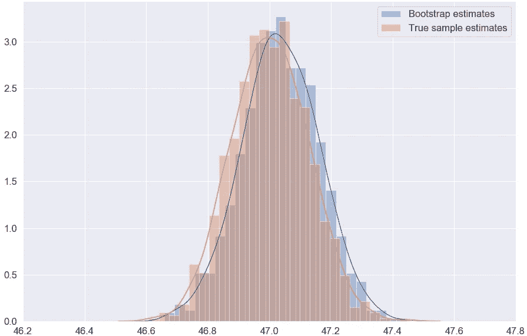
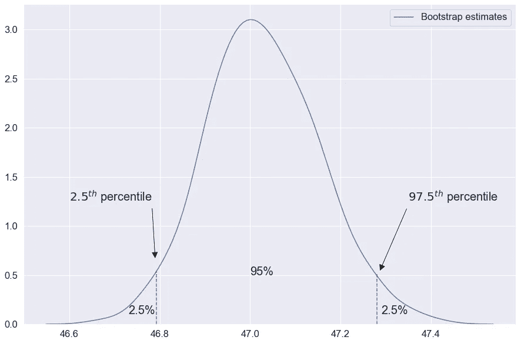
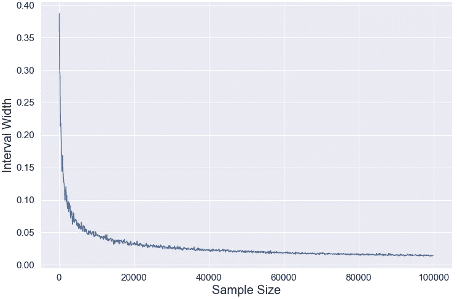

# 我们有信心模型的召回是精确的吗？

> 原文：<https://towardsdatascience.com/are-we-confident-our-models-recall-is-precise-133112a6c407?source=collection_archive---------15----------------------->

## 带有简单 Python 代码示例的 Bootstrap 估计和置信区间


Image by [995645](https://pixabay.com/users/995645-995645/?utm_source=link-attribution&amp;utm_medium=referral&amp;utm_campaign=image&amp;utm_content=3859795) from [Pixabay](https://pixabay.com/?utm_source=link-attribution&amp;utm_medium=referral&amp;utm_campaign=image&amp;utm_content=3859795)

# TL；速度三角形定位法(dead reckoning)

我们将应用 bootstrap 方法来估计分类器的**召回率**、**精度**、**F1-得分**、 **ROC AUC、**等。，并构造相应的置信区间。

有[代码](https://gist.github.com/roncho12/60178f12ea4c3a74764fd645c6f2fe13)你可以复制粘贴到“现在在 Python 中”部分，你可以随意使用。

老实说，这篇文章中的很多内容将是我提倡使用置信区间，特别是使用 bootstrap 方法构建的置信区间。

如果你事先知道你不需要(或者只是不想)阅读使用 bootstrap 方法和置信区间的好处，请随意跳过这篇文章的大部分内容，只使用[代码](https://gist.github.com/roncho12/60178f12ea4c3a74764fd645c6f2fe13)。

如果你不确定你是否应该读这篇文章，下一节可能会帮助你决定。

# 你应该读这篇文章吗？

“[引导程序简介](https://cds.cern.ch/record/526679/files/0412042312_TOC.pdf)的前言如下:

> 统计学是一门有着惊人的多用途的学科，却鲜有有效的实践者。对于大多数人来说，通往统计知识的传统道路被一道令人生畏的数学之墙挡住了。我们的方法避开了那堵墙。bootstrap 是一种基于计算机的统计推断方法，可以在没有公式的情况下回答许多实际的统计问题。我们在本书中的目标是用计算技术来武装科学家、工程师和统计学家，使他们能够分析和理解复杂的数据集。
> — [埃夫龙&提布拉尼，1994 年](https://cds.cern.ch/record/526679/files/0412042312_TOC.pdf)

在这篇文章中，我将(谦卑地)努力实现一个相似的目标。

置信区间有时被认为是统计学家的知识，当考虑数据科学从业者必须面对的共同挑战时，它似乎是不相关的。

在这篇文章中，我将尽我所能说服你，这位数据科学家:

1.  置信区间可能是一个非常有用的工具。
2.  构建置信区间可能是一项简单的任务。

我要说的是，尽管这两个目标可能很有价值，但在我们前进的过程中，还是有一些需要注意的地方。

# 介绍

估计。

这就是一切。

我们建立了一个模型，我们希望使用一些度量来估计它的性能，比如说回忆。我们希望我们的估计尽可能接近“真实”召回，即当我们将分类器释放到野外，即部署到生产中时，我们的分类器将具有的召回。

考虑一个普通的估计，比如平均身高。我们可能不会计算 5000 人的平均身高，并说这与其他 100 万人的平均身高完全相同。同样，基于 5000 个数据点计算召回率，并期望它与分类器未来将遇到的 100 万个数据点的召回率**完全**相同，也是没有意义的。

为了更好地理解我们的回忆(或其他指标)的可变性，我们可以应用 bootstrap 方法来估计它，并构建一个[置信区间](https://en.wikipedia.org/wiki/Confidence_interval)，这将帮助我们评估它的方差。

这篇文章关注的是向读者介绍这些方法，并提供易于使用的 Python 代码来应用它们。

# 在这篇文章中你会发现什么？

1.  **什么是自举？**
2.  ***. 632/. 632+*自举方法**
3.  **我们为什么要关心置信区间？**
4.  **Bootstrap 置信区间——为什么和如何？**
5.  **如何解读一个置信区间？**
6.  **样本量&置信区间宽度**
7.  **现在在 Python 中**
8.  这里有龙

# 1.什么是自举？

> bootstrap 是一种广泛适用且极其强大的统计工具，可用于量化与给定估计量或统计学习方法相关的不确定性。— [詹姆斯等人，2013 年](https://www.amazon.com/Introduction-Statistical-Learning-Applications-Statistics/dp/1461471370)

一般来说，bootstrap 方法是基于对现有数据集进行重采样的技术集合，目的是获得各种[统计](https://en.wikipedia.org/wiki/Statistic)的估计值。这是通过使用我们现有的数据集，从原始数据集**中抽取替换数据集**来创建新的引导数据集来实现的，即数据点可以在引导生成的数据集中出现多次。

我们创建了许多这样的自助数据集，并使用它们来计算我们感兴趣的[统计量](https://en.wikipedia.org/wiki/Statistic)。这个过程使我们能够得到一个 bootstrap 分布，它可以用来估计样本统计量的分布。

## 具体的例子

比方说，我们希望找到 android 手机用户目前在其设备上安装的应用程序的平均数量。为此，我们收集了 1000 名安卓手机用户的数据，计算出平均应用数量，结果是 47.038 个。

然而，我们想要估计这个平均值的“可靠”或“准确”程度，或者换句话说，我们想要估计我们找到的平均值的[标准误差](https://en.wikipedia.org/wiki/Standard_error)。

为了完成上述操作，我们通过执行以下操作来应用引导程序:

1.  从数据集中采样(替换)1，000 个数据点。
2.  根据此示例计算平均应用程序数量。

我们重复这两个步骤 1000 次，每次都从数据集中重新采样数据点并计算平均值。



Fig. 1\. Distribution of bootstrap estimates vs. the distribution of estimates based on samples from the true population.

图 1 描述了两种分布:

*   平均应用数量的估计分布，通过从单个样本生成 1000 个引导样本**并计算每个引导样本(蓝色)的平均值获得。**
*   通过从真实总体中生成 1000 个样本**并计算每个样本的平均值(橙色)而获得的平均值的估计分布。**

我们观察到，使用 bootstrap 估计获得的估计值与我们试图估计的值非常相似:

```
 mean	median	stdev
Bootstrap estimates:	47.035	47.034	0.125
True estimates:		47.003	47.001	0.123
```

我们现在有 1000 个来自 bootstrap 样本的平均值。这些平均值的均值是 47.035，这是我们对样本均值(我们数据集中应用的平均数量)的 **bootstrap 估计，非常接近真实估计值的均值——47.003。**

我们还计算了这 1000 个 bootstrap 估计值的[标准差](https://en.wikipedia.org/wiki/Standard_deviation)，得到 0.125——这是我们对样本均值的 [**标准差**](https://en.wikipedia.org/wiki/Standard_error) **的**估计，也就是说，这是我们使用数据集计算的平均应用数量的[标准差](https://en.wikipedia.org/wiki/Standard_error)的估计。换句话说，我们可以预期原始样本平均值(47.038)与真实平均值相差 0.125。****

我们找到的[标准差](https://en.wikipedia.org/wiki/Standard_error)可以用来构建一个[置信区间](https://en.wikipedia.org/wiki/Confidence_interval)。如果我们假设样本均值呈正态分布，使用 bootstrap 方法获得的估计值允许我们说，区间[46.79，47.28]有 95%的概率覆盖(包含)真实平均值——全球所有 android 手机用户的平均应用数量。

> **注意**:我们不会详细说明构建上述置信区间的方法，因为我们将在本文中使用不同的方法。

## 为什么我们使用自举方法？

如果我们能够收集更多的数据，那就太棒了，但很多时候我们只有一定数量的数据，我们不得不将就一下——由于时间限制、预算限制或其他各种原因，我们无法从原始人群中获得更多的数据。

我们希望利用可用的数据集，并从中提取尽可能多的信息，就像我们在上面的例子中所做的那样。使用 bootstrap 方法允许我们这样做(为了某些目的)。

# 2.什么是 *.632* /.632+自举法？

当我们开始估计一个参数时，我们通常对估计量的“准确性”感兴趣——我们想知道我们的估计量是否“稳定”，即具有低可变性。

在本节中，我们将讨论获得 bootstrap **估计值**的方法，不要与构建 bootstrap **置信区间**的方法相混淆(稍后讨论)。

我们通过使用[估计器](https://en.wikipedia.org/wiki/Estimator)获得估计值，例如，为了估计人口的平均身高，我们使用样本中人员的平均身高作为 [*估计器*](https://en.wikipedia.org/wiki/Estimator) (数据的函数)，它产生*估计值*(一个数字)。

一个[估计器](https://en.wikipedia.org/wiki/Estimator)可能[有偏差](https://en.wikipedia.org/wiki/Bias_of_an_estimator)，这意味着它会倾向于高估或低估真实参数。更具体地说，这意味着估计器的[期望值](https://en.wikipedia.org/wiki/Expected_value)将大于或小于它要估计的参数的期望值。

*.632* 估计器和 *.632+* 估计器是自举估计器，通过校正[偏差](https://en.wikipedia.org/wiki/Bias_of_an_estimator) ( *.632+* 是更优越但计算量更大的方法)来解决有偏差估计的问题。

*.632* 估计量由 [Efron，1983](https://people.eecs.berkeley.edu/~jordan/sail/readings/archive/efron-improve_cv.pdf) 引入，作为对未来观测值进行分类时预测规则的误差率的估计量。论文表明 *.632* 估计量比交叉验证和其他几种估计量表现更好。

然而，后来在[ [Efron & Tibshirani，1997](https://cindy.informatik.uni-bremen.de/cosy/teaching/CM_2011/Eval3/efron_97.pdf) ]中指出，当用于估计可能高度过拟合的模型的误差率时， *.632* 估计器可能会遭受向下的偏差。 *.632+* 估算器纠正可能的偏差问题，并产生更好的估算值。

> **注**:bootstrap 估计量实际上是交叉验证估计量的平滑版本[ [Efron & Tibshirani，1997](https://cindy.informatik.uni-bremen.de/cosy/teaching/CM_2011/Eval3/efron_97.pdf) ]，这里的“平滑”是指减少可变性。

## . 632 代表什么？

当我们从一个均匀分布的 ***n 个*** 物品中取样时，抽到一个特定物品的概率是 ***1/n*** 而没有抽到它的概率是 ***1-(1/n)*** 。
当我们抽取有替换的*n 个项目(所有抽取都是独立的)时，某个特定项目永远不会被抽取的概率是 ***(1-(1/n))^n*** 等于 ***1/e*** 因为 ***n*** 趋近于无穷大([见此处](https://www.wolframalpha.com/input/?i=limit+%281-1%2Fn%29%5En+as+n-%3Einfinity))。*

*由于我们是在替换的情况下进行采样，这意味着平均而言 ***n*1/e*** (大约。 ***n*0.368*** )的项目将不被选中，或者换句话说，我们的 ***n*** 项目的样本将包含大约。***n * 0.632***(***63.2%***)的数据集中的项目(因为我们是从均匀分布用替换抽样的)。这个结果被用来加权估计量所依赖的几个项来校正偏差，因此得名。 *632* 估计器。*

## *这就是全部的数学吗？*

*由于 *.632* 和 *.632+* 估计量的正式定义取决于*无信息误差率*、*相对过拟合率*、*留一自助法*和其他几个术语的正式定义，因此我不会用众多的方程来拖累这一节，请读者参考 [Efron & Tibshirani，1997](https://cindy.informatik.uni-bremen.de/cosy/teaching/CM_2011/Eval3/efron_97.pdf)
要获得更简短、更好的解释，请参见[本答案](https://stats.stackexchange.com/a/96750/47999)中的[交叉验证](https://stats.stackexchange.com/)。*

*希望有一天 Medium 会支持 *LaTeX* ，用交错文本写十几个方程将不再需要使用十几幅图像。*

# *3.我们为什么要关心置信区间？*

*假设我们已经建立了一个分类器，为了评估它的性能，我们在单个数据点上测试它，我们得到了正确的结果—召回率是 100%。大获成功！*

*但这听起来很好笑，对吧？在单个数据点上测试分类器？
所以我们在 10 个数据点上再次测试，得到了 80%的召回率。还是不错的。然而，仅使用 10 个数据点来评估性能似乎有些怪异——如果我们在 10 个相对简单的例子上测试我们的分类器会怎么样？
如果我们选择一组不同的 10 个数据点并再次评估，我们可能会得到不同的回忆分数。*

*在 100 个数据点上测试我们的分类器怎么样？还是 1000？多少个数据点就够了？我们需要多少数据点来确定我们的召回是可靠的？*

*我们不需要精通统计学就能知道，如果我们基于少量的观察值计算一个数字(例如平均值)，这个数字可能是“不准确的”。我们凭直觉知道这一点。*

*假设我们试图通过只测量 5 个人的身高来估计我们镇上人们的平均身高。我们知道我们的估计可能是完全错误的——我们只测量了 5 个人，试图估计 10 万人的平均身高——显然使用这么小的样本存在问题。*

*置信区间为我们提供了一系列可能的值，这样我们可以更好地理解我们的估计值可能具有的可变性。在上下文中使用“可能”一词是有意的，因为实现的置信区间的属性不是固定的，并且可以根据情况而变化。*

## *野外的置信区间*

*置信区间被广泛使用的一个领域是流行病学研究。在[ [Janerich 等人，1990](https://www.nejm.org/doi/full/10.1056/NEJM199009063231003) ]中可以找到一个典型的使用案例，在那里他们研究了肺癌是否与家庭中暴露于烟草烟雾有关。*

*研究人员对 191 名肺癌患者和同等数量的非肺癌患者进行了基于人群的病例对照研究。*

*缩写方法和结果——为了评估在家庭中暴露于烟草烟雾是否会增加患肺癌的风险，研究人员计算了[比值比](https://en.wikipedia.org/wiki/Odds_ratio) (2.07)和比值比的 95%置信区间(1.16 至 3.68)。*

*这意味着在这项研究中，他们发现在家庭中接触烟草烟雾的人患肺癌的几率是不接触烟草烟雾的人的两倍(2.07)。我们确实注意到，置信区间表明真实的[优势比](https://en.wikipedia.org/wiki/Odds_ratio)也可能是 1.16，也就是说，与那些没有暴露于烟草烟雾的人相比，在家庭中暴露于烟草烟雾的人患肺癌的可能性可能只有 1.16 倍。*

*改变样本大小(或研究中选择的 25 年吸烟阈值)，我们也可能得到一个包括 1.0 的置信区间，这意味着[比值比](https://en.wikipedia.org/wiki/Odds_ratio)在统计上不显著，实验中两组患肺癌的几率可能相同。*

*正如我们所看到的，置信区间包含了单个数字所不能包含的信息。*

# *4.自助置信区间——为什么和如何？*

## *为什么使用 bootstrap 置信区间？*

*Bootstrap 置信区间可以使用非参数抽样构建，这意味着**我们不需要对我们感兴趣的参数**(或我们的数据)的分布做任何假设。Bootstrap 置信区间也可以使用参数抽样来构建，但我们不会在本文中使用这种方法。*

## *如何构造 bootstrap 置信区间？*

*在帖子后面提供的[代码](https://gist.github.com/roncho12/60178f12ea4c3a74764fd645c6f2fe13)中，我们使用 bootstrap 估计分布的[百分位数](https://en.wikipedia.org/wiki/Percentile)来构建置信区间。基于 bootstrap 百分位数构建置信区间的动机是，我们可以使用 bootstrap 估计分布的百分位数，因为它(大概)与我们试图估计的参数分布足够相似。这在某些情况下非常准确，而在其他情况下则不太准确。*

**

*Fig. 2\. Percentiles of the distribution of bootstrap estimates.*

*例如，我们将使用 bootstrap 估计值的分布构建一个 95%的置信区间(图 2):*

*   *置信区间的下限将是分布(46.8)的第 2.5 个百分位数[——低于该值，将发现 2.5%的 bootstrap 估计。](https://en.wikipedia.org/wiki/Percentile)*
*   *置信区间的上限将是分布(47.3)的第 97.5 个百分位数[——低于该值时，将发现 97.5%的 bootstrap 估计。](https://en.wikipedia.org/wiki/Percentile)*

*正如我们在图 2 中看到的那样，选择下限和上限意味着 95%的 bootstrap 估计值在置信区间内，我们说置信区间[46.8，47.3]有 95%的概率覆盖我们试图使用 bootstrap 方法估计的参数。*

*例如，如果我们试图估计一个分类器的召回率，那么我们可以说区间[46.8，47.3]有 95%的概率覆盖(包含)我们的分类器的真实召回率。*

*我们应该知道，有几种方法可以构建 bootstrap 置信区间，我们鼓励好奇的读者阅读[ [Carpenter & Bithell，2000](https://www.tau.ac.il/~saharon/Boot/10.1.1.133.8405.pdf) ]来更好地了解每种方法的利弊。如果你需要更多关于本文所用方法的信息，可以在[ [Efron & Tibshirani，1994，ch.13](https://cds.cern.ch/record/526679/files/0412042312_TOC.pdf) ]中找到。*

> *依我拙见，构建一个或多或少“准确”的置信区间并实际使用它比完全忽略从置信区间获得的信息要好。*

# *5.如何解读一个置信区间？*

*本帖中我们讨论的置信区间是 [**frequentist**](https://en.wikipedia.org/wiki/Frequentist_inference) 置信区间。为了确保我们理解它们的含义，我们将考虑下面的例子:*

*假设我们为分类器的召回构建了 95%的置信区间，并获得区间[0.55，0.65]。*

*这意味着:有 95%的概率**区间**【0.55，0.65】覆盖(包含)真实召回。*

*它**不**意味着:有 95%的概率**真实回忆**在区间【0.55，0.65】内。*

*迷茫？不要害怕。*

*当讨论 frequentist 置信区间(最常见的置信区间)时，真实参数(在我们的例子中是回忆)被认为是一个**固定数**，而不是一个[随机变量](https://en.wikipedia.org/wiki/Random_variable) —它只有一个固定值，该值要么在置信区间内，要么不在置信区间内。没有与之相关的概率。95%的概率指的是我们用来构造区间的**方法**。**方法**保证区间在 95%的情况下(平均)覆盖真实参数。*

*考虑以下情况:我们计算召回 100 次(每次基于不同的样本/测试集),并以 95%的置信度构建 100 个置信区间。
这 100 个置信区间中的 5 个将不会覆盖真实召回(平均而言)——例如，当真实召回为 0.66 时，其中一个可能是[0.55，0.65]的置信区间，即这个[0.55 到 0.65]的置信区间是不覆盖真实召回的那 5 个置信区间之一。*

*另一个例子:假设我们想找出一个中国人的平均身高。真实的平均身高是某个固定的数字，例如 168.3 厘米。我们无法测量 14 亿人的身高，所以我们使用 1000 名中国人的样本来测量他们的身高——我们样本的平均值是 167.3 厘米，置信区间是[166.1 厘米，168.5 厘米]。
我们现在再抽样调查 1000 人，测量他们的身高，构建另一个置信区间。
我们重复上述过程 100 次。到目前为止，我们已经计算了平均身高 100 次(每个样本一次)，并构建了 100 个置信区间。平均而言，这些置信区间中的 5 个将不涵盖(包含)168.3 厘米的真实平均身高*

*现在让我们假设我们只有一个 1000 人的样本，因为这是我们的预算所能负担的。我们基于单一样本构建的 95%置信区间有 5%的可能性无法覆盖真实的平均身高。*

> ***注意:**我们总是可以构建一个置信水平更高的置信区间，比如说 99%，代价是让区间变宽。*

# *6.样本大小和置信区间宽度*

*置信区间的宽度对我们是有价值的，因为它使我们能够更好地理解我们估计的可变性。更宽的间隔意味着更高的可变性。*

**

*Fig. 3\. Bootstrap confidence interval width plotted against sample size.*

*上图(图 3)展示了在特定条件下，使用 bootstrap 方法( *.632* )估算召回率的模拟结果。改变参数将导致略微不同的结果，但是主要结果将保持不变——我们可以预期置信区间宽度随着样本量的增加而减小。*

*图中的数据是通过应用 scikit-learn 的[逻辑回归](https://scikit-learn.org/stable/modules/generated/sklearn.linear_model.LogisticRegression.html)分类器生成的，该分类器用于通过将其拟合到使用`[make_classification](https://scikit-learn.org/stable/modules/generated/sklearn.datasets.make_classification.html)`生成的二元分类数据集上来获得 bootstrap 估计值和召回的置信区间。对于每个样本大小，运行 1000 次 bootstrap 迭代，以获得 bootstrap 估计和召回的置信区间。随机噪声被添加到数据集中，使分类任务变得更加困难，就像真实世界中的数据(通常)有噪声一样。*

## *一些模拟结果*

*对于包含 500 个数据点的数据集，bootstrap 召回估计为 60.6%，但 95%置信区间为[48.9%，70.8%]。
这意味着我们不能为我们获得了 60.6%的召回率而高兴，因为置信区间有 95%的机会覆盖(包含)真实召回率，这可能是 50.0%，这使得我们的分类器像掷硬币一样有用。*

*相同的分类器在 1，000 个数据点上进行测试，产生了 62.9%的 bootstrap 召回估计值，95%的置信区间为[54.5%，71.3%]。注意，现在我们可以更确定我们的分类器比随机猜测的目标类更好，因为置信区间不包括值 50%。*

> ***注意** : Bootstrap 置信区间宽度(以及其他属性)不仅是样本大小的函数，也是分类器类型(线性模型、基于树的模型等)的函数。)，正在估计的参数和数据集中要素的固有方差，等等。*

# *7.现在在 Python 中*

*本节介绍了一个可以复制粘贴并在代码中轻松使用的函数。该函数简单地包装了来自 [mlxtend](http://rasbt.github.io/mlxtend/installation/) 包的`[bootstrap_point632_score](http://rasbt.github.io/mlxtend/user_guide/evaluate/bootstrap_point632_score/)`函数，以便于使用。*

*[代码](https://gist.github.com/roncho12/60178f12ea4c3a74764fd645c6f2fe13)包括`bootstrap_estimate_and_ci`函数以及几个简单的使用示例，我们在这些示例中计算**召回**、**精度**、**F1-得分**、 **ROC AUC** 和**精度**的估计值和置信区间。*

## *引导迭代的次数*

*我们注意到[ [Carpenter & Bithell，2000](https://www.tau.ac.il/~saharon/Boot/10.1.1.133.8405.pdf) ]建议在计算引导置信区间时使用 1000–2000 次引导迭代。如果你只关心参数估计，那么 50-200 次迭代通常就足够了[ [埃夫隆&蒂布希拉尼，1997](https://cindy.informatik.uni-bremen.de/cosy/teaching/CM_2011/Eval3/efron_97.pdf) ]。*

*对于大样本量和计算成本更高的模型，使用大量 bootstrap 迭代会变得非常耗时，因此默认迭代次数(`n_splits`)被设置为 200。您可以选择是否增加该数值，以更长的计算时间为代价获得更准确的置信区间。*

## *使用*

*`[bootstrap_estimate_and_ci](https://gist.github.com/roncho12/60178f12ea4c3a74764fd645c6f2fe13)`函数返回 bootstrap 估计值、bootstrap 置信区间的下限和上限以及 bootstrap 估计值的标准偏差(也是样本估计值的[标准误差](https://en.wikipedia.org/wiki/Standard_error))，例如像这样调用函数:*

```
*est, low, up, stderr = bootstrap_estimate_and_ci(estimator, X, y)*
```

*将返回四个值，其中`est`是准确度的 bootstrap 估计，95%置信区间为[ `low`，`up`，样本准确度的标准误差为`stderr`。*

***[**代码**](https://gist.github.com/roncho12/60178f12ea4c3a74764fd645c6f2fe13) **包括几个调用不同参数和不同度量的函数的例子。*****

## ***关于参数的说明***

*   ***`score_func`的默认值是准确性，但它可以是任何具有签名`score_func(y_true, y_pred, **kwargs)`的 sklearn [分类度量](https://scikit-learn.org/stable/modules/classes.html#classification-metrics)。如果您愿意，您也可以编写自己的评分函数来满足您的需要，只要它具有上述签名并返回一个数字。***
*   ***如果您希望使用类似 sklearn 的`[roc_auc_score](https://scikit-learn.org/stable/modules/generated/sklearn.metrics.roc_auc_score.html#sklearn.metrics.roc_auc_score)`的评分函数来获得 ROC AUC 的估计值和置信区间，您可以在[代码](https://gist.github.com/roncho12/60178f12ea4c3a74764fd645c6f2fe13)中看到一个示例。这有点像黑客，但实现起来非常简单。***
*   ***`method`的默认值是`.632`，因为`.632+`方法的计算量更大，会大大延长运行时间。如果使用比 *.632* 更好的估算器来获得估算值对您来说非常重要，即使以计算时间为代价，您也应该选择`.632+`方法。在所有其他情况下，`.632`方法应该提供良好的结果。***
*   ***`alpha`的默认值是 0.05，这将导致一个
    *(1-alpha)* 100% = 95%*的置信区间。
    如果您想要 99%的置信区间，请使用`alpha=0.01`；对于 90%的置信区间，使用`alpha=0.1`等等。***

# ***8.这里有龙***

***尽管置信区间在各个领域都是常见的(甚至是强制性的),但它们也是一个主题:***

1.  ***经常被误解。***
2.  ***经常争论。***

***重复置信区间的优点和缺点超出了本文的范围，所以我将只简要强调几个已知的问题:***

*   ***频率主义者置信区间与贝叶斯可信区间。***
*   ***将间隔的宽度解释为与其“准确性”一致。***
*   ***为了置信区间而放弃使用 p 值，但仍然使用置信区间进行统计推断。***
*   ***有些理论性质在渐近上是正确的，有时被认为适用于每一种情况，尽管事实并非如此。***

***以上绝不是所有可能问题的完整列表。如果你想更好地了解它，你可以在[ [Morey et al .，2016](http://Morey, R.D., Hoekstra, R., Rouder, J.N., Lee, M.D. and Wagenmakers, E.J., 2016) ]中阅读更多信息。***

***克里斯托佛·马格努松的博客中的[这个链接](https://rpsychologist.com/d3/CI/)提供了一个关于置信区间的漂亮的交互式可视化，作者的评论信息丰富，写得很好。***

## ***统计推断***

***这篇文章**没有**建议使用置信区间来进行统计显著性检验，并且**也没有**鼓励将它们视为描述绝对的“真理”，而仅仅是一种近似。因此，上述问题不应成为主要关注点。***

***但是，如果您确实计划使用置信区间来执行统计推断(例如，分析医疗数据以决定适当的治疗)，尤其是在处理小样本量时，您可能希望更好地了解置信区间。
作为一个例子， [Vollset，1993](https://onlinelibrary.wiley.com/doi/abs/10.1002/sim.4780120902) 比较了 13 种构造二项式比例置信区间的方法，并描述了它们的特点。***

***构建置信区间的方法有很多，选择“正确”的方法需要了解每种方法的特性。***

## ***代表性样品***

***我们总是假设我们拥有的样本(我们的数据集)恰当地、成比例地反映了真实人群的关键特征，即它是一个[代表性样本](https://www.investopedia.com/terms/r/representative-sample.asp)。否则，使用这样的样本获得的任何估计都是不可靠的，不应该被信任(在大多数情况下)。***

## ***置信区域***

***本文没有讨论的另一个问题是构建同时置信区间(称为*置信区域)*，它是多参数情况下置信区间的推广。***

***我们没有讨论同时为几个参数构建置信区间的情况，这种情况保证这些区间将以概率 *X，*覆盖真实参数，即，为每个参数单独构建 X%置信区间是一回事，而构建 X%置信区域是另一回事，该区域将在给定置信水平 X%下同时覆盖所有参数。***

# ***摘要***

***我们已经相当广泛地讨论了置信区间，我希望我已经很好地传达了使用它们的好处。***

***我们看到了如何应用 bootstrap 方法来估计参数及其可变性，并为我们的估计构建了 bootstrap 置信区间。***

***我们查看了几个[代码](https://gist.github.com/roncho12/60178f12ea4c3a74764fd645c6f2fe13)示例，这些示例展示了如何使用 bootstrap 方法获得估计值，并构建召回率、精确度、F1 分数、ROC AUC 和准确度的置信区间。***

***就是这样。***

***感谢你花时间通读这篇文章！***

*****如果你愿意，我们非常欢迎你写一篇回应。我很想知道您的想法——欢迎各种形式的反馈！*****

# ***收场白***

***置信区间在许多领域都是一个有价值的工具，但在我们实践数据科学时，有时会被忽略。通过忽略它们，我们含蓄地说，使用置信区间为癌症患者选择适当的治疗方法或决定一种新药是否真的降低了心脏病发作的风险是可以的，但当试图根据其他领域的数据建立模型时，置信区间是不相关的——如果我们的估计“不准确”，没有人的健康会受到威胁，因此可以安全地忽略置信区间。***

***绩效指标，如 F1 分数、ROC AUC 等。是[随机变量](https://en.wikipedia.org/wiki/Random_variable) —每次我们计算它们时，它们的值都会发生变化，因为它们取决于我们选择作为测试集或验证集的样本，即不同的样本会产生不同的值。置信区间可以帮助我们估计度量标准的可变性。***

***构建置信区间可能(有时)会导致一些精神上的痛苦——发现我们辛苦获得的 F1 分数实际上可能低于我们想要接受的分数，这一点都不好玩。另一方面，置信区间使我们能够知道我们可以“信任”我们的测量值多少，以及它们“可能”有什么范围的值。***

# ***参考***

1.  ***Efron，b .和 Tibshirani，r .，1997 年。[交叉验证的改进:632+ bootstrap 方法](https://cindy.informatik.uni-bremen.de/cosy/teaching/CM_2011/Eval3/efron_97.pdf)。*美国统计协会杂志*， *92* (438)，第 548–560 页。***
2.  ***迪奇乔，T.J .和埃夫龙，b .，1996 年。[自举置信区间](https://projecteuclid.org/download/pdf_1/euclid.ss/1032280214)。*统计科学*，第 189–212 页。***
3.  ***卡彭特和比瑟尔，2000 年。 [Bootstrap 置信区间:什么时候，哪个，什么？医学统计学家实用指南](https://www.tau.ac.il/~saharon/Boot/10.1.1.133.8405.pdf)。*医学统计学*， *19* (9)，第 1141–1164 页。***
4.  ***埃夫龙，b .和蒂布拉尼，r .，1986 年。[标准误差、置信区间和其他统计准确性测量的自举方法](https://projecteuclid.org/download/pdf_1/euclid.ss/1177013815)。统计科学，第 54-75 页。***
5.  ***Efron，b .和 Tibshirani，R.J .，1995 年。 [*交叉验证和 bootstrap:估计一个预测规则的错误率*](https://pdfs.semanticscholar.org/1937/3f43bb7456627880d50e53ab69e36f4c7607.pdf) 。斯坦福大学生物统计学系。***
6.  ***Janerich，D.T .，Thompson，W.D .，Varela，L.R .，Greenwald，p .，Chorost，s .，Tucci，c .，Zaman，M.B .，Melamed，M.R .，Kiely，m .和 McKneally，M.F .，1990 年。[肺癌和家庭中暴露于烟草烟雾](https://www.nejm.org/doi/full/10.1056/NEJM199009063231003)。*《新英格兰医学杂志》*， *323* (10)，第 632–636 页。***
7.  ***Efron，b .和 Tibshirani，R.J .，1994 年。 [*自举简介*](https://cds.cern.ch/record/526679/files/0412042312_TOC.pdf) 。CRC 出版社。***
8.  ***埃夫龙，b，1983 年。[估计预测规则的错误率:交叉验证的改进](https://people.eecs.berkeley.edu/~jordan/sail/readings/archive/efron-improve_cv.pdf)。*美国统计协会杂志*， *78* (382)，第 316–331 页。***
9.  ***2013 年，詹姆斯·g·威滕·d·哈斯蒂·t·蒂布希拉尼·r。[](https://www.amazon.com/Introduction-Statistical-Learning-Applications-Statistics/dp/1461471370)*(第 112 卷，第 18 页)。纽约:斯普林格。****
10.  ****瑞典沃尔塞特，1993 年。[二项式比例的置信区间](https://onlinelibrary.wiley.com/doi/abs/10.1002/sim.4780120902)。*医学统计学*， *12* (9)，第 809–824 页。****
11.  ****Morey，R.D .，Hoekstra，r .，Rouder，J.N .，Lee，M.D .和 Wagenmakers，E.J .，2016。[把信心放在置信区间的谬论](https://link.springer.com/content/pdf/10.3758%2Fs13423-015-0947-8.pdf)。*心理通报&回顾*， *23* (1)，第 103–123 页。****