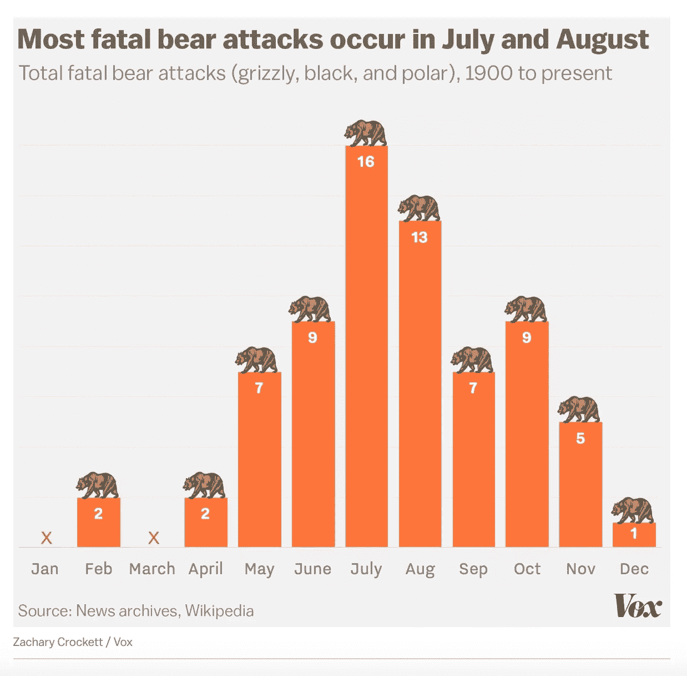
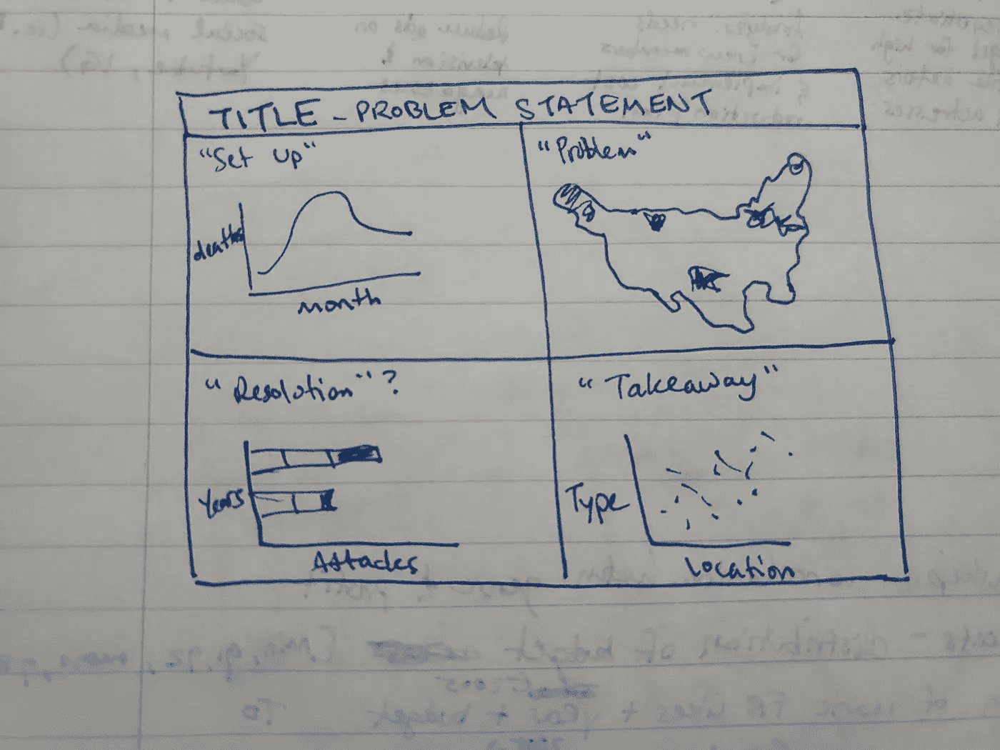
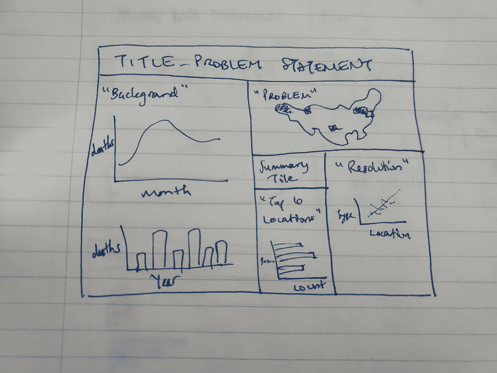

# 你有可能被熊袭击吗？

> 原文：<https://towardsdatascience.com/are-you-likely-to-be-attacked-by-a-bear-5f0ba960e0de?source=collection_archive---------27----------------------->

Photo by [Photo Collections](https://www.pexels.com/@photocollections?utm_content=attributionCopyText&utm_medium=referral&utm_source=pexels) from [Pexels](https://www.pexels.com/photo/animal-animal-photography-bear-big-213988/?utm_content=attributionCopyText&utm_medium=referral&utm_source=pexels)

经过两个月的学习和项目，我来到了 Udacity 的数据可视化纳米学位项目的顶点。简而言之，这个顶点项目的目标是通过从[改头换面星期一](http://www.makeovermonday.co.uk/data/)中选择一个数据集或可视化，并在此基础上进行改进，将课程的所有原则结合到一个作品中。由于我对熊的兴趣，我决定基于[维基百科](https://en.wikipedia.org/wiki/List_of_fatal_bear_attacks_in_North_America#References)的数据来源制作一个关于[致命熊袭击](https://data.world/makeovermonday/2019w21)的可视化图片(尽管它们看起来毛茸茸的，令人想抱，但它们可能是致命的)。伴随可视化的故事由 Vox 的扎卡里·克罗克特撰写。

这篇文章的其余部分详细描述了我改进致命熊攻击可视化的过程，以及我为什么做出这样的设计决定。对于那些只对关键的要点和改进感兴趣的人，请查看 TL；博士部分。对于那些有几分钟空闲时间并且有兴趣和我一起完成我的过程的人，请继续阅读这篇文章的详细部分。

**我的 Viz 改进之旅**

下面可视化的问题陈述是“在哪个公园，什么时候，你最有可能被熊杀死？”

Data collected, prepared, and distributed by Ali Sanne on data.world | Visualization by Zachary Crockett, Vox

自然地，我期望可视化有公园的位置和一年中什么时候熊更可能攻击。当我没有找到那个信息时，我点击了[源文章](https://www.vox.com/2016/10/6/13170344/bear-attacks-national-state-parks)，通读了这个故事。以下是我创建新仪表板的过程:

1.  **下载源数据集**

数据集被收录在 [data.world](https://data.world/) 上，在“改头换面星期一”的源可视化旁边可以方便地找到。在查看了预览以了解包含了哪些数据后，我继续下载了该文件。

**2。浏览/清理 Excel 中的数据**

我做的第一件事是在 Excel 中打开数据集来查看原始数据。我首先通过滚动来熟悉列标题，看看都包括了什么。我在寻找数据中的任何不一致之处，如缺失/空白字段、单元格格式(即字段设置为常规、文本或日期格式)、额外空格和拼写错误。马上，我注意到“位置”栏下的一些单元格被写成“*城市，州*”，而其他单元格被写成“*附近的城市，州*”。我找到了所有在位置前带有“near”的单元格，并点击了 replace，没有填充任何内容(实际上删除了 near 的所有实例)。接下来，我将“日期”列改为日期格式，而不是保留它。最后，我删除了我能找到的任何多余的空格，并运行拼写检查。需要注意一些事情:

*   有些字段是空白的，我认为这是数据收集过程中的选择偏差。似乎这些字段完全是随机缺失的。
*   “年龄”栏下的一些字段包含小数，如 0.41666 或 0.83333，这表明在处理数据时存在一些限制。(幸运的是，年龄不是回答我的问题陈述的关键因素——更多细节见下一节)
*   位置格式没有标准化-一些字段具有国家公园的名称，其他字段具有城市名称和州名称，或者两者的变体。

**3。定义问题陈述和故事大纲**

在浏览完数据集后，我思考了一些问题，这些数据可能表明了一些趋势。我从数据中获得的关键信息是致命熊攻击的地点、熊的类型和攻击日期。我还参考了最初的问题陈述，因为我认为 Zachary 在 Vox 上的故事写得非常好，符合数据，但标题并没有尽可能地描述数据(上面看到的可视化没有显示公园的位置)。根据我对数据的了解和我对扎卡里故事的想法，我决定的问题陈述是“在北美你最有可能被熊袭击的地方是哪里？”

在这一点上，我已经定义了问题陈述，并且我知道主要的数据，所以我需要做的就是将它放入一个故事序列中。我从哪一年发生了多少起致命的熊袭击开始，为问题陈述奠定了基础。然后，我通过指出大多数袭击发生的地点，进入了故事的高潮。最后，我用哪种熊参与了攻击来结束这个故事。

**4。连接到 Tableau 中的数据**

我已经准备好连接 Tableau 中的数据，开始玩可视化游戏。然而，Tableau 反复给我一个错误，说我没有权限访问这个文件。我的快速解决方法是复制原始文件中包含数据的所有单元格，将其粘贴到新的 Excel 文件中，并以另一个名称保存。成功了。

**5。创建单独的工作表和摘要图块**

因为我已经在纸上定义了问题陈述和故事大纲，所以我有了一个粗略的想法，我想要创建什么样的可视化来塑造一个更好的故事。以下是我创作视觉效果的顺序:

*   **条形图**:为了给我的问题陈述搭建舞台，我想展示 1900 年至 2018 年间每月发生多少起致命袭击。这类似于 Zachary 的条形图，但是为了清晰起见，我决定采用一种更简单的设计方法。
*   **图**:清晰直观地链接回问题陈述和故事。这也类似于 Zachary 的故事中的地图，但我将其简化为突出显示熊袭击最致命的州，而不是专门突出显示公园(希望利用更多的原始数据进行定位)。
*   **堆积条形图**:直观对比致命袭击中涉及的熊的种类。
*   **树状图**:直观表示 1900-2018 年间每年有多少人死亡。
*   **高亮显示表格**:为了更好地显示灰熊袭击最多的月份。
*   **横条图**:显示最有可能被熊攻击的前 10 个地点。
*   **摘要贴**:虽然我不确定是否会使用这些，但我还是为我的故事制作了一些。

**6。使用列布局组装仪表板**

现在我已经创建了单独的工作表，剩下的就是如何将它们放在一个仪表板中。我开始在纸上画一些布局草图，然后将所有东西拖放到 Tableau 仪表板中。我的第一个布局是典型的四象限布局。这种布局帮助我思考我的故事，但我不喜欢它显示我的视觉效果的顺序，所以我回到草图。我真的很喜欢黄金比例布局的想法，所以我开始把我的视觉效果拼凑到这个布局中，但我发现较小的“网格”更难填充。我又回去画素描，把我的故事当成叙事来思考。如果我把它放在一个幻灯片中，我将如何呈现视觉效果的顺序？我决定保持简单，采用三列布局。

这是我的速写的样子…

My quadrant layout sketch

Sketch of golden ratio layout

Final sketch — 3 column layout

**7。最终产品**

我创建的最终仪表板是独一无二的，因为它可以独立讲述基于数据的故事。虽然 Zachary 在 Vox 上的故事写得很好，有很好的图形可视化，但我发现很难跟上交替的文本和视觉效果。我所做的是提取文本中的信息，并将其作为可视化信息显示在仪表板上，利用图表标题来总结故事。

最终产品的截图可以在文末找到。如果你想与 Tableau 公共页面互动的话，还提供了到 Tableau 公共页面的链接。

**8。关于数据的说明**

当我浏览这个数据集时，我对我是否应该使用它有非常复杂的感觉，因为数据几乎是零星的。我的意思是，这些数据是由某人根据写在维基百科页面上的数据收集和组织的。根据维基百科页面的引用，看起来大多数数据是从报纸文章、出版物或其他新闻渠道收集的。选择偏差在这里起了作用，因为我们只考虑了基于某人决定写的已发表的故事的致命熊袭击。一个更准确/可靠的获得致命熊袭击的方法可能是从医院记录中获得。

我注意到的另一件事是有关于致命熊袭击的描述。对于那些涉及两个或更多人的攻击，对所有人的描述都是一样的，可能准确也可能不准确。如果我要在我的数据故事中包含对攻击的描述，我必须以某种方式对数据进行规范化。

总之，我认为数据收集过程可以改进，以减少我们处理过程中的限制和偏见。这将产生一个更准确的熊袭击致死率的数据故事。

**TL；博士**

我在 Vox 上找到了由 [Zachary Crockett 创作的关于](https://www.vox.com/2016/10/6/13170344/bear-attacks-national-state-parks)[致命熊袭击](https://data.world/makeovermonday/2019w21)的可视化图片，于是我踏上了改进它的旅程。我开始研究和清理数据集，因为这些数据已经不可用了。当数据准备好了，我把它连接到 Tableau。然后我开始画出潜在的图表和布局。虽然我画的大部分潜在图表都没有做成画面，但我创造了更好的视觉效果来帮助我讲述我的故事(画面的力量)。接下来，我开始绘制仪表板布局，并最终拼凑出我的故事。下面是[最终结果](https://public.tableau.com/profile/vanna3582#!/vizhome/DeathsbyBearsDataVizCapstone/Dashboard1?publish=yes):

Created by Vanna Quon | Made with Tableau Public