# 你准备好成为一名数据科学家了吗

> 原文：<https://towardsdatascience.com/are-you-ready-to-be-a-data-scientist-af3d90770ac1?source=collection_archive---------23----------------------->

Image by [Gerd Altmann](https://pixabay.com/users/geralt-9301/?utm_source=link-attribution&utm_medium=referral&utm_campaign=image&utm_content=4062449) from [Pixabay](https://pixabay.com/?utm_source=link-attribution&utm_medium=referral&utm_campaign=image&utm_content=4062449)

回到 2013 年，麦肯锡的一份报告中有一句令人担忧的话:

> “美国将面临多达 19 万名受过统计和机器学习高级培训的数据科学家的短缺，以及 150 万名在统计方面足够精通以有效使用大数据的经理和分析师的短缺。”
> 
> 麦肯锡报告，2013 年 7 月

不可否认，数据科学是一个快速增长的领域，正在吸引更多的关注，并且迫切需要劳动力来填补当今就业市场上的大量空缺。

虽然我们努力赶上数据科学的潮流，但这里的主要问题是:

我们准备好工作了吗？我们应该学习什么才能开始数据科学职业生涯？

也许解决上述问题的最好方法是查看招聘信息，这些信息可以直接让我们了解雇主对我们当前市场的期望。

在本文中，我将基于一个真实的工作数据集强调几个关键方面。该数据集包括美国数据科学家的职位发布(2018 年更新)。我们将采用探索性数据方法，从数据集中获得洞察力，告诉我们一些关于数据科学职业的事实。

# 在我们开始之前…

如果您希望在 Indeed 数据集上遵循我的数据探索性的演练，您需要做好准备:

1.  **Indeed 职位发布数据集来自 ka ggle:**[https://www . ka ggle . com/elroyggj/Indeed-dataset-data-scientistanalystenengineer](https://www.kaggle.com/elroyggj/indeed-dataset-data-scientistanalystengineer)
2.  **Jupyter 笔记本**
3.  **Python 熊猫& Seaborn 库**

# 1.各行业的数据科学市场需求

## 1.1 加载数据

在 Jupyter Notebook 中，我们从使用 Python pandas 库加载 Indeed job 数据集“ *indeed_job_dataset.csv* ”开始，并快速查看数据。

Python scripts to load data from Indeed dataset

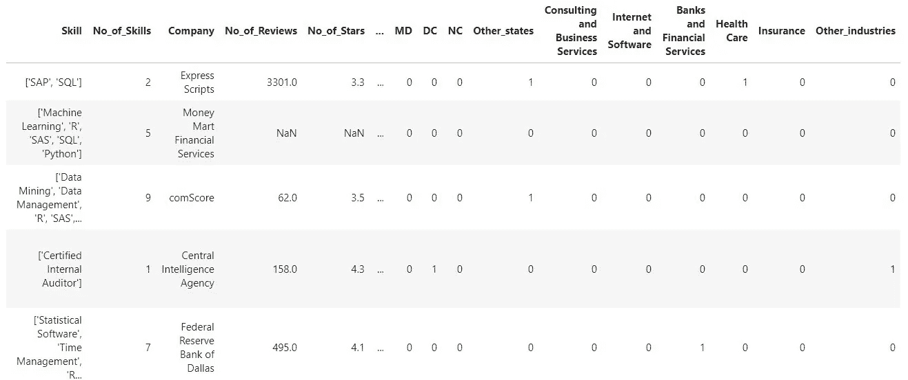

The first five records of Indeed dataset

数据集中总共有 **5715** 个作业条目。对数据的一瞥向我们展示了数据科学职位发布的详细信息，如工资、技能和行业。

## 1.2 绘制饼图

现在，让我们试着通过绘制一个饼状图来探索不同行业的工作需求。

Python script to create Pie Chart

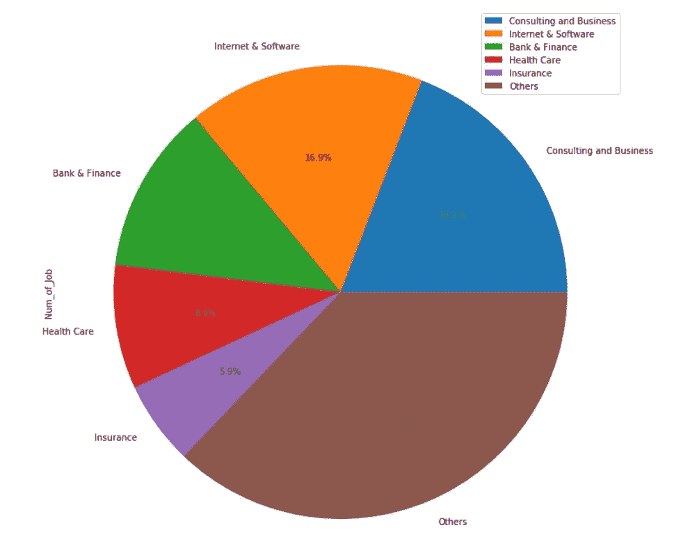

Pie Chart showing data science market demand in various sectors

## 1.3 我们从饼图中学到了什么

如果我们抛开*其他*类别，对数据科学职位需求最高的是 ***咨询和商业*** 部门。然而，不应低估其他领域对数据科学的市场需求。各行业市场需求的存在标志着数据科学职位的工作机会无处不在。有必要快速了解一下数据科学如何影响不同行业的商业模式和运营。

**1.3.1 咨询和商业服务**

在商业领域，数据科学根据从我们的购买和网络浏览历史中收集的数据提供**个性化的客户体验**。例如，每当我们登录亚马逊，系统就足够智能，可以检测并推荐可能是我们最喜欢的书籍。

Amazon Page 1

此外，**还通过显示购买了该商品的*顾客也购买了*商品的列表来交付相关商品**。

Amazon Page 2

简而言之，数据科学极大地促进了商业世界中的**目标营销**过程。

**1.3.2 互联网&软件**

在互联网和软件领域，由于数据科学社区的巨大市场需求，谷歌、微软、亚马逊和 IBM 等科技巨头已经推出了作为云服务的**机器学习** ( **MLaas** )。

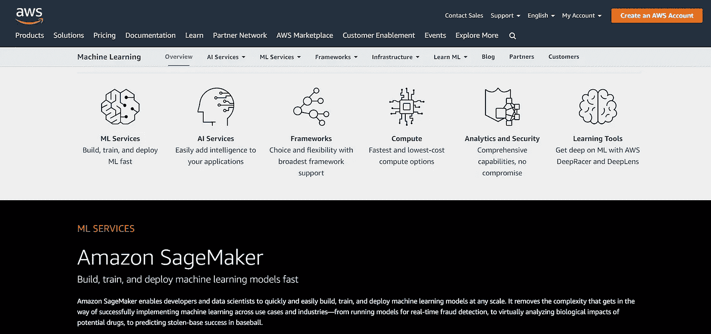

Amazon Machine Learning Services (Source: [https://aws.amazon.com/machine-learning/#](https://aws.amazon.com/machine-learning/#))

MLaas 能够快速启动机器学习(ML)计划，而无需投入大量时间和金钱来购买和设置高级工作机器。有了 MLaas，每个人都可以开始构建他们的第一个 ML 模型，以低成本从预测中产生有价值的见解。

MLaas 的日益流行也意味着未来的软件开发交付不再局限于“*软件产品*”，而是可以以数据科学服务或解决方案的形式出现。这种形式的服务交付在个体自由开发者社区中已经变得司空见惯。一个典型的例子就是 [Fiverr](https://www.fiverr.com/categories/programming-tech/data-analysis-services/machine-learning?source=category_filters&page=1) ***。***

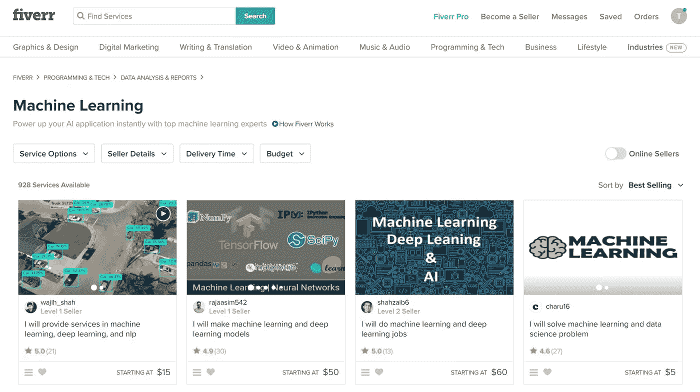

Fiverr Freelance Job Posting For Machine Learning (Source: [https://www.fiverr.com/](https://www.fiverr.com/))

**1.3.3 银行&金融**

数据科学在银行和金融领域的一个典型应用是**欺诈检测。**机器学习能够有效检测涉及银行交易、洗钱、贷款申请以及开立新账户的欺诈活动。例如，每当有异常高的交易活动时，由机器学习算法支持的欺诈检测系统能够将其搁置，直到授权用户验证交易。

Photo by [Dmitry Demidko](https://unsplash.com/@wildbook?utm_source=unsplash&utm_medium=referral&utm_content=creditCopyText) on [Unsplash](https://unsplash.com/s/photos/bank?utm_source=unsplash&utm_medium=referral&utm_content=creditCopyText)

数据科学也有助于改善投资银行的风险建模。通过大数据分析，银行在进行投资或评估公司价值以创造企业融资资本时，可以获得更好的洞察力。

摩根大通等主要金融机构非常重视数据科学的潜力。

> “无论这些变化的时间表如何，分析师、投资组合经理、交易员和首席信息官都需要熟悉大数据和机器学习的发展以及相关的交易策略。”
> 
> 摩根大通

 [## 利用机器学习和人工智能为投资决策提供信息

### 点击查看更多视频用于分析大数据的量化技术和新方法越来越多地被采用…

www.jpmorgan.com](https://www.jpmorgan.com/global/cib/research/investment-decisions-using-machine-learning-ai) 

**1.3.4 医疗保健**

医疗保健领域的数据科学用例总是与可穿戴设备的**大数据分析**联系在一起。可穿戴设备可以捕捉和记录大量的健康数据，如心率、血压甚至我们的睡眠模式。这些可穿戴数据有助于医生预测潜在的健康问题，并提出预防措施。

Photo by [Alexander Ruiz](https://unsplash.com/@rivailruiz?utm_source=unsplash&utm_medium=referral&utm_content=creditCopyText) on [Unsplash](https://unsplash.com/s/photos/wearable?utm_source=unsplash&utm_medium=referral&utm_content=creditCopyText)

此外，数据科学提供巨大前景的另一个领域是机器学习在医疗诊断中的**应用**。随着电子健康记录的大量存在，数据分析师可以应用机器学习技术来处理数据，并进行更快、更精确的诊断。改进的诊断使医生能够在早期检测慢性疾病的迹象，并有效地为患者确定合适的治疗方案。

Image by [rawpixel](https://pixabay.com/users/rawpixel-4283981/?utm_source=link-attribution&utm_medium=referral&utm_campaign=image&utm_content=3343887) from [Pixabay](https://pixabay.com/?utm_source=link-attribution&utm_medium=referral&utm_campaign=image&utm_content=3343887)

另一方面，数据科学也有助于**在医疗保健领域引入个性化的癌症治疗**。最近，一项临床研究表明，人工智能(AI)可以使用医学扫描图像和电子健康记录来产生一个治疗框架，帮助医生预测正确的治疗方法，对个体患者产生最少的副作用。

 [## 使用人工智能进行个性化放射治疗

### 克利夫兰诊所领导的新研究表明，人工智能(AI)可以使用医疗扫描和健康记录来…

newsroom.clevelandclinic.org](https://newsroom.clevelandclinic.org/2019/06/27/using-artificial-intelligence-to-deliver-personalized-radiation-therapy/) 

**1.3.5 保险**

与银行和金融部门类似，保险业面临的一个主要挑战是欺诈检测。这就是数据科学发挥作用的地方，它使用**机器学习模型来识别可能给保险提供商带来损失的欺诈性索赔**。

Photo by [Helloquence](https://unsplash.com/@helloquence?utm_source=unsplash&utm_medium=referral&utm_content=creditCopyText) on [Unsplash](https://unsplash.com/s/photos/insurance?utm_source=unsplash&utm_medium=referral&utm_content=creditCopyText)

通过使用保险数据集，如索赔细节、当事人细节、风险细节等，可以训练机器学习模型来估计欺诈索赔发生的可能性。IBM 已经为保险公司提供了类似的预测分析解决方案，帮助他们处理欺诈性索赔。

 [## 保险预测分析

### 不要看后视镜。使用预测分析来关注未来的道路。今天的保险公司…

www.ibmbigdatahub.com](https://www.ibmbigdatahub.com/whitepaper/predictive-analytics-insurance) 

此外，数据科学还通过为保险产品提供更准确的预测定价模型来改善风险管理。保险公司可以根据客户行为数据预测客户终身价值(CLV)，从而评估客户对保险公司的潜在盈利能力。

# 2.数据科学就业市场的预期技能

从上面的章节中，我们简单了解了数据科学对不同行业运营的影响。另一方面，数据科学总是涉及全面的数据处理管道，需要无数的专业知识来处理数据。

让我们试着再看一遍真实的工作数据集，这次我们将关注雇主期望的技术技能数量。我们将绘制一个条形图，显示从招聘信息中确定的技能数量。

Python script to create a bar chart to show the number of skills expected by employers

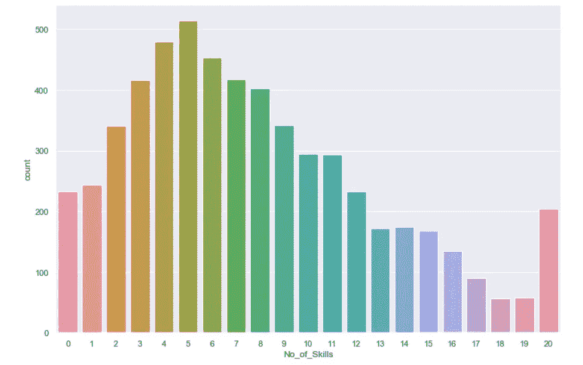

A bar chart showing the number of skills expected by employers

有趣的是，该条形图显示了大多数数据科学职位期望求职者至少具备两种及以上技能。(我们可以善意地忽略显示“*零”*技能数量的招聘信息，这只是因为一些招聘信息不包括任何预期技能的细节。)

也许我们还可以快速地看一下雇主到底期望什么样的技术技能。我们尝试观察前 20 条记录，并查看实际工作数据集中的“*技能*”列。

Python script to view the first 20 records of “Skill” column

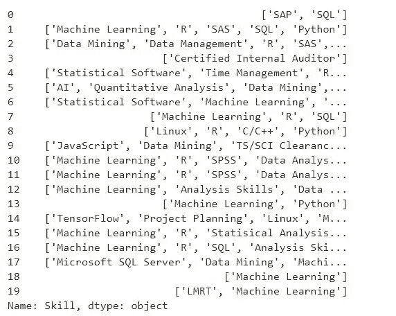

The first 20 records of “Skill” column

一瞥数据让我们看到了一些刺眼的关键词:“**机器学习**”、 **AI** ”、 **R** ”、 **Python** ”、 **SAP** ”、 **SAS** 、 **SQL** 、**数据挖掘**、 **SPSS** 等。

数据集告诉我们**当前的数据科学市场需要多样化的跨学科技能。**

然而，不可能在这里阐明所有的技能(因为这个列表非常长)。相反，我将挑选几个主要类别的必备技能，并逐一介绍。

## **2.1 编程**

Image by [StockSnap](https://pixabay.com/users/StockSnap-894430/?utm_source=link-attribution&utm_medium=referral&utm_campaign=image&utm_content=926775) from [Pixabay](https://pixabay.com/?utm_source=link-attribution&utm_medium=referral&utm_campaign=image&utm_content=926775)

编程是我们在数据科学领域从事许多工作所需要的基本技能，从数据争论、统计分析、可视化分析到机器学习。

在现有的数百种编程语言**、** [**Python**](https://www.python.org/) 和 [**R**](https://www.r-project.org/) 是数据科学中最受欢迎的两种语言。我们可以通过绘制一个条形图来显示就业市场对编程语言的需求，从而再次查看我们的 Indeed 数据集。

Python scripts to create a bar chart showing the market demand for Python and R

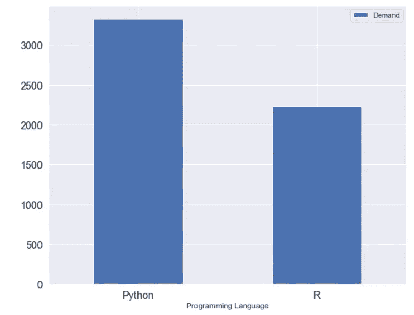

A bar chart showing the market demand for Python and R

它们受欢迎的原因如下:

1.  他们是**开源**。每个人都可以简单地免费使用和重新发布它们。
2.  用于数据分析、可视化和机器学习的丰富包和库。
3.  丰富的学习资源(互联网上有大量的教程)

虽然争论哪种语言更好可能有点争议，但我想说我们可以选择其中一种作为启动数据科学项目的起点。作为一名数据科学探索者，这里主要关心的是通过编写一些代码来熟悉底层的数据处理管道。在这个过程中，我们会找到更好地满足我们需求的工具，并且我们总是可以在以后切换到另一个工具。

此外，我们也不应该忽视除了 Python 和 r 之外的其他语言选择。有一些替代语言，如 **Java、Matlab、Julia、JavaScript、C++等**可用于数据科学。他们每个人都有自己的市场需求和支持社区。

以下是一些对 Python 和 R 编程有用的学习资源:

**Python 教程**

1.  【https://www.guru99.com/python-tutorials.html 
2.  [https://www.w3schools.com/python/default.asp](https://www.w3schools.com/python/default.asp)
3.  [https://www . coursera . org/learn/python-for-applied-data-science-ai](https://www.coursera.org/learn/python-for-applied-data-science-ai)

**R 教程**

1.  [https://www.guru99.com/r-tutorial.html](https://www.guru99.com/r-tutorial.html)
2.  [https://www.statmethods.net/r-tutorial/index.html](https://www.statmethods.net/r-tutorial/index.html)
3.  [http://www.r-tutor.com/](http://www.r-tutor.com/)

## **2.2 数据库开发**

Image by [Gino Crescoli](https://pixabay.com/users/AbsolutVision-6158753/?utm_source=link-attribution&utm_medium=referral&utm_campaign=image&utm_content=2654130) from [Pixabay](https://pixabay.com/?utm_source=link-attribution&utm_medium=referral&utm_campaign=image&utm_content=2654130)

在许多商业环境中，数据被收集并存储在一个结构明确的关系数据库中。在任何数据科学项目中，数据都是最基本的元素，因此应该得到适当的关注，而不是以任意的方式将其放入几个平面文件中。

因此，掌握**关系数据库管理系统(RDBMS)** 在许多数据科学工作中是必不可少的。让我们再次探索我们的 Indeed 数据集，收集一些关于雇主期望的各种 RDBMS 技能的信息。

Python scripts to create a bar chart showing market demand for RDBMS Skills

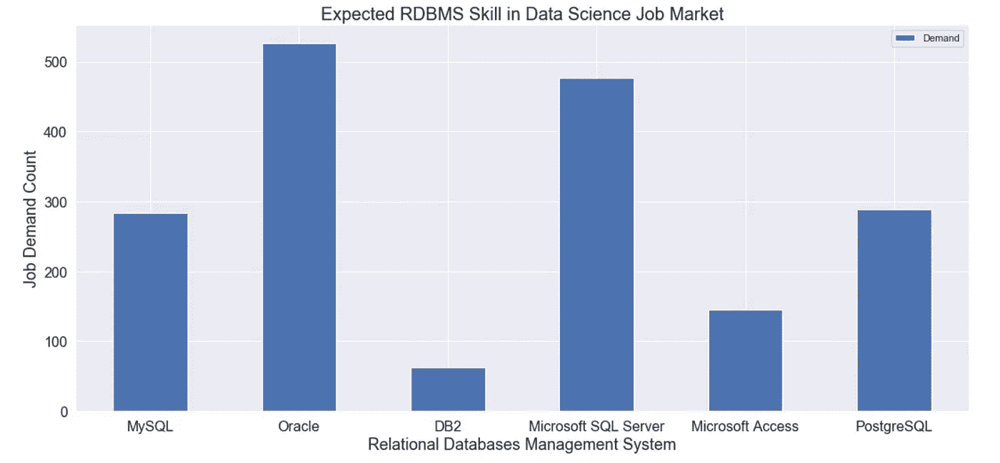

A bar chart showing market demand for RDBMS Skills

上面的条形图显示了对任何流行的关系数据库的熟悉程度，如[**【MySQL】**](https://www.mysql.com/)**[**Oracle**](https://www.oracle.com/database/)**[**DB2**](https://www.ibm.com/my-en/analytics/db2)**[**微软 SQL Server**](https://www.microsoft.com/en-in/sql-server/sql-server-2019)**[**微软 Access**](https://products.office.com/en-my/access) **和**********

****虽然关系数据库仍然被广泛接受，但另一种类型的数据存储， **NoSQL 数据库，**已经开始在各种行业中获得关注。NoSQL 数据库的存在是为了满足市场对更灵活和可扩展的数据结构的需求，以存储通常更加非结构化并以指数速度增长的大数据。****

****用关键字“ *NoSQL* ”对 Indeed 数据集进行简单的查询，将会得到 **607** 个肯定的命中结果。****

****Python script to count positive hits of “NoSQL” from Indeed dataset****

****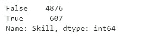****

****Positive hits of “NoSQL” from Indeed dataset****

****这是值得探讨的一些变种，NoSQL 数据库管理系统，出现在确实招聘启事。****

****Python scripts to create a bar chart showing market demand for NoSQL DBMS Skills****

****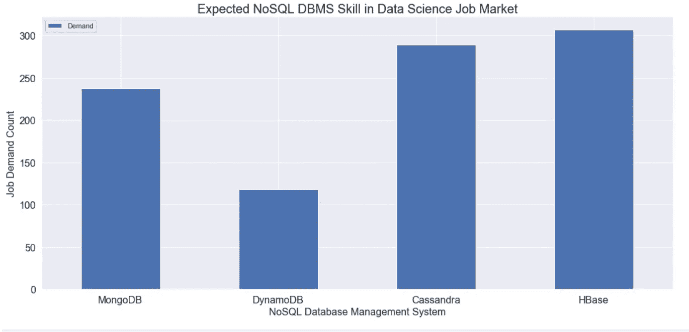****

****A bar chart showing market demand for NoSQL DBMS Skills****

********[**DynamoDB**](https://aws.amazon.com/dynamodb/)**[**Cassandra**](http://cassandra.apache.org/)**和** [**HBase**](https://hbase.apache.org/) 是就业市场上比较流行的四种 NoSQL 数据库管理系统。随着大数据的不断增长，建设 NoSQL 数据库的市场需求必将增加。因此，**掌握 NoSQL 数据库开发**应该是数据科学家遗愿清单的一部分。**********

## ****2.3 数据挖掘****

********

****Photo by [Nicolas J Leclercq](https://unsplash.com/@nicolasjleclercq?utm_source=unsplash&utm_medium=referral&utm_content=creditCopyText) on [Unsplash](https://unsplash.com/s/photos/data-mining?utm_source=unsplash&utm_medium=referral&utm_content=creditCopyText)****

******数据挖掘**从原始数据中提取知识或有用信息，是每个数据科学家的必备技能。数据挖掘的一个关键方面是从原始数据中识别趋势或新兴模式，从而形成决策过程。因此，**统计数据分析**和**可视化分析**是数据挖掘过程中的两个常见例程。****

****从技术上来说，数据挖掘可以使用编程方法来执行，这种编程方法使用诸如 **Python 或 R** 等语言。这两种语言都提供了许多有用的库，只需要几行代码就可以进行统计分析和可视化分析。因此，对于数据科学家来说，仅仅拥有一些基本的编程语法知识是不够的。相反，需要熟悉一些数据科学的库。以下链接显示了用于数据科学的前 20 个 Python 和 R 库:****

1.  ****[https://bigdata-made simple . com/top-20-python-libraries-for-data-science/](https://bigdata-madesimple.com/top-20-python-libraries-for-data-science/)****
2.  ****[https://www . kdnugges . com/2018/05/top-20-r-libraries-data-science-2018 . html](https://www.kdnuggets.com/2018/05/top-20-r-libraries-data-science-2018.html)****

****另一方面，**掌握数据挖掘的软件包如**[**Tableau**](http://tableau.com)[**SPSS**](https://www.ibm.com/my-en/analytics/spss-statistics-software)**[**SAS**](https://www.sas.com/en_my/home.html)**或** [**Excel**](https://products.office.com/en/excel) 在数据科学工作中也是可以期待的。让我们再次探索 Indeed 数据集，观察该软件的市场需求。******

****Python scripts to create a bar chart showing market demand for statistical software****

****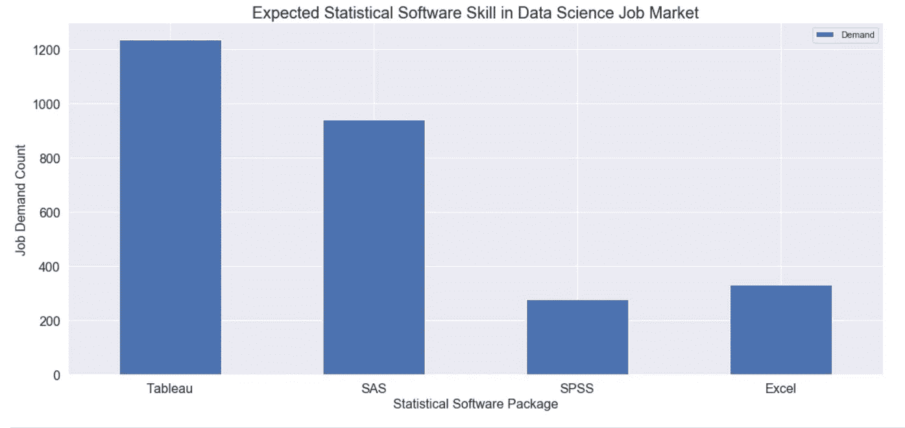****

****A bar chart showing market demand for statistical software****

****显然，Tableau 是行业中使用的统计软件包中的佼佼者。像 Tableau 这样的软件提供了一个非常用户友好的界面，使任何人都可以只通过添加和删除按钮控制来进行令人惊叹的数据可视化。****

****然而，使用软件包进行数据挖掘的缺点是软件要支付高额的许可费。这可能也是 Python 和 R 在业界接受度要好得多的原因(就拿“*Python&R*”Vs“*统计软件包*”的岗位需求统计的两个柱状图对比一下就知道了)。****

## ****2.4 机器学习****

********

****Image by [Gerd Altmann](https://pixabay.com/users/geralt-9301/?utm_source=link-attribution&utm_medium=referral&utm_campaign=image&utm_content=3853117) from [Pixabay](https://pixabay.com/?utm_source=link-attribution&utm_medium=referral&utm_campaign=image&utm_content=3853117)****

****机器学习可能是数据科学中最流行的“术语”。另一个简单的从真实的招聘信息中查询“*机器学习*”关键词会给你 **2297** 肯定的结果。****

****Python scripts to show positive hits of “Machine Learning”****

****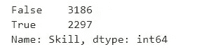****

****Positive hits of “Machine Learning” in Indeed dataset****

****在简单明了的解释中，****

> ****"机器学习是一种给计算机编程的艺术，这样它们就可以从数据中学习."****
> 
> ****奥雷连·盖伦****

****在许多工作领域，机器学习对于使机器本身能够从现有数据中学习以进行大数据分析是可有可无的。目的是对复杂问题(例如银行部门的欺诈检测)做出可靠的预测。****

****与数据挖掘类似，机器学习在技术上可以使用 Python 或 R 编程来完成，这也解释了为什么这两种语言在行业中被广泛接受。因此，**使用一些 Python 和 R 库进行机器学习的经验**也是在数据科学领域获得工作的另一大优势。****

****在开始工作之前，也许磨练机器学习技能的最佳方式是通过实践。Parul Pandey 发表了一篇关于一些顶级数据科学竞赛平台的丰富文章，值得一读。****

**** [## 除 Kaggle 之外的顶级竞争数据科学平台

### 学习任何东西的最好方法是实践。

towardsdatascience.com](/top-competitive-data-science-platforms-other-than-kaggle-2995e9dad93c)**** 

## ****2.5 云计算****

********

****Image by [200 Degrees](https://pixabay.com/users/200degrees-2051452/?utm_source=link-attribution&utm_medium=referral&utm_campaign=image&utm_content=1989339) from [Pixabay](https://pixabay.com/?utm_source=link-attribution&utm_medium=referral&utm_campaign=image&utm_content=1989339)****

****云计算是一种相对较新的技术，在当前的就业市场上开始获得很多关注。许多企业选择云平台，而不是在本地机器上托管数据和应用程序。其中的一些原因包括:****

*   ******节约成本** —云计算采用按需付费模式。基本上，用户只需要为他们使用的服务付费。企业可以节省硬件采购和维护成本。****
*   ******弹性** —云计算能够根据当前需求自动调整计算资源。这对于那些有高峰和非高峰营业时间的电子商务网站尤为重要。****
*   ******安全性和可靠性** —云服务提供商负责系统和数据安全，而不是用户自己。****

****鉴于云计算提供的优势，许多企业期望数据科学家具备云计算技能也就不足为奇了。****

****的确数据集揭示了对管理 [**亚马逊网络服务**](https://aws.amazon.com/)[**微软 Azure**](https://azure.microsoft.com/en-us/) **或** [**谷歌云平台**](https://cloud.google.com/) **的能力的高需求。******

****Python scripts to create a bar chart showing market demand for Cloud Computing Skill****

****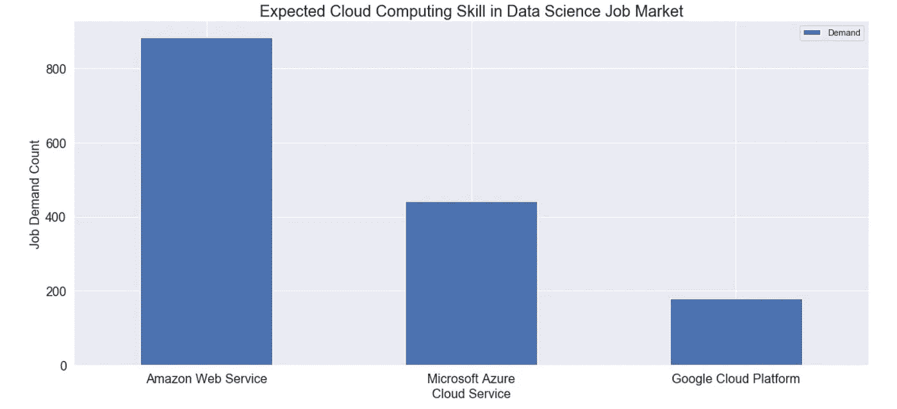****

****A bar chart showing market demand for Cloud Computing Skill****

# ****3.最终想法****

****严格来说，数据科学并不是 21 世纪才出现的。很早以前，在许多商业和学术环境中就发现了利用数据进行决策的方法。很多底层的统计分析方法和机器学习算法都只是几十年前积累的发现。****

****然而，**我们不能否认，随着大数据和互联网技术的存在，如今我们的数据科学家所扮演的角色正在经历巨大的扩展**。等待我们的主要挑战是时刻准备好必要的数据技能，以满足市场需求。持续学习和接触是在数据科学职业生涯中生存的关键。****

# ****参考****

1.  ****麦肯锡报告，2013 年 7 月。(检索自[https://www . McKinsey . com/~/media/McKinsey/Featured % 20 insights/Americas/US % 20 Game % 20 changers/MGI _ Game _ changers _ US _ growth _ and _ renewal _ Full _ report . ashx](https://www.mckinsey.com/~/media/McKinsey/Featured%20Insights/Americas/US%20game%20changers/MGI_Game_changers_US_growth_and_renewal_Full_report.ashx))****
2.  ****机器学习的定义。奥雷连·盖伦(2019)。使用 Scikit-Learn、Keras 和 TensorFlow 进行机器实践学习:构建智能系统的概念、工具和技术****

# ******Github 资源******

*   ****本文中的所有 Python 脚本都可以在一个 [Github](https://github.com/teobguan2016/AreYouReadyToBeDataScientist) repo 中找到。请随意下载代码供您参考。****