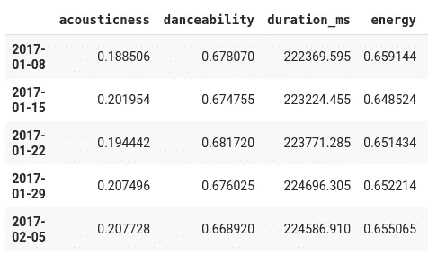
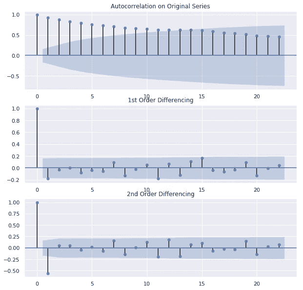
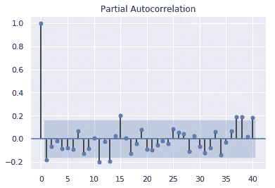
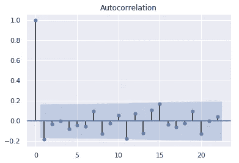
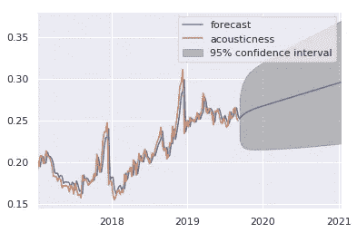
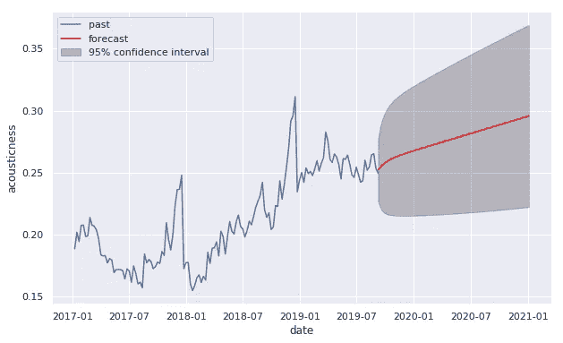

# Python 中的 ARIMA 预测

> 原文：<https://towardsdatascience.com/arima-forecasting-in-python-90d36c2246d3?source=collection_archive---------5----------------------->

## 把手放在某物或者某人身上

## 手动和自动 ARIMA 快速启动和运行，包括对两者的简要讨论。

我将把每周的 Spotify 全球 200 强榜单作为一个时间序列，用来试验 ARIMA 模式。[数据](https://raw.githubusercontent.com/deinal/predict-spotify-top-global/master/data/top_200_features.csv)范围从 2017 年到 2019 年，整个 jupyter 笔记本在[这里](https://colab.research.google.com/drive/1oh3GcHKUJjcAhcvElPlI5iaH7PX-eCcP)都有。

以下是我们进行预测的数据子集:

```
feature_mean.head()
```



Spotify weekly top 200 audio features

ARIMA 代表自回归综合移动平均线，它取决于三个关键变量 *p* 、 *d* 、 *q* 才能成功。简要如下:

*p* =滞后次数/AR 项顺序

*d* =差分顺序

*q* =滞后预测误差数/MA 条款顺序

米什拉写了更多关于 ARIMA 模型内部工作原理的文章，包括参数。我在这里的目标是解释如何手动和自动地在 Python 中快速启动和运行 ARIMA。我将对*声音*特征进行预测:

```
timeseries = feature_mean["acousticness"]
```

让我们使用扩展的 Dickey Fuller (ADF)检验来看看时间序列是否是平稳的:

```
from statsmodels.tsa.stattools import adfullerprint("p-value:", adfuller(timeseries.dropna())[1])
```

p 值:0.43

p 值大于显著性水平 0.05，因此它不是静态的，需要进行差分，即。*d*T42 0。

我们首先使用自相关函数找出差分的阶数 *d* :

```
from statsmodels.graphics.tsaplots import plot_acf, plot_pacffig = plt.figure(figsize=(10, 10))ax1 = fig.add_subplot(311)
fig = plot_acf(timeseries, ax=ax1,
               title="Autocorrelation on Original Series") 
ax2 = fig.add_subplot(312)
fig = plot_acf(timeseries.diff().dropna(), ax=ax2, 
               title="1st Order Differencing")
ax3 = fig.add_subplot(313)
fig = plot_acf(timeseries.diff().diff().dropna(), ax=ax3, 
               title="2nd Order Differencing")
```



时间序列在***d = 1****处静止，只有第一个滞后高于显著性水平。如果你的数列略有差异，试着增加一个额外的 AR 项，如果略有差异，也许增加一个额外的 MA 项。*

*知道我们应该差一次，我们继续找出 AR， *p* 的顺序。我们通过计算偏自相关中显著性水平以上的滞后数来得到它:*

```
*plot_pacf(timeseries.diff().dropna(), lags=40)*
```

**

*第一个滞后是唯一一个大大高于有效电平的滞后，因此 ***p = 1*** 。*

*自相关函数可以告知移除平稳序列中的自相关所需的 MA 项 *q* 的顺序。*

```
*plot_acf(timeseries.diff().dropna())*
```

**

*在显著性水平之上可以发现一个滞后，因此****q = 1***。**

```
**from statsmodels.tsa.arima_model import ARIMAmodel = ARIMA(timeseries, order=(1, 1, 1))
results = model.fit()
results.plot_predict(1, 210)**
```

****

**Akaike 信息标准(AIC)估计给定模型丢失的相对信息量。越少越好。**

```
**results.summary()**
```

**模型:ARIMA(1，1，1)，…，AIC: -806.848 …**

**我们把它放在脑后，继续测试 [auto_arima](http://www.alkaline-ml.com/pmdarima/1.0.0/modules/generated/pmdarima.arima.auto_arima.html) :**

```
**import pmdarima as pm**
```

**创建模型:自动 ARIMA 使用 ADF 来测试平稳性，p 和 q 的起始值被设置为 1，并且 Spotify 数据不被假定为季节性的:**

```
**def arimamodel(timeseries):
    automodel = pm.auto_arima(timeseries, 
                              start_p=1, 
                              start_q=1,
                              test="adf",
                              seasonal=False,
                              trace=True)
    return automodel**
```

**我们希望像使用 statsmodel 的 [plot_predict](https://www.statsmodels.org/stable/generated/statsmodels.tsa.arima_model.ARMAResults.plot_predict.html) 一样简洁地绘制它，因此必须填充预测上限和下限之间的区域。**

```
**def plotarima(n_periods, timeseries, automodel):
    # Forecast
    fc, confint = automodel.predict(n_periods=n_periods, 
                                    return_conf_int=True)
    # Weekly index
    fc_ind = pd.date_range(timeseries.index[timeseries.shape[0]-1], 
                           periods=n_periods, freq="W")
    # Forecast series
    fc_series = pd.Series(fc, index=fc_ind) # Upper and lower confidence bounds
    lower_series = pd.Series(confint[:, 0], index=fc_ind)
    upper_series = pd.Series(confint[:, 1], index=fc_ind) # Create plot
    plt.figure(figsize=(10, 6))
    plt.plot(timeseries)
    plt.plot(fc_series, color="red")
    plt.xlabel("date")
    plt.ylabel(timeseries.name)
    plt.fill_between(lower_series.index, 
                     lower_series, 
                     upper_series, 
                     color="k", 
                     alpha=0.25)
    plt.legend(("past", "forecast", "95% confidence interval"),  
               loc="upper left")
    plt.show()**
```

**然后我们就有了拟合和绘制模型所需的所有内容:**

```
**automodel = arimamodel(feature_mean["danceability"])
plotarima(70, feature_mean["acousticness"], automodel)**
```

****

```
**automodel.summary()**
```

**模型:ARIMA(1，1，1)，…，AIC: -806.848 …**

**这与我们手动得到的参数化结果完全相同。哇，效果很好！使用 auto_arima 获得正确的参数要容易得多，也快得多，唯一的缺点是必须从头开始绘制，以便看起来和 statsmodels 内置的一样好。**

**MachineLearning+网站上关于 ARIMA 模式的精疲力尽的指南功不可没。哦，你也可以试着用前面提到的[笔记本](https://colab.research.google.com/drive/1oh3GcHKUJjcAhcvElPlI5iaH7PX-eCcP)把*的声音*改成别的，比如*的舞蹈*。**

**[1]:米什拉(M. Mishra)，拆箱 ARIMA 模型(2018 年 6 月 11 日)，[https://towardsdatascience . com/Unboxing-ARIMA-Models-1 DC 09d 2746 f 8](/unboxing-arima-models-1dc09d2746f8)**

**[2]: ARIMA 模型—Python 中时间序列预测完全指南，[https://www . machine learning plus . com/Time-Series/ARIMA-Model-Time-Series-Forecasting-Python/](https://www.machinelearningplus.com/time-series/arima-model-time-series-forecasting-python/)**