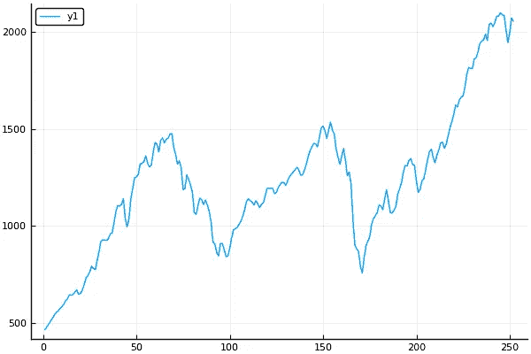
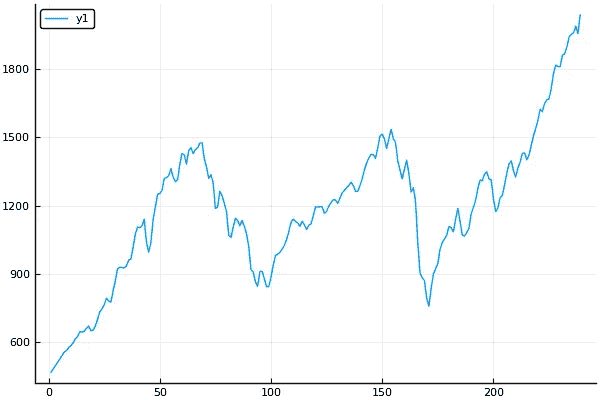
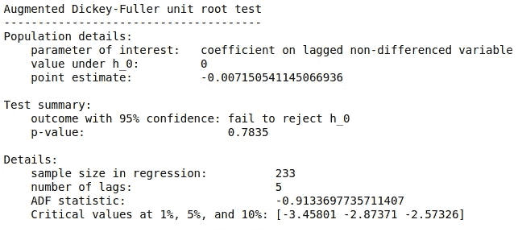
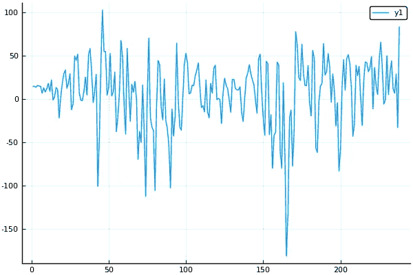
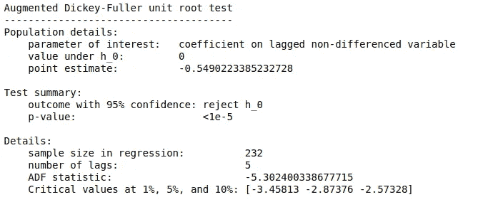
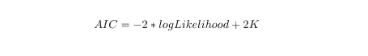

# ARIMA 模型与图灵. jl

> 原文：<https://towardsdatascience.com/arima-models-with-turing-jl-81dcf2a1094c?source=collection_archive---------11----------------------->

## 使用概率编程语言(PPL) [Turing.jl](https://turing.ml/dev/) 进行时间序列分析和预测。茱莉亚的实现可以在[这里](https://github.com/saumyagshah/JupyterNBTuringExamples/blob/master/time_series_ARIMA.ipynb) (Jupyter 笔记本)或者[这里](https://github.com/saumyagshah/TuringExamples/blob/time_series_ARIMA/time_series_ARIMA.jl)(。jl 文件)。


Time Series Models often have useful applications in the field of finance; Photo by [Markus Spiske](https://unsplash.com/@markusspiske?utm_source=medium&utm_medium=referral) on [Unsplash](https://unsplash.com?utm_source=medium&utm_medium=referral)

你好！

本文是我在 Julia Season of 投稿(JSoC) 2019 中完成的工作的一部分。它使用概率编程语言(PPL) [Turing.jl](https://turing.ml/dev/) 描述了 ARIMA 模型的 Julia 实现，这为定义概率模型提供了极大的便利。当我们在本文后面查看模型定义时，图灵的这一方面将变得更加明显。此外，图灵支持使用定制分布来指定模型。

好吧，那我们就直入主题吧！

## 导入库

## 加载和可视化数据集

我们将使用包含 1995 年至 2015 年标准普尔 500 调整后收盘值的数据集，每月一次。数据集可以从[这里](https://github.com/inertia7/timeSeries_sp500_R/blob/master/data/data_master_1.csv)(麻省理工学院许可)下载。

运行上面的代码后获得了下面的图。这就是我们的数据看起来的样子，绘制了每个时间指数的值:



Complete Data

我们将数据分为训练集和测试集，将 95%的数据作为训练集:



Train Data

## 检查稳定性

从图中我们可以看出，这个数列的平均值在接近尾声时上升。所以，级数不是平稳的。这通过针对平稳性的增强 Dickey-Fuller (ADF)测试得到了加强:



ADF test before differencing

因此，我们对时间序列进行差分，试图消除平稳性:



Plot of the differenced time series

这个数列似乎有一个大致不变的平均值，尽管这并不一定意味着这个数列是平稳的。我们再次使用 ADF 测试:



ADF test after differencing

成功！由于 p 值很低，我们可以有把握地假设这个序列是平稳的。借助于 ACF 和 PACF 图，我们现在可以继续为我们的差分时间序列选择 AR 和 MA 项。

## 借助 ACF 和 PACF 图选择 MA 和 AR 术语

为我们的训练数据获得的 ACF 和 PACF 图如下所示:

这些图可以用以下方式来解释:

*   我们可以有一个一阶自回归项，因为在滞后 1 处有正自相关。
*   PACF 曲线逐渐衰减，ACF 曲线在几个滞后之后突然截止。这表明移动平均项的存在。这一项的顺序应该是 1，因为所有大于 1 的滞后没有显著的相关性。

在 ARIMA 模型中同时包含 AR 和 MA 术语并不常见。所以，我们不会考虑这种情况。从以上两点来看，似乎模型更有可能存在移动平均项。然而，我们将考虑 ARIMA 模型的两种可能情况:

*   *ARIMA(1，1，0)*
*   *ARIMA(0，1，1)*

*ARIMA(p，d，q)* 模型的符号定义如下:

*   p:自回归项的个数
*   问:移动平均线的条数
*   差分的顺序

我们实现了这两种情况，并使用赤池信息标准(AIC)对模型进行了比较。这个[网页](https://people.duke.edu/~rnau/411arim.htm)作为定义下面的 *ARIMA(1，1，0)* 和 *ARIMA(0，1，1)* 模型的参考。

## ARIMA(1，1，0)

*ARIMA(1，1，0)* 模型定义如下:

```
[@model](http://twitter.com/model) ARIMA110(x) = begin
    T = length(x)
    μ ~ Uniform(-10, 10)
    ϕ ~ Uniform(-1, 1)
    for t in 3:T
        val = μ +                      # Drift term.
              x[t-1] +                 # ARIMA(0,1,0) portion.
              ϕ * (x[t-1] - x[t-2]) # ARIMA(1,0,0) portion.
        x[t] ~ Normal(val, 1)
    end
end
```

这里， *x* 是原始时间序列，因为我们已经考虑了模型定义本身的差异。注意，我们将有一个自回归项，因为 *p = 1。*

## ARIMA(0，1，1)

*ARIMA(1，1，0)* 模型定义如下:

```
[@model](http://twitter.com/model) ARIMA011(x) = begin
    T = length(x) # Set up error vector.
    ϵ = Vector(undef, T)
    x_hat = Vector(undef, T) θ ~ Uniform(-5, 5) # Treat the first x_hat as a parameter to estimate.
    x_hat[1] ~ Normal(0, 1)
    ϵ[1] = x[1] - x_hat[1] for t in 2:T
        # Predicted value for x.
        x_hat[t] = x[t-1] - θ * ϵ[t-1]
        # Calculate observed error.
        ϵ[t] = x[t] - x_hat[t]
        # Observe likelihood.
        x[t] ~ Normal(x_hat[t], 1)
    end
end
```

与前面的模型定义一样， *x* 是原始时间序列。注意，我们将有一个移动平均项，因为 *q = 1。*

这里要注意的一点是，用图灵编写的代码与写在纸上的代码在本质上是一样的。从上面的模型定义中可以明显看出这一点，只要看一下代码就可以理解这些模型定义。

## 抽样

使用螺母取样器对链条进行取样。你可以查看[文档](https://turing.ml/dev/docs/library/#samplers)来了解更多关于 NUTS 和图灵支持的其他几个采样器的信息。用于采样的代码如下:

要获得参数的可视化和汇总统计数据，您可以查看代码[这里](https://github.com/saumyagshah/JupyterNBTuringExamples/blob/master/time_series_ARIMA.ipynb) (Jupyter 笔记本)或[这里](https://github.com/saumyagshah/TuringExamples/blob/time_series_ARIMA/time_series_ARIMA.jl)(。jl 文件)。

## 比较 AIC 值

阿凯克信息标准(AIC)衡量不同统计模型的相对“良好性”。因此，它可以用于模型比较的目的。AIC 值越低，模型越好。此外，人们必须记住，AIC 的绝对值并没有多大意义，相对值才是重要的。数学上，AIC 由下式给出:



Formula for AIC

使用这个公式，我们可以计算两个模型的 AIC 值。该 [PDF](http://www.igidr.ac.in/faculty/susant/TEACHING/TSA/print06.pdf) 已被用作计算两个模型的 AIC 值的参考。

*   *ARIMA(1，1，0)*

```
function calculate_aic_ARIMA110(β::Float64, μ:: Float64, σ::Float64, s::Array{Float64, 1})
    T = length(s)
    ϵ = Vector(undef, T)
    s_pred = Vector(undef, T)

    s_pred[1], s_pred[2] = s[1], s[2]
    ϵ[1], ϵ[2] = 0.0, 0.0 
    for t in 3:T
        s_pred[t] = μ +                      
              s_pred[t-1] +                 
              β * (s_pred[t-1] - s_pred[t-2]) 
        ϵ[t] = s_pred[t] - s[t]
    end
    log_likelihood = (-(T - 1)/2)*2*π*σ^2 - (1/σ^2)*sum(ϵ.^2) 
    - π*σ^2/(1 - β^2) - ((s[1] - μ/(1 - β))^2)/(2*σ^2/(1 - β^2))
    aic = -2*log_likelihood + 2
    return aic
end
```

使用此函数，我们得到 ARIMA(1，1，0)的 AIC 值约为-299655.26

*   *ARIMA(0，1，1)*

```
function calculate_aic_ARIMA011(β::Float64, σ::Float64, s::Array{Float64, 1})
    T = length(s) ϵ = Vector(undef, T)
    s_pred = Vector(undef, T) s_pred[1] = s[1]
    ϵ[1] = 0.0
    for t in 2:T
        s_pred[t] = s[t-1] - β * ϵ[t-1]
        ϵ[t] = s[t] - s_pred[t]
    end
    log_likelihood = -(T/2)*log(2*π) - (T/2)*log(σ^2) +                                                                           (1/2*σ^2)*sum(ϵ.^2)  
    aic = -2*log_likelihood + 1
    return aic
end
```

使用此函数，我们得到 ARIMA(1，1，0)的 AIC 值约为 6.22 x 10⁷.

显然，我们可以看到 ARIMA(0，1，1)模型更好。

我用 Turing.jl 写的关于 ARIMA 模型的文章到此结束，希望你会觉得有趣。如果你对这篇文章有任何问题或疑问，请随时联系我，邮箱是 [s](https://saumyagshah.github.io/) shah@iitk.ac.in，或者你可以在 Julia slack 上用@Saumya Shah 给我加标签。

# 参考

[1]ARIMA 模型介绍。(2019).检索于 2019 年 8 月 26 日，来自[https://people.duke.edu/~rnau/411arim.htm](https://people.duke.edu/~rnau/411arim.htm)

[2]托马斯·s .(2009 年)。*估计 AR/MA 模型*【电子书】。检索自[http://www . igi dr . AC . in/faculty/susant/TEACHING/TSA/print 06 . pdf](http://www.igidr.ac.in/faculty/susant/TEACHING/TSA/print06.pdf)