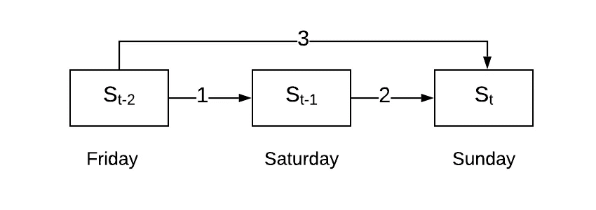

# ARIMA 简体。

> 原文：<https://towardsdatascience.com/arima-simplified-b63315f27cbc?source=collection_archive---------5----------------------->

## 对最流行的时间序列预测模型的简单解释

# 背景

> 时间序列预测背后的基本直觉是，某个时间段内某个变量的度量将取决于前一个时间段、前两个时间段、前三个时间段等同一变量的度量。

时间序列预测在许多预测问题(尤其是在商业领域)中都有应用，而 ARIMA 是最好的起点之一！

本文的目标是突出这个模型背后的构建模块(即 **AR** 、 **I** 和**MA】)**和底层概念(即**自相关**和**部分自相关** ) 。

# 相关和滞后因子

让我们考虑一个在任何特定的一天，比如说星期天，预测汽油价格的例子。显而易见，周日的价格将取决于周六的价格。

现在让我们考虑一下周五的价格对周日价格的影响

由于周日的价格取决于周六的 **(2)** ，而周六的价格又取决于周五的 **(1)** ，周五的价格和周日的价格之间可能存在间接传递关系。

上述关系如下图所示。

Auto-correlation

除此之外，还有一个关系可能一开始很难想象，即周五的价格对周日价格的直接影响 **(3)** 。

这里日价格之间的这种相互关系，就叫做*。如果两个变量的值一起增加(或减少)，那么就说它们有正相关性。如果一个变量的值增加而另一个减少(反之亦然)，那么它们有一个*负相关性。**

*相关性是时间序列的一个重要概念，*

*   ***自相关，同时考虑*直接*和*间接*效应的**(如上图所示)，*
*   ***部分自相关，**仅考虑*的直接影响*，如下图所示*

**

*Partial auto-correlation*

## *滞后因素*

*因为我们已经考虑了基于前两天(即周五)价格的周日价格的影响…这里的滞后因子是 2。*

**

*Lag factor concept*

***自相关**和**部分自相关**在继续学习 ARIMA 之前理解很重要，因为它们对于为你的模型选择正确的参数至关重要。你可以在这里找到一个很好的解释[。](https://www.youtube.com/watch?v=DeORzP0go5I)*

# *自回归(AR)*

> *自回归(AR)模型是一种特殊类型的回归模型，其中因变量依赖于自身的过去值。*

*这必然意味着当前值与先前时间步骤中的值相关。更具体地说，这里的相关类型是[部分自相关](https://en.wikipedia.org/wiki/Partial_autocorrelation_function)。*

*AR 模型的方程式如下所示*

**

*AR equation*

*相应滞后观测值的相应权重(ф1，ф2…фp)由滞后观测值和当前观测值之间的相关性决定。如果相关性越大，对应于滞后观察的权重越高(反之亦然)。*

*注意等式中的 **(p)***

*这个 **(p)** 叫做滞后阶。它代表我们在模型中包括的先前滞后观察的数量，即与当前观察有显著相关性的滞后的数量。*

# *移动平均线*

> *移动平均(MA)模型的工作原理是分析你在预测前一个时间段的值时的错误程度，从而对当前时间段做出更好的估计。*

*基本上，这个模型考虑了滞后观测的误差。这些先前(滞后)观测误差对当前观测的影响取决于它们之间的[自相关](https://en.wikipedia.org/wiki/Autocorrelation)。这在某种意义上类似于考虑*部分自相关*的 ar 模型。*

**

*MA equation*

*ε项表示在相应滞后处观察到的误差，权重(ω1，ω2 …ωq)根据相关性进行统计计算。*

*注意等式中的**(q)**…*

***(q)** 表示移动窗口的大小，即对当前观测有重大影响的滞后观测误差的数量。它类似于滞后顺序 **(p)** ，但是它考虑的是误差而不是观测值本身。*

*MA 模型补充了 AR 模型，考虑了以前时间段的误差，从而有助于获得更好的估计。*

*当我们结合 AR 和 MA 等式时，我们得到*

**

*Combined equation for ARMA*

# *平稳性*

*到目前为止，我们讨论的模型(ar 和 MA)都假设序列是平稳的。这也意味着**【平稳性】**是利用这些模型进行任何时间序列的必要条件。*

## *但是…什么是平稳性？*

*基本上，一个时间序列要成为*平稳*，应该满足以下三个条件…*

1.  *[的意思是](https://en.wikipedia.org/wiki/Mean) ( **μ** )是*常数**
2.  *[标准差](https://en.wikipedia.org/wiki/Standard_deviation) ( **σ** )是*常数**
3.  *[季节性](https://www.itl.nist.gov/div898/handbook/pmc/section4/pmc443.htm) *不存在**

*在大多数情况下，通过研究相对于时间的曲线，可以直观地分析这些条件。*

*你会遇到许多显然不是平稳的数列。*

*这是否意味着预测不能应用于这些情况？*

*嗯…这就是子缩写 **I** 的由来…*

# *综合(一)*

*比方说，你遇到一个具有**“非常数”**平均值的数列。可以清楚地观察到，平均值随着时间的推移而增加，即*序列不是稳定的。**

**

*Amazon stock value over time*

*如果我们能以某种方式消除这种上升趋势，我们就可以走了。*

*一种方法是考虑连续时间步长之间的差异。这相当于执行形式的转换…*

**

*Transformation*

*应用这种变换，我们得到了具有可观测的常数平均值的下列趋势。标准差也是恒定的，季节性不存在，即该系列现在是*稳定的。**

**

*Transformation applied*

***I** 代表**集成** *(虽然与集成无关)*。这只是意味着，我们不是预测时间序列本身，而是预测序列从一个时间步到下一个时间步的差异。*

*注意，这里我们采用了一阶差分，即连续项差分的单个相位。这可以多次进行以使系列静止。*

**

*这个差分顺序**(**d**)**是 ARIMA 的一个重要参数，决定了模型的成功与否*****

*****因此，为了修正，最终的 ARIMA 模型将采取以下形式。*****

**********

# *****外卖食品*****

*****ARIMA 由于其简单性和对非平稳序列的泛化能力，是一种广泛使用的预测模型。*****

*****尽管如此，了解什么时候使用 ARIMA，什么时候不使用它是很重要的。ARIMA 不适用于季节性的数据。比如农作物产量预测或者人造圣诞树的销售！*****

*****在这些情况下，最好使用季节性 ARIMA。*****