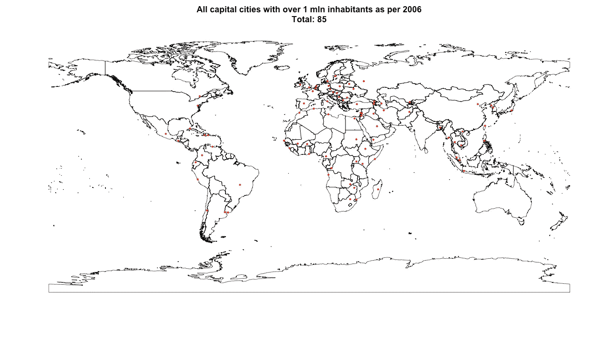
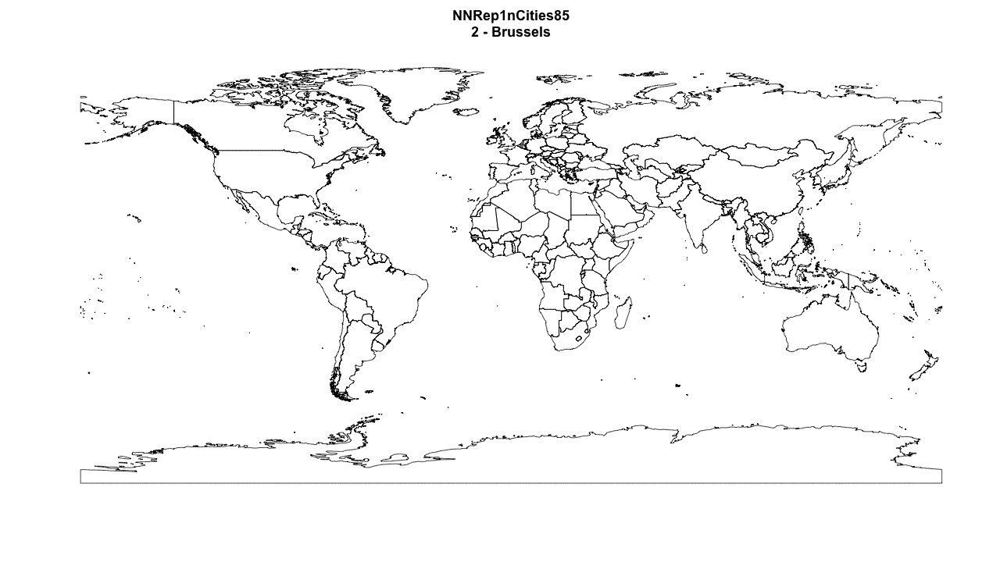
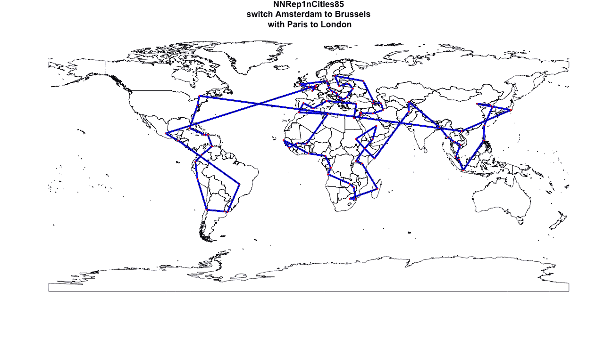
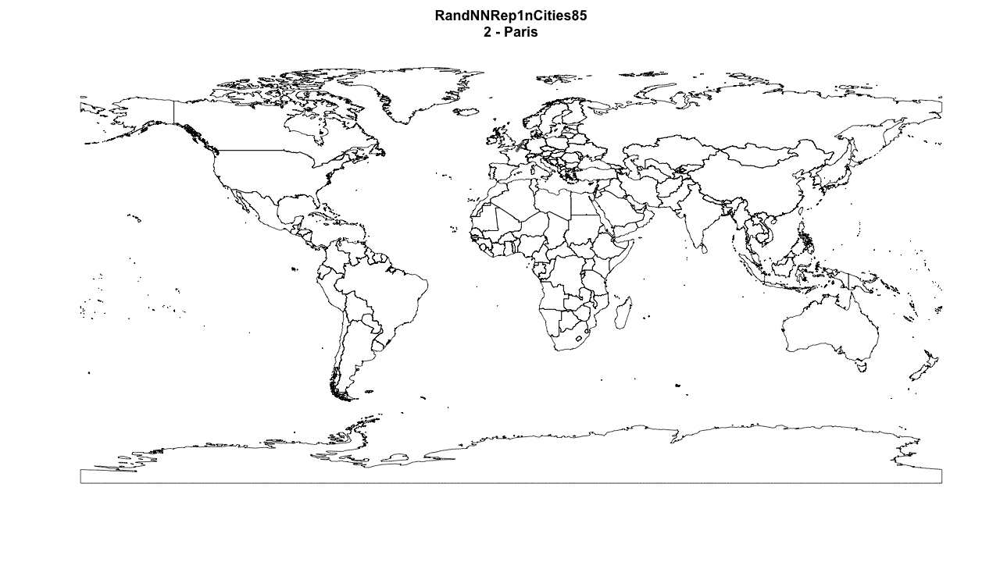
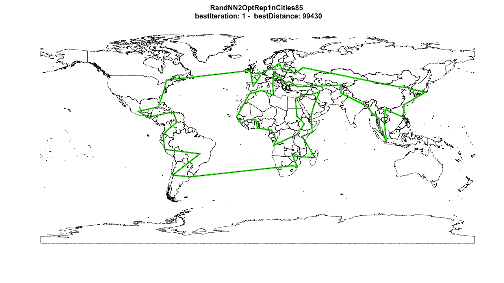
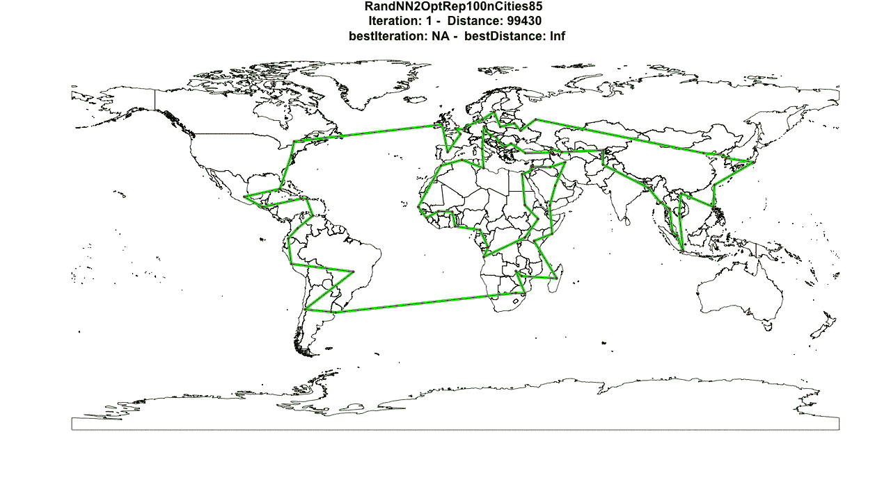
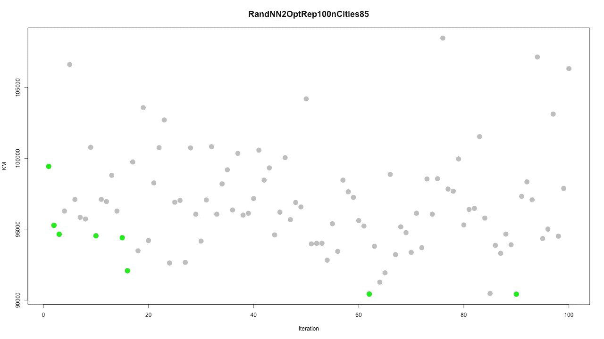
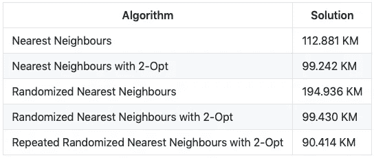

# 用直观的可视化解释搜索算法的基础

> 原文：<https://towardsdatascience.com/around-the-world-in-90-414-kilometers-ce84c03b8552?source=collection_archive---------11----------------------->

本文比较了应用于 85 个城市的旅行商问题的几种搜索算法。目标是向刚接触优化主题的人展示一些众所周知且有效的搜索算法背后的直觉。我选择构建不太复杂的算法，并试图将它们描述得尽可能容易理解。如果你感兴趣，你可以使用提供的 R 代码自己运行它们或者创建你自己的修改(向下滚动链接)。

# 旅行推销员问题

给定一组城市以及每对城市之间的旅行成本，旅行推销员问题(TSP)就是找到一种最便宜的方式来访问所有城市并返回起点。问题陈述的简单性是欺骗性的；TSP 是计算数学中研究最深入的问题之一。对于这个项目,“成本”被定义为两个城市之间的直接距离(即欧几里德距离),单位为千米。

# 资料组

根据 2006 年的统计，需要访问的 85 个城市都是全球人口超过 100 万的首都城市。今天可能会有更多人口超过 100 万的首都城市，但这与优化问题本身无关。我为美国首都(华盛顿)、加拿大首都(渥太华)和荷兰首都(阿姆斯特丹)开了一个例外。他们在 2006 年没有超过 100 万的居民，但我还是添加了他们，只是为了好玩。该数据集是从一个源文件构建的，该文件可以在 R 的“地图”包中免费获得，包含超过 40，000 个城市的信息。当然，我们所有的路线都从阿姆斯特丹开始。

# 方法

一种方法是计算所有可能的路线并选择最佳路线。对于这个有 85 个城市的 TSP 的例子，可能的解的数目是 1.65712e+126，或者 16571200672826435296943171271229587838132927197483106469639871841941940477704。这比宇宙中的恒星数量还要多([来源](https://www.esa.int/Our_Activities/Space_Science/Herschel/How_many_stars_are_there_in_the_Universe)，或者撒哈拉沙漠中的沙粒数量还要多([来源](https://www.youtube.com/watch?v=jQ41Gk80djs))。使用这种方法需要很多年和一台量子计算机来解决这个问题。因为我两者都没有，所以这种方法是不可行的。

另一种方法是使用精确的算法，如分支定界法或单纯形法。这些都是非常稳健的方法，将为高达+/-200(在普通 PC 上)的 TSP 问题找到最佳解决方案。然而，以一种直观的方式将这些可视化是具有挑战性的，如果不是不可能的话。由于这个项目的主要目标是向刚接触这个主题的人展示算法的直觉，这些是不合适的。此外，这些方法不能很好地扩展，因此将它们应用到更多的城市(源文件总共包含 40.000 个城市)是不可行的。因此，玩大型游戏的机会就少了。

相反，我使用了另一种强有力的方法来解决这个问题:搜索试探法。这些方法的优点是，您可以保持它们相对简单和直观，同时它们仍然可以找到(接近)最优的解决方案。此外，它们的伸缩性更好，因此将它们应用于更大的 TSP 将更不容易使您的机器崩溃。缺点是你不知道你离最优值有多远。我使用的搜索试探法是最近邻、随机最近邻和(重复)2-Opt。正如我将向你展示的，这些方法相对简单，但也非常有效和直观，尤其是结合使用时。

# 最近的邻居

最近邻居(NN)是最简单的搜索试探法之一。它是建设性搜索试探法家族的一部分，这意味着它会逐渐建立一条路线。从一个城市开始，仅在访问完所有城市后停止。它本性贪婪；在每一步中，它选择离当前位置最近的位置。

Nearest Neighbours

应用于我们的问题，我们找到一条总距离为 112.881 KM 的路线。每次我们运行算法，都会产生完全相同的解。这看起来让人放心，但这也是这种算法的一大缺点。由于其贪婪的本性，它总是追求眼前的利益，错过了在更长时间内会有回报的机会。NN 给了我们一个可行的解决方案，第一次尝试看起来一点也不差。但是我们能进一步改进它吗？

# 具有 2-Opt 的最近邻

2-Opt 是来自局部搜索家族的算法。这些算法从初始解开始，迭代地在该解的邻域中寻找改进机会。这个初始解可以是任何类型的解，只要它是可行的。例如，像 NN 这样的构造性算法的结果或者从专家知识构建的解决方案。

2-opt 算法的工作方式如下:从路径中提取两条弧线，将这些弧线重新连接起来，然后计算新的行驶距离。如果此修改导致总行驶距离缩短，则更新当前路线。该算法继续建立在改进的路线上，并重复这些步骤。重复该过程，直到没有发现更多的改进，或者直到完成了预定次数的迭代(在该实现中为 100 次)。

比如，让我们走以下路线:阿姆斯特丹—布鲁塞尔—巴黎—柏林—哥本哈根—赫尔辛基—伦敦—阿姆斯特丹。一个拱门可能是布鲁塞尔-巴黎，另一个可能是哥本哈根-赫尔辛基。2-Opt 交换这些拱门中的连接，即现在的路线从布鲁塞尔-哥本哈根和从巴黎-赫尔辛基运行。

*   目前航线:阿姆斯特丹—布鲁塞尔—巴黎—柏林—哥本哈根—赫尔辛基—伦敦—阿姆斯特丹
*   修改后的航线:阿姆斯特丹—布鲁塞尔—哥本哈根—柏林—巴黎—赫尔辛基—伦敦—阿姆斯特丹

Nearest Neighbours with 2-Opt

为了方便起见，这个可视化只显示了一次迭代(即阿姆斯特丹-布鲁塞尔弧线)，但是在我的实现中可能有多达 700，000 次这样的迭代。因此，对于一个小的实例，最终的解决方案可能看起来与初始的解决方案非常不同。NN + 2-Opt 找到的最终解是 99.242 KM。万岁！我们改进了我们的旅行！

# 随机最近邻

虽然 2-Opt 能够改善我们的游览，NN 扩展的最初的缺点仍然存在。我们可能仍然只是在改进一个局部最优的解决方案，而永远无法利用大的长期改进机会。为了增加我们“偶然发现”其中一个重大改进机会的机会，我们需要多样化我们最初的开始解决方案。这意味着我们可能会提出最初看起来“愚蠢”的初步解决方案，但实际上是伟大事业的基石。

这就是随机最近邻算法(RNN，不要被误认为是递归神经网络)发挥作用的地方。与常规 NN 算法的唯一区别是，它不是完全“贪婪的”，因为在构建路线的每一步，它都会考虑多个候选项(在我的实现中是 3 个最短距离选项)并随机选择 1 个。您可以通过增加或减少候选项的数量来调整算法的“贪婪性”。不太贪婪的算法会在生成的路由中产生更多的差异。

Randomized Nearest Neighbours

当应用到我们的问题时，最终的解决方案几乎增加了一倍的旅行距离，194.936 公里，而且情节看起来非常混乱。但是等等！先不要把你的电脑扔出窗外。由于我们算法中的随机性(即它的随机性质)，这可能只是运气不好。或者我们可能非常幸运，它可能被证明是本地搜索的一个极好的构建块…让我们调查一下！

# 具有 2-Opt 的随机最近邻

接下来，我们将 2-Opt 应用于 RNN 的最终解决方案，看看它实际上是否是伪装成怪物的天才积木。

Randomized Nearest Neighbours with 2-Opt

是啊！！！2-Opt 将我们开始时的这条丑陋的东西变成了一条只有 99.430 公里的美丽的新路线。这几乎就像一个童话故事…但是等等，我们还没有去酒吧庆祝。这条路线比从 NN+2op 开始的路线稍长，所以我们有更多的工作要做。

RNN 的随机结果给了我们一个很好的工作基础。但是，如果有更好的积木呢？由于这一过程的随机性，每次重复都会产生不同的结果，即不同的开始路线。如果我们重复这个过程很多次呢？也许我们会偶然发现一个更好的积木！

# 具有 2-Opt 的重复随机最近邻

该算法多次运行 RNN 算法，并对每个结果应用 2-Opt。通过一遍又一遍地重复这个过程，我们正在探索许多不同的初始解决方案的邻域。这样做，我们大大扩大了搜索范围，我们有更好的机会找到局部和全局最优解。在我的实现中，我重复这个过程 100 次，以确保 GIF 不会变得太大。

Repeated Randomized Nearest Neighbours with 2-Opt

哇！应用这种算法组合，我们目前的最佳总旅行距离减少了 10%!总行驶距离现在是 90.414 公里。现在是庆祝的时候了。这个算法已经能够在我们之前的最佳路线上找到 8 个改进。通过在探索的初始解中引入方差，我们能够探索许多不同的解，并迭代地改进它们。这样做，我们可以覆盖很多领域，也可以探索最初看起来不太有希望的解决方案。该算法从非常静态、贪婪和没有灵感的东西变成了能够调查许多选项并为问题生成创造性解决方案的东西。

Total distance for each iteration

最后的改进是在第 90 次迭代中发现的，所以在下一次运行中增加迭代次数是值得的。

# 结论

优化问题看似简单，但实际上往往非常复杂，并且有大量的潜在解决方案。解决这些问题可以用精确的方法，但这些方法通常需要时间和大量的计算能力，尤其是较大的优化问题通常太复杂而难以解决。但是，运用常识和一些创造力，我们可以构建需要更少处理能力并且可以执行得非常好的算法。事实上，如果时间有限，这些解决方案甚至可以优于精确的方法。我希望这篇文章能帮助不熟悉优化的人对算法如何工作产生一些直觉，并感受到它们巨大的潜力。

Result of each algorithm applied to TSP instance

Mikko Venhuis

电子邮件:[mikkovenhuis@gmail.com](mailto:mikkovenhuis@gmail.com)

自己运行代码:【https://github.com/Mik3000/SearchAlgorithms】T2

# 我没有时间去做但已经在我的待办事项清单上的事情

*   使用 Gurobi 生成该问题的最优解
*   制作区域版本。例如，游览欧洲所有的首都城市
*   应用替代搜索试探法，如遗传算法、模拟退火或禁忌搜索

# 如果您想了解更多信息:

*   旅行销售问题:[维基](https://en.wikipedia.org/wiki/Travelling_salesman_problem)或[滑铁卢大学](http://www.math.uwaterloo.ca/tsp/)
*   2-Opt: [维基](https://en.wikipedia.org/wiki/2-opt)
*   最近的邻居:[维基](https://en.wikipedia.org/wiki/Nearest_neighbour_algorithm)