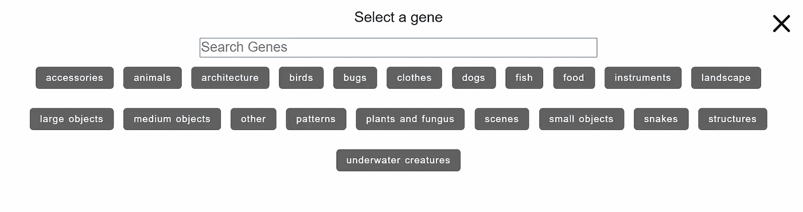

# 艺术育种家。给我画一只电动羊。

> 原文：<https://towardsdatascience.com/artbreeder-draw-me-an-electric-sheep-841babe80b67?source=collection_archive---------3----------------------->

## 如何以用户友好的方式应用生成式对抗网络？

  N   **没有什么是原创的。然而一切都是。早在二十世纪初，**达达主义者、超现实主义者、**以及后来的**默茨艺术家库尔特·施威特斯**就已经探索了这个事实。他们将发现的材料混合到新的拼贴画和 3D 组合中。无数现实的无数碎片变成了无数新的幻象。**

与**人工智能**同时代的实验结出了类似的美丽果实。你可能会意识到新作品背后的互文性，但它们就在这里——给你的新世界。最初开始于 [**的谷歌深度梦境**](https://medium.com/merzazine/deep-dream-comes-true-eafb97df6cc5?source=friends_link&sk=6d50ebb59584b487183385009ba50f54) 变成了机器人梦境的多面**可视化**。

> 我们现在可以看到人工智能对电羊、世界和其他事物的梦想了。

去年，我写了一篇关于 GANbreeder 的文章，这是乔尔·西蒙和 http://www.joelsimon.net/的申请。一个用户友好的 BigGAN 模型集，在 ImageNet、Kaggle 集和其他可视化数据库上进行了预训练。数据可视化的大众化和民主化。它允许从现有的 DNA 生成视觉杰作——在与其他用户/艺术家/观众的协作过程中，即使没有详细的数据科学知识(*不是每个艺术家都会 Python* )。

乔尔的最新项目将带你进入人工智能作品的下一个维度。令人惊叹:

> 艺术育种家

# 让我们参观 Android Dreams。

目前有五个板块:**普通**、**人像**、**相册、风景、**和**动漫人像**。(该项目正在开发中，因此新的模型和功能一直在出现)。

## 让我们在这本全面的艺术育种指南中探索所有的模型

Portraits (random selection)

# 画像

谷歌大脑的研究人员科学家 Ian Goodfellow 提到了人工智能在人脸生成方面的巨大飞跃:

当 2014 年人工智能生成的脸看起来仍然几乎像一张 *pareidolia Mars 脸*时，2018 年已经是照片逼真的假脸生成的突破(提醒一下病毒页面[ThisPersonDoesnotExist.com](https://thispersondoesnotexist.com/)用 StyleGAN 生成的绝对惊人的结果)。

现在你可以自己做了。在**肖像部分，**你会发现四个功能:

*   **随机。**
    显示的是已经生成的随机画像。你可以拿起它们并修改它们。
*   混合图像
    将现有的肖像和基因交叉——生成全新的人物角色。
*   **上传**上传
    比较新的功能——你可以上传图片来操控它们。
*   制作简短的变形视频。

# 创作肖像。

因此，让我们从现有的肖像集创建一个新的人。选择“随机”会将您带到“Artbreeder”中现有图像的列表:

Fig 1: Random browse

正如你所看到的，不仅照片真实感的脸可用，而且风格不同的模型。 **StyleGAN** 在这里以最佳方式展示**风格转移**。让我们选择戴眼镜的男性。

Fig 2: Children

你在这里看到的是最初的一组可能性。右上角是实际的修改面板

*   儿童
*   杂交的
*   编辑-基因

下面你可以看到不同用户已经生成的图像。

> 所有图像特征都是**神经网络层，**你可以主动或随机改变。

## 儿童

这种修改方法是您最不能控制的方法。你能做的一切就是改变**相似性与**差异的百分比。定义的不同图像越多，得到的不同结果就越多*(图 2)* 。当图片几乎符合您的预期时，您可以对其进行微调。

## 杂交的

Fig 3: Crossbreed

经典的**风格转移**模式。您选择另一个图像(存在于 Artbreeder 中)作为目标(或源，视情况而定)——通过修改**面**和**样式**参数，您可以在两个选择的图像之间转换样式。因此您可以合并图片或更改它们的样式。

## 编辑-基因

Fig 4: Edit-Genes

最有效的修改方式:通过主动改变每一层的百分比，你可以直接改变特定的功能。在图 4 中。你可以看到之前的男性戴眼镜者(T1)的肖像，但是通过变换层次(T2、年龄、T4、眼镜、性别)，几乎完全不同的图像出现了。参数 *Concept_art* 是一个隐藏的*样式传输层*从照片级逼真图像切换到手绘草图或绘画。

## 血统

图像下的第二个图标是血统。它显示了肖像的“系谱树”:

Fig 5: Lineage

在我们的例子中，它是一个简短的家谱。你还会在 Artbreeder 中发现经过反复修改的图片，故事很长。

Fig 6\. Sample for big-scale lineage

# 上传

这是一个新功能，它使**艺术培育者**更像是一个**艺术实验室**。它不再是纯粹的甘农场了。它的意思是:*你可以上传你的图片*。它们可能被敌对的网络以这样或那样的方式处理和改变。有时候并不像你想象的那样。

例如，上传这张著名的*前卫派*达达派**【汉斯·阿尔普】**(用一张纸碟遮住左眼)的肖像，在 [**发生器和**](https://sthalles.github.io/intro-to-gans/) 鉴别器的相互作用中，引起甘的“纠正”——*恢复*他看不见的眼睛(改变凝视):

这是与现实世界的实际交集(涉及版权、数据隐私等所有问题)。—用户要明智使用)。然后就是[使用期限](https://artbreeder.com/terms.pdf)，当然。

如果你把上面汉斯·阿尔普肖像的风格转移到我的照片上，就会发生这种情况:

Fig 6\. (Crossbreed with uploaded image: Vladimir Alexeev + Hans Arp)

或者我和克劳斯·诺米的风格转换:

Fig 7\. (Crossbreed with uploaded image: Vladimir Alexeev + Klaus Nomi)

上传功能极大地增加了可能性。

# 动画

静态图像生成的重要补充。选择关键帧(现有的肖像)——AI 会以一种近乎神奇的方式生成图像之间的过渡。您可以选择持续时间以及过渡模式。

Fig 8\. (Keyframes)

这个关键帧序列产生引人入胜的镜头:

您可以注意到关键帧之间的各种风格转换，非常奇怪。

# 通用模式

General

这是前**ganbreader**(也由 [Joel Simon](https://medium.com/u/be6acff3480f?source=post_page-----841babe80b67--------------------------------) 制作)背后的实际核心——经过打磨并与新模型一起运行。在这里你可以生成很多东西。

还记得，回到 2018 年，和比根的[大突破？你可以给基于 **Tensorflow** 的 GAN 模型一个任务来生成一个特定的主题——结果已经令人信服了(用](https://medium.com/merzazine/biggan-as-a-creative-engine-2d18c61e82b8?source=friends_link&sk=498b6f23dfa37347ac952e9d209710c4) [**Colab 笔记本**](https://colab.research.google.com/github/tensorflow/hub/blob/master/examples/colab/biggan_generation_with_tf_hub.ipynb) 试试看)。

使用 Artbreeder，您可以从头开始生成世界。

像肖像画一样，这里有以下功能:

*   **随机。**
    显示随机已经生成的图像。你可以拿起来修改。
*   **混合图像**
    跨越现有的肖像和基因——生成全新的视觉效果。
*   **Mix-Genes**
    组合特定的语义网络层(基因)
*   **制作动画**
    制作简短的变形视频。

溜进**随机**大概最多把你搞糊涂。除了面孔，你会在这里找到所有可能的嵌合体、幻影和无法解释的视觉效果。

Fig 9\. Random images from General Topic

这里的修改功能类似于生成肖像。

突出的例外是“编辑基因”。

Fig 10\. Edit-Genes in General.

正如你所看到的，这里的图层不像肖像中那样表现面部特征——它们更像是表现主题，几乎是柏拉图式的精神境界。这些“基因”是来自 BigGAN 中的“类别条件采样”[的“类别”:视觉数据库的主题，它们被标记并用于训练。](https://medium.com/merzazine/biggan-as-a-creative-engine-2d18c61e82b8?source=friends_link&sk=498b6f23dfa37347ac952e9d209710c4)

在*图 10* 中，你可以观察到哪些类别是视觉效果的基础(以及比例):**漫画、爱斯基摩犬、宫殿**等。

> 我们甚至可以在这里讲述图像的语义**词源。**

这种变革性的艺术一代是一种真正重新描绘我们现实的新方式。所以让我们在下一个函数中从头开始创建一个新的图像。

**混合基因**

首先，你需要选择一个基因(一个标记层，BigGAN 内部的一个神经网络突触):

Fig 11\. Select a gene

这是一个隐藏了内容列表的类别库。让我们选择 ***架构*** 作为我们的第一个*基因*。

Fig 12\. Gene “Architecture”

正如您所看到的，这是一项仔细的标记工作(并非总是如此)。BigGAN 在同一类别的无数图像上进行了训练，因此选择一个基因可以产生同一主题的非常不同的图像。所以让我们把“**种姓**作为第一个基因——第二个基因将来自于“**类*器具。***

Fig 13\. Select a gene

现在你明白我说的*标注*的意思了吧。总是一个**人的因素**。来自 *ImageNet* (以及很多其他图像数据库)的图像被人们贴上标签，有时对其目的没有一个清晰的概念。这里被标为**的乐器**实际上在大多数情况下是一个**人在演奏这个乐器**。其含义是显而易见的——它将产生人类，而不是物体。对于弱人工智能来说，一切都是关于要定义的模式。

但是现在让我们把“城堡”和“机关”结合起来:

Fig 14\. General results (you can change the intensity of a gene with slider)

两者——城堡和机关——都是可以辨认的，即使人们无法区分里面和外面。相当梦幻的意象。当你醒来并试图回忆最近的梦时，你知道这种感觉——画面在互换、变形、消失、滑动。迷惑你的大脑，试图找到最简单的概念。

## 动画

几乎和肖像画一样——结果是压倒性的。同样，这就像一个梦的可视化，只是在这种情况下，你甚至可以看到——或暂停——视频，这不会帮助你的意识更好地识别。

以下是一般动画的示例:

# 相册

Album mode

**10.000 专辑封面**是用于在“专辑”部分训练神经网络的数据库。

这是非常特别的东西——不同于肖像或一般的，相册是文本、布局和图像的模拟混合。远的是**人工通用智能**的时代。我们仍在与弱人工智能(T21)合作——文本背后的语义丢失了。这是一种通过计算来重建文本的尝试。

与以前的模型类似，我们在这里有以下功能:

*   **随机。**
    浏览随机生成的相册图片。
*   **Mix-Images**
    跨越现有相册，生成全新的视觉效果。
*   制作短片和变形视频。

记住，这里的“字体”和“字迹”属于构图。它不能作为层单独修改。

这与其说是理解，不如说是美感。

风格、图案和标识的多样性激发了更多灵感。

# 风景

Landscapes

这一部分展示了神经网络在无数图像上的训练是多么完美。在这种情况下——风景基本上是完美的。或者可能是我们的感知——我们的大脑在自然意象上比在其他动机上受到更好的训练。因此，我们没有意识到现有的故障或视觉错误，因为我们的感知跳过了不必要的元素。

您已经知道这些函数是如何工作的:

*   **随机。**
    浏览随机生成的风景图片。
*   **Mix-Images**
    跨越现有的风景，生成全新的视觉效果。
*   制作动画
    制作简短的变形视频。

就像在专辑里一样——在这里你必须尝试，混合，修改。没有真正的景观“基因”(至少目前是这样)，但是通过参数的随机化，您可以生成精彩的样本:

作为最近的补充，乔尔扩大了动漫肖像的选择，传奇人物[格温](https://www.gwern.net/)的动漫模型(也可以访问格温的项目[ThisWaifuDoesNotExist.com](https://www.thiswaifudoesnotexist.net/))。

Anime model by Gwern

# 发展

[乔尔·西蒙](https://medium.com/u/be6acff3480f?source=post_page-----841babe80b67--------------------------------)是 Artbreeder 背后的**英雄**。但在**art breader Discord-Server**中也有一些人，他们讨论、交流想法，建议如何改编最好的 UX，讨论最新的人工智能成就，讨论服务条款和隐私，分享最新的 art breader 创作的作品。卓越的团队合作。

Artbreeder 的开发是非常动态的——因为 Joel 对用户的想法和修改反应迅速。

> 迄今为止，这是我使用数码产品的最佳用户体验。

这就是为什么可能在这篇文章发表后的几天，Artbreeder 可能会获得新的功能，或者可能会改变它的界面。那么，你还在等什么？潜入并加入 [**艺术培育者**](http://artbreeder.com/) 。

# 用法？

事实上，哪些用例与 Artbreeder 的图像生成相关？如何应用这些结果？

以下是一些尝试:

*   概念设计理念
*   角色设计(视频游戏，桌上游戏，自发的 D&D 角色生成有人吗？)
*   艺术项目(图像和视频装置)
*   灵感

…仅举一些有趣的用法。

> *你还有其他应用人像生成的想法吗？*

创造！实验！受到启发！

你的，炼金术士。

Alchemist. Generated by Merzmensch with Artbreeder.

**更新。**我在 GANs 上找到了一篇标题类似的文章，它是一年前由 [Libre AI](https://medium.com/u/7804d72d9615?source=post_page-----841babe80b67--------------------------------) 的联合创始人兼首席执行官[埃内斯托·迪亚兹-阿比莱斯](https://medium.com/u/f88e4ab38174?source=post_page-----841babe80b67--------------------------------)博士发表的，讲述了在 AI/ML 的帮助下绘制绵羊的有趣尝试。免责声明:也许安托万·德·圣·埃克苏佩里和菲利普·K·蒂克的结合是我们理解创造力和人工智能的典型。所以，我没有抄标题，怕你纳闷。这是 21 世纪的明显后果。:-)

这是:

 [## 给我画一只电动绵羊

### 带 AI/ML

medium.com](https://medium.com/libreai/draw-me-an-electric-sheep-9a3e0b5fe7d5)