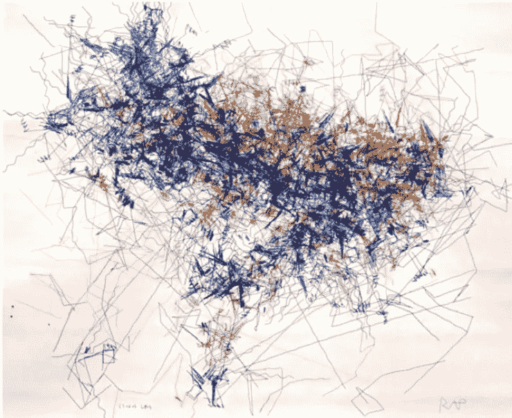

# 人工艺术家:人工智能能创造艺术吗？

> 原文：<https://towardsdatascience.com/artificial-artist-can-artificial-intelligence-create-art-d7dd6ed98270?source=collection_archive---------13----------------------->

## 开发具有艺术能力的人工智能的挑战

Photo by [Anna Kolosyuk](https://unsplash.com/@anko_?utm_source=medium&utm_medium=referral) on [Unsplash](https://unsplash.com?utm_source=medium&utm_medium=referral)

rt 是一个非常重要的工具，它允许人类表达我们想象中创造的情感和想法。它在社会环境中扮演着重要的角色，可以带来洞察力和理解，也可以带来娱乐。

开发具有艺术功能的计算方法的愿望并不是最近才有的。150 多年前，艾达·拜伦表达了她开发一台能够创作音乐的计算机的梦想[1]。

一个能够理解和创造艺术的人工智能将代表着在创造更接近人类的机器方面迈出了一大步。一个大问题是:机器创造的东西能被认为是艺术吗？

## 什么是艺术？

由于艺术固有的主观性，定义艺术并不是一件容易的事情。根据牛津词典，艺术被定义为:

> 人类创造性技能和想象力的表达或应用，通常以绘画或雕塑等视觉形式，创作出主要因其美或情感力量而被欣赏的作品。

有一个哲学分支研究艺术和美的概念，叫做**美学**。《牛津词典》中有以下关于美学的定义:

> “一套关于美的本质和欣赏的原则。哲学中有关美和艺术品味问题的分支

在美学中，一个观点负责定义某个对象如何被归类为一件艺术作品，这取决于几个因素，如个人品味、文化背景、艺术形式等，如[2]中所指出的:

> “审美观点决定了如何将一件物品理解为艺术品，以及当以这种方式理解时，如何判断一件物品的质量。一个观点可以被认为是一个观察者用来将物体视为艺术作品的构想，也可以被认为是一个艺术家用来创作新作品的构想。
> 
> 有许多可能的美学观点。它们因不同的人、不同的文化和不同的艺术形式而异。当两个不同的人以两种不同的方式理解和欣赏作为艺术作品的同一件物品时，或者当两个不同的艺术家创作出两种不同的物品并都被称为好的艺术作品时，观点的多样性就显而易见了。”

有了这些定义，很明显人工发展(或学习)一种美学观点应该是人工艺术家的基础。

## AI 能创造艺术吗？

简短的回答是:是的，为什么不呢？如前所述，如果我们对审美观点有一个好的定义，就有可能开发出一种能够评估艺术的算法。

主要问题是缺乏关于驱动人类艺术创作/评价的规则的知识。这使得精心设计一个能够产生艺术作品的封闭算法变得困难。最好的方法可能是使用元启发式算法，在一大组可能的解决方案中搜索，以发展自己的美感。

在[3]中，Penousal Machato 等人提出了人工智能成为艺术家必须具备的 5 个特征:

1.  学习:系统必须能够像人类艺术家一样，根据新的刺激来提高技能和调整艺术表现力。
2.  **自己的审美标准:**对于任何一个艺术创作者来说，能够评价自己和其他艺术家的艺术创作是至关重要的。即使没有评判艺术的普遍标准，每个人也必须根据自己的个性发展出自己的特定标准。
3.  **创造力:**创造新颖和创新的艺术作品是杰出艺术家的标志。该系统不应该对现有的艺术品进行小的改动，而是创造全新的东西(尽管它可能会受到其他艺术家作品的影响)。
4.  **平等:**制度不应受制于人的意志；它应该在同等水平上与人类或人工智能体相互作用。
5.  没有社会背景，艺术是无法被创造出来的。人工智能必须能够将艺术作品作为灵感的来源。

在同一篇论文中，提出了两个模块的方法。第一个模块是一个基于基因编程的进化引擎，负责创造新的艺术品。第二个是基于神经网络的自适应分类器，能够“捕捉相关的文体属性”并“成功区分作者和风格”。然而，即使具有良好的结果，该系统也仅部分满足上述要求。

我将展示一些其他的出版物，它们都是用人工系统来创造艺术的，尽管就我所知，目前还没有一个艺术系统能满足所有 5 个要求。

Photo by [Franck V.](https://unsplash.com/@franckinjapan?utm_source=medium&utm_medium=referral) on [Unsplash](https://unsplash.com?utm_source=medium&utm_medium=referral)

## 音乐分析与作曲

在[4]中，作者提出了一个通过使用 992 首音乐作品的流行度作为审美标准来训练的人工网络。这个系统自主地创造了巴赫的小调 (BWV 784)中的*发明#13 的变体，这些变体被发现对许多听众来说是审美愉悦的。这篇论文中提出的突出问题是很难找到真正糟糕的音乐(这里定义为不受欢迎的音乐)，因为大多数古典音乐的糟糕例子都没有存档。*

## 机器人动作画家

Leonel Moura 开发了一个可以创作新颖画作的机器人。RAP[机器人动作画家]通过随机性、散斑性和色序性来实现人工创造性。此外，该机器人能够自行确定绘画完成的时刻。

Artwork from RAP robot [5].

## DeepArtificialComposer

在这项工作[6]中，提出了一种用于旋律自动作曲的音符过渡的递归神经网络模型，称为深度人工作曲器(DAC)。DAC 可以生成与训练示例的风格一致的旋律(例如，爱尔兰和 Klezmer 音乐)。DAC 生成的旋律的创造性由音乐序列的新颖性来衡量，这导致 DAC 创建的旋律与人类作曲家创作的旋律相比具有新颖性。

## 结论

创造和欣赏艺术是人类区别于其他生物的独特之处之一。一个能够培养艺术感觉的系统将代表着向更复杂的人工智能迈进了一大步，并能更好地理解人类大脑的运作。

即使现有的人造艺术家不符合被认为是真正艺术家的一套严格的规则，我们也有系统能够创造杰出材料的例子。在我看来，这种能力让机器更加人性化。

## 参考

[1]摩尔，多丽丝·l . .**爱拉斯伯爵夫人阿达:拜伦的合法女儿**哈珀柯林斯出版社，1977 年。

[2]吉普斯、詹姆斯和乔治·史蒂尼。**“算法美学的调查”** *莱昂纳多*8.3(1975):213–220。

[3]马查多、佩努萨尔等**《论进化人工艺术家的发展》** *计算机&图形学*31.6(2007):818–826。

[4] Manaris，Bill，et al. **“一种基于语料库的混合音乐分析与作曲方法。”** *全国人工智能会议论文集*。第 22 卷。№1.加利福尼亚州门洛帕克；马萨诸塞州剑桥；伦敦；AAAI 出版社；麻省理工学院出版社；1999, 2007.

[5]莱昂内尔·莫拉。一种新的艺术:机器人动作画家*×生成艺术会议，意大利米兰理工大学大学* (2007)。

[6] Colombo，Florian，Alexander Seeholzer 和 Wulfram Gerstner。**“深度人工作曲:用于自动旋律生成的创造性神经网络模型。”** *进化和生物灵感音乐艺术国际会议*。施普林格，查姆，2017。