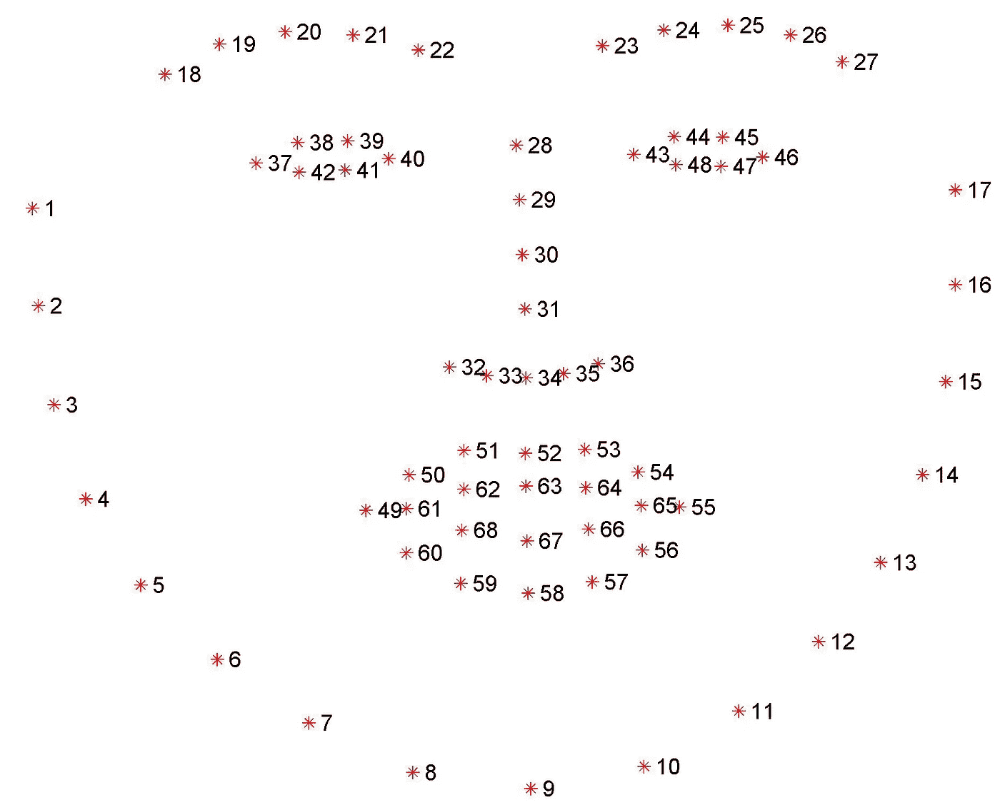
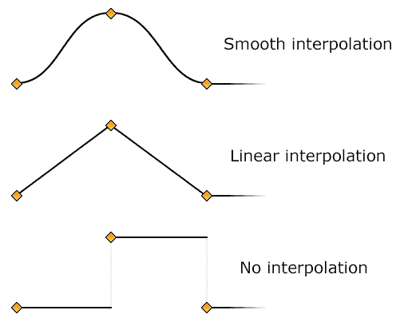
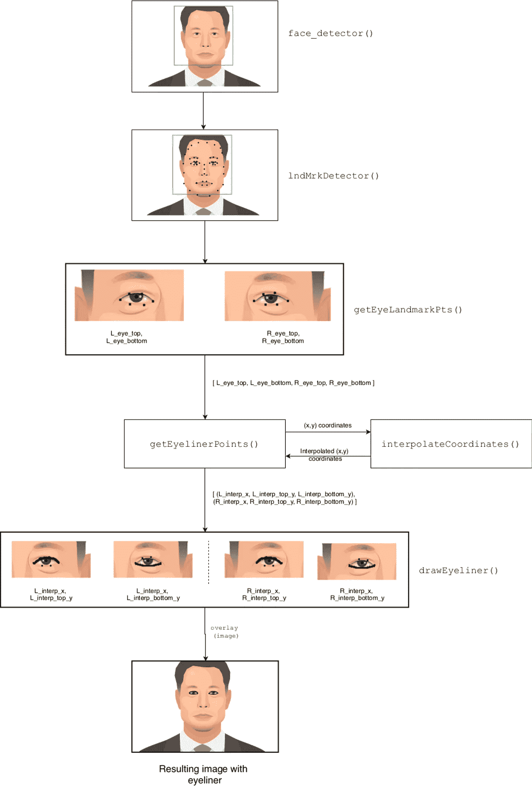

# 使用 Python、OpenCV 和 Dlib 在 LIVE Feed 上绘制人工眼线

> 原文：<https://towardsdatascience.com/artificial-eyeliner-on-live-feed-using-python-opencv-and-dlib-4786a139842b?source=collection_archive---------33----------------------->

## 有没有想过自己制作类似 Snapchat 的滤镜？这里有一个简单易懂的教程，它将带你一步步地在 live feed 上画出令人惊艳的眼线。


This is how our final output will look like. (Video by [Wolfgang Sauerwald](https://www.pexels.com/@wolfgang-sauerwald-1415383?utm_content=attributionCopyText&utm_medium=referral&utm_source=pexels) from [Pexels](https://www.pexels.com/photo/close-up-of-a-woman-showing-different-facial-expressions-3063839/?utm_content=attributionCopyText&utm_medium=referral&utm_source=pexels))

计算机视觉是最令人兴奋的领域之一，具有广泛的应用范围，从医学成像到创建最有趣的面部过滤器。在这篇文章中，我试图创建一个人工眼线来模仿 Snapchat 或 Instagram 滤镜。希望你喜欢阅读。

这篇文章是为计算机视觉的初学者准备的，他们想做一些令人兴奋的事情。我会尽可能简单地解释。我建议在阅读这篇文章的同时浏览一下 GitHub 上的代码，以便有更好的理解。

在开始之前，设置一个新的虚拟环境并安装所有必需的依赖项非常重要。您可以访问我的 [GitHub repo](https://github.com/kaushil24/Artificial-Eyeliner/) 获取说明。

我们将在这个项目中使用 OpenCV、NumPy、imutils、SciPy 和 Dlib。下面是在我们的项目中使用这些库的简要描述——如果您已经很熟悉，可以跳过这一部分。

*   OpenCV:它是最流行的图像处理模块之一。我们将使用 OpenCV 来读取、写入和绘制图像。
*   NumPy:在处理 OpenCV 项目时经常使用 NumPy。图像本质上是一个像素数组，OpenCV 使用这些以 NumPy 数组形式存储的数组对图像执行操作。
*   Imutils: Imutils 带有自制功能，使您的计算机视觉工作更加轻松。在这里，我们将使用它将 dlib 对象转换为 numpy 数组，这种数组非常灵活并且被广泛接受。
*   Scipy:顾名思义，SciPy 用于 python 上的科学计算。我们将使用它来创建插值(如果它现在没有意义也没关系)。
*   Dlib: Dlib 最初是作为包含各种 ML 算法的 C++库出现的。我们将使用 dlib 提取面部标志点。

# 项目概述

简单解释一下——程序首先从每张脸上提取 68 个标志点。在这 68 个点中，点 37-42 属于左眼，点 43-48 属于右眼——见下图。



Visualisation of 68 landmark points. (Image from [pyimagesearch](https://www.pyimagesearch.com/2017/04/03/facial-landmarks-dlib-opencv-python/))

因为我们的目标是画眼线，所以我们只对 37-48 点感兴趣，我们提取这些点。我们将对这些提取的点进行插值。插值意味着我们试图在两个给定点之间插入点。我们可以使这种插值线性或平滑-详情见下图。



Types of interpolation. (Image by [Ultrafractal](https://www.ultrafractal.com))

眼线算法流程图如下图。



接下来，我们更详细地描述该算法。如果您只是对运行代码感兴趣，请跳到下一节。

# 深入项目

我们将首先提取包围面部的边界框的坐标。

OpenCV 将图像转换为 NumPy 数组。这个`numpy.array`(图像的矩阵表示)存储在名为`frame`的变量中。我们使用一个名为`face_detector()`的函数，返回一帧中所有面周围的边界框的坐标。这些边界框坐标存储在一个名为`bounding_boxes.`的变量中，我们在`bounding_boxes`上迭代一个循环，在一帧中检测到的每张脸上画眼线。`face_landmark_points`存储 68 个标志点。`eye_landmark_points`是从`getEyeLandmarkPts()`接收的眼睛标志点阵列。

`getEyeLandmarkPts()`将 68 个标志点作为输入，并返回具有左上眼睑(`L_eye_top`)、左下眼睑(`L_eye_bottom`)和右眼(`R_eye_top & R_eye_bottom`)坐标的 4 个元素的数组。这是通过简单的 NumPy 索引完成的。我们正在转移极端点(第 37、40、43 和 46 点。见 68 个标志点图)向外再移 5 px。这在第 6–9 行完成。这是为了给出更真实的外观。

**注意:在一个数组中，索引从 0 开始。因此，我们在代码中更改了 pt 编号 36、39、42 和 45。**

现在我们需要通过这些点插值得到一条平滑的曲线，从这条曲线我们可以画出眼线。我们需要区别对待每条曲线。(即`L_eye_top`、`L_eye_bottom`、`R_eye_top`、`R_eye_bottom`)。因此，我们为每条曲线使用一个单独的变量名。`interpolateCoordinates()`用于在每条曲线上生成插值。scipy 模块的函数`interp1d()`用于生成插值。`kind='quadratic'`表示生成这些点的曲率。

`interpolateCoordinates()`被`getEyelinerPoints()`反复调用，为每条曲线生成插补坐标。它返回每条曲线的插值点数组。

`drawEyeLiner()`将生成的插值点作为自变量，在两个连续点之间画一条线。这在两个循环中对每个曲线进行，一个用于左眼，另一个用于右眼。这些画出来的线就是我们的眼线。它返回一个有眼线的新帧`op`。然后**轰！**我们完成了:d

# 使用项目

这个项目的用法非常简单。就从这里克隆 [github repo。](https://github.com/kaushil24/Artificial-Eyeliner/)

```
git clone [https://github.com/kaushil24/Artificial-Eyeliner/](https://github.com/kaushil24/Artificial-Eyeliner/)
```

接下来，打开命令提示符并键入以下代码来运行示例测试

`python3 eyeliner.py -v "Media/Sample Video.mp4"`

通过将视频路径放在参数中，您可以使用自己的视频。完整的 CLI 命令如下:

`python eyeliner.py [-i image] [-v video] [-d dat] [-t thickness] [-c color] [-s save]`

*   `-i` :要画眼线的图像的路径
*   `-v` :要画眼线的视频的路径。
*   `-v` :如果给`webcam`的话，网络摄像头视频的活眼线。`python3 -v webcam -s "Webcam output"`
*   `-t` :设置眼线粗细的整数(int)。默认= `2`。1-5 之间的推荐数值
*   `-d`:您的`shape_predictor_68_face_landmarks.dat`文件的路径。默认路径在根目录中。除非您将`shape_predictor_68_face_landmarks.dat`文件存储在其他位置，否则您不需要使用此参数。
*   `-c` :改变眼线颜色。语法`-c 255 255 255`。默认= `0 0 0`。其中每个数字代表它的 R G B 值。
*   `-s` :您想要保存输出的位置和文件名。注意程序会在保存文件时自动添加扩展名。如果同名文件已经存在，它将覆盖该文件。

摆弄一下代码，如果你添加了有用的东西，一定要发出一个拉取请求。让我们把它变成一个合作项目。

GitHub 回购:[https://github.com/kaushil24/Artificial-Eyeliner/](https://github.com/kaushil24/Artificial-Eyeliner/)

这就把我们带到了终点。

嘿，这是我的第一篇文章。请评论您的疑问和反馈，我将很乐意解决它们。希望你喜欢阅读这篇文章！祝你愉快。