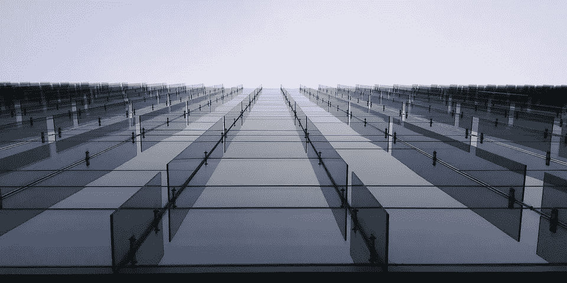

# 人工通用智能(AGI) Vs .狭义人工智能

> 原文：<https://towardsdatascience.com/artificial-general-intelligence-agi-vs-narrow-ai-58ab8b33f582?source=collection_archive---------29----------------------->

供应商和理论家可以向世界承诺，但为了做出明智的决定，区分人工通用智能(AGI)和狭义人工智能是必不可少的。

简单来说，当代所有的人工智能都是狭义或弱人工智能。即使是最聪明的系统也无法执行与人类智能相当的常识。虽然计算机可以在特定任务上超越人类，如国际象棋、危险或预测天气，但它们仍然无法进行抽象思维、解释回忆或用复杂的解决方案解决创造性问题。

# 影响深远，但仍然狭窄

为了开发窄范围的人工智能，数据科学家定义要整合哪些数据，确定合适的算法，并指定要应用的最佳模型。虽然“弱”这个词带有负面内涵，但狭义 AI 绝不令人失望；企业不断利用目前由狭义人工智能执行的任务的[赏金。](https://www.businessinsider.com/artificial-intelligence-ai-most-impressive-achievements-2017-3#security-5)

在自动驾驶汽车和面部识别的发展之间，当前的人工智能模型正在彻底改变全球的行业。各种规模的企业都想方设法将最佳实践与人工智能相结合，以实现整个组织决策的自动化。这些大大小小的自动化为员工创造了更高层次的工作空间，让他们专注于解决更复杂的问题。一个接一个的行业领导者正在使用人工智能来脱离群体，以[获得对竞争对手的优势](https://www.cnn.com/2019/02/17/investing/artificial-intelligence-investors-machine-learning/index.html)。

狭义人工智能在很大程度上间接为公司创造价值，无论是通过提高效率还是作为内部增强功能，如亚马逊的产品推荐。客户不会因为人工智能而涌向公司，但狭义人工智能正在迅速改变客户(和员工)的体验。

根据德勤的报告，企业对认知技术的使用正以惊人的速度增长，早期采用者正在加倍投资。这项技术比以往任何时候都更容易测试和使用，这使得它成为下一波公司效仿的理想时机。

从历史上看，人工智能的进步以爆发的形式出现，并创造了一个波峰和波谷的时间线；开发人员将这些低谷称为“人工智能冬天”，这意味着技术扩张最小化的时代，这是由于缺乏资金和公众对技术能力的不兑现承诺和不切实际的希望造成的。

随着物联网收集数据的繁荣、图形处理单元(GPU)的诞生以及计算机速度、内存和存储的快速发展，当前的兴奋气氛到来了。在过去的 10 年里，艾不仅熬过了最后的严冬，而且现在正以前所未有的速度获得资助。

随着人工智能的发展，高管和商业领袖开辟了新的领域。随着互联网和行业巨头为保护技术的未来而战，投资在[飙升](https://techcrunch.com/2019/07/22/microsoft-invests-1-billion-in-openai-in-new-multiyear-partnership/)。随着谷歌和微软等科技巨头宣布他们自己的[“人工智能优先”](https://www.forbes.com/sites/tomtaulli/2019/05/12/the-weeks-important-ai-announcements-from-google-and-microsoft/#5b23ef6f6db9)战略，许多人都在问:人工智能终于全面开花了，还是世界正濒临另一个人工智能冬天？

当理论家们争夺视野，比较最后的场景(“谁会赢，人类还是机器人？”)，理解当前技术的局限性、设定合理的期望值并制定考虑这些因素的策略是至关重要的。

# 人工智能之路(AGI)

如前所述，过度承诺人工智能的现有能力是有风险的。过去，当公众开始期待人工智能进步的冲击，并遇到令人失望的结果时，公众舆论急剧下降，并放弃了对可能性的希望。

企业和公众都在问:人类何时能实现 AGI？技术是处于风口浪尖，还是对遥远的未来一代人来说是现实？

最近在深度学习和神经网络方面的革命归功于人脑。深度学习革命的领导者之一， [Terry Sejnowski 说，](https://www.techrepublic.com/article/the-deep-learning-revolution-how-understanding-the-brain-will-let-us-supercharge-ai/)“在过去的 50 年里，人工智能取得的唯一进步，真正对经济和科学产生影响的，是真正受到自然和大脑的启发，这就是我们的现状。”

这个典故的自然演变是，深度学习和机器学习的进步为计算机很快实现类似人脑的功能铺平了道路；然而，这不一定是真的。事实上，即使深度学习成熟到神经网络相当于人脑的程度，人工智能专家仍然不清楚如何开发实际的智能。

脸书首席人工智能科学家 [Yann LeCun 表示](https://spectrum.ieee.org/automaton/robotics/artificial-intelligence/facebook-ai-director-yann-lecun-on-deep-learning)“虽然深度学习从生物学中获得了灵感，但它离大脑实际做的事情非常非常远。把它描述成大脑给了它一点魔法的光环，这是很危险的。导致炒作；人们声称事情不是真的。人工智能已经经历了许多人工智能冬天，因为人们声称他们无法交付的东西。”

当被问及实现 AGI 需要多长时间时，专家们给出了各种各样的答案，从 10 年到永远不会。总体共识是明确的:如果有办法做到这一点，实际上还没有人知道如何做到。

# 利用手边的技术实现业务目标

在冬天之外，人工智能技术不断进步，每一项发现都让科学家离创造 AGI 更近了一步。就目前情况而言，虽然人工智能在广义操作方面无法与人脑相比，但人工智能的能力正在日益扩展。微软研究实验室主任 Eric hor vitz[解释说](https://phys.org/news/2014-04-robots-social-intelligence.html)当前技术的能力允许一种由不同的狭义人工智能组成的“智能交响乐”。

当杰夫·贝索斯[说](https://www.cnbc.com/2017/05/08/amazon-jeff-bezos-artificial-intelligence-ai-golden-age.html)这是人工智能的“黄金时代”时，也许他是对的。虽然这项技术仍处于萌芽阶段，但对于企业来说，事情再好不过了。狭义人工智能让生活变得更容易，尽管它以多种方式影响着几乎每个行业，但人类的智能仍然是不可替代的。

当人类最终到达 AGI 时，伦理困境的数量很可能开始一个后黄金时代的困境。更多关于企业如何使用人工智能的信息，请阅读我们的博客[这里](https://www.quickpath.com/resources/facts-about-enterprise-ai-in-2019)。

*原载于 2019 年 7 月 28 日*[*https://www.quickpath.com*](https://www.quickpath.com/resources/2019/7/28/artificial-general-intelligence-agi-vs-narrow-ai)*。*