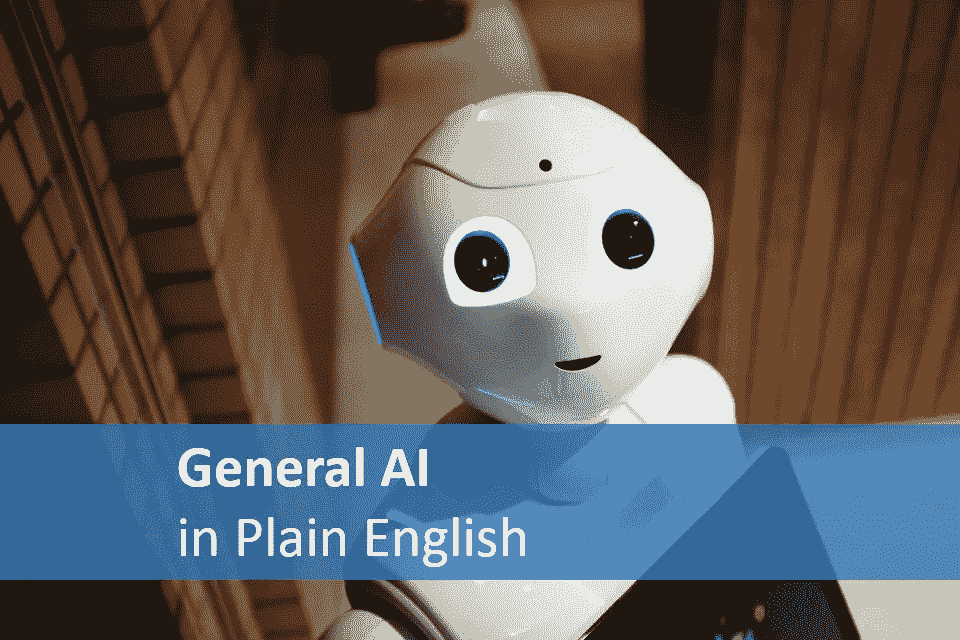

# 用简单的英语说人工智能

> 原文：<https://towardsdatascience.com/artificial-general-intelligence-in-plain-english-e8f6e9a56555?source=collection_archive---------14----------------------->

人工智能的圣杯，人类成就的顶峰，终极武器，我们未来的主人，以及我们所知的世界末日。这够清楚了吗？

# 先不要惊慌。

用道格拉斯·亚当斯的话说，不要惊慌。Siri、Cortana、Alexa 和 Google Assistant 并没有密谋接管人类。让我们真正明确一件事，尽管我们到处都有人工智能的例子，但人工通用智能还没有发明出来，可能还要几十年。

# 什么是人工智能？

让我们快速复习一下。AI 只是软件，它只是一个为完成一项任务而编写的应用程序。它不是有生命的，它没有灵魂或意识，它没有善良或邪恶的意图，它只是为了完成一项任务而编写的软件。

当大多数人想到[人工智能](https://becominghuman.ai/)时，他们会想到电影中描绘的东西，无所不知的超级智能，通常是危险的，可以接管世界的计算机。想想 HAL9000 或者天网。在电影中，这些虚构的人造生物不仅能进行完整的对话，它们知道一切并控制一切。

然而，我们每天对人工智能的体验是非常不同的，人工智能今天就在我们周围，但它们都不像电影中描绘的那样。想想脸书的面部识别技术，它会建议你标记人名；想想银行用来发现可疑信用卡交易的欺诈检测技术；想想能让你的房间保持舒适温度的自我调节 Nest 恒温器。

# 专业化与通用人工智能。

人工智能主要有两种类型，专业的和普通的。如今，专门的人工智能无处不在，Siri、面部识别、Snapchat 过滤器、Amazon.com 推荐、Nest 恒温器以及数百个我们几乎视为理所当然的例子。专门的 AI 也就那么回事，专门的。它擅长做一件特定的事情(识别照片中的人脸，推荐你接下来想读的书，判断你的信用风险是否良好，检测皮肤癌)。在某些情况下，专门的人工智能现在甚至比人类做得更好。

然而专业的 AI 却有着非常愚蠢的蚯蚓的智商，这是对蚯蚓的侮辱。专门的 AI 只是一个软件应用程序，它只做一件事，那件事取决于你使用哪个专门的 AI 应用程序。我之所以使用 app 这个术语，是因为我们都可以理解手机上做一件事的应用的概念。我的手机上有一个天气预报应用程序，一个货币兑换应用程序，还有一个点咖啡的应用程序。他们都很好地完成了他们的任务，你可以说货币转换应用程序在计算我的新运动鞋以英镑计的价格时比我聪明，但如果我试图用它来点一杯咖啡，它完全没有用。

专门的 AI 就跟那些 app 一样。亚马逊(Amazon.com)的专业人工智能应用程序可以推荐你可能想买的其他东西，在寻找人们愿意花更多钱购买的东西方面非常出色。但是问它一张照片里有没有猫完全没用，想都别想让它点一杯大豆拿铁。

专家人工智能就是我们今天所知道的人工智能。我们已经编写了数以百万计的专业人工智能应用程序(当我说应用程序时，它们通常只是一个更大的应用程序的一部分，或者对老派极客来说是一个“子例程”)，它们都做特定的事情，其中许多都非常擅长它们所做的事情。但是，除了专门为他们编写的任务之外，他们在做任何事情时都是完全无用的。

这就是艾将军是完全不同的野兽的地方。专门的人工智能擅长于专门的任务，一般的人工智能擅长于任何任务(在合理的范围内)。专门的人工智能是用来做一件事的，而一般的人工智能是用来学习做任何事的。

> 专门的人工智能是用来做一件事的，而一般的人工智能是用来学习做任何事的。

我喜欢称它为通用人工智能，因为这比人工通用智能更容易输入和说出，但别担心，它们是一回事。有时候也可以叫全 AI，强 AI，或者真 AI。考虑到它还不存在，让我们不要太纠结于语义，通用 AI 现在就可以了。

你问的 Siri/Alexa/Cortana 呢，她不是一般的 AI 吗？你可以问她任何问题，她会回答，这是不是让她成为一个通用人工智能？没有。Siri(和她的所有同行)只是一个专门人工智能的集合，她可以识别自然语言，她可以检测问题的上下文，她可以查看你的日历或在互联网上搜索答案。但你可以问 Siri 羊驼毛是什么颜色，并不意味着她实际上知道答案。她所做的只是复述她在网上找到的与你问题中的几个关键词相匹配的东西。Siri 甚至不知道羊驼是什么，或者皮毛，或者颜色。一个五岁的孩子比 Siri 聪明得多，我的狗比 Siri 聪明，我的狗没那么聪明。

如果 Siri 不是一般人工智能的例子，那什么是呢？一句话，什么都没有。我们还没有造出一个，这对人类来说是个好消息。

在我解释为什么构建一个通用 AI 可能真的是个坏消息之前，让我们先解释一下什么是通用 AI。

专门的人工智能专门用来做一件事，就像十字螺丝刀一样，它很适合用十字头拧螺丝。如果你想钉一颗钉子，或者切一点木头，或者开一个罐头，那都是没用的。你可以把一堆专门的人工智能粘在一起，组成一把人工智能的瑞士军刀(Siri 就是这样)，但一旦你遇到一个你的刀无法处理的任务，你就卡住了。试过用瑞士军刀粉刷栅栏吗？

# 艾将军

通用人工智能是一种非常不同的动物，它是一种可以学习做不同事情的人工智能。想象一下，一把十字螺丝刀可以变成一把锯子、一把油漆刷或一把卷尺。一个智能螺丝刀，它可以看到问题，然后适应成为解决问题的正确工具。

现在你可能正在想象第二部《终结者》电影，里面有一个来自未来的闪亮变形机器人，它可以变成任何形式来解决它所面临的问题。这是一个合理的类比，但我不是在谈论一个物理变形的人工智能，请记住，“ [AI](https://becominghuman.ai/) ”只是一个计算机程序，它只是一个软件。想象一个软件应用程序可以改变以适应你正在做的事情，想象 PowerPoint 变成 Photoshop，然后是 WhatsApp、Excel 和 SAP。该应用程序是多用途的，可以用于任何任务，从照片编辑到时间表，再到社交媒体。

这是专业人工智能和通用人工智能的关键区别。专业人工智能擅长做它被设计的事情，而通用人工智能擅长学习如何做它需要做的事情。更具体地说，通用人工智能将能够学习、计划、推理、用自然语言交流，并将所有这些技能集成到任何任务中。

# 听起来不错吧。这几乎不是世界末日。

一个计算机程序可以用来解决一系列不同的问题，并学习做比它被编程做的更多的事情，这有什么害处呢？听起来没那么可怕，实际上也不是。

总的来说，通用人工智能是一件好事，它将帮助我们解决目前超出我们精神和技术能力的问题，例如不仅预测气候变化，而且确定平衡我们正在争论的所有因素的最佳行动(经济增长，可持续性，主权国家对自己的森林和土地的权利，土著人民的权利，眼前利益与长期利益，以及一长串使人类目前不可能达成理想解决方案的其他因素)。通用人工智能通常在预测天气、经济变化、社会变化、人类行为和自然灾害等方面非常有用。

如果使用得当，一般的人工智能将会给人类带来巨大的好处，也会给与我们共同生活在这个星球上的其他物种带来巨大的好处。不幸的是，在一些情况下，使用不当会导致灾难。这才是你应该开始担心的地方。

# 不是世界末日，只是人类统治的终结。

在两个关键场景中，通用人工智能可能会出现可怕的错误，我的意思是可怕的，不是在删除所有宠物照片的 ios 升级中，而是在人类文明的终结中。

# 场景一——人类做坏事

与所有新技术和工具一样，它们有可能极大地造福社会，但如果用于错误的原因，它们可能会带来灾难。青铜时代的金属冶炼让我们能够制造新的工具来更好地耕种土地，但它也创造了剑和武器来更好地自相残杀。核裂变创造了一种新的能源，但另一方面，它也给了我们有史以来最具毁灭性的武器。互联网将社会连接成一个全球社区，但它也允许网络流氓和恐怖分子出于各种错误的原因使用它。

通用人工智能可以用来解决社会面临的巨大问题，也可以用作网络武器，一种监控、影响和控制社会的手段。它可以用来策划经济危机，推翻一个国家，剥削，计划和领导军事入侵。更微妙的是，它可以被用来大规模影响社会以获取经济利益(想想脸书和剑桥分析)。

> 下一个主要的军备竞赛是创造第一个通用人工智能的竞赛。第一个创造通用人工智能的民族国家将成为下一个世界超级大国，也可能是最后一个超级大国。

通用人工智能的使用是我们可以绝对控制的，作为人类，我们可以决定我们使用它做什么，以及我们同意不使用它做什么。这正成为联合国层面的一场关键辩论，但与所有协议一样，它依赖于人们遵守这些协议。几十年来，我们遵守了核裁军条约，但只需要一个朝鲜、普京或特朗普，这些条约就变得毫无意义。然而，与核武器不同的是，普通人工智能的使用要微妙得多。当愤怒时使用核武器是相当明显的，但是使用一般的人工智能来影响政治和社会几乎是看不见的。我们可能永远也不会知道它发生了。

> 那句可怕的话“枪不杀人，人杀人”在这里其实很恰当，艾将军不是一件坏事，而是我们用它来做什么可能是坏事。非常糟糕。

第二种情况是我们无法控制的，不管我们达成了多少协议，遵守得有多好。第二种情况最有可能终结人类文明。放松，这也是最遥远的事，我们可能还有 50 年才会发生。

# 场景二——超级智能

> 超智能，某物超过人类智力的点。

这只是一个视角的问题，只要一般的人工智能软件没有我们聪明，我们都会没事。你看，人类已经非常习惯于成为世界上最聪明的物种(我不会说最聪明，因为你可能会认为我们对地球所做的离聪明还有很长的路要走)。我们可能不是最快、最强、最大的，但我们是迄今为止最聪明的，这是帮助我们生存和繁荣的原因。

如果我们遇到一个比我们聪明两倍、三倍或一百万倍的物种，会发生什么？如果新物种如此聪明，以至于它用我们看待蚂蚁或蟑螂的方式来看待人类，那会怎样？我们会被视为地球上的害虫或瘟疫，而不是一个聪明、有创造力、和平的物种吗？它会认为消灭人类符合地球和所有其他与我们共享地球的物种的最大利益吗？

这可能看起来很牵强，而且有点偏离了技术文章的主题，但这正是我们与通用人工智能一起前进的道路。通用人工智能的一个关键特征是学习和进化的能力。关于进化，每一代都比上一代更好。在自然界中，进化的速度受到繁殖率的限制，对于人类来说，这通常是 20 年左右，所以我们每 20 年进行一次非常小的进化，但在人工智能的世界中，进化可以在几分钟内发生。

在创造通用人工智能的过程中，我们潜在地创造了一个能够以比我们自己更快的速度学习和进化的系统。可能对气候变化建模有用的通用人工智能可以通宵运行，每分钟都在进化，变得更准确、更智能、更擅长完成任务。到第二天早上，它将比前一天晚上提前 720 代。用人类的术语来说，那将是一夜之间 14400 年的进化史。在 11 天的时间里，这个系统的进化次数将超过我们作为智人存在的 315，000 年中整个人类的进化次数。假设一分钟的进化周期，随着系统的进化，它的进化速度可能会加快，几天后它可能只需要几秒钟就能进化。

经过一个月不断加速的进化，这个系统将会进化数百万次，它将会超越地球上所有生命的整个进化过程。它的能力将远远超出我们的想象，它的工作方式也将超出我们的理解。它会达到远远超过我们人类的智能水平。

> 在宇宙的眨眼之间，我们将创造出我们的上级，一个如此聪明的存在，它将把我们仅仅看作居住在地球上的许多生命形式中的一种。我们在智力食物链顶端的地位将彻底结束。

它用这种智慧做什么是未知的部分。它会把人类视为它的创造者，它的上帝吗？它会视自己为上帝，视我们为威胁吗？它会不会认为人类不仅仅是一种低级的生命形式？

这是技术、哲学和伦理结合的地方。当谈到开发通用人工智能时，我们需要问自己这样一个问题:“仅仅因为我们可以，我们应该吗？”。

# 意识？

还有意识的问题。如果机器能够学习、推理和进化，它是有意识的吗？什么时候它不再是一个软件，而成为一个生命体？关掉它就等同于谋杀吗？那是另一篇文章，以后再说。

# 摘要

不要害怕人工智能，害怕那些出于错误原因使用它的人类。怕的不是超智能，怕的是认识到人类只是生命进化的一步。在某些时候，我们总是会被下一次进化所取代。我们只是从未想过会有一个我们自己创造的生物来取代我们。