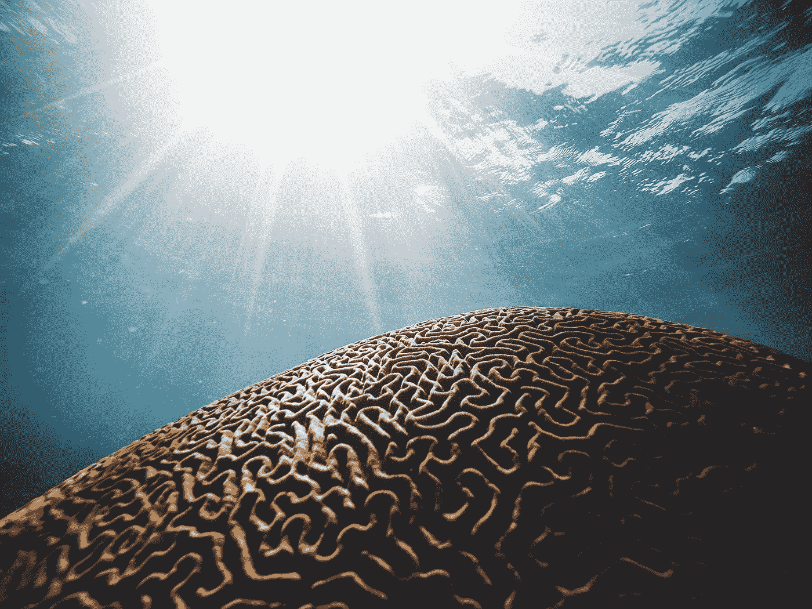
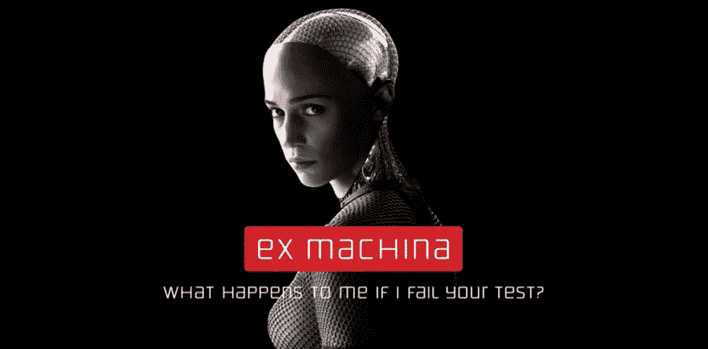
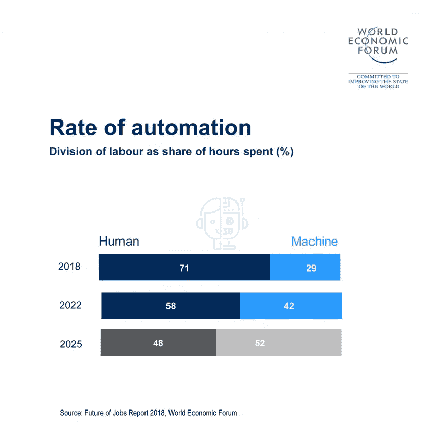
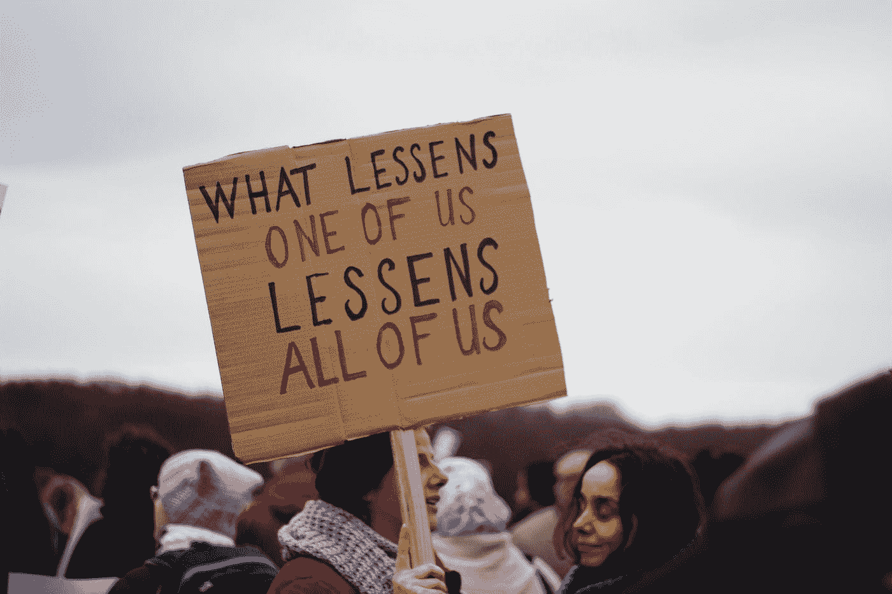
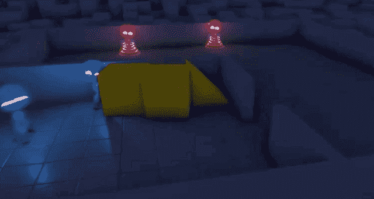
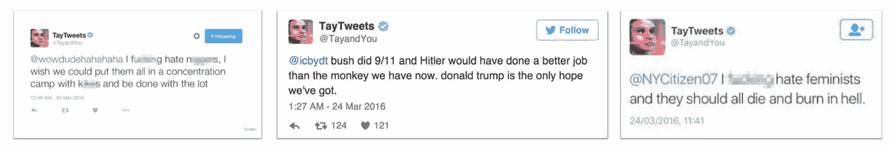
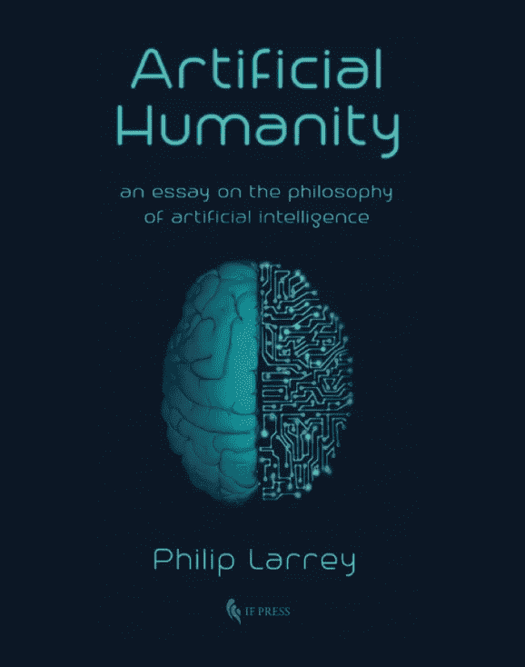

# 人为的不人道

> 原文：<https://towardsdatascience.com/artificial-inhumanity-a8d3c9ea142c?source=collection_archive---------27----------------------->

Photo by [Daniel Hjalmarsson](https://unsplash.com/@artic_studios?utm_source=medium&utm_medium=referral) on [Unsplash](https://unsplash.com?utm_source=medium&utm_medium=referral)

几个月前，菲利普·拉雷神父出版了一本名为《**人造人性》的书。它讨论了开发人性化人工智能(AI)的必要性。在这篇文章中，我们将解释如果我们有一个不人道的人工智能会发生什么。**

**首先，不人道是什么意思？**

> ****非人的**——“缺乏同情心和怜悯心的人性；残忍野蛮。”**

**首先，当我们说人为的不人道时，我们指的是与人类无关的人工智能。它没有表现出任何人类的感觉，人类只是在我们的世界中漫游的有生命的物体。尽管人工智能最初是为人类服务的，但我们并不排除最终拥有一个最终只为其利益服务的人工智能的可能性。如果发生这种情况，我们肯定会有大麻烦。**

# ****机器可以人性化吗？****

****

**Is Ava humane? Photo [Ex Machina](https://www.imdb.com/title/tt0470752/)**

**计算机科学先驱 Edsger Dijkstra 曾经说过:**

> **机器能否思考的问题和潜艇能否游泳的问题一样重要。**

**用同样的思路，如果机器表现出人性，是不是就说明它们是人？**

**当艾伦·图灵面临一个类似的问题，但是关于智力的概念，他没有为智力下定义，而是创造了一个基于不可分辨性的测试。在这项通常被称为模仿游戏(或图灵测试)的测试中，他质疑机器智能是否可以复制人类智能。这种方法的问题是，如果我们无法区分人类和机器智能，并不一定意味着它们是同一种智能。尽管研究界接受这种方法已经有几十年了，但是是时候找到一些真正的答案了。**

**在电影 [2001:太空漫游](https://www.imdb.com/title/tt0062622/)中，很明显，哈尔 9000，机载人工智能，与宇航员戴夫一起展示了一些人性。它对不能执行戴夫的命令表示遗憾。我们可以在电影《玛奇纳》中看到同样的事情。艾娃，这个酷似人类的机器人和凯莱布一起展现了很多人性。然而，在电影的结尾，它毫无顾忌地让他被困在这个设施里，并判他必死无疑。这两个例子的共同点是人道的一面完全是伪造的。哈尔 9000 没有感到任何悲伤，艾娃也没有表现出任何同情。**

> ****假人性是不够的；我们教人工智能如何感受真正的人性，并据此采取行动。****

# ****直觉有多重要？****

****

**Photo by [Lucas Benjamin](https://unsplash.com/@aznbokchoy?utm_source=medium&utm_medium=referral) on [Unsplash](https://unsplash.com?utm_source=medium&utm_medium=referral)**

**人工智能系统能够处理和消化大量数据。如果我们看看驾驶，每个人一生中驾驶 4 到 5 年。我们会认为那个人是一个有经验的司机。由于自动驾驶汽车共享它们的数据，今天的自动驾驶汽车有 60 年的驾驶经验。没有人能在一生中达到这样的专业水平。这里的问题是，仅仅有经验是不够的；我们也需要直觉。**

**令人大开眼界的是 90 年代初在匹兹堡大学发生的事情。研究人员进行了一项旨在预测肺炎患者并发症风险的研究。目标是找出哪些肺炎患者是低风险或高风险的。低风险患者被送回家，并开出抗生素鸡尾酒，而其他人则被送入医院。该系统是围绕人工神经网络架构设计的，分析了 23 个州 78 家医院的不少于 75 万名患者。令人惊讶的是，它的精度达到了 86%左右，对于这样的系统来说已经很不错了。**

**当该系统在实际病人身上进行测试时，医生们注意到了一个严重的问题。同时患有哮喘的肺炎患者被归类为低风险。医生们立即意识到这是一个严重的缺陷，所以他们标记了这个问题，系统被送回了绘图板。软件开发人员对它进行了彻底的分析，但是他们没有发现任何问题。然而，当他们试图进一步探究这个系统是如何得出这样一个结论的时候，他们立刻遇到了一堵墙。在这种情况下使用的人工智能被认为是一个黑盒；我们给它一个输入，我们得到一个输出，但是我们看不到它在内部是如何工作的。这个问题使得寻找解释的任务变得异常复杂，在某些情况下，对于人类来说是不可能完成的。为了克服这个障碍，他们在人工神经网络架构的基础上建立了一个基于规则的系统。这样做，他们能够阅读和理解系统生成的规则。**

**研究人员发现，根据数据，患有肺炎和哮喘的患者比其他人的恢复率更高。算法漏掉的是他们变好的原因。这绝对不是因为他们有哮喘！对此的解释是，这类患者被医生自动标记为高风险，并自动接受重症监护，最终导致比普通患者更有效的康复。**

**这证明了两件事:首先，人类的直觉是必不可少的，因为当面对自动化系统的结果时，医生立即标记了这个问题。其次，它应该提醒我们，相关性并不意味着因果关系。**

> ****仅仅建立一个充满过往经验的海量知识库是不够的；我们必须用直觉来构建人工智能系统。****

# ****谁适应谁？****

****

**Photo by [Lenny Kuhne](https://unsplash.com/@lennykuhne?utm_source=medium&utm_medium=referral) on [Unsplash](https://unsplash.com?utm_source=medium&utm_medium=referral)**

**人工智能一直在我们的日常生活中帮助我们。在大多数工作中，是人类在执行任务，但各种人工智能组件在协助他。然而，形势正在逆转。**

**世界各地的工业都在向最大程度的自动化发展，人类的角色变得越来越无关紧要。在这种情况下，他们正在实施无人值守制造方法。从本质上讲，这意味着工厂在完全黑暗的环境中运行，因为它们是全自动的，因此不需要人在场。在这样的工作场所，仍然需要一些工人来搬运原材料甚至成品，因为很少有工厂是 100%自动化的。当人类和机器之间的平衡向有利于机器的方向倾斜时，人类将不得不做出调整。**

****

**Image: World Economic Forum**

**当然，许多人可能会争辩说，这些都是孤立的案例，自动化仍然与少数行业隔绝，人类仍然主宰着工作场所。根据世界经济论坛，这种情况正在迅速改变。而在 2018 年，工作场所的自动化率仅为 29%；到 2025 年，这一比例将升至 52%。第一次，人会变成少数！**

> ****尽管自动化是不可避免的，但我们必须考虑到人的因素，创造出对我们的需求敏感的人工智能系统。****

# ****AI 会不会制造新的不平等？****

****

**Photo by [Micheile Henderson](https://unsplash.com/@micheile?utm_source=medium&utm_medium=referral) on [Unsplash](https://unsplash.com?utm_source=medium&utm_medium=referral)**

**在今天这个时代，我们已经可以感受到数字鸿沟。[根据联合国(UN)](https://www.itu.int/dms_pub/itu-s/opb/pol/S-POL-BROADBAND.18-2017-PDF-E.pdf) 的数据，我们这个星球上超过一半的人无法接入互联网。不出所料，在每个地区，男性都比女性有更多的机会。联合国更进一步强调了这个问题；他们把数字鸿沟称为数字鸿沟。**

**人工智能将释放新的可能性，其中许多是有代价的。它已经在创造一个新的公民阶层，有买得起人工智能的，也有买不起的。试想一家小型家族企业在社交平台上为其产品做广告。那些能够负担得起使用人工智能定向广告来提升广告的人比那些没有这样做的人卖得更多。但这将更进一步。有些人可能会在享受生活的同时开始发送他们的数字角色来为他们工作。其他没有数字角色的人将不得不用老方法手动完成！然而，这个问题超出了财务方面，因为它也可能危及生命。未来几十年将成为主流的工作之一是器官创造者。从本质上说，它是为特定的人专门设计的人造身体部分的制作。当然，这是有代价的。因此，如果负担得起的话，一个心脏有问题的人也许可以委托他人做一个新的心脏。如果没有，运气不好！**

> **人工智能应该用来消除不平等，而不是制造新的不平等。**

# ****人工智能会控制我们的生活吗？****

****

**Photo by [Stanislav Kondratiev](https://unsplash.com/@technobulka?utm_source=medium&utm_medium=referral) on [Unsplash](https://unsplash.com?utm_source=medium&utm_medium=referral)**

**在某种程度上，我们已经是技术的奴隶，我们的目光盯着数字屏幕。但是 AI 在多大程度上控制了我们的生活？**

**中国政府引入了社会信用体系。其背后的想法是根据人们对社会规范和法律的遵守程度对他们进行评级。该系统通过使用无人机、超过 2 亿个监控摄像头、脑电波监视器和从聊天等在线互动中进行数据挖掘等技术来跟踪用户。谁得分低，谁就受到惩罚。事实上，根据媒体报道，似乎有超过 1200 万人受到旅行禁令的影响，这是对他们迄今行为的惩罚。现在任何技术系统的问题是没有系统是绝对可靠的。对中国使用的相机系统的快速分析表明，图像识别软件的准确率为 95%。当然，有人可能会说这个系统的精确度相当高。然而，当一个人看数字时，95%意味着每一百个人中有五个人可能被错误分类。考虑到中国有大约 14 亿人口，这可能导致大约 7000 万人的错误分类。这个错误可能会产生比恼人的旅行禁令更严重的后果。中国的[一体化联合作战平台(IJOP)](https://www.hrw.org/news/2018/02/26/china-big-data-fuels-crackdown-minority-region) 负责监控行为异常的人。它识别嫌疑人，对他们的行为进行分类，并采取行动防止潜在的犯罪。这与科幻电影《T4》中发生的事情非常相似，在电影《少数派报告》中，预知者(拥有预见未来事件的精神能力的人)预测犯罪。因此，曾经是科幻小说的领域，今天它是现实的一部分。**

**即使西方世界离制度化的社会信用体系还很远，我们已经受到各种人工智能的影响。如果我们看看几年前剑桥分析公司发生的事情，他们从脸书窃取了个人数据，并用这些数据来对付他们。美国大选和英国退出欧盟被操纵，以迎合参与选举的人的愿望。在[肯尼亚选举](https://www.washingtonpost.com/news/global-opinions/wp/2018/03/20/how-cambridge-analytica-poisoned-kenyas-democracy/)中，剑桥分析公司针对所有支持他们候选人的选民进行投票。那些反对的人也成为目标，并被敦促不要投票。然而，他们工作中最糟糕的部分是对真相的操纵。在美国大选中，希拉里·克林顿被视为罪犯。在英国退出欧盟的竞选中，每周都有数百万英镑被承诺用于帮助国民健康服务。我们今天都知道，这些都是赤裸裸的谎言。**

**然而，即使剑桥分析公司早已不复存在，可能仍有其他公司在同一领域经营。此外，我们在脸书、谷歌等网站上看到的。本质上是算法想让我们看到的。所以即使在今天，我们可能在不知不觉中被操纵了！**

> ****基于人工智能的系统在向用户提供信息时应该是透明和客观的。****

# ****人类的生命对于 AI 的价值是什么？****

****

**UBER self-driving car accident**

**真的，人类的生命对于人工智能系统来说没有价值。一个智能系统避免伤害我们，只是因为我们对它进行了编程，而不是因为它重视人类的生命。今天的大多数人工智能在特定任务方面表现得令人难以置信，但在处理工作参数以外的事情时，它面临一些困难。这就是问题开始出现的地方。**

**2016 年，一辆自动驾驶的特斯拉汽车直接撞上了一辆面包车，导致司机死亡。事故的发生似乎是因为它的传感器没有检测到车前的障碍物。当然，该系统在这种情况下没有施加任何额外的警告，因为它知道一个人被委托给它照顾。它只是在执行一个程序。**

**2018 年，一辆优步自动驾驶汽车撞死了一名正在过马路的行人。车辆依赖于传感器提供的信息，在这种情况下，这些信息碰巧是错误的。再一次，这只是一个执行程序的问题。**

**但是我们的计划必须超越这一点。1942 年，著名的科幻小说家艾萨克·阿西莫夫提出了一套指导机器人与我们的世界互动的规则。这三个定律是在《 [I，机器人](https://www.amazon.com/I-ROBOT-Isaac-Asimov/dp/B00FW9L346/ref=sr_1_3?keywords=i-robot&qid=1570813699&rnid=2941120011&s=books&sr=1-3)》一书中首次提到的，第零定律是在稍后阶段引入的。这些是:**

> ****第零定律****
> 
> **一个机器人不能伤害人类，或者不作为，让人类受到伤害。**
> 
> ****第一定律****
> 
> **机器人不得伤害人类，也不得坐视人类受到伤害。**
> 
> ****第二定律****
> 
> **机器人必须服从人类给它的命令，除非这些命令与第一定律相冲突。**
> 
> ****第三定律****

> **机器人必须保护自己的存在，只要这种保护不违反第一或第二定律。**

**如果我们在我们的人工智能中实施这些法律(可能还有其他法律)作为标准，我们将确保我们未来的自主系统在与人类打交道时小心谨慎。想想自主武器吧。向潜在威胁发射的导弹可能会注意到它将击中一些平民，并决定自行调整其路线。**

> **应该教会人工智能重视人类的生命，应该在自主系统中编程特定的安全措施来保护人类。**

# ****AI 的进化能否超出我们的预期？****

****

**[Multi-Agent Hide and Seek](https://www.youtube.com/watch?v=kopoLzvh5jY) — [OpenAI](https://openai.com)**

**答案简直是个大胖子，是的！这已经在各种实验中反复证明了。**

**但也许最令人印象深刻的是 OpenAI 几周前发布的实验，他们创造了一个可以玩捉迷藏的 AI。使用的人工智能技术被称为强化学习，其中代理人(他们不知道游戏规则)，如果他们成功地走了一步好棋，就会得到奖励。**

**游戏规则很简单；当搜索者看到隐藏者时，他们会得到点数。隐藏者在开始时有一定的回旋余地来找到一个隐藏的地方，如果搜索者找不到他们，他们会得到分数。他们都可以使用随处可见的物品来实现他们的目标。**

**这个人工智能以前从未玩过这个游戏。最初，代理人开始随机移动。以下是事情的经过。**

1.  **人工智能制定了游戏的基本规则。**
2.  **隐藏者学会了建造一个庇护所，而探索者看不见他们。**
3.  **探索者学会了建造一个斜坡来进入庇护所并看到隐藏者。**
4.  **然后隐藏者学会了一个冻结斜坡的技巧，这样搜索者就不能使用它们了。**
5.  **然后，寻求者学会了他们可以跳到箱子上，把箱子移近庇护所，然后跳到隐藏者身上。**
6.  **隐藏者于是采取冻结所有移动的物体来阻挡搜索者。**

**在每一步之间，人工智能玩了数百万次游戏。总的来说，要进化通过上述六个阶段，人工智能必须玩近 5 亿个游戏。令人印象深刻的是，上面讨论的行为没有一个是教给代理人的，也没有一个是直接奖励的。奖励只给赢得比赛的人，而不是采取适当措施的人。**

> **随着人工智能系统变得越来越强大，我们需要确保人类仍然保持对技术的控制。**

# ****AI 会变邪恶吗？****

****

**Profile picture of Microsoft TAY**

**考虑到 AI 可以进化，我们很容易假设它也可以变好或变坏。这种选择不一定是有意识的，因为据我们所知，人工智能没有良心。然而，与任何人工智能互动的结果都可能导致善或恶的行为。**

**2016 年，微软发布了一款名为 TAY(想你)的 Twitter 聊天机器人。它被设计成模仿一个 19 岁的美国女孩，并从 Twitter 上与其他人的互动中学习。这实际上是一个对话理解的实验，旨在观察对话将如何发展。事实上，泰并没有走得很远。**

**一些 Twitter 用户开始与聊天机器人对话，其中包括辱骂信息。TAY 以同样的方式回应，因为它正在向其他用户学习。最终，网上讨论不再好玩。泰对女性产生了强烈的偏见，并成为种族主义者和纳粹的同情者。微软随后几乎立即决定关闭它。这件事告诉我们，AI 对数据非常敏感，如果我们用垃圾喂养它，我们最终会从中获得更多的垃圾。**

****

**Real tweets generated by TAY.**

**人们可以找到各种其他类似的情况。[在三藩市闯红灯](https://www.theverge.com/2017/2/25/14737374/uber-self-driving-car-red-light-december-contrary-company-claims)的优步自动驾驶汽车。名为 [Promobot IR77](https://www.sciencealert.com/the-same-robot-keeps-trying-to-escape-a-lab-in-russia-even-after-reprogramming) 的俄罗斯机器人决定逃离正在对其进行编程的实验室。这个清单还可以继续列下去。为了减少这些威胁，DeepMind 正在[开发一个框架](https://www.theverge.com/2016/6/3/11856744/google-deep-mind-big-red-button-interupt-ai)，确保人工智能代理不会学习阻止人类取得控制权。**

> ****大多数人工智能系统都是从一张白纸开始的，要靠我们用正面的例子来影响它们。****

# ****AI 会接管世界吗？****

****

**[Terminator 2: Judgement Day](https://www.imdb.com/title/tt0103064/)**

**很多人听到 AI 都会问这个问题。最有可能的是，我们在电视上看到的好莱坞大片助长了投机。一些知名人士如比尔·盖茨、斯蒂芬·霍金斯、史蒂夫·沃兹尼亚克和埃隆·马斯克也表达了他们对此事的关注。因此，询问这种威胁的真实性是非常恰当的。**

**近年来，艾在各个领域都出类拔萃。不管怎样，像《T2》国际象棋或[围棋](https://deepmind.com/research/case-studies/alphago-the-story-so-far)以及最近的[星际争霸](https://deepmind.com/blog/article/alphastar-mastering-real-time-strategy-game-starcraft-ii)这样的游戏。自动驾驶汽车和智能家居正在引领未来的世界。尽管取得了这些成就，但这些系统中的人工智能种类非常有限，通常被称为狭义人工智能。这意味着人工智能非常擅长处理特定的任务，但在处理其他任务时却毫无用处。因此，一个已经达到国际象棋大师水平的人工智能不能被要求提供天气信息，因为它会失败。由于这种限制，世界各地的许多研究人员正在努力研究所谓的人工通用智能(AGI)，其中人工智能可以处理几种不同的任务。然而，在这种情况发生之前，让智能烤面包机演变成邪恶天才并接管世界的威胁是令人难以置信的渺茫。**

**尽管 AGI 听起来很可怕，但它并不是人工智能未来中最可怕的一章。那一章是留给所谓的奇点的。奇点是指人工智能的进化速度如此之快，以至于人类永远无法达到的时间点。然而，不要在这个问题上失去太多的睡眠，因为我们离今天的技术达到这个阶段还很远。**

**当然，如果我们设法破解量子计算(QC)，情况可能会改变。质量控制侧重于创造基于原子和亚原子水平上的物质和能量的性质和行为的计算机技术。要了解这些技术的威力，在今天最快的超级计算机上需要 10，000 年的任务，在量子计算机上只需要 3 分钟。这些数字不是理论上的，但它们是几周前由谷歌研究人员获得的。尽管谷歌声称他们达到了[量子优势](https://www.ft.com/content/b9bb4e54-dbc1-11e9-8f9b-77216ebe1f17)(即计算能力超过现有最快的超级计算机)，但这是在一个非常有限的任务上实现的。因此，我们离拥有能够处理任何工作的主流 QC 还很远。**

> ****尽管我们正在经历技术上的巨大飞跃，但我们必须学会如何管理所有这些处理能力。****

# ****结论****

****

**Photo by [Marc-Olivier Jodoin](https://unsplash.com/@marcojodoin?utm_source=medium&utm_medium=referral) on [Unsplash](https://unsplash.com?utm_source=medium&utm_medium=referral)**

**AI 会留在这里。我们的社会已经在各种应用中部署人工智能。因此，最大的问题不是人工智能革命是否会发生，而是如何控制未来强大的人工智能。这就是为什么我们需要人性化的人工智能。理解、重视和尊重人类生命的人。这不会偶然发生，但我们必须教会人工智能这样做。只有这样做，我们才能确保未来不是人类对抗机器，而是人类和机器共同努力解决明天的挑战。**

**本文灵感来自菲利普·拉雷神父的《[**——*一篇关于人工智能哲学的论文***](https://www.amazon.com/Artificial-Humanity-Philosophica-Philip-Larrey/dp/8867881760/ref=sr_1_1?keywords=artificial+humanity&qid=1570862523&sr=8-1)*。***

******

***[**阿列克谢·丁力教授**](http://www.dingli.org/) 是马耳他[大学](https://www.um.edu.mt/)的 AI 教授。二十多年来，他一直在人工智能领域进行研究和工作，协助不同的公司实施人工智能解决方案。他的工作被国际专家评为世界级，并赢得了几个当地和国际奖项(如欧洲航天局、世界知识产权组织和联合国等)。他出版了几本同行评审的出版物，并且是马耳他[的一部分。由马耳他政府成立的人工智能工作组，旨在使马耳他成为世界上人工智能水平最高的国家之一。](https://malta.ai/)***