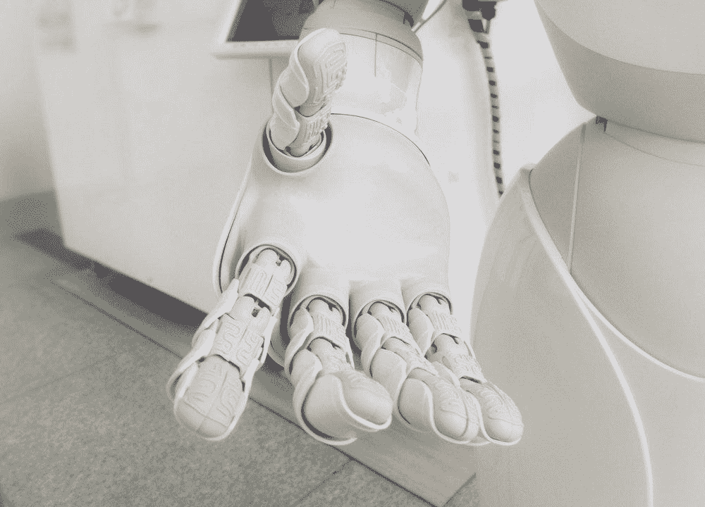
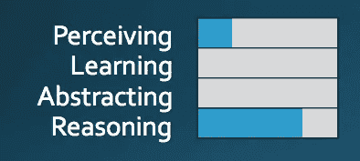
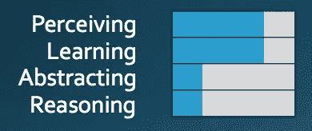
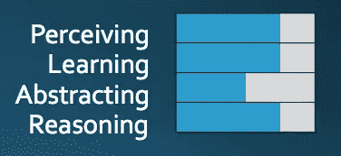

# 银行业中的人工智能:双刃剑

> 原文：<https://towardsdatascience.com/artificial-intelligence-ai-in-banking-the-double-edged-sword-276e3e6321ff?source=collection_archive---------15----------------------->

Photo by [Franck V.](https://unsplash.com/photos/jIBMSMs4_kA?utm_source=unsplash&utm_medium=referral&utm_content=creditCopyText) on [Unsplash](https://unsplash.com/search/photos/ai?utm_source=unsplash&utm_medium=referral&utm_content=creditCopyText)

人工智能对银行业来说是一把双刃剑。在金融行业的闲聊中，有两个主题浮现出来。首先，在数据、人工智能(AI)和云方面实力雄厚的“大科技”可能会对银行业利润、并最终对金融体系的稳定性造成巨大压力。其次，人工智能算法和模型的使用带来了行业或监管机构尚未完全理解和理解的风险。换句话说，不管你做不做。

人工智能是不可避免的，风险也在不断加剧，这一事实令世界各地的监管机构感到担忧。但是，当谈到在金融行业使用人工智能模型的问题时，语言不是很清楚或一致。当监管者谈论人工智能的风险时，他们指的是什么？他们到底担心什么？[美国](https://www.federalreserve.gov/newsevents/speech/brainard20181113a.htm)和[澳大利亚](https://www.afr.com/business/banking-and-finance/apra-sounds-the-alarm-on-algorithm-risk-20180313-h0xf34)监管机构最近对人工智能使用的警告似乎表明，他们意识到正确处理这一问题的战略重要性，但仍没有迹象表明在这个问题上有任何正式指导。

> 在为人工智能在银行业的应用设定明确的政策方向方面，监管机构的惰性可能会放大监管机构非常担心的金融稳定风险。

一段时间以来，银行一直在使用先进的模型，包括可以被归类为人工智能的模型。《新巴塞尔协议》在信用风险、市场风险和运营风险等领域引入了一大堆统计学习模型。银行一直在投资模型风险管理功能，并建立了管理这些模型风险的能力。那么，在使用人工智能模型时，监管机构到底关注什么？是什么阻碍了政策方向？让我们从基础开始。

AI 是什么？

如果我有一分钱…！当然，人工智能已经被有限的学者、研究人员和行业从业者很好地定义和理解，但它远不是整个行业的共识。《大英百科全书》将人工智能定义为“数字计算机或计算机控制的机器人执行通常与智能生物相关的任务的能力”。智慧生物？这可能是另一个棘手的问题。虽然这个定义是正确的，但它很难成为一个实用的解释。另一方面，我们有技术解释，其中 AI 被用作机器学习(ML)、深度学习(DL)、统计、数学和其他高级分析技术等技术组合的总称。业界迫切需要一个可行的人工智能的解释和分类，这将有助于提高围绕人工智能及其相关风险的讨论质量。

美国国防高级研究计划局(DARPA)，人工智能前沿创新的旗手，已经提出了一种新颖的方式来[解释](https://www.darpa.mil/ddm_gallery/3WavesOfAI.jpg)人工智能处理信息的能力。

> DARPA 将人工智能定义为“处理信息的编程能力”。处理信息的概念智能分为四类**感知、学习、抽象和推理**。人工智能的发展分为三个阶段，分别是**手工知识**、**统计学习**和**上下文适应**，它们可以用来理解人工智能在金融行业中的应用

**第一波:手工知识**

人工知识模型是基于规则的人工智能模型，其中人类定义知识的结构，而机器探索细节。基于规则的引擎是一个基本的人工智能应用程序，**能够对“狭义定义的问题”进行推理**，但尽管如此，它们仍然是 DARPA 的人工智能。例如，银行计算新巴塞尔协议监管资本的方式，其中预先确定的资本公式应用于一组预先定义的产品。如果有新的信息，如新产品，则需要更新规则。这些人工智能模型没有任何学习能力，处理不确定性的能力也很差。这些第一波人工智能模型仍然与网络安全等新兴和加速的风险相关。最近，在 DARPA 的[网络大挑战](https://www.esecurityplanet.com/hackers/darpas-machine-challenge-solves-crackaddr-puzzle.html) (CGC)中，一个基于第一波原则的名为‘Mayhem’的系统解决了一个十年之久的安全挑战。

> 银行已经制作了大量的知识人工智能模型，但很少有人将它们视为模型，更不用说人工智能了。它们通常被认为是“确定性工具”或“软件”。治理和风险管理并不明确，但通常在技术风险的保护伞下进行管理。

第一波人工智能模型的固有风险(如其处理不确定性的能力所解释的)是*非常高的*。然而，这些模型存在于高度受控的环境中，因为它们不能很好地应对自然界的动态变化。**意识到第一波人工智能模型的**风险可以*非常低*，因为它们被应用于狭义定义的问题，这首先减少了不确定性。尽管如此，如果这些模型正在做出实质性的决策，那么模型的使用可能会带来灾难性的风险。

Courtesy: The DARPA

**第二波:统计学习**

S 统计模型**能够在** **【定义的** **问题域**内学习。例如，领域可以是语言处理或视觉模式识别。问题的复杂程度用数据来表示。更丰富的数据将产生更多的信息，需要更复杂(非线性)的学习算法来表示它们。例如，如果你有 10 张狗的照片，你可以开发一个简单的算法，从 10 张照片中学习并以合理的准确度识别一只狗。然而，如果你有一千张不同品种狗的照片，你可以开发一个更复杂的模型，它不仅可以识别狗，还可以识别品种。统计学习人工智能模型拥有细微的分类和预测能力，但只有最低限度的推理能力，没有上下文能力。

金融行业充斥着统计学习模型。确定个人或公司违约概率的信用评级模型和估计洗钱倾向的反洗钱模型就是其中的一些例子。

> 这些现有的统计学习人工智能模型大多是现实世界的简单表示，并遵循奥卡姆剃刀原理。一些较新的模型用于模拟行为、欺诈等。开始利用大数据和自然语言处理(NLP)等复杂概念。

第二波模型的**内在**风险是*高*，正如他们处理不确定性的能力所解释的那样。他们很好地处理了不确定性，但是依赖于代表不确定性的数据。使用大数据的更复杂的算法在统计上令人印象深刻，但在个体上并不可靠。他们容易产生可以被利用的固有偏见。这些模型的任何自主性都需要被监控和管理，因为不良适应和不希望的行为是可能的。总的来说，**意识到的这些人工智能模型的**风险可能*非常高*，因为问题领域的不确定性可能会有很大差异。与第一波模型一样，基于决策的重要性，统计人工智能模型的使用可能导致灾难性风险。

Courtesy: The DARPA

**第三波:背景适应**

上下文适应人工智能模型解释决策，通常由对现实世界现象进行上下文解释的系统构建。**这里的关键是可解释性和自动化**。生成模型创建解释，为决策和概率提供上下文。这是打着可解释人工智能旗号的前沿研究(XAI)。这在处理复杂的决策时是很重要的，比如涉及道德困境的决策。上下文适应对于降低模型风险和最终决策风险至关重要，因为预计未来大多数决策都将实现自动化。

由于该领域的不成熟，第三波人工智能模型的固有和现实风险*非常高*。虽然可解释性对意识到人工智能决策很重要，但管理风险绝对至关重要。

Courtesy: The DARPA

**总之……**

金融行业已经在使用第一波和第二波人工智能模型中讨论的先进技术来做出决策或为决策提供信息。任何关于在银行业使用人工智能的担忧都需要被衡量和具体化。对人工智能模型带来的风险一概而论，并不一定包含这样一个事实，即银行已经建立了处理第一波和第二波人工智能模型中讨论的大多数风险的重要能力。监管需要跟上并加快政策制定和指导的步伐，以减轻实施人工智能的任何惰性。存在相当大的风险，要么阻碍人工智能使用银行业的进展，要么没有适当认识到人工智能模型给银行业带来的风险。人工智能治理工作需要从人工智能模型的适当识别和分类开始。这里讨论的 DARPA 方法可能不是最终目的地，但肯定是起点。

最后，人工智能意味着反映人类的智能。我们越害怕它，它看起来就越可怕。现在是时候直面人工智能风险，并在银行业推广人工智能的使用了。